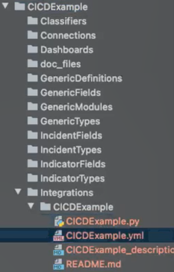

In Cortex XSOAR, you can develop and test your content on other machines, before using it in a production environment. You can do this by using [the remote repository feature in the UI](https://docs.paloaltonetworks.com/cortex/cortex-xsoar/6-5/cortex-xsoar-admin/remote-repository/remote-repositories-overview.html) or using the CI/CD process.
	   
 
## The CI/CD process
The CI/CD process helps you develop and maintain content for complex content development using the full functionality of a Git repository, enabling you to run unit tests, code reviews, run test playbooks, etc. Instead of building and maintaining code on a Cortex XSOAR development environment, you can build content from your own repository, build servers, and utilize third party tools (like CircleCI, Jenkins, etc). You can also use version control, undertake code reviews, do lint and validations, use automatic testing, run tests on development machines, etc. 


The process is designed for more advanced users who have an understanding of CI/CD concepts and have a number of developers who work on local machines. In particular, it is recommended that you should have the following knowledge:
 - The ability to set up a build system
 - The ability to use [demisto-sdk](https://xsoar.pan.dev/docs/concepts/demisto-sdk)
 - A basic knowledge of Git
 - A basic knowledge of containers (docker)


The remote repository feature in the UI is designed for less complex content (one or two developers working on a local machine).  


CI/CD has the following advantages over using the remote repository feature in Cortex XSOAR:
- Controls the code base with a multi-branch approach. Multiple developers can work on different branches. You can have code reviews, issue pull requests, etc.
- Use CI/CD solutions (like CircleCI, Jenkins, etc) as part of your testing (including running test playbooks) and deployment. You also have the ability to run automatic testing.

**NOTE:** To use this process you need to have a Git repository. GitHub, GitLab and Bitbucket are currently supported.

The CI/CD process involves the following stages:
- [Development](#development)
- [Testing/staging](#testingstaging)
- [Deployment](#deployment)

For general information about the CI/CD process, see [CI/CD FAQs](#cicd-faqs).


### Overview Demo Video
<video controls>
    <source src="https://github.com/demisto/content-assets/raw/master/Assets/ContentManagement/content_management_demo.mp4"
            type="video/mp4"/>
    Sorry, your browser doesn't support embedded videos. You can download the video at: https://github.com/demisto/content-assets/raw/master/Assets/ContentManagement/content_management_demo.mp4
</video>


 ## Development
 
 In the development stage, [set up the CI/CD process](#setup-the-cicd-development-process) by creating or cloning a Git repository based on the [CI/CD template repository](https://github.com/demisto/content-ci-cd-template). You can then create and maintain your custom content with the built-in functionality of [demisto-sdk](https://xsoar.pan.dev/docs/concepts/demisto-sdk). The CI/CD process uses `demisto-sdk` to develop and deploy custom content packs. It downloads, uploads, validates, creates content, migrates content from a Cortex XSOAR server, etc. It also supports content pack structure generation, auto validation of custom content including running linters on the code, and generation of content pack documentation, etc. For a full list of features, commands, and arguments, see [demisto-sdk-commands](https://github.com/demisto/demisto-sdk#commands).

 #### Setup the CI/CD Development Process
 
 Before you begin, download and install the `demisto-sdk` on your machine.  
 
 Ensure that the `DEMISTO_BASE_URL` and `DEMISTO_API_KEY` are set to the server environment that you want to use. For example, if you want to upload content directly to the server without using an artifact server you need to point the server to this environment. When working on a branch and you want to download/upload to a development environment, ensure that the `demisto-sdk` points to the development server.
 1. **Create the CI/CD Repository.**

    Create or fork a Git repository (such as GitHub, GitLab, Bitbucket,etc). Use [CI/CD template repository](https://github.com/demisto/content-ci-cd-template) as your base structure. The `demisto-sdk` connects to this Git repository and then automatically connects to Cortex XSOAR servers using the API, to ensure that it validates Cortex XSOAR content.
    The repository contains the following content:
    
    | Content | Description |
    | ------- | ----------- |
    | `config.yml` | The CI/CD configuration file (in the `.github\workflows` folder), which validates the content pack, creates an ID set, runs tests, etc. When you want to deploy your content, you need to update the file with your repository and whether you want to use an artifact server.  For more information, see Configuring the config.yml file in [Deployment](#deployment). |
    | `pre-commit` | Within the `.hooks` folder, the pre-commit file uses the Git rebase interactive tool for manual control of your history revision process. |
    | `.vscode` | Used when using VSC as your IDE. |
    | `build_related_scripts` | Contains the CI/CD scripts. The `build_related_scripts/bucket_upload.py` script enables you to upload to Google Cloud Storage (artifact server).  Before deploying your content, you need to update the name of the bucket list when uploading the Google Cloud Storage. For more information, see Configure the the bucket_upload.py file in [Deployment](#deployment). <br/> **NOTE**: If using another storage application such AWS, you need to replace Google Cloud Storage. Contact Customer Support to assist with this. <br/> The `get_modified_packs.py` script enables you to get the latest version of the content pack before merging. |
    | `dev_envs/pytest`| A folder that contains the `conftest.py`, which validates python files. |
    | `.demisto-sdk-conf`| The custom configuration file for the `demisto-sdk` commands. For more information, see [Setting a preset custom command configuration](https://xsoar.pan.dev/docs/concepts/demisto-sdk#setting-a-preset-custom-command-configuration). |
    | `.gitignore` | Specifies intentionally untracked files that Git should ignore. |
    | `.private-repo-settings` | Set who can view your repository. For more information, see [Setting repository visibility](https://docs.github.com/en/repositories/managing-your-repositorys-settings-and-features/managing-repository-settings/setting-repository-visibility). |
    | `CommonServerPowerShell.ps1` | Required when using Powershell. For more information, see [Powershell code](https://xsoar.pan.dev/docs/integrations/powershell-code). |
    | `CommonServerPython.py` | Required using Python. For more information, see [Common server python](https://xsoar.pan.dev/docs/reference/api/common-server-python). |
    | `README.md` | A markdown file that provides a description of the pack. |
    | `demistomock.ps1` | Enables you to debug Powershell script. |
    | `demistomock.py` | Enables you to debug Python Script. For more information about the demistomock files see [Debugging using demistomock the demisto-object](https://xsoar.pan.dev/docs/integrations/debugging#using-demistomock-the-demisto-object). |
    | `requirements.txt` | Contains a list of all the project’s dependencies. |
    | `tox.ini` | The command-line driven automated testing tool for Python. |
    | `xsoar_config.json` | The configuration file that defines what packs lists, and jobs will be set up on the machine. Update this when you are ready to deploy. See step 3 under **Deployment** below. |

 2. **(Optional) Set up the repository to work with an IDE.**
    
    For example if working with GitHub via VSC, download Git desktop and then Configure VSC.  Ensure that you enable Git in your IDE tool (Code>Preferences>Settings).
 3. **Create branches for content.**
    
    Create content on separate branches for content packs. Different developers are able to create content independently, which makes it easier to review content, create pull requests, test the content on a machine, etc.
 
 
 4. **(Optional) Migrate custom content in Cortex XSOAR to Git Repository**.

    You can migrate all custom content, separate content items, or detached out-of-the-box content.


    **NOTE:** Ensure that the `DEMISTO_BASE_URL` and `DEMISTO_API_KEY` are set to the server environment that you want to download. 
  - **Migrate all custom content** 
    
    If you currently use the existing remote repository feature in Cortex XSOAR and now want to use the CI/CD process, download the content from your development machine using the `demisto-sdk download` command. For example, to download content from your remote repository to your repository created in step 1, run the following command: 
    `demisto-sdk download -o address_of_the_pack_folder -i name_of_the_content`

    If you have a lot of content, downloading can take a substantial amount of time, as it creates separate folders for each pack. It is recommended to create one folder with a general name and then separate them into branch repositories.

- **Migrate some custom content** 
  
  If you want to migrate some custom content like an integration,  run the download command by specifying the content. For example, to add an `CICDExample` integration to the *CICDExample* Content Pack, run the following command:
        `demisto-sdk download -o Packs/CICDExample -i CICDExample`
        The `CICDExample` integration file appears in the `Integrations` folder, which separates the content into Python and YML files together with a `README.md`.
    
    
     
     **NOTE:**  You can download directly from the development server. If downloading Automations and integrations, you need to use the `demisto-sdk split` command to split the content into the correct format.

- **Migrate detached out-of-the-box content**
  
  If you have out-of-the-box  content from a content pack that is detached (such a Phishing incident type) and want to use the CI/CD process, run the following command:

  `demisto-sdk download --system --type <object to download such as layouts, playbooks, scripts> -i <the name of the object to download> -o <the output directory>` 
  
  It is recommended to download to a new `SystemPacks` folder to avoid validation errors. The object needs to be stored in the `SystemPacks` folder to preserve the pack structure. 
  
  **NOTE**: Only the detached items are stored and not other files such as pack metadata, release notes, readme, etc.

  For example, to download the detached phishing incident type layout, run `demisto-sdk download --system --type layouts -i Phishing -o SystemPacks/Phishing/Layouts` 
  
  If you want to download the **Phishing Investigation - Generic v2** playbook run the following:

   `demisto-sdk download --system --type playbooks -i Phishing_investigation_-_Generic_v2.yml -o SystemPacks/Phishing/Playbooks`


 
5. **Create New Content.**
   
 	In a branch that has been created in step 3 above, create new content, by running the following command:

     `demisto-sdk init` 
    
    The `init` command automatically generates the content pack structure. 
    
    Follow the on-screen instructions by typing the name of the Content Pack, metadata, description, type of Pack, category, author, email address,tags, integration, etc.
    The Pack appears in the repository with the required folders. You can delete those items that are not needed.  In this example, we create a new content pack, called `CICDExample`. 
        
     
    
    The content pack contains the following content:

    | Content | Description |
    | ------- | ----------- |
    | `Classifiers` | Contains the classifiers in JSON format. |
    | `Dashboards` | Dashboards in JSON format. |
    | `GenericDefinitions` | Contains JSON files that define the generic object that you create. <br/> **NOTE:** Although available from version 6.5, it is currently not supported. You can delete this. |
    |  `GenericFields` | Includes subfolders of custom incidents and custom indicator fields. <br/> **NOTE:** Although available from version 6.5, it is currently not supported. You can delete this. |
    | `GenericModules` | The context in which the object will be used. Contains the views (pages) displaying the new objects. <br/> **NOTE:** Although available from version 6.5, it is currently not supported. You can delete this. |
    | `GenericTypes` | Includes subfolders of custom incident and indicator types. Each directory uses the same structure as incident/indicator types. <br/> **NOTE:** Although available from version 6.5, it is currently not supported. You can delete this. |
    | `IncidentFields` | Incident fields in JSON format. |
    | `IncidentTypes` | Incident types in JSON format. |
    | `IndicatorTypes` | Incident types in JSON format. |
    | `Integrations` | Contains YML, PNG, Markdown, and Python files for integrations. |
    | `Layouts` | Layouts in JSON format. |
    | `Playbooks` | Contains YML and Markdown files. |
    | `README.md` | Information about the Content Packs. |
    | `Reports` | Reports in JSON format. |
    | `Scripts` | Contains automations in YML, Python and Markdown files. |
    | `TestPlaybooks` | Contains test files. |
    | `Widgets` | Widgets in JSON format. |
    | `doc_files` | Contains images in PNG format. |
    | `pack_metadata.json` |  Metadata about the content pack. For example, name, version, description. Every time it changes, you should update the version |

	
6. **Add any additional files that are required.**
        
    You might want to add a `Release Notes`, `.secrets-ignore`, or `.pack-ignore` files/folders. You can see how the Content hierarchy appears in the [Hello World](https://github.com/demisto/content/tree/master/Packs/HelloWorld) Content Pack.


7. **Generate a README for your integration, script, or playbook.**
    
    Run the following command:
        `demisto-sdk generate-docs --insecure -e directory`
        For more information, see [creating documentation](https://xsoar.pan.dev/docs/documentation/readme_file#creating-documentation).

8. **(Optional) Run SDK Validate and SDK Lint on your changes**

    Run the `demisto-sdk format` command, which ensures that your new or modified files comply with Cortex XSOAR's standard. 
    To check that your code is valid, run the `demisto-sdk validate` command and the `demisto-sdk lint` command on your code.<br/>
    **Troubleshooting:** If you receive many errors from the validate/lint commands, it is not a major issue, as you can control the [validations](https://xsoar.pan.dev/docs/concepts/demisto-sdk#validate) you want to ignore.
    For example, if you receive the `BA111` - Problematic fields names error, or the `IN135` or `IN145` - Integration params issues, you can add it to the `.pack-ignore` file in your pack like this:
    ```
        [file:some_playbook.yml]
         ignore=BA111
   
        [file:some_integration.yml]
         ignore=IN135,IN145
    ```
    For the `DOXXX` - Docker Images errors, you can add `--no-docker-checks` flag to your validate command 
    or add `no_docker_checks` to the `.demisto-sdk-conf` repository file like this:
    ```
       [validate]
       no-docker-checks=true
    ```
    
### Development Video Tutorial
<video controls>
    <source src="https://github.com/demisto/content-assets/raw/master/Assets/ContentManagement/CICD-development.mp4"
            type="video/mp4"/>
    Sorry, your browser doesn't support embedded videos. You can download the video at: https://github.com/demisto/content-assets/raw/master/Assets/ContentManagement/CICD-development.mp4 
</video> 


## Testing/Staging

In testing/staging process, you can do the following:

- Utilize 3rd party CI/CD Solutions, such as CircleCI, Jenkins, etc.
- Run validations and automated tests from a testing server as part of a build process.
- Run test playbooks.
   


#### To test Content:

Before you begin, ensure that you have installed the following:
- Your CI/CD solution (such as CircleCI).
- Docker, or applications like Mypy, Flake8, pylint, pytest, etc., for validations and lint commands.  

1. **Review the lint and the validate in the `.demisto-sdk-conf` file.**
    
2. **(Optional): Upload the content to a test staging environment**.
    
    Run the following command:
    `Demisto-sdk upload -i Packs/mypack`
    For example, to upload an integration, type `demisto-sdk upload -i Packs/CICDExample/Integrations/CICDExample` 
    **NOTE:** Update the `DEMISTO_BASE_URL` and `DEMISTO_API_KEY`, if required. 
    
3. **Test the content and run test playbooks, as required**.

3. **Open a Pull Request for other developers to review.**
        
    Using your CI/CD solution, it checks the changes - validations, lints, etc. If it requires approval, you have to wait before being able to merge. The validation is done according to the hooks in your repository. When you create the pull request, the CI/CD process runs automatically. <br/>

    
  


After the testing has completed successfully, you are now ready to deploy content.


### Testing/Staging Video Tutorial
<video controls>
    <source src="https://github.com/demisto/content-assets/raw/master/Assets/ContentManagement/CICD-testing-staging.mp4"
            type="video/mp4"/>
    Sorry, your browser doesn't support embedded videos. You can download the video at: https://github.com/demisto/content-assets/raw/master/Assets/ContentManagement/CICD-testing-staging.mp4 
</video>


 ## Deployment
 

In  the deployment stage, you can do the following: 
- Control both custom and out-of-the-box content packs deployment into production.
- Deploy via an artifact server or directly to the Cortex XSOAR production server.

By default, deployment occurs when content is pushed from a branch repository to a master repository. Before deployment, you need to consider whether to deploy via an artifact server.

 
 ### Artifact Server

An artifact server such as Google Cloud Services, enables you to  maintain and control version deployment and rollbacks, so you can keep track of your work. Each content pack version is saved in separate folders in the artifact server. You can use the [XSOAR CI/CD](https://xsoar.pan.dev/docs/reference/packs/content-management) Content Pack, to fetch the content from the artifact server to the Cortex XSOAR server. The content pack enables you to monitor, install content packs via a Playbook, incident type, etc. 


 **NOTE**: For Multi-tenant you cannot run the playbook in the XSOAR CI/CD Content Pack, as its not possible to create incidents or playbooks on the Main account. Instead you  can upload the content via the CI/CD Build.

Although you can choose your own artifact repository, (such as AWS, GCP, Git, FTP server, etc) by default, the CI/CD process uses Google Cloud Storage. You need to install the [Google Cloud Storage Content Pack](https://xsoar.pan.dev/docs/reference/integrations/google-cloud-storage) and configure the integration. If using another storage provider, such as AWS you need to install the relevant Content Pack and set up the integrations as necessary.

The main advantage of the artifact server is version control and rollback. You update the `xsoar_config.json` file with any version change, rather than having to update the repository.


### Without an Artifact Server
You can deploy your content without the need for an artifact server. If you do not use an artifact server, the `demisto-sdk upload` command, uploads the content pack directly to the Marketplace. When content is pushed to master, the content is automatically deployed to the server.


By default the CI/CD process uses an artifact server. You can need to update this in the config.yml file.


Although you do not have the flexibility of version control and rollback, it is relatively easy to set up, as you do not need to configure the artifact server and you do not an integration or set up the XSOAR CI/CD Content Pack. The user can decide whether to install from the Marketplace. 

#### To deploy content:
  
1. **Configure the `config.yml` file.**

    When you fork the repository, a [config.yml](https://github.com/demisto/content-ci-cd-template/blob/master/.github/workflows/config.yml) file is included in the repository (`github\workflows` folder). 
    
    1.1 Update the repository details under `steps`:
    
    ```
    steps:
      - name: XSOAR CI/CD master checkout
        uses: actions/checkout@v2
        with:
          repository: your/repository
          path: repository
          fetch-depth: 0
    ```
    For example:
    ```
        repository: demisto/content-ci-cd-template
        path: repository
    ```
    
   1.2 If not using an artifact server, replace the following section:
    
            # ========= UPLOAD TO ARTIFACTS SERVER OPTION =========
            # TODO: Upload to the artifacts server of your choice.
            # Create a file with the service account data
            # use the bucket_upload script to upload your packs to google cloud storage
            python $GITHUB_WORKSPACE/repository/build_related_scripts/bucket_upload.py --service_account $GITHUB_WORKSPACE/service_account.json --packs_directory $NEW_PACKS_FOLDER --branch_name $BRANCH_NAME
            # Delete the service account file
            rm $GITHUB_WORKSPACE/service_account.json
    
    With:

            # ========= UPLOAD DIRECTLY TO YOUR XSOAR MACHINE (WHEN MERGING TO MAIN REPO) =========
            if [ $BRANCH_NAME != master ]; then
              CONFIG_FILE=$(cat xsoar_config.json)
              MARKETPLACE_PACKS_LIST=$(cat $CONFIG_FILE | jq -r '.marketplace_packs')
              # Upload Custom Packs
              demisto-sdk upload --input-config-file /xsoar_config.json
              # Upload MarketPlace Packs
              python3 build_related_scripts/MarketPlaceInstallerFromCICD.py --marketplace-packs-list $MARKETPLACE_PACKS_LIST

2. **(Artifact Server only) Configure the the `bucket_upload.py` file.**
   
   Update the bucket name, main bucket path and format file before pushing any content from your Git repository. The artifact server is based on Google Cloud Storage.
   
   If using a different storage provider, you need to update the `bucket_upload.py` file with the required artifact server information. Contact Customer Support if you need to change this.
    
3. **Configure the `xsoar_config.json` file.**
    
    The `xsoar_config.json` file defines how custom packs, content packs, lists, and jobs are set up on the production machine. It consists of the following sections:
    
    | Content | Description |
    | ------- | ----------- | 
    |`custom_packs`| Custom content packs, which are installed through the build process.|
    | `marketplace_packs` |Marketplace packs to be installed on the machine.|
    | `lists`| Lists that are created in the machine.|
    | `jobs` | Jobs that are created in the machine.|

    3.1 **Update the ID and URLs for each custom content pack.**
    
    For a non-artifact server, change the `URL` to the name of the Pack in the following format (using a local URL):
     `"Url": "Packs\name”` 
    
    **NOTE:** For a non-artifact server, if you want to change the version you need to change it in the branch repository and not in this file.
    If using an artifact server, update the version in the `URL`. This enables you to have version control. If there was an error in a content pack you can change the version number to an earlier version in your repository. <br/>
    
    

    3.2 **(Optional) Update Marketplace Content Packs**.
    
    You can also add any Marketplace Content Packs to update. You have the option to deploy from here with the latest version. If you have a lot of out-of-the-box content, use the `demisto-sdk xsoar-config-file --add-all-marketplace-packs` command which automatically adds all the installed out of the box Content Packs to the configuration file.
  
   
4. **Check that all the changes are validated and are successful.**
    <br/> The Git repository should look similar to this:

    

    In the Master Repository, ensure that the repository is in a structure similar to this:
    
    ````
    ├── .github\workflows
        │   ├── config.yml
        ├── .hooks
        │   ├── (your-hooks-here)
        ├── vscode
        │   ├── extensions.json
        ├── build_releated_scripts
        │   ├── bucket_upload.py
        │   ├── get_modified_packs.py
        ├── dev_envs/pytest
        │   ├── conftest.py
        ├── Packs
        │   ├── Pack1
        │   │   ├── IncidentFields
        │   │   │   ├── (your-incident-field.json)
        │   │   │   ├── …
        │   │   ├── IncidentTypes
        │   │   │   ├── (your-incident-type.json)
        │   │   │   ├── …
        │   │   ├── Layouts
        │   │   │   ├── (your-layout.json)
        │   │   │   ├── …
        │   │   ├── Playbooks
        │   │   │   ├── (your-playbook.yml)
        │   │   │   ├── …
        │   │   ├── Scripts
        │   │   │   ├── (your-script)
        │   │   │   │   ├── (your-script.py)
        │   │   │   │   ├── (your-script.yml)
        │   │   │   ├── …
        │   │   ├── Integrations
        │   │   │   ├── (your-integration)
        │   │   │   │   ├── (your-integration.py)
        │   │   │   │   ├── (your-integration.yml)
        │   │   │   ├── …
        │   │   ├── ReleaseNotes
        │   │   │   ├── (1_0_1.md)
        │   │   │   ├── (1_0_2.md)
        │   │   │   ├── …
        │   ├── …
        ├── .demisto-sdk-conf
        ├── .gitignore
        ├── .private-repo-settings
        ├── CommonServerPowerShell.ps1
        ├── CommonServerPython.py 
        ├── demistomock.py
        ├── demistomock.ps1  
        ├── README.md
        ├── requirements.txt
        ├── tox.ini
        ├── xsoar_config.json

    ````

5. **Merge the changes to the master repository.**
   
    The content is uploaded to the artifacts server or directly to the machine.
    If using an artifact server, open the folder in the artifact server. The hierarchy should appear similar to this:

    ````
    ├── builds
    │   ├── branch-name
    │   │   ├── packs
    │   │   │   ├── pack1
    │   │   │   │   ├── 1.0.0
    │   │   │   │   │   ├── pack1.zip
    │   │   │   ├── pack2
    │   │   │   │   ├── 1.0.1
    │   │   │   │   │   ├── pack2.zip
    │   │   │   ├── 
    │   ├── 
    ├── production
    │   ├── packs
    │   │   ├── pack1
    │   │   │   ├── 1.0.0
    │   │   │   │   │   ├── pack1.zip
    │   │   │   ├── 1.0.1
    │   │   │   │   │   ├── pack1.zip
    │   │   │   ├── 1.1.0
    │   │   │   │   │   ├── pack1.zip
    │   │   │   ├── 
    │   │   ├── pack2
    │   │   │   ├── 1.0.0
    │   │   │   │   │   ├── pack2.zip
    │   │   │   ├── 1.0.1
    │   │   │   │   │   ├── pack2.zip
    │   │   │   ├── 1.0.2
    │   │   │   │   │   ├── pack2.zip
    │   │   │   ├── 
    │   │   ├──

    ````

6. **(Non-artifact server) Install the content to Cortex XSOAR**.
    
    In Cortex XSOAR go to Installed Packs and see your custom content packs. 

7. **(Artifact Server) Add the content to Cortex XSOAR.**
   You can either use the [XSOAR CI/CD Content Pack](https://xsoar.pan.dev/docs/reference/packs/content-management) or download content manually. If using Google Cloud Services, download the [Google Cloud Storage Content Pack](https://xsoar.pan.dev/docs/reference/integrations/google-cloud-storage) and set up the integration instance. If using another storage application you need to download the appropriate Content Pack such as AWS. 
   - Download the [XSOAR CI/CD Content Pack](https://xsoar.pan.dev/docs/reference/packs/content-management).
   The Content Pack includes the Configuration Setup playbook, the configuration setup layout, incident fields, automations, etc. The playbook can run via a job or manually. The playbook fetches the configuration file and loads the contents to the machine. It downloads, and installs the custom content packs and configures lists and jobs if part of the content packs.
   The XSOAR CI/CD Content Pack uses either Google Cloud Storage or HTTP requests to fetch the content packs. If running a different storage provider, you need to download the integration (such as AWS - S3). You need to either create or duplicate the **Configuration Setup** incident field and add the provider (such as AWS) as the source. You also need to update the **Configuration Set_up** playbook by adding a task at the same level as Google Cloud Storage.
 
   
  
   - If not using the XSOAR CI/CD Content Pack, install content manually. For example, if using Google Cloud Services integration run the `gcd-download-file` command.
  
8. If you have any detached content which you have downloaded in step 4 in Setup the CI/CD Development Process above, run the following command:
   `sdk upload --input-config-file -reattach`
   
   The command uploads all the detached content automatically and compares the content to content in Cortex XSOAR. The files that exist in the `SystemPacks` folder remain detached and all other items are attached when uploaded to Cortex XSOAR.    
      
   **NOTE**: When you upload detached content to Cortex XSOAR it overrides any existing detached content. To keep any changes make a duplicate of the existing detached content in Cortex XSOAR before uploading.  


### Deployment Video Tutorial
<video controls>
    <source src="https://github.com/demisto/content-assets/raw/master/Assets/ContentManagement/CICD-deployment.mp4"
            type="video/mp4"/>
    Sorry, your browser doesn't support embedded videos. You can download the video at: https://github.com/demisto/content-assets/raw/master/Assets/ContentManagement/CICD-deployment.mp4 
</video>


## Manage a Pull Request

In order to use this option in Cortex XSOAR platform, download the **XSOAR CI/CD** content pack from Marketplace. (Search for the **Content Management** content pack).

In the pull request management there are 2 options: 
- Pull request creation.
- Pull request update.

The platform supports GitHub, GitLab, and Bitbucket.
The default Git code management is GitHub. If you want to change the default: 


To change the default values in the **Pull Request Creation - Generic** playbook:
1. In the Cortex XSOAR platform, go to **Playbooks**.
2. Search for and select the **Pull Request Creation - Generic** playbook.
3. Click the *Playbook Triggered* task (located in the beginning of the playbook) and update the values as required:
   | Field | Description | Default |
   | --- | --- | --- |
   | GitIntegration | Git code management. Possible values are github, gitlab, bitbucket. | github |
   | MainBranch | The branch that the pull request will be merged into | master |
   | ChannelName | The application to send your message to. Possible values are Slack or Teams | --- |
4. Click **Save**.


### Pull Request Creation
To create a new pull request in your repository:
1. In the Cortex XSOAR platform, go to **Incidents**.
2. Click **New Incident**, and a new window will open.
3. In the new window, fill in the following fields:
    - The name of the incident.
    - The type of the incident: Pull Request Creation.
    - The playbook: Pull Request Creation - Generic.
    - In the *CI/CD Pull Request Attachment* field, attach the files to add to the new pull request.
    - (Optional) - In the *CI/CD Branch* field, write the name of the new branch for the pull request. The name of the branch should be a new one, that wasn't used before. If you don't fill this field, a new name will be generated automatically during the run of the playbook.
    - (Optional) - In the *CI/CD Pull Request Reviewer* field, add reviewer information. 
      - If you are using GitHub, write the username of the reviewer. 
      - If you are using Bitbucket, write the account ID of the reviewer. (Use the ***!bitbucket-workspace-member-list*** command  to retrieve the relevant account ID).
      - If you are using GitLab, enter a username *or* user ID.
    - (Optional) - In the *CI/CD Pull Request Comment* field, write a comment for the pull request description.
4. Click **Create New Incident** to create the pull request.
5. If a channel is configured (as described above), at the end of the process a message will be sent with the new pull request details in the configured channel. 

### Pull Request Update
To update an exiting pull request in your repository:
1. In Cortex XSOAR platform, go to **Incidents**.
2. Click **New Incident**, and a new window will open.
3. In the new window,fill in the following fields:
    - The name of the incident.
    - The type of the incident: Pull Request Update.
    - The playbook: Pull Request Creation - Generic.
    - In the *CI/CD Pull Request Attachment* field, attach the files to add or update in the pull request.
    - Choose the pull request source branch from the list in *CI/CD Pull Request Branch* field, *or* write the name of the source branch in the *CI/CD Branch* field. If a name is not given, a new branch name will be generated automatically and a new pull request will be created.
4. Click *Create New Incident* to update the pull request.
5. If a channel is configured (as described above), at the end of the process a message will be sent with the updated pull request details in the configured channel.


### CI/CD FAQs

1. **We use Dev/Prod.  Do I still need this feature?  What is the difference?**

    This feature is an alternative for the Dev/Prod environment. Instead of building and maintaining your code on a development Cortex XSOAR platform, you can do so from your own chosen git repository and utilize 3rd party tools like CI/CD infrastructures, build servers, artifact servers and more. This adds to your development and testing process. These multiple powerful tools do not exist with the Cortex XSOAR UI feature like Version control, code review, distributed developing environments, automatic testing, etc.

2. **Do I need to have GitHub in order to use this pack?**

    You need a Git repository, but the choice is yours. We currently support GitHub/GitLab/Bitbucket.

3. **How does it work with propagation tags and/or in a multi-tenant environment?**

    Once the custom content is pulled to the main account, it will be propagated to the tenants per the propagation labels on the content items.

4. **Can I take all the current marketplace packs and turn it into the configuration format?**
    
    Yes, that is supported.


