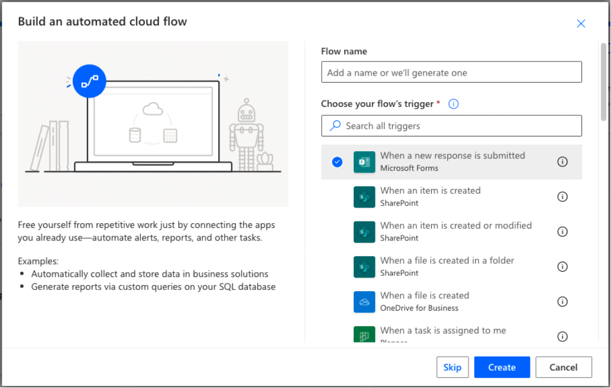
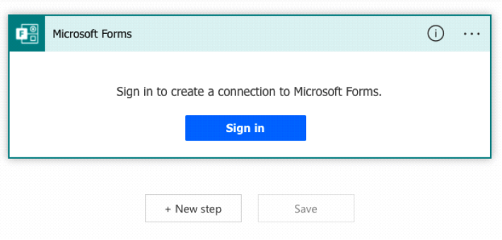
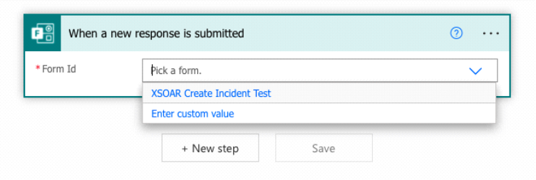
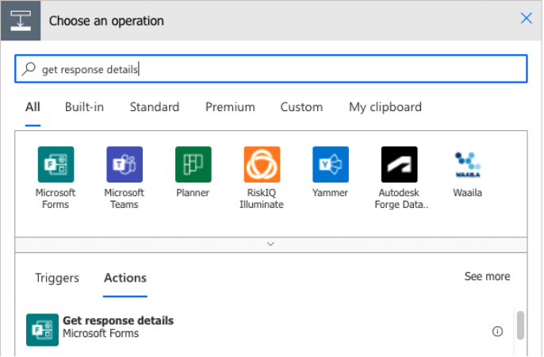
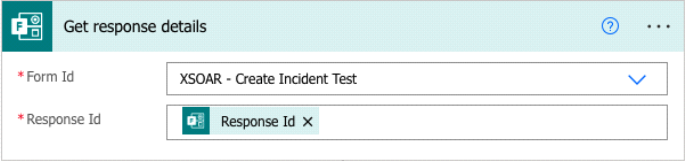
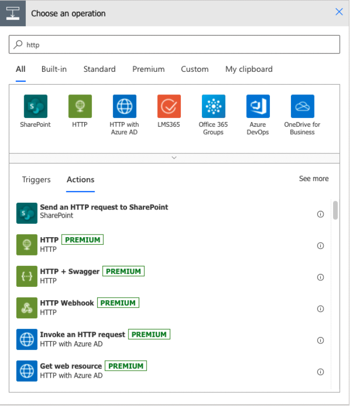
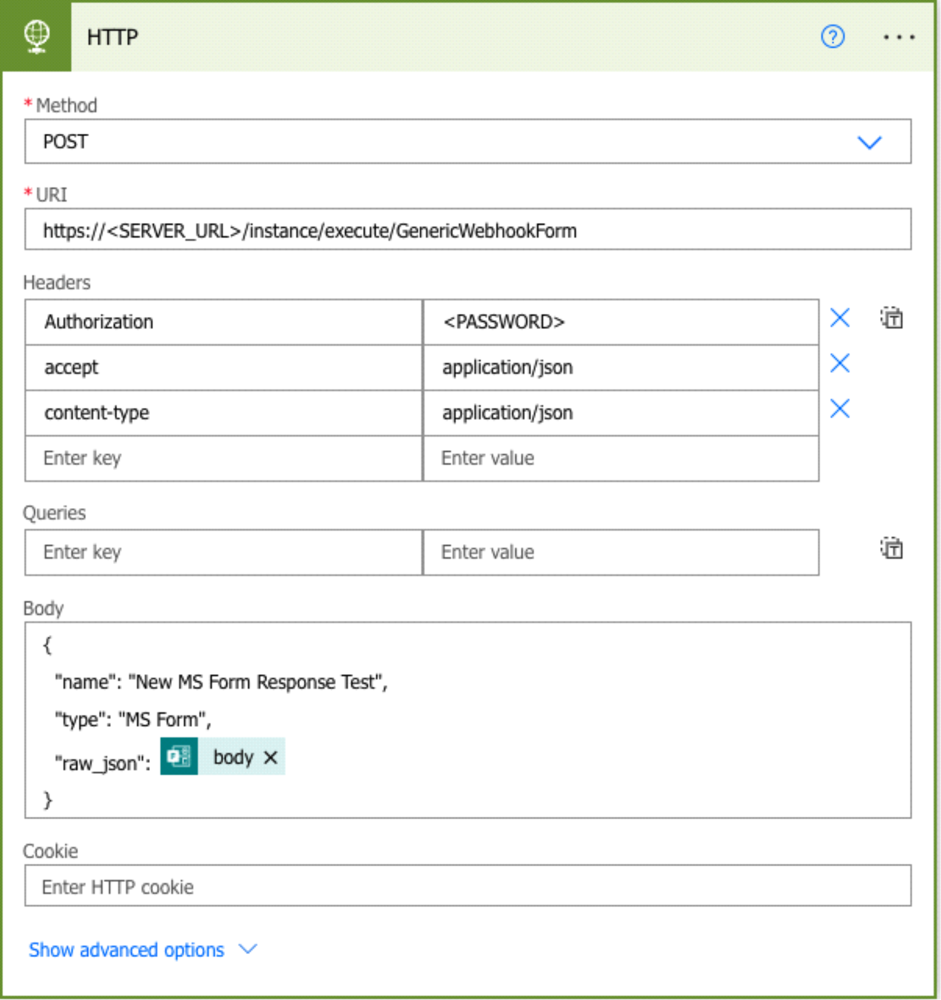
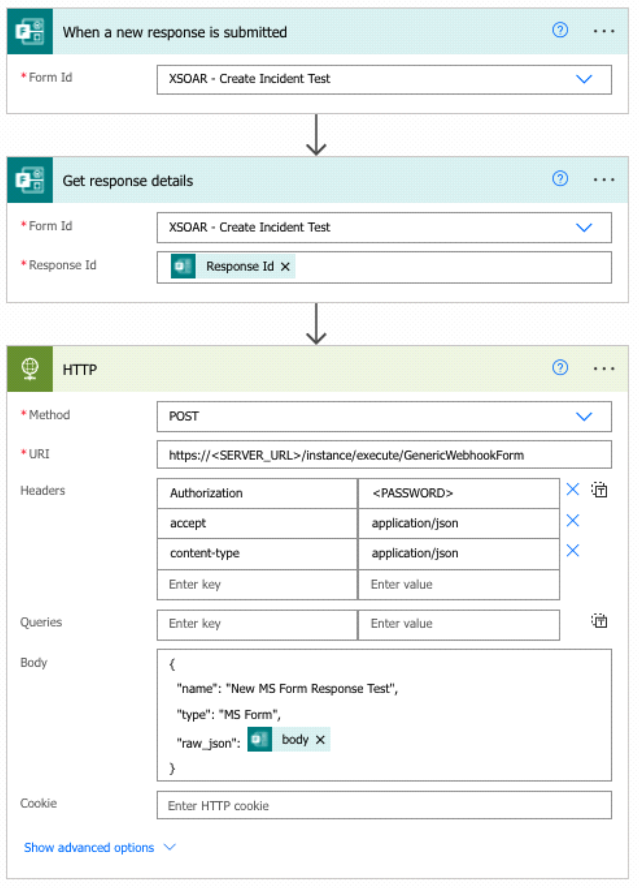

1. Set up an instance of the Generic Webhook integration. Refer to the [Generic Webhook Configuration](https://xsoar.pan.dev/docs/reference/articles/google-forms-cortex-xsoar#generic-webhook-configuration) section of the Processing Google Form Responses via a Webhook documentation. 
   
   To authorize the request coming from Power Automate, it is recommended to set the *Username* parameter to *_header:Authorization* and to set the *Password* parameter to a strong password of your choice, as described [here](https://xsoar.pan.dev/docs/reference/integrations/generic-webhook#security).

2. Go to Microsoft Forms and create a form to be used to create new Cortex XSOAR incidents.
    1. Click **+ New Form**.
    2. Populate the form with the desired questions.
    3. Under *Share*, configure who can respond to the form.

3. Go to *Power Automate* and create a new Power Automate flow.
   1. Click **+ Create**.
   2. Click **Automated cloud flow**.
   3. Enter a name for your form. For the trigger, select *When a new response is submitted (Microsoft Forms)*.

      </img>

4. Set up the flow trigger.
   1. In the first step fo the flow, sign into your account that owns the Microsoft Form.

      </img>
   2. Select the form you want to trigger off of.

      </img>

5. Add a step to the flow to get the form response details.
   1. Click **+ New step**.
   2. Search for and choose the Microsoft Forms *Get response details* action.

      </img>
   3. In the *Form Id* field, select the form created in the trigger step above.
   4. In the *Response Id* field, select the Response Id that was output from the trigger step.

      </img>

6. Add a step to the flow to make a POST request to Cortex XSOAR to create a new incident.
   1. Click **+ New step**.
   2. Search for and choose the **HTTP** action.

      </img>
   3. Select method *POST*.
   4. Enter the following URI:  
   
      https://&lt;Cortex-XSOAR-URL>/instance/execute/&lt;INTEGRATION-INSTANCE-NAME>

      or 

      http://&lt;Cortex-XSOAR-URL>:&lt;LISTEN_PORT>
  
      For information on how to set up the integration and determine the URL, make sure you have reviewed the information [here](https://xsoar.pan.dev/docs/reference/integrations/generic-webhook).

      **Note:** As of this writing, the Power Automate HTTP action does not support self-signed certificates with no way to skip TLS verification. Therefore, it is necessary to set up a valid signed certificate on the Cortex XSOAR server in order to use HTTPS.

   5. If you set a Username/Password on the Generic Webhook instance, as is recommended, add the following headers:

      ⦁	Authorization: <PASSWORD_FROM_INSTANCE_CONFIG>

      ⦁	Accept: application/json

      ⦁	Content-Type: application/json

    6. Enter the request body as a JSON. Optionally, you can set incident fields like “name” and “type”. You can also pass the entire form response body in the “raw_json” key, to make it available to be mapped using a mapper set on the Generic Webhook integration instance.

       </img>

7. Save your flow, which should look something like this:

    </img>

8. Test.

   Submit the Microsoft Form and check to make sure the flow was triggered and ran successfully. If yes, check and validate that a Cortex XSOAR incident was created. If not, review the flow run and troubleshoot any errors with the HTTP call.

