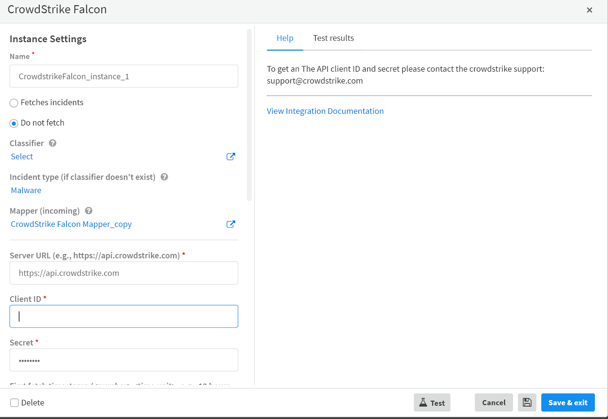

 

The **Endpoint Malware Investigation** content pack provides a generic framework to handle malware investigation. This pack incorporates the most relevant integrations in Cortex XSOAR for handling malware incidents.

The playbook in this pack includes the following steps: 
- endpoint enrichment 
- file retrieval for reputation enrichment and detonation
- host forensics
- enterprise threat hunting,
- isolation of suspicious endpoints
- unisolation endpoints after investigation and blocking malicious indicators

These steps provide a solid basis and guidelines for malware investigation.

The new feature in **Endpoint Malware Investigation - Generic V2** (available from version 6.1) is the indicators extraction rules. This feature extracts all the relevant fields from incidents in order to run the **Endpoint Malware Investigation - Generic V2** playbook properly.

## Pack Workflow

First you need to decide in which incidents to activate the Malware incident type. If you don't have a default playbook or incident type for your endpoint protection integration, this pack could be a good fit. You just need to define the malware incident type for the relevant integration or create a dedicated [Classifier](https://xsoar.pan.dev/docs/incidents/incident-classification-mapping#classification).
 

 
## What's in this Content Pack?     
### Playbooks
There is 1 playbook in this pack. This playbook uses all the other playbooks mentioned in this article. 

**Endpoint Malware Investigation - Generic V2** 

This playbook provides a framework for handling a malware investigation through all essential stages. The playbook consists of 7 stages where each stage contains the relevant playbook or tasks. 

#### Enrichment

The **Get endpoint details - Generic** playbook uses the generic ***!endpoint*** command to retrieve details on specific endpoints.

For additional information, refer to: [Get endpoint details - Generic](https://xsoar.pan.dev/docs/reference/playbooks/get-endpoint-details---generic)

#### Retrieve File

The **Retrieve File from Endpoint - Generic V2** playbook retrieves the required file for further investigation. This playbook can retrieve a file by its hash or by its file path. 

For additional information, refer to: [Retrieve File from Endpoint - Generic V2](https://xsoar.pan.dev/docs/reference/playbooks/retrieve-file-from-endpoint---generic-v2)

#### Detonation

Dynamic analysis for suspicious files is a significant stage in every malware incident. The analysis will not only determine if the file is malicious, but also provide indicators for further investigation.
The **Detonate File - Generic** playbook detonates files through active integrations that support file detonation.

For additional information, refer to: [Detonate File - Generic](https://xsoar.pan.dev/docs/reference/playbooks/detonate-file---generic)

#### Forensics

The **Get host forensics - Generic** playbook provides additional forensics on the investigated host. Currently, this playbook uses only the Illusive network integration.

For additional information, refer to: [Get host forensics - Generic](https://xsoar.pan.dev/docs/reference/playbooks/get-host-forensics---generic)

#### Threat Hunting

The **Threat Hunting - Generic** playbook assists in hunting IOCs in your organization as part of the malware investigation.

For additional information, refer to: refer to: [Threat Hunting - Generic](https://xsoar.pan.dev/docs/reference/playbooks/threat-hunting---generic)

#### Isolation

The **Isolate Endpoint - Generic V2** playbook rapidly isolates the infected host and prevents the threat from spreading throughout your organization. 

For additional information, refer to: [Isolate Endpoint - Generic V2](https://xsoar.pan.dev/docs/reference/playbooks/isolate-endpoint---generic-v2)

#### Unisolation

The **Unisolate Endpoint - Generic** playbook unisolates endpoints according to the endpoint ID or hostname that is provided by the playbook input.

For additional information, refer to: [Unisolate Endpoint - Generic](https://xsoar.pan.dev/docs/reference/playbooks/unisolate-endpoint---generic)

#### Remediation and Blocking Indicators

The **Block Indicators - Generic v2** playbook blocks the malicious indicators that were discovered during the investigation. The playbook blocks files, IPs, URLs, and user accounts.

For additional information, refer to: [Block Indicators - Generic v2](https://xsoar.pan.dev/docs/reference/playbooks/block-indicators---generic-v2)

## Layouts

This layout has three tabs:
- [Incident info tab](#incident-info-tab)
- [Investigation tab](#investigation-tab)
- [Similar incidents tab](#similar-incidents-tab)

### Incident info tab

| Layout sections | Description |
| ---- | ---- |
| Case Details | Information that is associated with the incident, such as: Type, Owner, Source Brand, Source instance, Playbook, Severity. |
| Source Details | Information that is associated with the source host of the incident, such as: IP, user, hostname, src OS, etc. |
| File Attributes | Information regarding the suspicious file that was involved in the incident. |
| Threat Hunting Results | Results of the **Threat Hunting - Generic** playbook. |
| Notes | Comments entered by the user regarding the incident. |
| Team Members | A list of the analysts who participated in this incident. |
| Timeline Information | Information regarding the incident timeline, such as: time occurred, last update, closed time, etc. |
| Child Incidents | Incidents that were created from this incident. |
| Work Plan | Information regarding the playbook tasks from the Work Plan. |
| Linked Incidents | Incidents that were linked to the current incident. |
| Closing Information | Information regarding the closing of the incident. |

### Investigation tab

| Layout sections | Description |
| ---- | ---- |
| Malware Details | Malicious file details such as: tactics, technique, command line, etc. |
| Endpoint details | Details of the endpoints that were involved in the investigation. |
| Forensics | Forensic data that was retrieved by the **Get host forensics** playbook. |
| Investigation Report | The investigation summary report. |
| Indicators | Indicators that were extracted from the incident. |

### Similar incidents tab
Displays information for similar incidents based on the **DBotFindSimilarIncidentsByIndicators** script.

| Layout sections | Description |
| ---- | ---- |
| Incident ID | The similar incident ID. |
| Created | The date when the similar incident was created. |
| Name | The name of the similar incident. |
| Similarity Incident | The score for the similarity for the incident. |
| Parent CMD line | The arguments in the command line of the parent process.  |
| File Path | The path of the suspicious file. |
| Command Line | The arguments of the command line that triggered the file. |

## Before You Start

### Classification and Mapping 
(https://xsoar.pan.dev/docs/incidents/incident-classification-mapping)

To use the **Endpoint Malware Investigation - Generic V2** playbook we strongly recommend that you map the playbook for the relevant integration.
1. Navigate to **Settings** > **Integrations** > **Classification and Mapping**.
2. Mark the checkbox of the relevant integration that you want to map.
3. Click **Duplicate**.

4. Click the copy you just created. 
5. From the *Incident Type* dropdown list, select **Malware**.

6. From the *Select Instance* dropdown list, select the instance that you want to map.

   After selecting your instance the *Data fetched JSON* will be loaded.

 

7. Map the relevant fields from the JSON by selecting the keys and clicking **Choose data path**. See the table in the [Auto Extraction](#auto-extraction) section for the fields to map. For information about creating a mapper, see [Create a Mapper](https://docs.paloaltonetworks.com/cortex/cortex-xsoar/6-1/cortex-xsoar-admin/incidents/classification-and-mapping/create-a-mapper.html).

 

8. Click **Save Version**.
9. Navigate to **Settings** > **Integration** > **Servers & Services**.
10. Access the relevant integration instance setting and edit it as follows:
   - From the Incident Type dropdown list, select **Malware**.
   - For the Mapper, select the mapper you created. 

 
 

## Extraction Rules
(https://docs.paloaltonetworks.com/cortex/cortex-xsoar/6-1/cortex-xsoar-threat-intel-management-guide/manage-indicators/auto-extract-indicators/define-indicator-extraction-rules-for-an-indicator-type.html)

In the 6.1 version a new future was added to XSOAR. The *Auto Extract from incidents fields* feature extracts indicators from incidents fields and enriches their reputations using commands and scripts defined for the indicator type. You can automatically extract indicators in the following scenarios:
- When fetching incidents
- In a playbook task
- Using the command line

In order for the malware incident type layout to properly display the relevant fields and for the playbook to extract the fields it is important to map the fields as shown in the table below so that they will appear in the malware incident layout.

Refer to the [incident classification and mapping](https://xsoar.pan.dev/docs/incidents/incident-classification-mapping) documentation for relevant guidance.

Note: Fields that are not mapped will not appear in the layout.

                                      

| File Attributes | Source Details | Malware Details |
| --------- | ------------- | -------- |
| File Name | Src | CMD |
| File Path | Host Name | Scenario |
| File Hash | Src NT Domain | Objective |
| MD5 | Src Operating System | Tactic |
| SHA1 | Users | Tactic ID |
| SHA256 |  | Technique |
| File Size |  | Technique ID |
| Signature | | Description |

In the **Endpoint Malware Investigation - Generic V2** playbook, the indicators are extracted according to the indicators extraction rules of the malware incident type.

To view the indicators that will be extracted:
1. Navigate to **Settings** >  **Advanced** > **Incidents Types**.
2. Mark the *Malware* checkbox.
3. Click **Indicator Extraction Rules**.

 
      
If you want to edit the indicator extraction rules, you need to detach the Malware incident type. When you finish editing the rules, you must reattach the Malware incident type.
1. Navigate to **Settings** >  **Advanced** > **Incidents Types**.
2. Mark the *Malware* checkbox.
4. Click **Detach**.

 

2. Mark the *Malware* checkbox.
3. Click **Indicator Extraction Rules**.
5. Edit the rules.
6. When you are finished editing, click **Save**.
7. Mark the *Malware* checkbox.
8. (Optional.) Click **Reattach**. Note that if you reattach the incident type, the next update will override any changes you made to the default playbook and indicator extraction rules. 

 

### Integrations

The following is a list of integrations each playbook/sub-playbook uses.

| Playbook | Integrations |
| ----- | ----- |
| Get endpoint details - Generic | - [Palo Alto Networks Cortex XDR - Investigation and Response](https://xsoar.pan.dev/docs/reference/integrations/cortex-xdr---ir) - [CrowdStrike Falcon](https://xsoar.pan.dev/docs/reference/integrations/crowdstrike-falcon) |
| Retrieve File from Endpoint - Generic V2 | - [VMware Carbon Black EDR](https://xsoar.pan.dev/docs/reference/integrations/carbon-black-enterprise-edr) - [VMware Carbon Black EDR - Live Response API](https://xsoar.pan.dev/docs/reference/integrations/carbonblackliveresponse) - [Cylance Protect v2](https://xsoar.pan.dev/docs/reference/integrations/cylance-protect-v2) |
| Detonate File - Generic | - [Group-IB TDS Polygon](https://xsoar.pan.dev/docs/reference/integrations/group-ib-tds-polygon) - [JoeSecurity](https://xsoar.pan.dev/docs/reference/integrations/joe-security) - [Cisco Threat Grid](https://xsoar.pan.dev/docs/reference/integrations/threat-grid) - [McAfee Advanced Threat Defense](https://xsoar.pan.dev/docs/reference/integrations/mc-afee-advanced-threat-defense) - [CrowdStrike Falcon Sandbox](https://xsoar.pan.dev/docs/reference/integrations/vx-stream) - [Palo Alto Networks WildFire V2](https://xsoar.pan.dev/docs/reference/integrations/wild-fire-v2) - [Lastline v2](https://xsoar.pan.dev/docs/reference/integrations/lastline-v2) - [Cuckoo Sandbox](https://xsoar.pan.dev/docs/reference/integrations/cuckoo-sandbox) - [SNDBOX](https://xsoar.pan.dev/docs/reference/integrations/sndbox) - [Hybrid Analysis](https://xsoar.pan.dev/docs/reference/integrations/hybrid-analysis) - [ANY.RUN](https://xsoar.pan.dev/docs/reference/integrations/anyrun) - [FireEye (AX Series)](https://xsoar.pan.dev/docs/reference/integrations/fireeye) - [VMRay](https://xsoar.pan.dev/docs/reference/integrations/vmray) |
| Threat Hunting - Generic | - [SplunkPY](https://xsoar.pan.dev/docs/reference/integrations/splunk-py) - [IBM Qradar](https://xsoar.pan.dev/docs/reference/integrations/q-radar) - [Palo Alto Networks PAN-OS](https://xsoar.pan.dev/docs/reference/integrations/panorama) - [Palo Alto Networks AutoFocus v2](https://xsoar.pan.dev/docs/reference/integrations/auto-focus-v2) - [Cortex Data Lake](https://xsoar.pan.dev/docs/reference/integrations/cortex-data-lake) |
| Isolate Endpoint - Generic V2| - Carbon Black Response - [Cortex XDR](https://xsoar.pan.dev/docs/reference/integrations/cortex-xdr---ir) - [CrowdStrike Falcon](https://xsoar.pan.dev/docs/reference/integrations/crowdstrike-falcon)  - [FireEye HX](https://xsoar.pan.dev/docs/reference/integrations/fire-eye-hx) - [Cybereason](https://xsoar.pan.dev/docs/reference/integrations/cybereason) |
| Unisoloate Endpoint - Generic | - Carbon Black Response - [Cortex XDR](https://xsoar.pan.dev/docs/reference/integrations/cortex-xdr---ir) - [CrowdStrike Falcon](https://xsoar.pan.dev/docs/reference/integrations/crowdstrike-falcon)  - [FireEye HX](https://xsoar.pan.dev/docs/reference/integrations/fire-eye-hx) - [Cybereason](https://xsoar.pan.dev/docs/reference/integrations/cybereason) |
| Block Indicators - Generic v2 | - [PAN-OS](https://xsoar.pan.dev/docs/reference/integrations/panorama) - [Minemeld](https://xsoar.pan.dev/docs/reference/integrations/palo-alto-minemeld) - [Cortex XDR](https://xsoar.pan.dev/docs/reference/integrations/cortex-xdr---ir) - [Cylance Protect v2](https://xsoar.pan.dev/docs/reference/integrations/cylance-protect-v2) - Carbon Black Response - [Palo Alto Networks Traps](https://xsoar.pan.dev/docs/reference/integrations/traps) - [Cybereason](https://xsoar.pan.dev/docs/reference/integrations/cybereason) - [Active Directory Query V2](https://xsoar.pan.dev/docs/reference/integrations/active-directory-query-v2) - [Check Point Firewall V2](https://xsoar.pan.dev/docs/reference/integrations/check-point-firewall-v2) - [Zscaler](https://xsoar.pan.dev/docs/reference/integrations/zscaler) - [FortiGate](https://xsoar.pan.dev/docs/reference/integrations/forti-gate) - [Symantec Messaging Gateway](https://xsoar.pan.dev/docs/reference/integrations/symantec-messaging-gateway)

 
