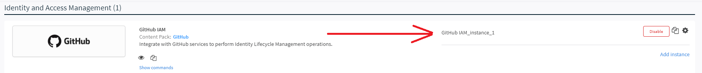

The Identity Lifecycle Management (ILM) pack enables 2 flows. 
- [User provisioning](#user-provisioning) - Provision users from Workday into Active Directory and/or Okta.
- [App sync](#app-sync) - Synch users in Okta to applications.

User provisioning can be used by itself, but it is a prerequisite for the app sync flow.

Read the instructions for each flow carefully to first understand the workflows that this pack executes and understand how it must be implemented. 

## User Provisioning

 The ILM pack enables you to provision users from Workday into Active Directory and/or Okta by performing management operations like creating, reading, updating and deleting users. 

### Workday Reports

HR uses Workday to manage operations for employees in the organization. It is standard practice for HR to generate reports for these maintenance operations. For example, running a weekly report that captures all new and terminated employees, or a daily report that captures updates to existing employee profiles (e.g., new mailing address or phone number).

Cortex XSOAR uses the Workday integration to fetch reports and create XSOAR incidents that correspond to the management operation(s) in the report. For example, if you run a full report that includes 5 new employees, 3 terminated employees, and 10 employee profiles that were updated, 18 unique incidents would be created in XSOAR.

Each report has a unique URL, which you enter in the Workday Report URL instance parameters. If you want to fetch or run associated playbooks on multiple reports, each report will require its own integration instance.

The Workday integration creates incidents based on employee information included in the report such as the employee's hire date, termination date (or last day of work), prehire flag and more. Depending on the incident type, the *IAM - Sync User* or *IAM - Activate User in Active Directory* playbook runs and provisions the user into the rest of the configured integrations, or activates the user in Active Directory, respectively.
The *IAM - Sync User* playbook determines the management (create, read, update, or delete/disable) operations that need to be done according to the data retrieved from the Workday report. 
For example, if a new employee joins the company, Workday will create an *IAM - New Hire* incident, and the playbook runs a Create operation across the supported IAM integrations. Similarly, if an employee is terminated in Workday, the incident type will be *IAM - Terminate User*, and a Disable operation runs in the supported IAM integrations.
The *IAM - Activate User In Active Directory* playbook will run when an *IAM - AD User Activation* incident is fetched. This incident is created for new or rehired employees, before the hire date or immediately, depending on the days configured in the Workday integration parameters.

### User Provisioning Workflow

The following table shows the supported Workday operations and their corresponding XSOAR commands, which are executed in the pack playbooks.

---

| Workday Operation | XSOAR Command |
|------------------ | ------------- |
| New user hire | iam-create-user |
| User update | iam-update-user |
| User termination | iam-disable-user |
| User rehire | iam-update-user |  
 --- 

### Before You Start - User Provisioning

The logic of the playbooks in the ILM pack, which determine how they execute, is determined by the employment data ingested from the Workday integration.

To start working with Workday integration, download ``Workday`` pack from the marketplace and configure the [Workday IAM](https://xsoar.pan.dev/docs/reference/integrations/workday-iam) integration.

There are several custom fields that must be populated with specific values in order for the playbooks to execute the correct management operations. If your current Workday instance does not include these fields and values, you will need to add them to the instance.

The following table lists these fields, what they are used for in Cortex XSOAR, and the valid values the fields accept.

| Workday fields  |  How it is Used  | Possible Values |
| ------------ |---------------| -----|
| Email address      | A unique identifier for the user. | User's work email address | 
| Employment status |  Influences the playbook flow that will run on the IAM - Sync User incident.  | Active   Leave of Absence   Terminated
| Rehired employee  | Used in conjunction with the prehire flag to determine whether a user should be rehired. | Yes   No |
| Prehire flag | If True, indicates a pre-hire status of the employee (i.e., a future hire or rehire). | True   False|
| Hire date | Used to determine when a user will be created for the employee. | Any date format is supported.   The format should match the format chosen in the integration parameter. |
| Termination date / Last day of work | Used in conjunction with the prehire flag to determine whether a user should be terminated. | Any date format is supported.   The format should match the format chosen in the integration parameter. |

- Make sure to obtain the URL where the Workday reports are hosted. Each report has a unique URL, which you enter as one of the integration instance parameters. If you want to fetch multiple reports, each report will require its own integration instance. 

- Ensure that you have a **Mail sender** integration for sending email notifications.

### Initial Sync and User Profiles

Cortex XSOAR stores all employee information as *User Profile* indicators. User Profiles have many fields out-of-the-box, which hold data about the employee. 

**Note:** The User Profiles are initially created when Workday's *fetch-incident* command is executed for the first time and the *Sync user profiles on first run* parameter is checked. The profiles are created without triggering an incident. User Profiles for users that are added to Workday **after** this initial fetch are created by the *IAM - Sync User* playbook. This syncs all existing employees to XSOAR without running incidents for them, as they are already provisioned in the apps used by the organization.

The User Profiles are constantly synchronized with Workday, so that when a change to a user comes from a Workday report, the integration creates an incident, triggering a change in the rest of the apps used in the organization, and updating the User Profile indicator.

### Pack Configurations

This pack requires that you configure the following content items in the order listed.

1. Playbook configuration (inputs)
2. Indicator and Incident fields and mappers. You only need to configure these if you are adding custom fields which you want to store in XSOAR and/or provision into additional applications.
3. Integration configurations
#### Playbooks

IAM - Sync User: 
Under the inputs for the IAM - Sync User playbook, make sure you configure values for the ITNotificationEmail and ServiceDeskEmail inputs.

1. Navigate to *Playbooks* and locate the *IAM - Sync User* and *IAM - Activate User In Active Directory* playbooks.  
2. Click *Playbook Triggered* and insert values for the following inputs, in both playbooks, where applicable:
    1. *ITNotificationEmail* - used to receive notifications about any errors in the provisioning process.
    2. *ServiceDeskEmail* - used to receive initial temporary passwords for new hires to prepare employee laptops, etc.
    3. *PasswordGenerationScriptName* - The name of the automation script that will be used to generate a random password for newly created Active Directory users. The default script used for this is GeneratePassword, but depending on your password complexity policy, you may or may not want to use it.
 
### Integrations

- Workday IAM integration [(see the documentation)](https://xsoar.pan.dev/docs/reference/integrations/workday-iam).

    **Note:** Before running the Workday integration, ensure that you have added the fields in Workday as instructed in Before You Start.
- IAM-compatible integrations. These integrations support execution of the generic ILM management operations.

    - Active Directory - [(see the documentation)](https://xsoar.pan.dev/docs/reference/integrations/active-directory-query-v2)
    - Okta - [(see the documentation)](https://xsoar.pan.dev/docs/reference/integrations/okta-iam)
    - ServiceNow - [(see the documentation)](https://xsoar.pan.dev/docs/reference/integrations/service-now-iam)
    - GitHub - [(see the documentation)](https://xsoar.pan.dev/docs/reference/integrations/git-hub-iam)
    - Slack - [(see the documentation)](https://xsoar.pan.dev/docs/reference/integrations/slack-iam)
    - Salesforce - [(see the documentation)](https://xsoar.pan.dev/docs/reference/integrations/salesforce-iam)
  
    
> <i>Note:</i> If you choose to run any of the basic management operations, such as create, delete, etc. manually from the CLI, make sure to include the email and username fields in the user profile.

## App Sync

The app-sync feature provides automated app provisioning in applications (such as ServiceNow, GitHub, and Slack) for users created in Okta. App-sync consists of 2 main features:
1. Create/Enable/Disable users in apps they are assigned to or unassigned from through Okta.
2. Update users in apps when their information changes, either directly through Okta, or indirectly through a change in Workday which in turn updates the information in Okta and then in the rest of the apps.

### App Sync Process

The app-sync process starts when one of the following scenarios happens:
1. A user is assigned/unassigned to an application in Okta
2. A user is part of a group that was assigned/unassigned to an application in Okta.
3. The user's information changed in Okta, directly or indirectly (through an IAM - Update User incident)

The **Okta IAM** integration fetches the following Okta log event types and proceeds with the applicable flow:
* The *application.user_membership.add* / *application.user_membership.remove* Okta event results in *IAM - App Add* / *IAM - App Remove* incidents respectively, which run the **IAM - App Sync** playbook. The playbook uses the integration context (that is transparent to the user) of the Okta instance, which maps Okta App IDs to integration instances in Cortex XSOAR, in order to determine to which instance to sync the user. It then runs either the ***iam-update-user*** with the "allow-enable" argument set to True, or ***iam-disable-user*** command, depending on the detected incident type.
**Note:** The behavior for when a user account does not exist in the app is configurable through the relevant integration configuration. For example, if the user does not exist in the app to which they are assigned and the integration's "create if not exists" parameter is unchecked, then the command will be skipped. If the parameter is checked - the account will be created. 

* The *user.account.update_profile* Okta event results in *IAM - App Update* incidents which run the **IAM - App Update** playbook. The playbook checks which apps the user is assigned to, and maps it to integration instances in Cortex XSOAR in which the user will be updated. The mapping is done using the integration context (that is transparent to the user) of the Okta instance, which maps Okta App IDs to integration instances in Cortex XSOAR, in order to determine which instancea to update the user in. It then runs the ***iam-update-user*** in all of the available instances of the apps to which the user is currently assigned.

### Before You Start

Before using the app-sync feature with Okta, you need to perform the [initial synchronization of users from Workday into XSOAR User Profiles](#user-provisioning).

### Pack Configurations

To trigger the app-sync *IAM - App Add*, *IAM - App Remove* and *IAM - App Update* incident types, you need to configure an [Okta IAM integration](#okta-iam-integration) to fetch incidents. Before enabling the integration, create an [IAM Configuration](#iam-configuration) incident from which to make connections between Okta applications and IAM integration instances. When a user is added to or removed from a connected Okta application, XSOAR will call the relevant management command from its connected IAM instance in XSOAR.

#### Okta IAM integration
Configure the following information in your Okta IAM integration instance.

| Field | Value | Notes |
| ---- | ----| ----|
| Classifier | Okta IAM - App Sync | Select this from the drop-down list and not the textbox configuration, where “User Profile - Okta (Incoming)” and “User Profile - Okta (Outgoing)” should be. |
| Mapper | Okta IAM - App Sync | Select this from the drop-down list and not the textbox configuration, where “User Profile - Okta (Incoming)” and “User Profile - Okta (Outgoing)” should be. |
|Query only application events configured in IAM Configuration | Checked/Unchecked | Select this option to let the integration fetch all supported event types. Unselect this only if you are sure you don't want to fetch specific Okta events.
| Fetch Query Filter | “eventType eq "application.user_membership.add" or eventType eq "application.user_membership.remove" or eventType eq "user.account.update_profile" | Only fill this if the *Query only application events configured in IAM Configuration* parameter is unchecked. This allows you to specify manually which Okta event types to fetch. |
| Fetches incidents | Select this option. | |
| Automatically creates a user if not found in the update command | Select this option | |

#### IAM Configuration 

The app-sync process requires that you have a mapping of Okta App IDs to Cortex XSOAR integration instance names. This mapping allows you to decide what app assignments trigger the creation or removal of users in which instance.

For example, you may have an Okta App ID “0oau408dvkn96MwHc0h3” and want to map it to the **ServiceNow_Users_Instance1** so that every time a user is assigned to an app that has this App ID, a user will be created in ServiceNow using the generic IAM commands in Cortex XSOAR.

Configuring the app-sync settings is a one-time configuration that you can do using an out-of-the-box dedicated incident type. Create an incident of type **IAM - Configuration**, choose your Okta instance, and fill in the Okta App names and your Cortex XSOAR integration instance names in the relevant fields.

You can obtain the app integration instance name from the integration page in Cortex XSOAR:

By creating this incident and filling the app and instance information, a configuration will be saved in the integration context. This is transparent to the user. Once the configuration is set, the playbooks will use it automatically. Additionally, you will be able to use the ***okta-iam-get-configuration*** command to view the configuration at any time. If you ever decide to run the command ***okta-iam-get-configuration*** manually, make sure to use the *using* parameter with the correct instance name of Okta in which you made the configuration to receieve the configuration that you're expecting.

#### IAM - App Sync & IAM - App Update playbooks
These playbooks contain error handling tasks where a user is assigned to review the incident if app-sync fails for any reason. You can assign a user to the incident using the playbook inputs. If you want, you can configure the *UserRoleToAssignForFailures*, *UserAssignmentMethod*, and *AssignOnlyOnCall* playbook inputs according to your needs. Otherwise, a user will be randomly assigned.

### Integrations

 Okta IAM - [(see the documentation)](https://xsoar.pan.dev/docs/reference/integrations/okta-iam)
 
 
 ## Advanced

### Fields and Mappers

The mappers that are provided out-of-the-box work with the assumption that you did not add any fields. 

If you want to include additional information in the user profile indicator, and provision it to your available IAM applications, follow the steps in the following example: 

1. Add the field to the mappers for the Workday, Okta, Active Directory, and for any other IAM integration configured. 

   **Note:** To change the mappers, you will need to duplicate each mapper. 

   Ensure that you are adding the fields to the relevant incident types within each mapper.

   * for the Workday incoming mapper, add the field to the *IAM - Sync User* incident type.
   * for Okta and Active Directory, add the field to the *UserProfile* incident type in both the incoming and outgoing mappers.
   
        > <i>Note:</i> As part of the configuration of the Active Directory mapper, you must map a value to the OU (organizational unit) required field. To do this, create a transformer that maps a user attribute of your choice to an OU value.
   
   * for GitHub, the relevant mappers are in the *IAM-SCIM* pack and can be used in any integrations that uses SCIM.

2. Reconfigure each integration to use the duplicated mappers you created.

#### Example

The following is an example of the flow when adding a field to work with the ILM content pack. This example does not presume to cover all possible scenarios.

1.  Add an incident field.
    1. Navigate to Settings -> Advanced -> Fields and click *New Field*.
    1. Enter the name for the field and click the *Attributes* tab.
    1. Clear the *Add to all incident types* checkbox.
    1. In the *Add to incident types* drop-down, select the following:
        - User Profile
	- IAM - Sync User
	    
	    You can also add the following incident types if you would like to display the new field in the incident layout (the new fields will be shown regardless in the User Profile indicator).
	    - IAM - New Hire
	    - IAM - Update User
	    - IAM - Terminate User
	    - IAM - Rehire User
    1. Click *Save*.

    

1. Add an indicator field.
    1. Change the field type to *Indicator*.

       

    1. Click *New Field*. 
    1. Give the same name as you entered for the Incident field. In this example, we have used Sample-Field-IAM.
    1. Click the *Attributes* tab.
    1. Clear the *Add to all incident types* checkbox.
    1. In the *Add to incident types* drop-down, select the User Profile indicator type. 
    1. Click *Save*. 

    

1. Add the fields to the respective layouts.
    1. Navigate to *Settings -> Advanced -> Layouts*.
    1. Select the incident or indicator layout to which you want to add the field, for example, *User Profile*, and click *Duplicate*.
    1. Click the User Profile_copy layout.
    1. In the *Library*, click *Fields and Buttons*, and drag the field you added above to the section in the layout in which you want it to appear. In this example, we have added the field to the *Personal and Contact Information* section.
    1. Save the layout. 
    1. Repeat this process for each of the other layouts in which you want the field to appear.
    1. Go to *Indicator Types*, select the User Profile indicator type, click edit and then change the layout to the new layout you have just created.

    

1. Map the new field in all of the mappers.
    1. Navigate to *Settings -> Integrations -> Classification and Mapping*.
    1. Select the mapper to which you want to add the field, for example, *IAM Sync User - Workday*, and click *Duplicate*. 
    1. Click *IAM Sync User - Workday_copy*.
    1. Under *Get data*, select the source from which you want to retrieve the sample data for mapping.
    1. Under *Select Instance*, select the instance of the selected source.
    1. Under *Incident Type*, select the relevant incident type, as follows:
        - for the Workday incoming mapper, add the field to the *IAM - Sync User*, *IAM - New Hire*, *IAM - Rehire User*, *IAM - Update User* and *IAM - Terminate User* incident types. 
        - for Okta, Active Directory, ServiceNow, GitHub and the rest of the IAM integrations, add the field to the UserProfile incident type in both the incoming and outgoing mappers.
    1. Map the new field you have created to the field in the schema. For purposes of this example, we have mapped the Sample-Field-IAM field to the employee number.
    1. Repeat this process for each additional field and save the mapper. 
    1. Repeat this process for all of the mappers. For example:
        - Workday incoming mapper
        - Okta incoming and outgoing mappers
        - Active Directory incoming and outgoing mappers
        - ServiceNow incoming and outgoing mappers
        - GitHub that uses the IAM-SCIM incoming and outgoing mappers

    

1. Configure the integration instances to use the new mappers.
    1. Navigate to *Settings -> Servers and Services* and select one of the integration instances for this pack. In our example, we are using Workday.
    1. In both *Mapper (incoming)* fields (one located under the *Incident type* field and one located under the *Use system proxy settings* checkbox) select the copy mapper that you created above. In our example, that would be **IAM Sync User - Workday_copy**. 

 
## Demo Video
<video controls>
    <source src="https://github.com/demisto/content-assets/raw/master/Assets/xsoar.pan.dev/IAM__Full_Demo.mp4"
            type="video/mp4"/>
    Sorry, your browser doesn't support embedded videos. You can download the video at: https://github.com/demisto/content-assets/raw/master/Assets/xsoar.pan.dev/IAM__Full_Demo.mp4 
</video>

## Troubleshooting

##### Why are my new fields not shown in the layout?
Make sure of the following: 
* You've created an incident field **and** an indicator field with the exact same name.
* The incident fields are associated to the IAM incident types, and the indicator fields are associated to the User Profile indicator type, as described in the Fields and Mappers section. 
* The fields are mapped in the Workday mapper under all the relevant incident types
* The mapper configured in the Workday integration is the correct one.
* The fields were added to the layout where you want them to appear
* The incident types were configured to use the new layout that you've created

##### Why are incidents not being created from Workday?
There could be several reasons for this:
* The integration is being run for the first time, at which point only the initial user sync is run - which is when the User Profile indicators are created as described in the "Initial Sync & User Profiles" section.
* You keep resetting the last run timestamp in the Workday integration while "Sync user profiles on first run" option in the Workday integration configuration is checked. You should not reset the last run timestamp or you should uncheck that option if you've already performed the initial sync.
* Your Workday report is missing required fields. Please refer to the table in the "Before You Start - User Provisioning" section and make sure that the report holds all of those fields for every employee.
* Nothing has changed in the Workday report since the initial sync, so there is nothing to provision.

##### Why are duplicate incidents being created?
There could be several reasons for this:
* There were changes to an employee in the Workday report, but the employee's incident in XSOAR failed before updating the User Profile indicator of that employee. As long as there is a discrepancy between the Workday report and the User Profile indicator, the Workday integration will keep trying to update it. Search for the incident of the employee and fix the cause of error. Then - the next incident should complete and no duplicate incidents should follow.
* The field is missing in one of the incident types in the Workday mapper

##### Why does user creation fail in Active Directory?
There could be several reasons for this. Inspect the error message in the Process Details tab to understand why the creation failed. If you cannot determine the cause of the error, make sure that:
* You've added a transformer script which determines the OU where the user will be created, in the Active Directory outgoing mapper, in the User Profile incident type and schema type, under the "ou" field.
* You're using LDAPS in the Active Directory (port 636) integration.
* You've specified a password generation script in the *IAM - Activate User In Active Directory* playbook inputs, under the *PasswordGenerationScriptName*, and that script complies with your domain's password complexity policy.

##### Why am I getting unwanted IAM - App Update incidents?
You may have rules configured in Okta which automatically update user information for every new user. If you want to have those updates provisioned to the rest of the apps, you will need to follow the process of adding additional fields under the "Advanced" section.
