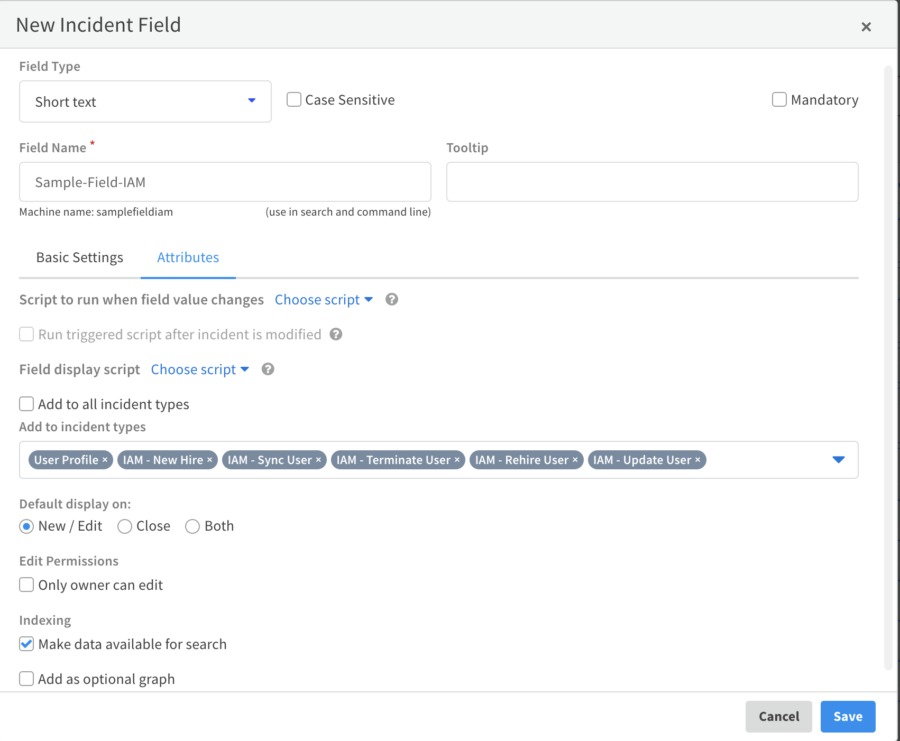

The Identity Lifecycle Management (ILM) pack enables 2 flows. 
- [User provisioning](#user-provisioning) - Provision users from Workday into Active Directory and/or Okta.
- [App sync](#app-sync) - Synch users in Okta to applications.

User provisioning can be used by itself, but it is a prerequisite for the app sync flow.

Read the instructions for each flow carefully to first understand the workflows that this pack executes and understand how it must be implemented. 

## User Provisioning

 The ILM pack enables you to provision users from Workday into Active Directory and/or Okta by performing management operations like creating, reading, updating and deleting users. 

### Workday Reports

HR uses Workday to manage operations for employees in the organization. It is standard practice for HR to generate reports for these maintenance operations. For example, running a weekly report that captures all new employees and terminated employees, or a daily report that captures updates to existing employee profiles (e.g., new mailing address or phone number).

Cortex XSOAR uses the Workday integration to fetch reports and create XSOAR incidents that correspond to the management operation(s) in the report. For example, if you run a full report that includes 5 new employees, 3 terminated employees, and 10 employee profiles that were updated, 18 unique incidents would be created in XSOAR.

Each report has a unique URL, which you enter in the Workday Report URL instance parameters. If you want to fetch or run associated playbooks on multiple reports, each report will require its own integration instance.

The Workday integration creates an IAM-Sync-User incident for each user profile that is in the report.. This incident runs the IAM - Sync User playbook and provisions the user into the rest of the configured integrations. The playbook determines the management (create, read, update, or delete/disable) operations that need to be done according to the data retrieved from the Workday report. 
For example, if a new employee joins the company, the playbook changes the incident type to IAM-New-Hire, and runs a Create operation across the supported IAM integrations. Similarly, if an employee is terminated in Workday, the playbook changes the incident type to IAM-Terminate-User, and a Disable operation runs in the supported IAM integrations. 

### User Provisioning Workflow

The following table shows the supported Workday operations and their corresponding XSOAR commands, which are executed in the pack playbooks.

---

| Workday Operation | XSOAR Command |
|------------------ | ------------- |
| New user hire | iam-create-user |
| User update | iam-update-user |
| User termination | iam-disable-user |
| User rehire | iam-enable-user |  
 --- 

### Before You Start - User Provisioning

The logic of the playbooks in the ILM pack, which determine how they execute, is determined by the employment data ingested from the Workday integration.

There are several custom fields that must be populated with specific values in order for the playbooks to execute the correct management operations. If your current Workday instance does not include these fields and values, you will need to add them to the instance.

The following table lists these fields, what they are used for in Cortex XSOAR, and the valid values the fields accept.

| Workday fields  |  How it is Used  | Possible Values |
| ------------ |---------------| -----|
| Email address      | A unique identifier for the user. | User's work email address | 
| Employment status |  Influences the playbook flow that will run on the User Profile incident.  | Active   Leave of Absence   Terminated
| Rehired employee  | Used to determine whether the User rehire flow is implemented. | Yes   No |
| Prehire flag | Used in conjunction with the Rehired employee field to enable the User rehire flow. | True   False|

- Make sure to obtain the URL where the Workday reports are hosted. Each report has a unique URL, which you enter as one of the integration instance parameters. If you want to fetch multiple reports, each report will require its own integration instance. 

- Ensure that you have a Mail sender integration for sending email notifications.

### Pack Configurations

Cortex XSOAR stores all employee information as User Profile indicators. User Profiles have many fields out-of-the-box, which hold data about the employee. 

**Note:** The User Profiles are initially created when the Workday integration fetches incidents. User profiles for users that are added to Workday after this initial fetch are created by the IAM-Sync User playbook. 

The User Profiles are constantly synchronized with Workday, so that when a change to a user comes from a Workday report, the integration creates an incident, triggering a change in the rest of the apps used in the organization, and updating the User Profile indicator.

This pack requires that you configure the following content items in the order listed.

1. Playbook configuration (inputs)
2. Indicator and Incident fields and mappers. You only need to configure these if you are adding custom fields.
3. Integration configurations
#### Playbooks

IAM - Sync User: 
Under the inputs for the IAM - Sync User playbook, make sure you configure values for the ITNotificationEmail and ServiceDeskEmail inputs, as well as the TerminateOnLastDayOfWork, Timezone, and DateFormat inputs.

1. Navigate to *Playbooks* and locate that IAM - Sync User playbook.  
1. Click *Playbook Triggered* and insert values for the following inputs:
ITNotificationEmail - used to receive notifications about any errors in the provisioning process.
ServiceDeskEmail - used to receive initial temporary passwords for new hires to prepare employee laptops, etc.
TerminateOnLastDayOfWork - determines whether termination of employees goes into effect on their last day of work, or on their termination day. By default, employees are terminated on their termination day.
Timezone - The time zone used when referring to employee termination date, last day of work, hire date, and so on. This should be the time zone that is used in the employee Workday reports. The time zone you choose affects the way that the playbooks treat dates for the employee. For example, if your chosen time zone is "America/Los_Angeles" and an employee should be terminated on November 5th at 23:59, then only when it's November 5th and 23:59 in Los Angeles will the termination occur.
DateFormat - the format in which the dates in employee Workday reports are represented. For example, if an employee's hire date appears like this: 06/15/2020, then the value for the DateFormat input should be %m/%d/%Y.

#### Fields and Mappers

The mappers that are provided out-of-the-box work with the assumption that you did not add any fields. 

If you want to add fields, follow the steps in the following Example section. 

1. Add the field to the mappers for the Workday, Okta, Active Directory and Github integrations. 

   **Note:** To change the mappers, you will need to duplicate each mapper. 

   Ensure that you are adding the fields to the relevant incident types within each mapper.

   * for the Workday incoming mapper, add the field to the *IAM-Sync-User* incident type.
   * for Okta and Active Directory, add the field to the *UserProfile* incident type in both the incoming and outgoing mappers.
   * for Github the relevant mappers are in the IAM-SCIM pack and can be used in any integrations that uses SCIM.

2. Reconfigure each integration to use the duplicated mappers you created.

##### Example

The following is an example of the flow when adding a field to work with the ILM content pack. This does not presume to cover all possible scenarios.

1.  Add an incident field.
    1. Navigate to Settings -> Advanced -> Fields and click *New Field*.
    1. Enter the name for the field and click the *Attributes* tab.
    1. Clear the *Add to all incident types* checkbox.
    1. In the *Add to incident types* drop-down, select the following:
	    - IAM - Sync User
	    - IAM - New Hire
	    - IAM - Update User
	    - IAM - Terminate User
	    - IAM - Rehire User
    1. Click *Save*.

    

1. Add an indicator field.
    1. Change the field type to *Indicator*.

       

    1. Click *New Field*. 
    1. Give the same name as you entered for the Incident field. In this example, we have used Sample-Field-IAM.
    1. Click the *Attributes* tab.
    1. Clear the *Add to all incident types* checkbox.
    1. In the *Add to incident types* drop-down, select the User Profile indicator type. 
    1. Click *Save*. 

    

1. Add the fields to the respective layouts.
    1. Navigate to *Settings -> Advanced -> Layouts*.
    1. Select the layout to which you want to add the field, for example, *User Profile*, and click *Duplicate*.
    1. Click the User Profile_copy layout.
    1. In the *Library*, click *Fields and Buttons*, and drag the field you added above to the section in the layout in which you want it to appear. In this example, we have added the field to the *Personal and Contact Information* section.
    1. Save the layout. 
    1. Repeat this process for each of the other layouts in which you want the field to appear.

    

1. Map the new field in all of the mappers.
    1. Navigate to *Settings -> Integrations -> Classification and Mapping*.
    1. Select the mapper to which you want to add the field, for example, *IAM Sync User - Workday*, and click *Duplicate*. 
    1. Click *IAM Sync User - Workday_copy*.
    1. Under *Get data*, select the source from which you want to retrieve the sample data for mapping.
    1. Under *Select Instance*, select the instance of the selected source.
    1. Under *Incident Type*, select the relevant incident type, as follows:
        - for the Workday incoming mapper, add the field to the IAM-Sync-User incident type. 
        - for Okta and Active Directory, add the field to the UserProfile incident type in both the incoming and outgoing mappers.
    1. Map the field from the layout to the field in schema. For purposes of this example, we have mapped the Sample-Field-IAM field to the employee number.
    1. Repeat this process for each additional field and save the mapper. 
    1.  Repeat this process for all of the mappers. There are 5 in total:
        - Workday incoming mapper
        - Okta incoming and outgoing mappers
        - Active Directory incoming and outgoing mappers

    

1. Configure the integration instances to use the new mappers.
    1. Navigate to *Settings -> Servers and Services* and select one of the integration instances for this pack. In our example, we are using Workday.
    1. In both *Mapper (incoming)* fields (one located under the *Incident type* field and one located under the *Use system proxy settings* checkbox) select the copy mapper that you created above. In our example, that would be **IAM Sync User - Workday_copy**. 

### Integrations

- Workday ILM integration (link to the integration docs).
**Note:** Before running the Workday integration, ensure that you have added the fields in Workday as instructed in Before You Start.
- IAM-compatible integrations. These integrations support execution of the generic ILM management operations.

    - Workday - [(see the documentation)](https://xsoar.pan.dev/docs/reference/integrations/workday-iam)
    - Active Directory - [(see the documentation)](https://xsoar.pan.dev/docs/reference/integrations/active-directory-query-v2)
    - Okta - [(see the documentation)](https://xsoar.pan.dev/docs/reference/integrations/okta-iam)

## App Sync

The app-sync feature provides automated app provisioning in applications (such as ServiceNow, GitHub, and Slack) for users created in Okta.

### App Sync Process

The app-sync process starts when a user is assigned to an application in Okta, or when a user is part of a group that was assigned to an application in Okta. 

The **Okta IAM** integration fetches events, such as *application.user_membership.add* and *application.user_membership.remove*, and creates *IAM - App Sync* incidents which run the **IAM - App Sync** playbook. The playbook uses the integration context (that is transparent to the user) of the Okta instance, which maps Okta App IDs to integration instances in Cortex XSOAR, in order to determine which instance to sync the user to. It then runs either the ***iam-create-user*** or ***iam-disable-user*** command, depending on the fetched event type.

### Before You Start

Before using the app-sync feature with Okta, you need to perform the [initial synchronization of users from Workday into XSOAR User Profiles](#user-provisioning).

### Pack Configurations

To trigger the app-sync *IAM - App Add* and *IAM - App Remove* incident types, you need to configure an [Okta IAM integration](#okta-iam-integration) to fetch incidents. Before enabling the integration, create an [IAM Configuration](#iam-configuration) incident from which to make connections between Okta applications and IAM integration instances. When a user is added to or removed from a connected Okta application, XSOAR will call the relevant management command from its connected IAM instance in XSOAR.

#### Okta IAM integration
Configure the following information in your Okta IAM integration instance.

| Field | Value | Notes |
| ---- | ----| ----|
| Classifier | Okta IAM - App Sync | Select this from the drop-down list and not the textbox configuration, where “User Profile - Okta (Incoming)” and “User Profile - Okta (Outgoing)” should be. |
| Mapper | Okta IAM - App Sync | Select this from the drop-down list and not the textbox configuration, where “User Profile - Okta (Incoming)” and “User Profile - Okta (Outgoing)” should be. |
| Fetch Query Filter | “eventType eq "application.user_membership.add" or eventType eq "application.user_membership.remove" | This allows Okta to fetch app assignment events (both add and remove events). |
| Fetches incidents | Select this option. | |
| Automatically creates a user if not found in the update command | Select this option | |

#### IAM Configuration 

The app-sync process requires that you have a mapping of Okta App IDs to Cortex XSOAR integration instance names. This mapping allows you to decide what app assignments trigger the creation or removal of users in which instance.

For example, you may have an Okta App ID “0oau408dvkn96MwHc0h3” and want to map it to the **ServiceNow_Users_Instance1** so that every time a user is assigned to an app that has this App ID, a user will be created in ServiceNow using the generic IAM commands in Cortex XSOAR.

Configuring the app-sync settings is a one-time configuration that you can do using an out-of-the-box dedicated incident type. Create an incident of type **IAM - Configuration**, choose your Okta instance, and fill in the Okta App names and your Cortex XSOAR integration instance names in the relevant fields.

You can obtain the Okta App ID from the URL when viewing an app in Okta:

You can obtain the app integration instance name from the integration page in Cortex XSOAR:

By creating this incident and filling the app and instance information, a configuration will be saved in the integration context. This is transparent to the user. Then you will be able to use the ***okta-iam-get-configuration*** command to view the configuration and use it in playbooks at any time. Note that when using the ***okta-iam-get-configuration*** command, you will have to use the *using* parameter with the correct instance name of Okta in which you made the configuration.

#### IAM - App Sync playbook
This playbook contains error handling tasks where a user is assigned to review the incident if app-sync fails for any reason. You can assign a user to the incident using the playbook inputs. If you want, you can configure the *UserRoleToAssignForFailures*, *UserAssignmentMethod*, and *AssignOnlyOnCall* playbook inputs according to your needs. Otherwise, a user will be randomly assigned.

### Integrations

 Okta IAM - [(see the documentation)](https://xsoar.pan.dev/docs/reference/integrations/okta-iam)
