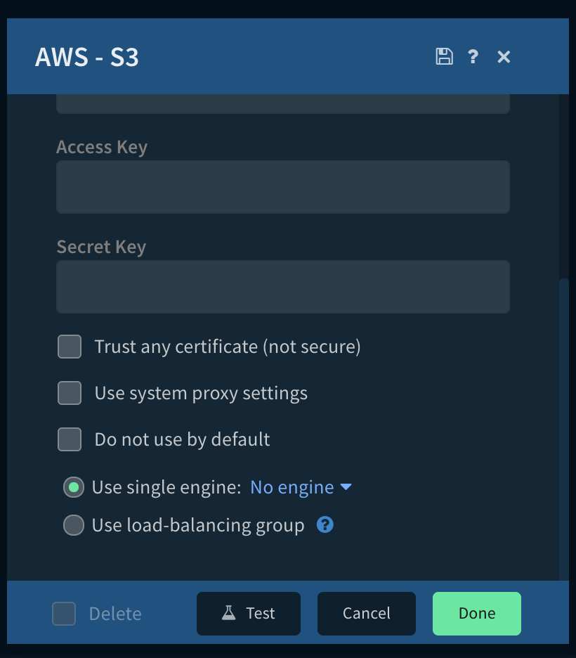
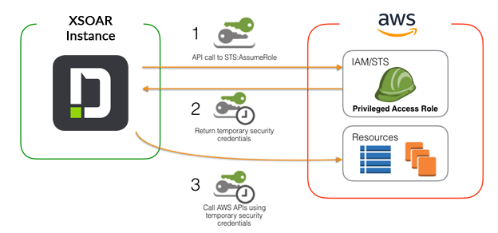

The Cortex XSOAR server can be located within the AWS environment in a local network or  self hosted outside the AWS environment in a remote network.

When the Cortex XSOAR server is located within the AWS environment in a local network, the AWS Integrations provide two options for authenticating to AWS:
* **Access Key and Secret Key**: the integration will use a configured Access Key and Secret Key to authenticate to AWS, which are set as part of the integration configuration parameters as can be seen in the following screen shot of the *AWS - S3* Integration:
  
  

* **Access Key, Secret Key, and Session Token**: the integration will use a configured Access Key, Secret Key, and Session Token to authenticate to AWS. The Session Token is set as part of the Secret Key parameter, in the form of `<secret_key>@@@<session_token>`.

  For example: if your Secret Key is `SecretKey123` and your Session Token is `SessionToken456=` then you should set the Secret Key parameter to `SecretKey123@@@SessionToken456=`.

* **EC2 Instance Metadata**: the integration will use the EC2 instance metadata service to retrieve security credentials. In this scenario there is no need to configure an Access Key and Secret Key. Credential management is taken care of by the EC2 instance metadata service. The integration will fetch from the metadata service temporary credentials for authenticating to AWS. To configure the instance metadata service you will need to attach an instance profile with the required permissions to the Cortex XSOAR server or engine that is running on your AWS environment. More information at: [IAM roles for Amazon EC2](https://docs.aws.amazon.com/AWSEC2/latest/UserGuide/iam-roles-for-amazon-ec2.html).

When self hosted outside the AWS environment in a remote network, the AWS Integrations should use:  **Access Key and Secret Key** authentication option.

## Using STS with AWS Integrations
AWS Integrations provide the option of using the AWS Security Token Service (STS) to assume specific least privilege roles. This allows configuring a specific role per Integration instance instead of using the general role provided by the metadata service or the authentication via the Access Key and Secret Key. For more information see:
* [Amazon STS documentation](https://docs.aws.amazon.com/STS/latest/APIReference/Welcome.html)
* [AWS IAM Roles documentation](https://docs.aws.amazon.com/IAM/latest/UserGuide/id_roles.html)

### Basic Concepts of STS

STS allows a resource to "trade-in" the credentials the resource has attached to it for other credentials.

For your XSOAR instance or engine, the credentials attached are the EC2 Metadata. The metadata is essentially a group 
of environment variables that the instance can use to "trade-in" for another set of credentials. This method of 
credential delegation is much more secure since it does not require _Access Keys_ and _Secret Keys_ to be stored anywhere.

To facilitate this "trade-in" process, there needs to be a level of trust between the resources. This is called 
a _Trust Relationship_ and establishes a trusted relationship between two resources.

More information regarding [Trust Relationships can be found here.](https://docs.aws.amazon.com/directoryservice/latest/admin-guide/edit_trust.html)

### Define Regional STS Endpoint
Go to Cortex XSOAR instance and perform the following steps:
* Settings -> ABOUT -> Troubleshooting
* Press on "Add Server Configuration"
* Fill the Key with the string: **python.pass.extra.keys**
* Fill the Value with the string: **--env=AWS_STS_REGIONAL_ENDPOINTS=regional**
* Run in the CLI: `/reset_containers`
* Verify that the env is set properly by running the following in the server CLI: `!py script="import os; print(os.environ)"`

### How XSOAR uses STS to Authenticate

Your XSOAR Instance assumes a role using the following process flow:



- Your XSOAR Instance/engine with the role attached to it first makes a request to AWS STS and passes it the details found in the EC2 Metadata.
- The STS service then checks to verify that the role you are requesting is allowed to be assumed by your XSOAR Instance.
- Next, the STS service returns new credentials with the allowed permissions to your XSOAR Instance.
- Lastly, using the new credentials, your AWS integration will make a request to the AWS Service and return the response.

When this flow is done, the client making the request has the permissions associated with the acquired role.

#### Prerequisites

* Authenticated role (either via the EC2 metadata service or via Access Key and Secret Key) requires minimum permission: _sts:AssumeRole_.
* Authenticated role requires permission to assume the roles needed by the AWS integrations


### Current Capabilities of AWS Integrations

All AWS integrations in Cortex XSOAR currently allow for roles to be assumed at the integration-instance level and the command 
level. This allows for very granular control over several different roles and regions.

To override the role being assumed at the command level, set the `roleArn` argument to the new role you want to use. 
This argument is not required but does allow you to use a role other than the default role that is configured in your AWS integration's instance configuration. 

Note that every assumed role must have an established trust relationship with your XSOAR instance or the command 
will indicate an *authentication* issue in the CLI.

## Configuration for using the EC2 Metadata Service (Attached Role)

The following provides instructions for configuring the AWS settings when the Cortex XSOAR server is located within the AWS environment in a local network.  For information about authenticating to AWS when the Cortex XSOAR server is self hosted outside the AWS environment in a remote network, see [AWS Integrations Authentication Self Hosted](#aws-integrations-authentication-self-hosted).

Before you can use the AWS integrations in Cortex XSOAR, you need to perform several configuration steps in your AWS environment.

**Please note:** For engines and servers using IMDSv2 for their EC2 metadata, the default http-put-response-hop-limit is 1.
If your integration is running within a container (Docker/Podman), you will need to set either `--net=host` as an extra configuration for the container service (Docker/Podman), or the hop limit will need to be increased to 2.
To increase the hop limit, please refer to the example below:

In an AWS enabled CLI:
```
aws ec2 modify-instance-metadata-options \
    --instance-id <instance_id> \
    --http-put-response-hop-limit 2 \
    --http-endpoint enabled
```

### Create a Policy allowing to AssumeRole

1.  Log in to the AWS Management Console and access the IAM console.  
    [https://console.aws.amazon.com/iam/](https://console.aws.amazon.com/iam/)
2.  In the navigation pane, select **Policies** > **Create Policy**.  
    If a **Get Started** button displays, click the button and then select **Create Policy**.
3.  On the Create Policy page, paste this in the **JSON** tab. There are several optional configurations for the policy.  

```json    
{
    "Version": "2012-10-17",
    "Statement": [{
    "Effect": "Allow",
    "Action": "sts:AssumeRole",
    "Resource": "*"
    }]
}
```

4. The role attached to the server should have the following _Trust Relationship_:

```json
{
  "Version": "2012-10-17",
  "Statement": [
    {
      "Effect": "Allow",
      "Principal": {
        "Service": "ec2.amazonaws.com"
      },
      "Action": "sts:AssumeRole"
    }
  ]
}
```
    
### Specify the Roles to Assume

You can specify which roles are allowed to be assumed by putting the role ARN in the _Resource_ section. These roles 
are the role ARNs that you would like your AWS XSOAR integrations to assume.
```json
{
    "Version": "2012-10-17",
    "Statement": [{
    "Effect": "Allow",
    "Action": "sts:AssumeRole",
    "Resource": [
"arn:aws:iam::123123123123:role/UpdateAPP",
"arn:aws:iam::123123123123:role/Admin",
"arn:aws:iam::123123123123:role/Readonly"
    ]
    }]
}
```

### Configuring your Assumed Roles

Now that the XSOAR server/engine has the necessary role to begin assuming your other roles, the roles you would like your 
AWS XSOAR integrations to assume must be configured. These roles need to be configured to know to _trust_ your XSOAR 
instance. This is done by configuring the following _trust relationship_ in the role you wish to assume.

**Please replace the ARN role with the role attached to your XSOAR Instance (or engine).**

```json
 {
      "Version": "2012-10-17",
      "Statement": [
        {
          "Sid": "",
          "Effect": "Allow",
          "Principal": {
            "AWS": "arn:aws:iam::111111111111:role/ROLE_ATTACHED_TO_SERVER"
          },
          "Action": "sts:AssumeRole"
        }
      ]
    }
```

    
### Grant Required Permissions

Grant the required permissions to the instance profile. For testing purposes, you can grant all required permissions to the instance profile to simplify the setup.

```json
{
    "Version": "2012-10-17",
    "Statement": [
        {
            "Effect": "Allow",
            "Action": "*",
            "Resource": "*"
        }
    ]
}
```

4.  From the left menu, select the **Roles tab** > **Create Role**.
5.  Under **Choose the service that will use this role**, select **EC2**
6.  Click the **Next:Permissions** button.
7.  Select the policy that you created and click **Next:Permissions**.
8.  Enter the role name and description in the required fields, and click **Create Role**.

For more information, see the [Amazon IAM documentation](https://docs.aws.amazon.com/IAM/latest/UserGuide/id_credentials_temp_control-access_enable-create.html).

### Attach a Role to the Instance Profile

1.  Log in to the AWS Management Console and access the EC2 console.  
    [https://console.aws.amazon.com/ec2/](https://console.aws.amazon.com/iam/)
2.  Select the Cortex XSOAR Server / Engine Instance.
3.  In the actions menu, select **Instance Settings** > **Attach/Replace IAM Role**.
4.  From the drop-down menu, select the role you created and click **Apply**.

More info available at: [Using an IAM Role to Grant Permissions to Applications Running on Amazon EC2 Instances](https://docs.aws.amazon.com/IAM/latest/UserGuide/id_roles_use_switch-role-ec2.html)

### Configure the Necessary IAM Roles that the AWS Integration Can Assume

Each integration command has the required permissions documented in the integration documentation. For example, if you want to use EC2 integration, you should create a role with EC2FullAccess permissions. You can also configure a role with specific permitted actions, such as ec2:DescribeInstances, ec2:CreateImage, and so on.

### Configure AWS Integrations on Cortex XSOAR

You can now add and configure the AWS integrations on Cortex XSOAR. See the documentation for each AWS integration.

## Configuration using Access Key and Secret Key

The following provides information for authenticating to AWS when the Cortex XSOAR server is self hosted outside the AWS environment in a remote network.


### AWS Settings Overview
You will need to create the following resources:
* **An IAM user with programmatic only access** (such as "xsoar.remediation" user used in the example below) **and an Access key, for authentication**. 
   * The user needs to have a Permissions Policy attached that enables the user to assume the "integration roles" (**xsoar.remediation-UserPolicy**).
* **IAM Roles for different AWS - Cortex XSOAR integrations that you need to grant granular and temporary permissions to AWS services** (such as “xsoar.IAM.Integration-Role”).
   * Each role needs to have the IAM user as a Trusted entity, so the user can assume the role (sts:AssumeRole)
   * Each role needs to have a Permissions Policy attached that enables only the permissions required by the corresponding integration. Each integration has the required permissions documented in the integration documentation.

### Create the IAM User  
1. Log in to the AWS Management Console and access the IAM console: (https://console.aws.amazon.com/iam/)
2. In the navigation pane, select **Users > Create user**.
   - **User name**: add a username (for e.g., "xsoar.remediation" )
   - **Access type**: select **Programmatic** access and click **Next**.
   - **Set permissions**: no permissions are required. Click **Next**.
   - **Tags** (optional): it is recommended to create a tag to describe the purpose (such us "Description: This user provide programmatic access to AWS - XSOAR integrations for auto-remediation").
3. Finalize the user creation and save the Access key ID and Secret access key (you will need them when configuring the integrations in Cortex XSOAR). 

### Create the IAM Roles for Integrations (Assumed Roles)
You will need to create Roles for your specific AWS - Cortex XSOAR Integrations, similar to the example below.

The following steps will exemplify the creation of a role for the [AWS - IAM integration](https://xsoar.pan.dev/docs/reference/integrations/aws---iam), with some granular IAM permissions only: iam:UpdateAccountPasswordPolicy and iam:ListUsers.
1. Create the policy for the role. In the navigation pane, select **IAM > Policies > Create Policy**. 
On the Create Policy page, paste the following code in the **JSON** tab:
```json
   {
       "Version": "2012-10-17",
       "Statement": [
           {
               "Effect": "Allow",
               "Action": [
                  "iam:UpdateAccountPasswordPolicy",
                  "iam:ListUsers"
              ],
              "Resource": "*"
          }
      ]
    }
```
1. Click **Review Policy** and add a **Name** and a **Description** (for e.g., *Name: xsoar-IAM-Remediation_Policy, Description: The policy enables rights for AWS IAM - XSOAR integration. Used for Prisma Cloud - XSOAR demo*).
1. Go to **IAM > Roles > Create Role**.
   1. Select trusted entity type: **AWS Service**.
   1. **Choose a use case**: for now, select **EC2** (You will be able to replace it with the IAM user after the role is created.)
   1. **Attach permissions policies**: select the policy created earlier (for e.g., *xsoar-IAM-Remediation_Policy*)
   1. **Name**: add a descriptive name for the role (such as "xsoar-IAM.integration-Role")
   1. **Role description**: explain the purpose of the resources (such us "This role allows the xsoar.remediation IAM User to call AWS IAM services on your behalf").
   1. Click **Create Role**.
1. Update the role that you just created to trust the IAM user, so the user will be able to assume this role.
   1. Go to the Role page and select **Trust relationships > Edit trust relationship**. 
   1. For **Principal element**, replace **EC2 service** with the **IAM user** used for the authentication that you created earlier. The trust relationship should look like the following: 
```json
  {
     "Version": "2012-10-17",
     "Statement": [
         {
             "Effect": "Allow",
              "Principal": {
              "AWS": "arn:aws:iam::<account-no>:user/xsoar.remediation"
              },
              "Action": "sts:AssumeRole"
         }
     ]
  }   
```
You can now add and configure the AWS integrations on Cortex XSOAR. See the documentation for each AWS integration (such as: [AWS - IAM](https://xsoar.pan.dev/docs/reference/integrations/aws---iam)). 
The following steps will exemplify the creation of an IAM integration associated with the role created earlier. 

### Configure the AWS IAM Integration on Cortex XSOAR   
1. Navigate to **Settings > Integrations > Servers & Services**.
1. Search for **AWS - IAM**.
1. Click **Add instance** to create and configure a new integration instance.
   * **Name**: a descriptive name for the integration instance.
   * **Role Arn**: add Role Arn of the role created for this integration (such as: `arn:aws:iam::<account-no>:role/xsoar-IAM.integration-Role`).
   * **Role Session Name**: add a descriptive session name (such as: xsoar-IAM.integration-Role_SESSION).
   * **Role Session Duration**: add a session duration (default is 900). The XSOAR integration will have the permissions assigned only when the session is initiated and for the defined duration. 
   * **Access Key**: add the Access key that you saved when creating the IAM user.
   * **Secret Key**: add the Secret key that you saved when creating the IAM user.
1. Click **Test** to validate the connection (Keys & Token).

### Working with PrivateLinks
When using AWS PrivateLinks (sts/service links) you should make sure that the DNS hostname is configured properly.
You can do it by one of the following methods
- [AWS Private DNS](https://docs.aws.amazon.com/vpc/latest/privatelink/manage-dns-names.html).
- Using the python pass arguments configuration:
   1. Go to **Settings** > **About** > **Troubleshooting** > **Server Configuration**.
   2. Click **Add Server Configuration**.
   3. Add the key `python.pass.extra.keys`.
   4. In the configuration value field `--add-host=<host>:X.X.X.X`.
   5. If you are using STS authentication, you might need to also configure the sts-host `--add-host=<host>:X.X.X.X##--add-host=<sts-host>:Y.Y.Y.Y`.