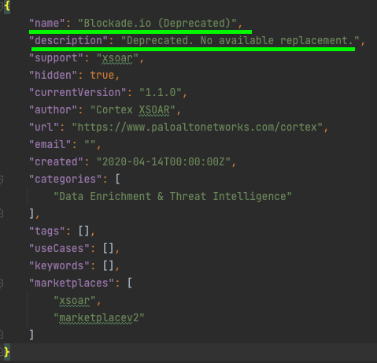
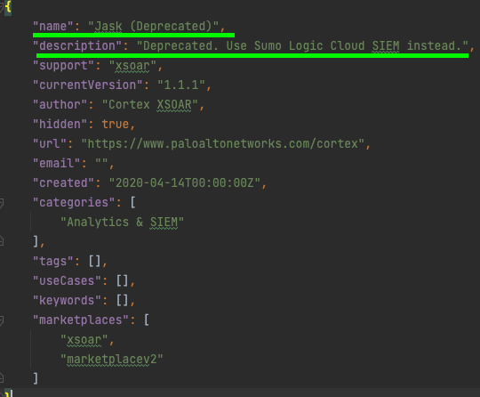
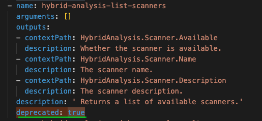

## Deprecated Content Items
Deprecated content items are no longer supported, and **should not be used**. The feature may no longer be considered efficient or safe.

The **only** content items that can be deprecated are **integrations, scripts and playbooks**.

A pack is considered deprecated when all of its integrations, scripts and playbooks are deprecated.

In addition, there are two more conditions:

1) The pack's name ends with the suffix (Deprecated).

2) The pack description should start one of the following sentences:

- "Deprecated. Use {OTHER_PACK_NAME} instead."
- "Deprecated. {Optional: REASON} No available replacement."

## Hidden Pack
A hidden pack will no longer be shown in Marketplace. Customers will not be able to download a hidden pack from Cortex XSOAR marketplace anymore.
​
Pack's reference docs will still be available for use.

## How to deprecate and hide a pack
1) Make sure that all the pack's integrations, scripts and playbooks are deprecated.

2) Then there are two options:
- Run ```demisto-sdk format -i Packs/<pack-name>/pack_metadata.json``` only if all the pack's integrations, scripts and playbooks are deprecated.
- Add to the name of the pack in the `pack_metadata.json` the suffix (Deprecated) and add to the description of the pack in the `pack_metadata.json` one of the two formats:

* "Deprecated. Use {OTHER_PACK_NAME} instead."
* "Deprecated. {Optional: REASON} No available replacement."

Optional: Hiding a pack:

Manually add the following key to the `pack_metadata.json` file. ```"hidden": true```

Example: Hidden pack:

</img>

Example: No available replacement pack:
</img>

Example: Use other pack:
</img>

## How to Deprecate an Integration
1) Add the following key to the integration yaml file: 
   ```deprecated: true```

2) Add one of the following sentence to the integration yaml's description: 
  
* "Deprecated. Use {OTHER_INTEGRATION_NAME} instead."
* "Deprecated. {Optional: REASON} No available replacement."

Example: No available replacement integration:
</img>

Example: Use other integration example:
</img>

## How to Deprecate an Integration Command
1) Add the following key to the command in the integration yaml file: 
   ```deprecated: true```
   
**Why deprecate commands instead of deleting them?**
   Some users may have used this command in a custom script or playbook.
   Deleting a command may result in unexpected errors, while deprecation retains backwards compatibility for the command.
​
Example: 
</img>

## How to Deprecate a Script
1) Add the following key to the script yaml file: 
```deprecated: true```

2) Add one of the following sentence to the script yaml's comment: 

- "Deprecated. Use {OTHER_SCRIPT_NAME} instead."
- "Deprecated. {Optional: REASON} No available replacement."
   
Example: No available replacement script:
</img>  

Example: Use other script:
</img>

## How to Deprecate a Playbook
1) Add the following key to the playbook yaml file:
   ```deprecated: true```

2) Add one of the following sentence to the playbook yaml's description:

- "Deprecated. Use {OTHER_PLAYBOOK_NAME} instead."
- "Deprecated. {Optional: REASON} No available replacement."

Example: No available replacement playbook:
</img>

Example: Use other playbook:
</img>