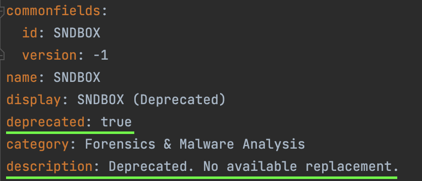
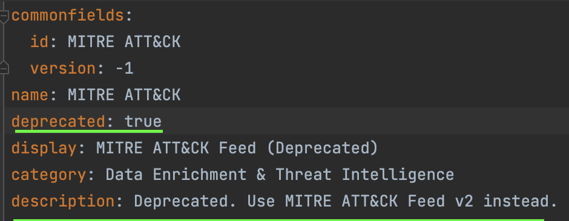
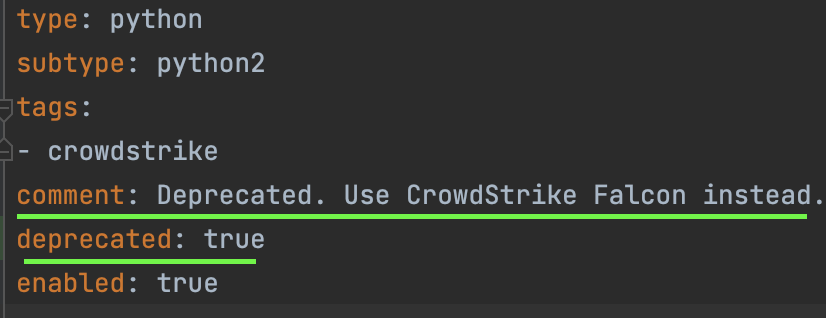
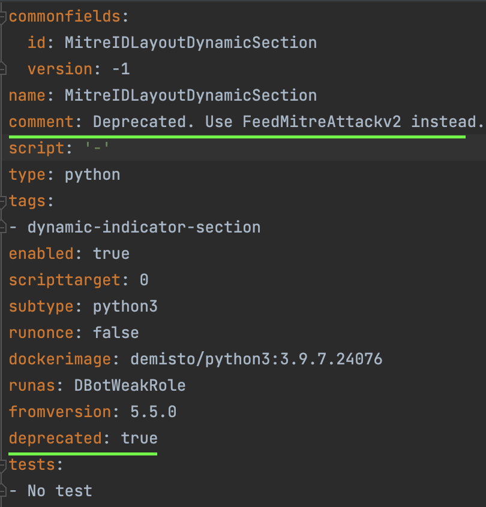
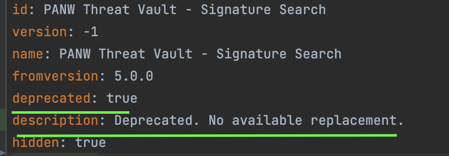
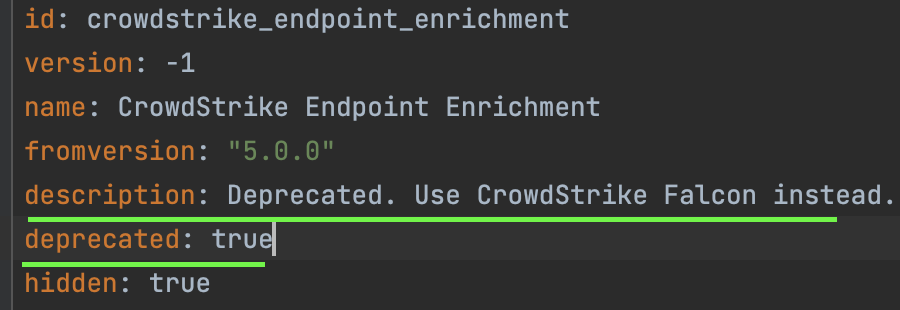
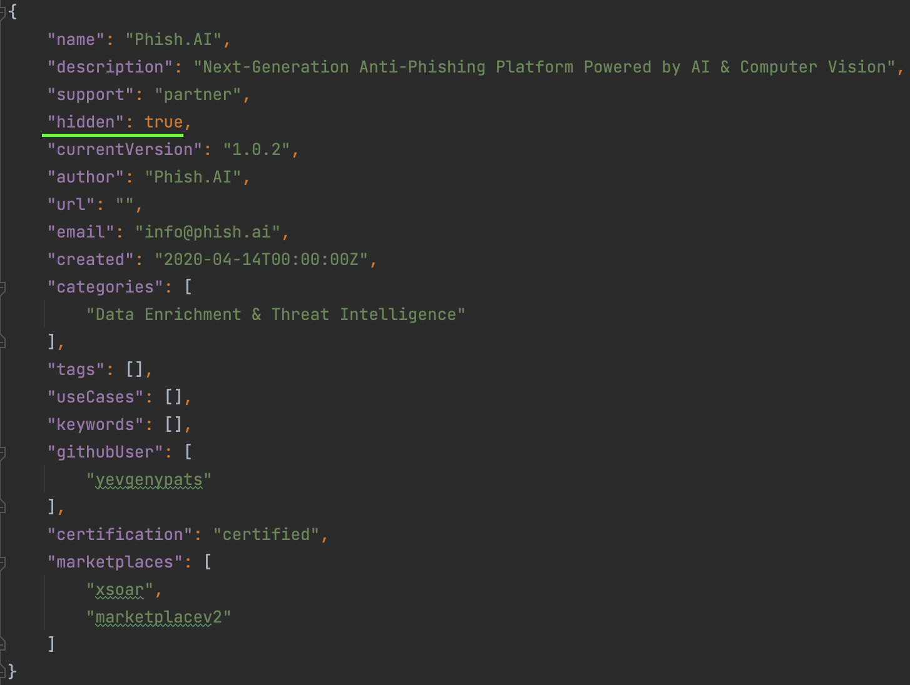

## What Deprecated Content Item Means
Deprecated content items are no longer supported, and **should not be used**. The feature may no longer be considered efficient or safe.

## Supported Content Items
The **only** content items that can be deprecated are **integrations, scripts and playbooks**.

A pack is considered deprecated when all of its integrations, scripts and playbooks are deprecated.

## Deprecating integration process

Deprecating integration is a very simple process. 

1) Add the following key to the integration yaml file ```deprecated: true```.

2) Add the following sentence to the integration yml's description : Deprecated. {reason why it is deprecated} either {use integration v2 instead} or {No available replacement}

no available replacement integration example:
</img>

use other integration example:
</img>

## Deprecating script process

Deprecating script is a very simple process.

1) Add the following key to the script yaml file ```deprecated: true```.

2) Add to the script yml comment the sentence: Deprecated. "reason why it is deprecated" or "use other script instead" or "No available replacement"

no available replacement script example:
</img>  

use other script example:
</img>

## Deprecating playbook process


1) define in the playbook yml file the following key: ```deprecated: true```.

2) Add to the playbook yml comment the sentence: Deprecated. "reason why it is deprecated" or "use other playbook instead" or "No available replacement"

no available replacement playbook example:
</img>

use other playbook example:
</img>

## Hidden Packs
A hidden pack will not be no longer shown in the marketplace.

A pack should be hidden from the marketplace when all of its integrations, scripts and playbooks are deprecated.

There is such a validation in the demisto-sdk that checks that such packs are marked as hidden.

## Making Pack Hidden Process
There are two options to make a pack hidden:

1) Adding the key ```"hidden": true``` manually to the `pack_metadata.json` file.

2) Running ```demisto-sdk format -i Packs/<pack-name>/pack_metadata.json``` will automatically hide the pack, as shown below.

</img>