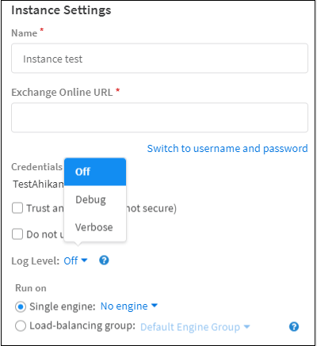

## Integration Debug Logs
Starting with version 6.2, it is possible to create logs for an instance of an integration in order to get debug information for a specific instance over a period of time.

For example, if you have an integration instance running the ***fetch-incidents*** command, and the integration misses some of the incidents, you may want to get debug level information for each ***fetch-incidents*** command (or any other command executed by this instance) even if the server log level is set to *Info*. If you move the server log level to *Debug*, the server log would contain lots of information that is mostly irrelevant in most cases for integration troubleshooting.

Therefore, the *Log Level* configuration parameter was added to the integration configuration. There are 3 options for this parameter:
- Off
- Debug
- Verbose 

                        

In Debug mode, the server will run all the commands of this instance with a *Debug* log level and log the information in the **Integration-Instance** log.

In Verbose mode, additional information such as connections coming off device handling, the raw response, and all parameters and headers are logged in addition to the debug level information. 

For example, if an integration fails and the instance log level is *Debug*, the **Integration-Instance** log will contain the error stack trace. If the log level is *Verbose*, **Integration-Instance** log will contain the error stack trace, but also a copy of the HTTP request, the parameters used in the integration, what the response was, etc.

By default, the *Log Level* configuration parameter is set to *Off*.

The **Integration-Instance.log** is located in  `/var/log/demisto/`.

These log level modes are only for the configured instance and do not affect the log for the entire server.

Note that the log level configuration for an integration instance may affect performance of the integration instance, therefore use this feature only for troubleshooting, and set it to Off when you have the required information in the log.
