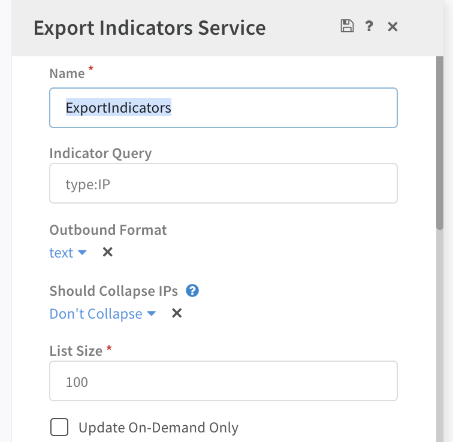

## Overview
**Supported Cortex XSOAR Server version**: 5.5 and above

Cortex XSOAR supports setting up long running integrations which expose an HTTP endpoint. Such integrations include:
* Palo Alto Networks PAN-OS EDL Service
* Export Indicators Service
* Microsoft Teams

When you initiate these integrations, they listen on an incoming HTTP port. The port is configured via the **Listen Port** setting of the integration. The HTTP interface can be accessed directly over the port, for example by running curl locally on the Cortex XSOAR Server machine (assuming the configured port is 7000 and HTTP is being used):
```
curl http://localhost:7000
```

**Important Note:** Each integration instance should be configured with a unique listening port number.

To access the integration over the listening port via the Cortex XSOAR Server's DNS host, you would use (assuming the configured port is 7000 and HTTP is being used) the url: `http://<cortex_xsoar_dns>:7000`. This requires opening the port to external access. Usually this involves a firewall or security group modification. 

Starting with Cortex XSOAR Server v5.5 there is an option to route the HTTP request via the Cortex XSOAR Server's HTTPS endpoint. This is useful if you would like to avoid opening an additional port (the long running integration's port) on the Cortex XSOAR Server's machine to outside access.

The rerouting is through HTTP, and not HTTPS. In this case don't set a certificate in the integration instance configuration.

:::caution
The integration will be open to the same network the XSOAR Server is accessible. Make sure you are aware of the network risks. Enabling strong authentication is highly recommended if the route is open to the public.
:::

## Setup
To configure a long running integration to be accessed via Cortex XSOAR Server's https endpoint perform the following:
* Configure the long running integration to listen on a unique port
* Make sure the long running integration is setup to use HTTP (**not HTTPS**)
* Add the following advanced Server parameter:
  * Name: `instance.execute.external.<instance_name>`
  * Value: `true`
* For example for an instance named **edl** set the following:
  * Name: `instance.execute.external.edl`
  * Value: `true`

**Note**: The instance name is configured via the `Name` parameter of the integration. Sample screenshot:
</img>


You will then be able to access the long running integration via the Cortex XSOAR Server's HTTPS endpoint. The route to the integration will be available at:
```
https://<server_hostname>/instance/execute/<instance_name>
```
For example, to test access to an instance named `edl` run the following curl command from the Cortex XSOAR Server's machine:
```
curl -k https://localhost/instance/execute/edl
```
Or from a remote machine:
```
curl https://<server_hostname>/instance/execute/edl
```

There is also the option to set a default value that all http long running integrations are exposed via the Cortex XSOAR's Server HTTPS endpoint. Do this by setting the following Server advanced parameter:
* Name: `instance.execute.external`
* Value: `true`

You can then also disable specific instances by setting:
* Name: `instance.execute.external.<instance_name>`
* Value: `false`

:::note
The integration instance name used in the URL is case-sensitive.
:::
