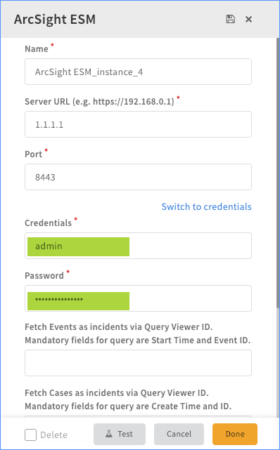
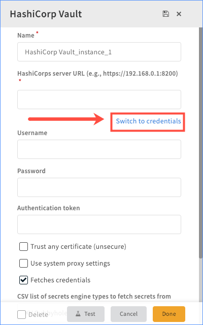
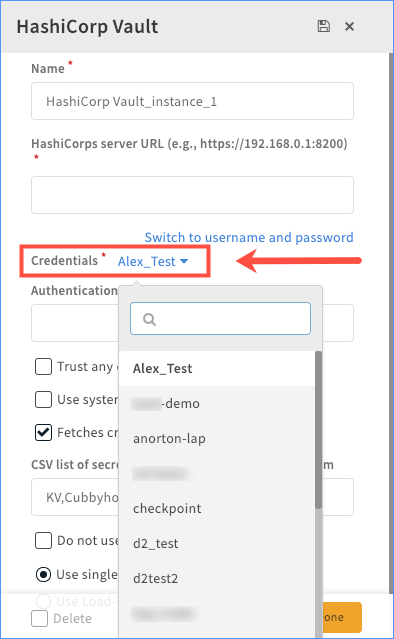

Credentials simplify and compartmentalize admin tasks, and enable you to save credentials without exposing usernames, passwords, or certificates. You can also reuse credentials across multiple systems, for example, when using the same Administrator password across multiple endpoints.

After you set up a credential, you can configure integration instances to use it instead of entering the name and password manually. Also, when you configure a system in which an agent will be deployed, you can use the `credentials` argument instead of user and password.

There are several ways you can configure credentials for an integration instance.

*   Manually enter a username and password when you configure the integration instance.
*   Use credentials from Cortex XSOAR Credentials.
*   Use credentials saved in an external credentials vault, e.g., CyberArk, or HashiCorp.

## Manually Enter Credentials

1.  Navigate to the integration you want to configure and click **Add instance**.
2.  In the **Credentials** field, type a username for this integration instance.
3.  In the **Password** field, type a password to use for this integration instance.

## Configure Cortex XSOAR Credentials

Cortex XSOAR Credentials enables you to centrally manage credentials, which include a unique name for the credential, username, password, and certificate. You can then select the credential name when configuring an integration instance.

1.  Navigate to **Settings** > **Integrations** > **Credentials**.
2.  Click the **+New** button to add a new credential.
3.  Configure the credential.  
    
|Property|Description|
|--- |--- |
|Credential Name|The display name for the credential|
|Username|The username for the credential|
|Password|The password for the credential|
|Workgroup|The workgroup to associate this credential with. This is relevant for third-party services, such as Active Directory, CyberArk, HashiCorps, etc.|
|Certificate|Certificate or SSH key to use for the credential|

    

## Configure an External Credentials Vault

Cortex XSOAR integrates with external credential vaults, which enables you to use them in Cortex XSOAR without hard coding or exposing them. The credentials are not stored in Cortex XSOAR, rather, the integration fetches the credentials from the external vault when called. The credentials are fetched and cached in-memory. They are passed to integrations that are executed as part of the integrations params.

*   [CyberArk AIM](https://xsoar.pan.dev/docs/reference/integrations/cyber-ark-aim)
*   [HashiCorp Vault](https://xsoar.pan.dev/docs/reference/integrations/hashi-corp-vault)

After the integration is configured to fetch credentials, the credentials will be available from the **Credentials** drop-down menu, and for use in automations and playbooks. To use these credentials in an integration, click **Switch to credentials**, and select the necessary credential from the drop-down menu.

### Sample Screenshots:

