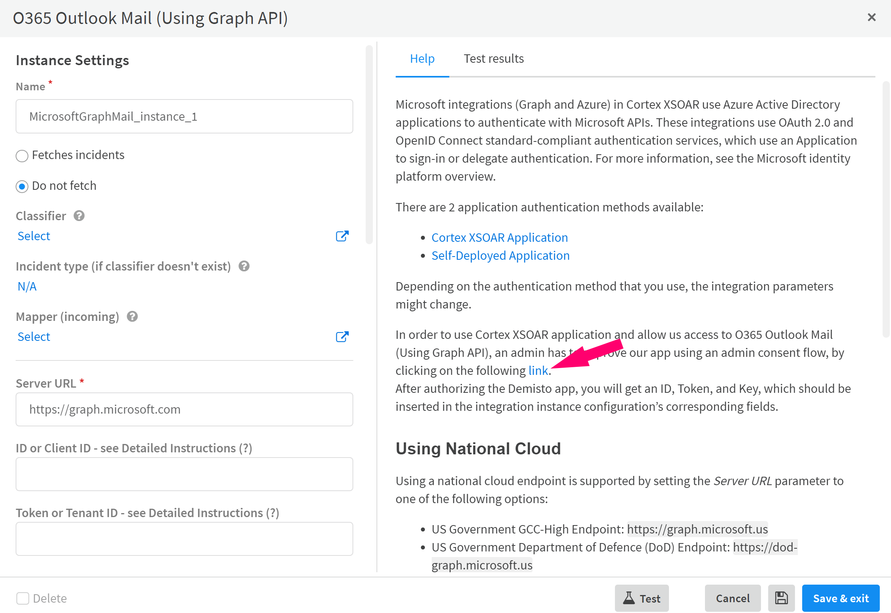
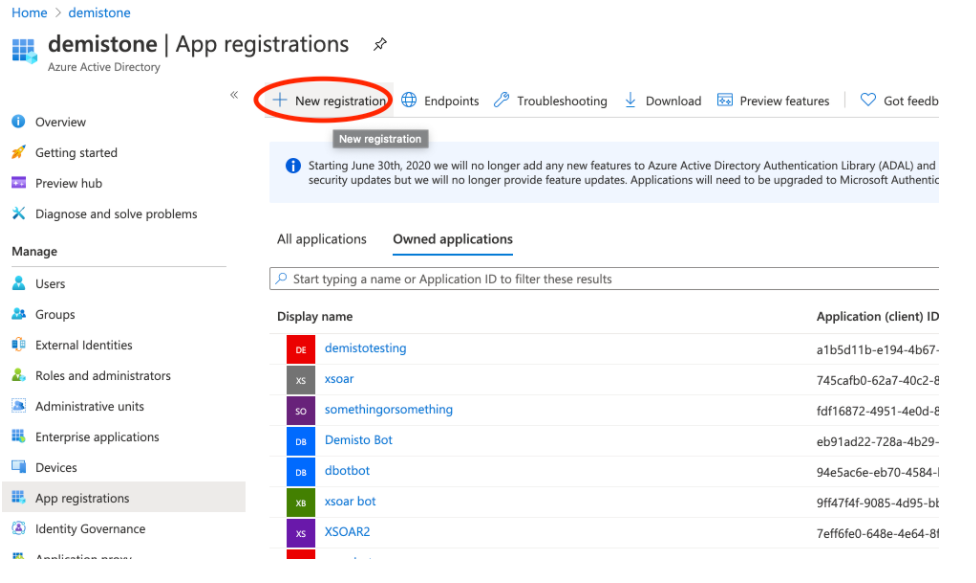
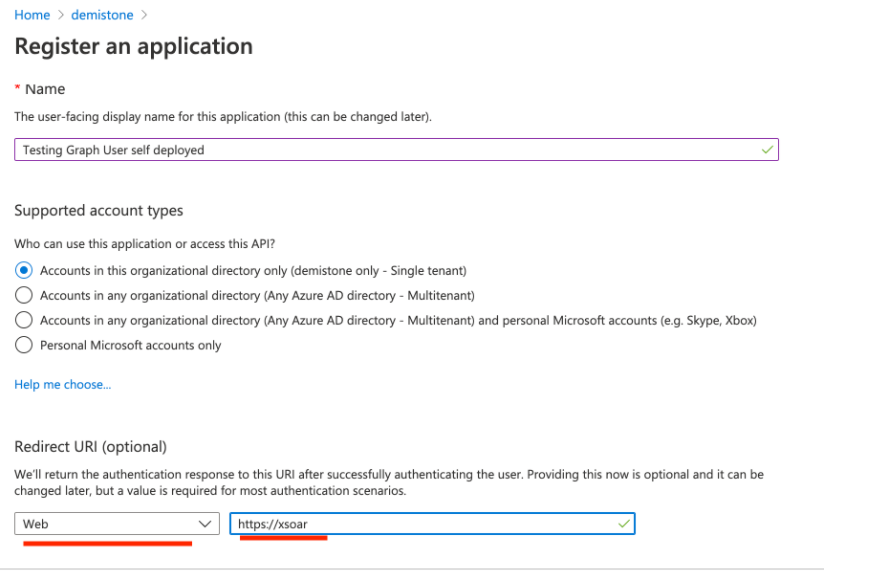
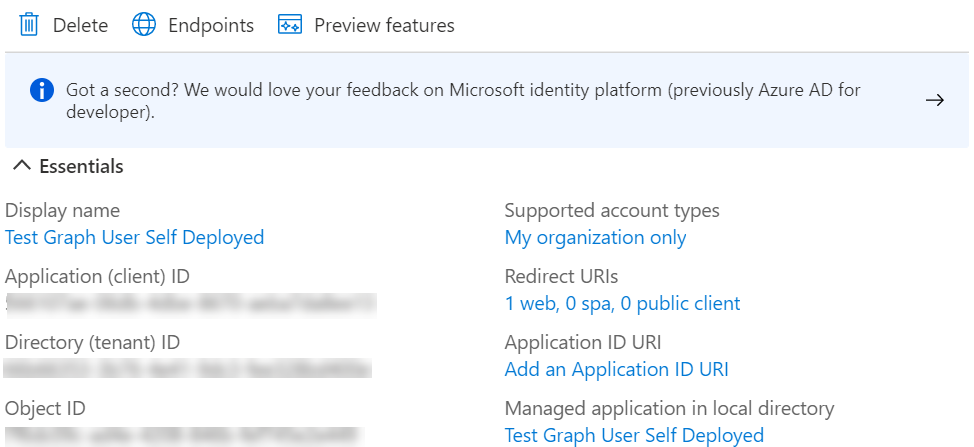
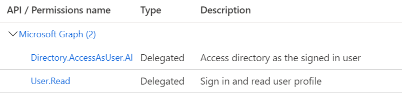
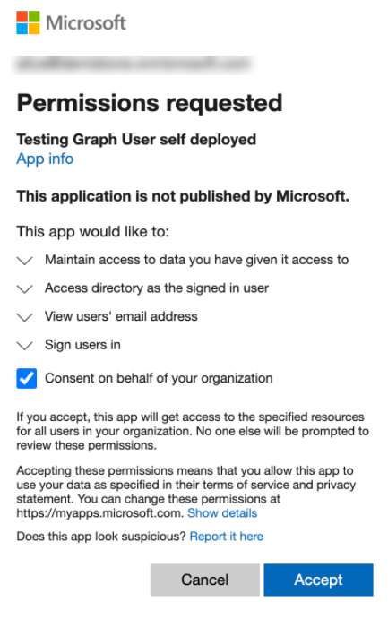
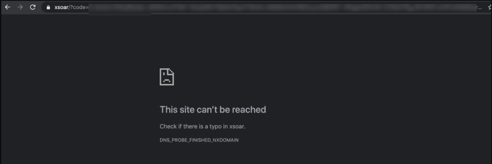

:::info Security Awareness: Device Code Authorization
It is recommended to use the client credentials and user authorization flows for integrations when possible. The device code authorization flow has limited protections against sophisticated phishing campaigns.

In no scenario emails or other forms of communication will be sent to the customer asking to enter a security code or follow a link. All generated links and codes will be shown in the War Room, by running the official integration commands.

More info at: [Device Code flow - Evolved phishing](https://www.microsoft.com/security/blog/2022/01/26/evolved-phishing-device-registration-trick-adds-to-phishers-toolbox-for-victims-without-mfa/)

:::

Microsoft integrations (Graph and Azure) in Cortex XSOAR use Azure Active Directory applications to authenticate with Microsoft APIs. These integrations use OAuth 2.0 and OpenID Connect standard-compliant authentication services, which use an **Application** to sign-in or delegate authentication. 
For more information, see the [Microsoft identity platform overview](https://docs.microsoft.com/en-us/azure/active-directory/develop/v2-overview).

There are three application authentication methods available: 

1.  [Cortex XSOAR Application](#cortex-xsoar-application)
2.  [Self Deployed Application](#self-deployed-application)
3.  [Azure Managed Identities](#azure-managed-identities-authentication)

## Cortex XSOAR Application
In this method, you grant consent for the Cortex XSOAR multi-tenant application to access your data. The application is maintained by Cortex XSOAR.
Depending on the integration, this requires either admin consent to [get access without a user](https://docs.microsoft.com/en-us/graph/auth-v2-service) or user consent to [get access on behalf of a user](https://docs.microsoft.com/en-us/graph/auth-v2-user).

**Note**: This method requires that you give consent to all permissions requested by the application.

To start the authentication process, go to the integration's detailed instructions:

1.  Navigate to __Settings > Integration > Servers & Services__.
2.  Search for wanted Microsoft integration, e.g. `O365 Outlook Mail (Using Graph API)`.
3.  Click __Add instance__.
4.  Click the Link that appears in the Help section:.

    </img>

5.  In the XSOAR Web Page that appears, click the **Start Authorization Process** button to initiate the authorization flow.
 

## Self Deployed Application
### Client Credentials
To use a self-configured Azure application, you need to add a new Azure App Registration in the Azure Portal. 

The application must have the required permissions for the relevant APIs, which are documented in the integration documentation, for example see [Microsoft Defender Advanced Threat Protection required permissions](https://xsoar.pan.dev/docs/reference/integrations/microsoft-defender-advanced-threat-protection#required-permissions).

To add the registration, refer to the [Microsoft documentation](https://docs.microsoft.com/en-us/azure/active-directory/develop/quickstart-register-app)

The Tenant ID, Client ID, and Client secret are required for the integration. 

When you configure the integration in Cortex XSOAR, enter those parameters in the appropriate fields:

* ID - Client ID
* Token - Tenant ID
* Key - Client Secret

  Alternatively, instead of providing the *Client Secret*, you can authenticate using [certificate credentials](https://docs.microsoft.com/en-us/azure/active-directory/develop/active-directory-certificate-credentials) by providing:
    * Certificate Thumbprint - The certificate thumbprint as appears when registering the certificate to the App
    * Private Key -  The private key of the registered certificate

In addition, make sure to select the ***Use a self-deployed Azure Application*** checkbox in the integration instance configuration.

### Authorize on Behalf of a User
Some of the Cortex XSOAR-Microsoft integrations (e.g., Azure Sentinel) require authorization on behalf of a user (not admin consent). For more information about this authorization flow, refer to the [Microsoft documentation](https://docs.microsoft.com/en-us/graph/auth-v2-user).

To configure a Microsoft integration that uses this authorization flow with a self-deployed Azure application:

1. Make sure the needed permissions are granted for the app registration, e.g for Microsoft Graph User: API/Permission name `Directory.AccessAsUser.All` of type `Delegated`.
2. The Redirect URI can direct any web application that you wish to receive responses from Azure AD. If you are not sure what to set, you can use `https://localhost`. 
3. Enter your client ID in the *ID* parameter field. 
4. Enter your client secret in the *Key* parameter field.
5. Enter your tenant ID in the *Token* parameter field.
6. Enter your redirect URI in the *Redirect URI* parameter field.
7. Save the instance.
8. Run the `!<integration command prefix>-generate-login-url` command in the War Room and follow the instructions. For example, for Microsoft Graph User: `!msgraph-user-generate-login-url`.

#### Using National Cloud
Some of the Cortex XSOAR-Microsoft integrations support the deployment of national clouds through the self-deployed
 authorization flow. For more information about Microsoft National Clouds, refer to the [Microsoft documentation](https://docs.microsoft.com/en-us/graph/deployments).
 Currently, the following integration supports national clouds:
 * O365 Outlook Mail (Using Graph API)  
 
In order to use a national cloud, change the *URL* parameter to the corresponding address of the national cloud you are using. For example, see [O365 Outlook Mail (Using Graph API) - National Clouds](https://xsoar.pan.dev/docs/reference/integrations/microsoft-graph-mail#using-national-cloud), for the supported cloud endpoints in this integration.

### Device Code Flow
Some of the Cortex XSOAR-Microsoft integrations use the [device code flow](https://docs.microsoft.com/en-us/azure/active-directory/develop/v2-oauth2-device-code).

To configure a Microsoft integration that uses this authorization flow with a self-deployed Azure application:
1. Make sure the needed permissions are granted for the app registration.
2. The Redirect URI can direct any web application that you wish to receive responses from Azure AD. If you are not sure what to set, you can use `https://localhost`.
3. In **Supported account types**, *Accounts in any organizational directory (Any Azure AD directory - Multitenant)* should be selected.
4. In the app registration, navigate to **Authentication** > **Advanced Settings**, and enable the mobile and desktop flows.

   </img>

5. Enter your application ID in the ***Application ID*** parameter field.

## Azure Managed Identities Authentication
#### Note: This option is relevant only if the integration is running on Azure VM.

Some of the Cortex XSOAR-Microsoft integrations use the [Azure Managed Identities Authentication](https://learn.microsoft.com/en-us/azure/active-directory/managed-identities-azure-resources/overview).

Follow one of these steps for authentication based on Azure Managed Identities:

- ##### To use System Assigned Managed Identity
   - Select **Azure Managed Identities** from the **Authentication Type** drop down or select the **Use Azure Managed Identities** checkbox and leave the **Azure Managed Identities Client ID** field empty.

- ##### To use User Assigned Managed Identity
   1. Go to [Azure Portal](https://portal.azure.com/) -> **Managed Identities**.
   2. Select your User Assigned Managed Identity -> copy the Client ID -> paste it in the **Azure Managed Identities Client ID** field in the instance settings.
   3. Select **Azure Managed Identities** from the **Authentication Type** drop down or select the **Use Azure Managed Identities** checkbox.

## Revoke Consent

In order to revoke consent to a Cortex XSOAR Microsoft application, refer to the [Microsoft documentation](https://docs.microsoft.com/en-us/azure/active-directory/develop/howto-convert-app-to-be-multi-tenant#revoking-consent). 

## Azure Integrations Parameters
In order to use the Cortex XSOAR Azure application, you need to fill in your subscription ID and resource group name, which you can find in the Azure Portal.

1. Log in to the [Azure Portal Home Page](https://portal.azure.com/#home) using your Azure credentials.

2. Search for your Azure product, for example SQL Servers: 

   

3. Click on your resource:

   

After you a redirected to the next page, in the **Overview** tab you will find your Resource group and Subscription ID:

## Self Deployed Application - Example 

1. In Microsoft Azure portal, create a new app registration.
   1. Select Azure Active Directory> App registrations> New registration.

      
   1. In the **Redirect URI (optional)** field select **Web** and type a name (you can enter an arbitrary name). In this example we use *https<nolink\>://xsoar.* 

       
   1. Click **Register.**
   
        You can see the Essential information here: 
        
        
   1. Copy the following information:

      - Application (client) ID
      - Directory (tenant) ID
   
2. Get the client secret, which is used for the **key** in the integration settings.
   1. Click **Certificate and secrets** -> **New client secret**.
    
        Copy the client secret.
        
    
3. Ensure the needed permissions are granted for the app registration. 
   1. Go to API permissions>Add a permission>Microsoft Graph>Delegated permissions and search for 
    `Directory.AccessAsUser.All` of type `Delegated`.
   2. Click Add permissions.
    
      

    NOTE: Ensure that you have the following permissions:
     - Directory.Read.All - Delegated
     - User.ReadWrite.All - Application
     - User.Read - Delegated
4. Get the authorization code.

    1. Type the following in a browser: `https://login.microsoftonline.com/<tenant_id\>/oauth2/v2.0/authorize?response_type=code&scope=offline_access%20directory.accessasuser.all&client_id=*<client_id\>*&redirect_uri=https%3A%2F%2Fxsoar`
    
       Replace `tenant_id` and `client-id` with the tenant ID that was generated in step 1.iv.  

       The URI is the *https<nolink\>://xsoar*.

       This prompts the admin user to sign in and grant the app the appropriate permissions: 
    
       

       Once completed you are redirected to the redirect URI and will receive an authorization code in the query parameters of the URI. 
        
       **NOTE:** If there are multiple query parameters returned you should just copy the code value.

       

   2. Copy the ***AUTH_CODE*** (without the "code=" prefix). This value must be used in the MS Graph User in Cortex XSOAR integration in the **Authorization Code** field. 
   
5. Add the information to the instance in Cortex XSOAR by going to Settings>Integrations>Microsoft Graph User>Add Instance.

   1. In the ***ID*** parameter field, type the client ID.
   2. in the ***Token*** parameter field, type the tenant ID.
   3. In the ***Key*** parameter field, type your client secret.
   4. Click the **Use a self-deployed Azure application** checkbox.
   5. In the ***Redirect URI*** field, type the redirect URI we entered in the Azure portal.
   6. In the **Authorization code for self-deployed mode - received from the authorization step**, type the code that was generated in 4.2. 
   7. Save the integration settings and test the setup by running the *!msgraph-user-test* command from the Cortex XSOAR CLI.

## Supported Authentication Flows for Microsoft integrations

| Integration Name | XSOAR Application | Client Credentials | Device Code | Auth code (redirect URI) | Azure Managed Identities |
| --- | --- | --- | --- | --- | --- |
| Azure Compute v2 | yes | yes - support both client secret and certificate | no | no | no |
| Azure Data Explorer | yes | no - not supported by the API | yes | yes | no |
| AzureDevOps | yes | no - not supported by the API | yes | yes | no |
| Azure Firewall | yes | yes | yes | no | yes |
| Azure Key Vault | no | yes - support both client secret and certificate | no | no | yes |
| Azure Kubernetes Services | yes | no - not supported by the API | yes | yes | yes |
| Azure Log Analytics | yes | yes - support both client secret and certificate | no | yes | yes |
| Azure Network Security Groups | yes | no - not supported by the API | yes | yes | yes |
| Azure Risky Users | yes | yes | yes | no | yes |
| Azure Security Center v2 | yes | yes - support both client secret and certificate | no | no | yes |
| Azure Sentinel | no | yes - support both client secret and certificate | no | no | yes |
| Azure SQL Management | yes | no - not supported by the API | yes | yes | yes |
| Azure Storage | yes | no - not supported by the API | yes | yes | yes |
| Azure Storage Container | no | no | no | no | yes |
| Azure Storage FileShare | no | no | no | no | no |
| Azure Storage Queue | no | no | no | no | yes |
| Azure Storage Table | no | no | no | no | yes |
| Azure Web Application Firewall | yes | no - not supported by the API | yes | yes | yes |
| Microsoft 365 Defender | yes | yes - support both client secret and certificate | yes | no | yes |
| Microsoft 365 Defender Event Collector - XSIAM | no | yes | no | no | no - saas |
| Microsoft Defender for Cloud Apps | no | yes | yes | no | no |
| Microsoft Defender Advanced Threat Protection | yes | yes - support both client secret and certificate | no | yes | yes |
| Microsoft Graph API | yes | yes - support both client secret and certificate | no | no | yes |
| Azure Active Directory Applications | yes - device | yes | yes | no | yes |
| O365 Outlook Calendar | yes | yes - support both client secret and certificate | no | no | yes |
| Microsoft Graph Device Management | yes | yes - support both client secret and certificate | no | no | yes |
| O365 File Management | yes | yes - support both client secret and certificate | no | no | yes |
| Microsoft Graph Groups | yes | yes - support both client secret and certificate | no | no | yes |
| Azure Active Directory Identity And Access | yes | yes | yes | no | yes |
| Microsoft Graph Mail Single User | yes | no | no | yes | yes |
| O365 Outlook Mail | yes | yes - support both client secret and certificate | no | no | yes |
| Microsoft Graph Security | yes | yes - support both client secret and certificate | no | no | yes |
| Microsoft Graph User | yes | yes - support both client secret and certificate | no | yes | yes |
| Microsoft Management Activity API (O365 Azure Events) | yes | no | no | yes | yes |
| Microsoft Teams | no | yes | no | yes | no |
| Microsoft Teams Management | yes | yes | yes | no | yes |