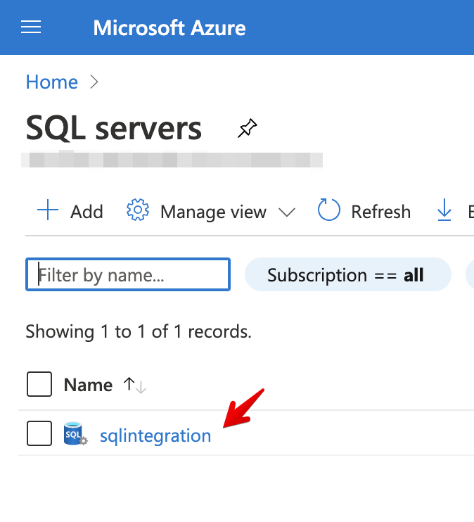

Microsoft integrations (Graph and Azure) in Cortex XSOAR use Azure Active Directory applications to authenticate with Microsoft APIs. These integrations use OAuth 2.0 and OpenID Connect standard-compliant authentication services, which use an **Application** to sign-in or delegate authentication. 
For more information, see the [Microsoft identity platform overview](https://docs.microsoft.com/en-us/azure/active-directory/develop/v2-overview).

There are 2 application authentication methods available: 

1.  Cortex XSOAR Application
2.  Self-Deployed Application

## Cortex XSOAR Application
In this method, you grant consent for the Cortex XSOAR multi-tenant application to access your data. The application is maintained by Cortex XSOAR.
Depending on the integration, this requires either admin consent to [get access without a user](https://docs.microsoft.com/en-us/graph/auth-v2-service) or user consent to [get access on behalf of a user](https://docs.microsoft.com/en-us/graph/auth-v2-user).
**Note**: This method requires that you give consent to all permissions requested by the application.

To start the authentication process, go to the integration's detailed instructions:

1.  Navigate to __Settings > Integration > Servers & Services__.
2.  Search for wanted Microsoft integration, e.g. `Microsoft Defender Advanced Threat Protection`.
3.  Click __Add instance__.
4.  Click on the question mark on the top right.

    </img>

5.  Follow the link to our authentication service to initiate the authorization flow.

## Self Deployed Application
To use a self-configured Azure application, you need to add a new Azure App Registration in the Azure Portal. 

The application must have the required permissions for the relevant APIs, which are documented in the integration documentation, for example see [Microsoft Defender Advanced Threat Protection required permissions](https://xsoar.pan.dev/docs/reference/integrations/microsoft-defender-advanced-threat-protection#required-permissions).

To add the registration, refer to the [Microsoft documentation](https://docs.microsoft.com/en-us/azure/active-directory/develop/quickstart-register-app)

The Tenant ID, Client ID, and Client secret are required for the integration. 

When you configure the integration in Cortex XSOAR, enter those parameters in the appropriate fields:

* ID - Client ID
* Token - Tenant ID
* Key - Client Secret

In addition, make sure to select the ***Use a self-deployed Azure Application*** checkbox in the integration instance configuration.


### Authorize on behalf of a user
Some of the Cortex XSOAR-Microsoft integrations (e.g., Azure Sentinel) require authorization on behalf of a user (not admin consent). For more information about this authorization flow, refer to the [Microsoft documentation](https://docs.microsoft.com/en-us/graph/auth-v2-user).

To configure a Microsoft integration that uses this authorization flow with a self-deployed Azure application:

1. Make sure the needed permissions are granted for the app registration, e.g for Microsoft Graph User: API/Permission name `Directory.AccessAsUser.All` of type `Delegated`.
2. The Redirect URI can direct any web application that you wish to receive responses from Azure AD. If you are not sure what to set, you can use `https://localhost`.
3. Copy the following URL and replace the ***TENANT_ID***, ***CLIENT_ID***, ***REDIRECT_URI***, ***SCOPE*** with your own client ID and redirect URI, accordingly.
```https://login.microsoftonline.com/TENANT_ID/oauth2/v2.0/authorize?response_type=code&scope=offline_access%20SCOPE&client_id=CLIENT_ID&redirect_uri=REDIRECT_URI```
For example, for Microsoft Graph User, replace the ***SCOPE*** with `directory.accessasuser.all`.
4. Enter the link and you will be prompted to grant Cortex XSOAR permissions for your Azure Service Management. You will be automatically redirected to a link with the following structure:
```REDIRECT_URI?code=AUTH_CODE&session_state=SESSION_STATE```
5. Copy the ***AUTH_CODE*** (without the "code=" prefix) and paste it in your instance configuration under the **Authorization code** parameter. 
6. Enter your client ID in the ***ID*** parameter field. 
7. Enter your client secret in the ***Key*** parameter field.
8. Enter your tenant ID in the ***Token*** parameter field.
9. Enter your redirect URI in the ***Redirect URI*** parameter field.

### Device Code Flow
Some of the Cortex XSOAR-Microsoft integrations use the [device code flow](https://docs.microsoft.com/en-us/azure/active-directory/develop/v2-oauth2-device-code).

To configure a Microsoft integration that uses this authorization flow with a self-deployed Azure application:
1. Make sure the needed permissions are granted for the app registration.
2. The Redirect URI can direct any web application that you wish to receive responses from Azure AD. If you are not sure what to set, you can use `https://localhost`.
3. In **Supported account types**, *Accounts in any organizational directory (Any Azure AD directory - Multitenant)* should be selected.
4. In the app registration, navigate to **Authentication** > **Advanced Settings**, and enable the mobile and desktop flows.

   </img>

5. Enter your application ID in the ***Application ID*** parameter field.

## Revoke Consent

In order to revoke consent to a Cortex XSOAR Microsoft application, refer to the [Microsoft documentation](https://docs.microsoft.com/en-us/azure/active-directory/develop/howto-convert-app-to-be-multi-tenant#revoking-consent). 

## Azure Integrations Parameters
In order to use the Cortex XSOAR Azure application, you need to fill in your subscription ID and resource group name, which you can find in the Azure Portal.

1. Log in to the [Azure Portal Home Page](https://portal.azure.com/#home) using your Azure credentials.

2. Search for your Azure product, for example SQL Servers: 


3. Click on your resource:



After you a redirected to the next page, in the **Overview** tab you will find your Resource group and Subscription ID:


