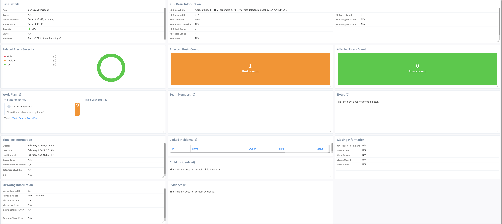

The Palo Alto Networks Cortex XDR - Investigation and Response pack automates Cortex XDR incident response, and includes custom Cortex XDR incident views and layouts to aid analyst investigations.

Cortex XDR is a detection and response app that natively integrates network, endpoint, and cloud data to stop sophisticated attacks. 

Responding and managing these attacks requires security teams to reconcile data from multiple sources. Valuable time is lost shuttling between screens and executing repeatable tasks while an attack continues to manifest. 

The playbooks included in this pack help you save time and keep your incidents in sync with Cortex XDR. They also help automate repetitive tasks associated with Cortex XDR incidents:
- Syncs and updates Cortex XDR incidents.
- Triggers a sub-playbook to handle each alert by type.
- Extracts and enriches all relevant indicators from the source alert.
- Hunts for related IOCs.
- Calculates the severity of the incident.
- Interacts with the analyst to choose a remediation path or close the incident as a false positive based on the gathered information and incident severity.
- Remediates the incident by blocking malicious indicators and isolating infected endpoints.

The Palo Alto Networks Cortex XDR - Investigation and Response pack enables the following flows: 
- [Device Control Violations](#device-control-violations) - Fetch device control violations from XDR and communicate with the user to determine the reason the device was connected.
- [XDR Incident Handling](#xdr-incident-handling) - Compare incidents in Palo Alto Networks Cortex XDR and Cortex XSOAR, and update the incidents appropriately. 

 

## Device Control Violations
If a user connects an unauthorized device to the corporate network, such as a USB dongle or a portable hard disk drive, the connection creates an event in Cortex XDR. 
The [Cortex XDR device control violations](#cortex-xdr-device-control-violations) playbook queries Cortex XDR for device control violations for specified hosts, IP addresses, or XDR endpoint IDs. It then communicates via email with the involved users to understand the nature of the incident and if the user connected the device. 

The playbook can enrich data for XDR incidents and determine if there were any device control violations prior to this incident or if there is a correlation between this incident and another one. 

You can create a job to periodically query Cortex XDR for device control violations. The dedicated [JOB - Cortex XDR query endpoint device control violations](#job---cortex-xdr-query-endpoint-device-control-violations) playbook enriches the data associated with the endpoint device control events, and creates an incident if any violations are found.  The [Cortex XDR device control violations](#cortex-xdr-device-control-violations) playbook is the response playbook for the violations found.

The [Cortex XDR device control violations](#cortex-xdr-device-control-violations) playbook can be used to enrich data for the involved hosts/users in XDR and other incidents.

All collected data is displayed in the XDR device control incident layout.

### XDR Incident Handling

The [Palo Alto Networks Cortex XDR - Investigation and Response](#palo-alto-networks-cortex-XDR---investigation-and-response) integration fetches Cortex XDR incidents and runs the [Cortex XDR incident handling v3](#cortex-xdr-incident-handling-v3) playbook. The playbook runs the ***xdr-get-incident-extra-data*** command to retrieve data fields of the specific incident including a list of alerts with multiple events, alerts, and key artifacts.  

The playbook then searches for similar incidents in Cortex XSOAR to link to the current incident. If a similar incident is found, the analyst will be asked whether to close the current incident as a duplicate since there is an older incident already being handled. The analyst will review the linked incident and decide if the incident should be resolved and closed as a duplicate incident. 

If no similar incidents are found, or if the analyst does not want to close the incident as a duplicate, the workflow continues.

The [Cortex XDR Alerts Handling](#cortex-xdr-alerts-handling) sub-playbook loops through and checks the category of the alerts. Currently, this sub-playbook handles Malware and Port Scan alerts only. If the category is Malware, the [Cortex XDR - Malware Investigation](#cortex-xdr---malware-investigation) sub-playbook will run. If the category is Port Scan, the [Cortex XDR - Port Scan - Adjusted](#cortex-xdr---port-scan---adjusted) sub-playbook will run. After the Malware or Port Scan sub-playbook runs or if the alert is in any other category, the main playbook will continue to further investigate. It counts the number of alerts in the incident. This information will be displayed in the layout. It then executes the [Cortex XDR device control violations](#cortex-xdr-device-control-violations) sub-playbook. 

Then the [Entity Enrichment Generic v3](https://xsoar.pan.dev/docs/reference/playbooks/entity-enrichment---generic-v3) sub-playbook runs which takes all the entities in the incidents and enriches them with the available products in the environment. The SOC team will then do a manual in-depth analysis of the incident. 

You can then choose to optionally run the [Palo Alto Networks - Hunting And Threat Detection](https://xsoar.pan.dev/docs/reference/playbooks/palo-alto-networks---hunting-and-threat-detection) sub-playbook to extract IOCs from the investigation and run them across the organization to check if there are any other compromised accounts or endpoints with the same information that was detected in this alert.

The severity of the incident is calculated by the [Calculate Severity - Generic v2](https://xsoar.pan.dev/docs/reference/playbooks/calculate-severity---generic-v2) sub-playbook.

Based on the severity, the analyst decides whether to continue to the remediation stage or close the investigation as a false positive. The remediation blocks all the indicators that were extracted from the incident either manually or automatically using the [Block Indicators - Generic v2](https://xsoar.pan.dev/docs/reference/playbooks/block-indicators---generic-v2) sub-playbook.

If this was a port scan alert, the analyst will manually block the ports used for the exploitation on the scanned hosts.

After the remediation, if there are no new alerts, the playbook stops the alert sync and closes the XDR incident and investigation. 

### Syn Indicators between Cortex XSOAR and Cortex XDR
The [Cortex XDR - IOCs](https://xsoar.pan.dev/docs/reference/integrations/cortex-xdr---ioc) feed integration syncs indicators between Cortex XSOAR and Cortex XDR. The integration syncs indicators according to the defined fetch interval. At each interval, the integration pushes new and modified indicators defined in the Sync Query from Cortex XSOAR to Cortex XDR. Additionally, the integration checks if there are manual modifications of indicators on Cortex XDR and syncs back to Cortex XSOAR. Once per day, the integration performs a complete sync which also removes indicators that have been deleted or expired in Cortex XSOAR, from Cortex XDR.
 

## In This Pack
The Palo Alto Networks Cortex XDR - Investigation and Response content pack includes several content items.

### Automations
- **EntryWidgetNumberHostsXDR**: Entry widget that returns the number of hosts in a Cortex XDR incident. 
- **EntryWidgetNumberUsersXDR**: Entry widget that returns the number of users that participated in a specified Cortex XDR incident.
- **EntryWidgetPieAlertsXDR**: Entry widget that returns a pie chart of alerts for a specified Cortex XDR incident by alert severity (low, medium, and high).
- **XDRSyncScript**: Deprecated. The incoming and outgoing mirroring feature added in XSOAR version 6.0.0 is used instead to sync XDR. After the Calculate Severity - Generic v2 sub-playbook’s run, Cortex XSOAR will be treated as the single source of truth for the severity field, and it will sync only from Cortex XSOAR to XDR, so manual changes for the severity field in XDR will not update in the XSOAR incident.

### Classifiers
- **Cortex XDR - Classifier**: Classifies Cortex XDR incidents.
- **Cortex XDR - Incoming Mapper**: Maps incoming Cortex XDR incidents fields.
- **Cortex XDR - Outgoing Mapper**: Maps outgoing Cortex XDR incidents fields.

### Incident Types
- **Cortex XDR Device Control Violations**
- **Cortex XDR Disconnected endpoints**
- **Cortex XDR Incident**
- **Cortex XDR Port Scan**

### Incident Fields
- **LastMirroredInTime**
- **XDR Alert Count**
- **XDR Alerts**
- **XDR Assigned User Email**
- **XDR Assigned User Pretty Name**
- **XDR Description**
- **XDR Detection Time**
- **XDR device control violations**
- **XDR Disconnected endpoints**
- **XDR File Artifacts**
- **XDR High Severity Alert Count**
- **XDR Host Count**
- **XDR Incident ID**
- **XDR Low Severity Alert Count**
- **XDR manual severity**
- **XDR Medium Severity Alert Count**
- **XDR Modification Time**
- **XDR Network Artifacts**
- **XDR Notes**
- **XDR Resolve Comment**
- **XDR Status (Deprecated from version 6.0.0. Use XDR Status v2 instead)**
- **XDR Status v2**
- **XDR URL**
- **XDR User Count**

### Indicator Fields
XDR status: The indicator status in XDR.

### Integrations
#### Cortex XDR - IOC
Syncs indicators between Cortex XSOAR and Cortex XDR. 

#### Palo Alto Networks Cortex XDR - Investigation and Response
Enables direct execution of Cortex XDR actions within Cortex XSOAR.

### Layouts
There are 4 layouts in this pack. The information displayed in the layouts are similar with minor changes as detailed below.

#### Cortex XDR Device Control Violations layout

| Layout sections | Description |
|------------------ | ------------- |
| Case Details | Displays the following information associated with the incident: Type, Severity, and Playbook. |
| XDR Device Control Violations | A table displaying the following information about the incident: host name, user name, IP address, violation type, and the date the violation occurred. |
| Affected Hosts Count | Color-coded field that displays the number of hosts affected by the incident. The color indication is as follows: green - 0 hosts, orange - 1-3 hosts, red - 4 or more hosts. |
| Affected Users Count | Color-coded field that displays the number of users affected by the incident. The color indication is as follows: green - 0 users, orange - 1-3 users, red - 4 or more users. |
| Notes | Comments entered by the user regarding the incident. |
| Linked Incidents | Displays any incident that is linked to the current incident. |

#### Cortex XDR Disconnected endpoints

| Layout sections | Description |
|------------------ | ------------- |
| Case Details | Displays the following information associated with the incident: Type, Source Instance, Severity, Owner, Playbook, and Source Brand.  |
| Affected Users Count | Color-coded field that displays the number of users affected by the incident. The color indication is as follows: green - 0 users, orange - 1-3 users, red - 4 or more users.  |
| Affected Hosts Count | Color-coded field that displays the number of hosts affected by the incident. The color indication is as follows: green - 0 hosts, orange - 1-3 hosts, red - 4 or more hosts.  |
| Notes | Comments entered by the user regarding the incident. |
| XDR Disconnected endpoints | Displays a table with the following information for the disconnected endpoints: Endpoint Name, Endpoint Status, Endpoint OS, Endpoint ID, and Endpoint Last Seen. |
| Disconnected endpoints report | Displays a report for the disconnected endpoints. |
| Linked Incidents | Displays any incident that are linked to this incident. |

#### Cortex XDR Incident
This layout has two tabs:

##### Case Info Tab

| Layout sections | Description |
|------------------ | ------------- |
| Case Details | Displays the following information associated with the incident: Type, Source Instance, Source Brand, Severity, Owner, and Playbook. |
| XDR Basic Information | Displays XDR basic information that includes: XDR description, XDR Incident ID, XDR Status v2, XDR Host Count, XDR User Count, XDR Notes, XDR URL, XDR Alert Count. |
| Related Alerts Severity | Displays the alerts severity in the XDR incident. |
| Affected Hosts Count | Color-coded field that displays the number of hosts affected by the incident. The color indication is as follows: green - 0 hosts, orange - 1-3 hosts, red - 4 or more hosts. |
| Affected Users Count | Color-coded field that displays the number of users affected by the incident. The color indication is as follows: green - 0 users, orange - 1-3 users, red - 4 or more users. |
| Timeline Information | Displays general information about the handling of the incident.|
| Team Members | Displays a list of the analysts who worked on this incident. |
| Notes | Comments entered by the user regarding the incident. |
| Evidence | Displays the data that analysts marked as evidence for this incident. |
| Linked Incidents | Displays the incidents that were linked to the current incident. |
| Closing Information | Displays the information that the analyst reported about closing the incident. |
| Mirroring Information | Displays general mirroring information for this incident. |

##### Investigation Tab

| Layout sections | Description |
|------------------ | ------------- |
| XDR Alerts | Displays the following XDR alert information: Alert ID, Detection Timestamp, Severity, Name, Category, Action, Action Pretty, Description, Host IP, Host Name, User Name, MITRE ATTACK TACTIC, and MITRE ATTACK TECHNIQUE, |
| XDR File Artifacts | Displays the following information about the XDR file artifacts: File Name, File SHA256, Alert Count, File Wildfire Verdict, File Signature Vendor Name, and File Signature Status. |
| XDR Network Artifacts | Displays the following information about the XDR network artifacts: Type, Alert Count, Is Manual, Network Domain, Network Remote IP, Network Remote Port, and Network Country. |
| XDR Endpoint Device Control Violations | Displays the following information about the XDR endpoint device control violations: Hostname, Username, IP, XdR endpoint ID, Violation type, and Date. |
| Indicators | Displays the following information about the indicators: Type, Value, Reputation, First Seen, and Last Seen. |
| Incident Files | Displays the Incident Files that can be seen in the War Room. |

#### Cortex XDR Port Scan

| Layout sections | Description |
|------------------ | ------------- |
| Case Details | Displays the following information associated with the incident: Type, Source Instance, Source Brand, Owner, and Playbook. |
| XDR Basic Information | Displays XDR basic information that includes: XDR Description, XDR Incident ID, XDR Status, XDR Host Count, XDR User Count, XDR Notes, XDR URL, XDR Alert Count, XDR High Severity, XDR Medium Severity, XDR Assigned User Email, Source IP, and Source Hostname. |
| Related Alerts Severity | Displays the alerts severity in the XDR incident. |
| Affected Hosts Count | Color-coded field that displays the number of hosts affected by the incident. The color indication is as follows: green - 0 hosts, orange - 1-3 hosts, red - 4 or more hosts. |
| Affected Users Count | Color-coded field that displays the number of users affected by the incident. The color indication is as follows: green - 0 users, orange - 1-3 users, red - 4 or more users. |
| Timeline Information | Displays general information about the handling of the incident. |
| Team Members | Displays a list of the analysts who worked on this incident. |
| Notes | Comments entered by the user regarding the incident. |
| Evidence | Displays the data that analysts marked as evidence for this incident. |
| Linked Incidents | Displays the incidents that were linked to the current incident. |
| Closing Information | Displays the information that the analyst reported about closing the incident. |

### Playbooks
There are several playbooks in this pack.

#### [Cortex XDR - Check Action Status](https://xsoar.pan.dev/docs/reference/playbooks/cortex-xdr---check-action-status)
Checks the action status of an action ID. Enter the action ID of the action whose status you want to know.

#### [Cortex XDR - Isolate Endpoint](https://xsoar.pan.dev/docs/reference/playbooks/cortex-xdr---isolate-endpoint)
Accepts an XDR endpoint ID and isolates it using the [Palo Alto Networks Cortex XDR - Investigation and Response](https://xsoar.pan.dev/docs/reference/integrations/cortex-xdr---ir) integration.

#### [Cortex XDR - Unisolate Endpoint](https://xsoar.pan.dev/docs/reference/playbooks/cortex-xdr---unisolate-endpoint)
Accepts an XDR endpoint ID and unisolates it using the [Palo Alto Networks Cortex XDR - Investigation and Response](https://xsoar.pan.dev/docs/reference/integrations/cortex-xdr---ir) integration.

#### [Cortex XDR - Malware Investigation](https://xsoar.pan.dev/docs/reference/playbooks/cortex-xdr---malware-investigation)
Investigates a Cortex XDR incident containing  malware alerts. The playbook:
- Enriches the infected endpoint details.
- Lets the analyst manually retrieve the malicious file.
- Performs file detonation.

The playbook is used as a sub-playbook in the following playbooks:
- [Cortex XDR Incident Handling - v3](https://xsoar.pan.dev/docs/reference/playbooks/cortex-xdr-incident-handling-v3)
- [Cortex XDR Alerts Handling](https://xsoar.pan.dev/docs/reference/playbooks/cortex-xdr-alerts-handling)

#### [Cortex XDR - Port Scan](https://xsoar.pan.dev/docs/reference/playbooks/cortex-xdr---port-scan)
Investigates a Cortex XDR incident containing internal port scan alerts. The playbook:
- Syncs data with Cortex XDR.
- Enriches the hostname and IP address of the attacking endpoint.
- Notifies management about host compromise.
- Escalates the incident in case of lateral movement alert detection.
- Hunts malware associated with the alerts across the organization.
- Blocks detected malware associated with the incident.
- Blocks IPs associated with the malware.
- Isolates the attacking endpoint.
- Allows manual blocking of ports that were used for host login following the port scan.

The playbook is used as a sub-playbook in the following playbooks:
- [Cortex XDR Incident Handling - v3](https://xsoar.pan.dev/docs/reference/playbooks/cortex-xdr-incident-handling-v3)
- [Cortex XDR Alerts Handling](https://xsoar.pan.dev/docs/reference/playbooks/cortex-xdr-alerts-handling)

#### [Cortex XDR - Port Scan - Adjusted](https://xsoar.pan.dev/docs/reference/playbooks/cortex-xdr---port-scan---adjusted)
Investigates a Cortex XDR incident containing internal port scan alerts. The playbook:
- Syncs data with Cortex XDR.
- Notifies management about a compromised host.
- Escalates the incident in case of lateral movement alert detection.

#### [Cortex XDR - quarantine file](https://xsoar.pan.dev/docs/reference/playbooks/cortex-xdr---quarantine-file)
Accepts file paths, file hashes, and endpoint IDs in order to quarantine a selected file.

#### [Cortex XDR - Retrieve File Playbook](https://xsoar.pan.dev/docs/reference/playbooks/cortex-xdr---retrieve-file-playbook)
Retrieves files from selected endpoints. You can retrieve up to 20 files, from no more than 10 endpoints.
Inputs for this playbook are:
- A comma-separated list of endpoint IDs.
- A comma-separated list of file paths for your operating system, either Windows, Linux, or Mac. At least one file path is required.

#### [Cortex XDR Alerts Handling](https://xsoar.pan.dev/docs/reference/playbooks/cortex-xdr-alerts-handling)
Loops over every alert in a Cortex XDR incident. It is used as a sub-playbook in the [Cortex XDR incident handling v3](https://xsoar.pan.dev/docs/reference/playbooks/cortex-xdr-incident-handling-v3) playbook.
Currently, the supported alert categories are:
- Malware
- Port Scan

#### [Cortex XDR device control violations](https://xsoar.pan.dev/docs/reference/playbooks/cortex-xdr-device-control-violations)
Queries Cortex XDR for device control violations for the specified hosts, IP address, or XDR endpoint ID. It then communicates via email with the involved users to understand the nature of the incident and if the user connected the device. 
All the collected data is displayed in the XDR device control incident layout.
This playbook is also used as the response playbook for the [JOB - Cortex XDR query endpoint device control violations](https://xsoar.pan.dev/docs/reference/playbooks/job---cortex-xdr-query-endpoint-device-control-violations) playbook or as a sub-playbook in the [Cortex XDR Incident Handling - v3](https://xsoar.pan.dev/docs/reference/playbooks/cortex-xdr-incident-handling-v3). 

#### [JOB - Cortex XDR query endpoint device control violations](https://xsoar.pan.dev/docs/reference/playbooks/job---cortex-xdr-query-endpoint-device-control-violations)
A job to periodically fetch endpoint device control events and enrich the data associated with the endpoint device control events. It creates an incident if any violations are found.  The [Cortex XDR device control violations](https://xsoar.pan.dev/docs/reference/playbooks/cortex-xdr-device-control-violations) playbook is the response playbook for the violations found.

#### [Cortex XDR disconnected endpoints](https://xsoar.pan.dev/docs/reference/playbooks/cortex-xdr-disconnected-endpoints)
A job to periodically query disconnected Cortex XDR endpoints with a provided last seen time range playbook input.
The collected data generates a CSV report, including a detailed list of the disconnected endpoints.
The report will be sent to email addresses provided in the playbook input.
The playbook includes an incident type with a dedicated layout to visualize the collected data.

#### [Cortex XDR Incident Handling](https://xsoar.pan.dev/docs/reference/playbooks/cortex-xdr-incident-handling)
This playbook is triggered by fetching a Palo Alto Networks Cortex XDR incident. 
Syncs and updates new XDR alerts that construct the incident. It enriches indicators using Threat Intelligence integrations and Palo Alto Networks AutoFocus. The incident's severity is then updated based on the indicators' reputation and an analyst is assigned for manual investigation. If chosen, automated remediation with Palo Alto Networks FireWall is initiated. After a manual review by the SOC analyst, the XDR incident is closed automatically.

***Note*** - The **XDRSyncScript** used by this playbook sets data in the XDR incident fields that were released to content from the Cortex XSOAR server version 5.0.0. For Cortex XSOAR versions under 5.0.0, follow the Palo Alto Networks Cortex XDR documentation to upload the new fields manually.

#### [Cortex XDR incident handling v2](https://xsoar.pan.dev/docs/reference/playbooks/cortex-xdr-incident-handling-v2)
This playbook is triggered by fetching a Palo Alto Networks Cortex XDR incident.
The playbook syncs and updates new XDR alerts that construct the incident and triggers a sub-playbook to handle each alert by type.
Then, the playbook performs enrichment on the incident's indicators and hunting for related IOCs.
Based on the severity, it lets the analyst decide whether to continue to the remediation stage or close the investigation as a false positive. 
After the remediation, if there are no new alerts, the playbook stops the alert sync and closes the XDR incident and investigation.

#### [Cortex XDR incident handling v3](https://xsoar.pan.dev/docs/reference/playbooks/cortex-xdr-incident-handling-v3)
This playbook is triggered by fetching a Palo Alto Networks Cortex XDR incident.
The playbook syncs and updates new XDR alerts that construct the incident and triggers a sub-playbook to handle each alert by type.
Then, the playbook performs enrichment on the incident’s indicators and hunts for related IOCs.
Based on the severity, it lets the analyst decide whether to continue to the remediation stage or close the investigation as a false positive.
After the remediation, if there are no new alerts, the playbook stops the alert sync and closes the XDR incident and investigation. For performing the bidirectional sync, the playbook uses the incoming and outgoing mirroring feature added in XSOAR version 6.0.0. After the Calculate Severity - Generic v2 sub-playbook’s run, Cortex XSOAR will be treated as the single source of truth for the severity field, and it will sync only from Cortex XSOAR to XDR, so manual changes for the severity field in XDR will not update in the XSOAR incident.

#### [Cortex XDR Incident Sync](https://xsoar.pan.dev/docs/reference/playbooks/cortex-xdr-incident-sync)
Compares incidents in Palo Alto Networks Cortex XDR and Cortex XSOAR, and updates the incidents appropriately. When an incident is updated in Cortex XSOAR, the XDRSyncScript will update the incident in XDR. When an incident is updated in XDR, the XDRSyncScript will update the incident fields in Cortex XSOAR and rerun the current playbook. Do not use this playbook when enabling the incident mirroring feature added in XSOAR version 6.0.0.

#### [Cortex XDR - Block File](https://xsoar.pan.dev/docs/reference/playbooks/cortex-xdr---block-file)
Adds files to the Cortex XDR block list with a given file SHA256 playbook input.

## Before You Start

### Required Content Packs
This Content Pack may require the following additional Content Packs:
- Active Directory Query
- Base
- Common Playbooks
- Common Scripts

### Optional Content Packs
- AutoFocus
- Demisto REST API
- EWS
- EWS Mail Sender
- Gmail
- Gmail Single User (Beta)
- Mail Sender (New)
- Microsoft Graph Mail Single User
- Microsoft Graph Mail
- PANW Comprehensive Investigation
- Port Scan

## Pack Configurations
- [Device Control Violations Workflow](#device-control-violations-workflow)
- [Query Disconnected Cortex XDR Endpoints Workflow](#query-disconnected-cortex-xdr-endpoints-workflow)

### Device Control Violations Workflow
1. Create a job to query for device control violations.  

   1. Click **Jobs**. 
   2. Click **New Job**.
   3. Configure the recurring schedule.
   3. Enter a name for the job.
   4. In the Type field, select *XDR Device Control Violations*.
   5. In the Playbook field, select **JOB - Cortex XDR query endpoint device control violations**. 
   6. Click **Create new job**.
   
      Note: For detailed information about creating jobs, see [Jobs](https://xsoar.pan.dev/docs/incidents/incident-jobs).

2. Define the inputs for the [JOB - Cortex XDR query endpoint device control violations](https://xsoar.pan.dev/docs/reference/playbooks/job---cortex-xdr-query-endpoint-device-control-violations).

   Note: The scheduled run time and the timestamp playbook input must be identical. If the job recurs every 7 days, the timestamp should be 7 days as well.
3. To run the response playbook for the violations found, define the inputs for the [Cortex XDR device control violations](https://xsoar.pan.dev/docs/reference/playbooks/Cortex-XDR-device-control-violations).

### Query Disconnected Cortex XDR Endpoints Workflow
1. Create a job to query the disconnected endpoints.
   1. Click **Jobs**. 
   2. Click **New Job**.
   3. Configure the recurring schedule.
   3. Enter a name for the job.
   4. In the Type field, select *Cortex XDR disconnected endpoints*.
   5. In the Playbook field, select **Cortex XDR disconnected endpoints**.
   6. Click **Create new job**.

       Note: For detailed information about creating jobs, see [Jobs](https://xsoar.pan.dev/docs/incidents/incident-jobs).
2. Define the inputs for the [Cortex XDR disconnected endpoints](https://xsoar.pan.dev/docs/reference/playbooks/cortex-xdr-disconnected-endpoints) playbook.

   Note: The scheduled run time and the timestamp playbook input must be identical. If the job recurs every 7 days, the timestamp should be 7 days as well.
