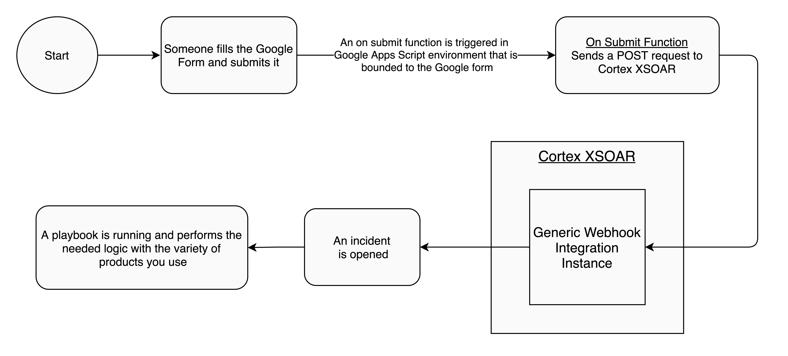
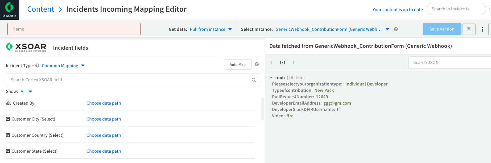
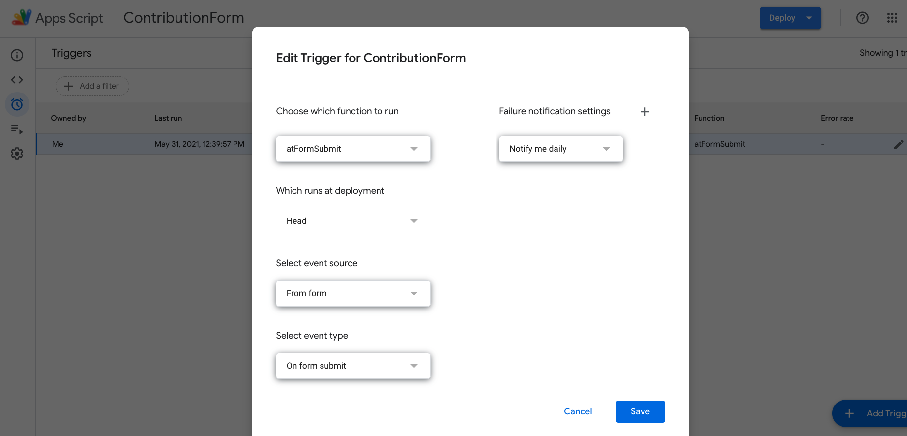
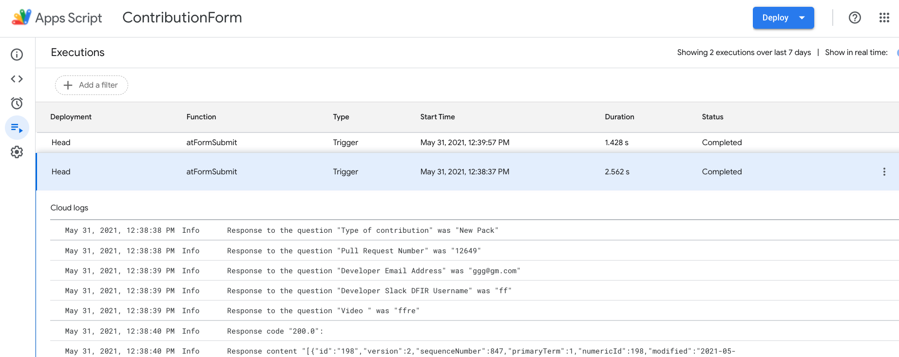

Imagine you have a Google form for some purpose, and you want to run some logic with different services upon form submission.
As you might know, Google provides an IDE to run some code that is bounded to the form. This service is called [Google Apps Script](https://developers.google.com/apps-script).
But combining various kinds of services can be frustrating. You can use Cortex XSOAR to make this process a lot easier.

For instance, see the following architecture:

</img>

### To implement the above flow, do the following things:

#### Generic Webhook Configuration

1. Download the [Generic Webhook Pack](https://xsoar.pan.dev/marketplace/details/GenericWebhook) and configure an instance of the integration. For example, you can call the instance: *GenericWebhookForm*.

   :::note NOTE
   The webhook integration needs to be accessible from the internet, [this](https://xsoar.pan.dev/docs/reference/articles/long-running-invoke) should assist, or you need to run the webhook integration on an engine which is accessible from the internet.
   :::

2. Please configure the Webhook integration with a username & password, as we the attached code is using basic authentication. See [this](https://xsoar.pan.dev/docs/reference/integrations/generic-webhook) for more information.

3. In Cortex XSOAR, create an incident type that represents the Google form use case. Add a layout, mapper, classifier, etc...

   It is recommended to enable the **store_samples** parameter of the Webhook integration to be able to create a mapper.
   </img>

4. Create a designated playbook to run when the incident is created. 

#### Google Forms Configuration

1. Create a Google form that will provide the information you need.

2. Create a Google Apps Script for the selected form. See [Creating a project from Google Docs, Sheets, or Forms](https://developers.google.com/apps-script/guides/projects#creating_a_project_from_google_docs_sheets_or_forms) for more information.

3. Add the `https://www.googleapis.com/auth/script.external_request` scope to your **appsscript.json** file. See [this](https://developers.google.com/apps-script/concepts/scopes) for more information.

4. Create a new file in the script editor with the following generic code. (Replace the username, password, and URL with the values from the Generic Webhook integration):
    ```javascript
      function atFormSubmit(e) {
        var formResponse = e.response;
        var itemResponses = formResponse.getItemResponses();
        var formData = {};
        for (var i = 0; i < itemResponses.length; i++) {
          var itemResponse = itemResponses[i];
          var key = itemResponse.getItem().getTitle();
          var value = itemResponse.getResponse();
          formData[key] = value;
          Logger.log('Response to the question "%s" was "%s"', key, value);
        }
        sendPostRequestToXSOAR(formData);
      }
      function sendPostRequestToXSOAR(formData) {
        var body = {name: "New Google Forms Response", raw_json: formData};
        var username = <YOUR_USERNAME>;
        var password = <YOUR_PASSWORD>;
        var url = <YOUR_WEBHOOK_INSTANCE_URL>;
        var params = {
          method: "POST",
          payload: JSON.stringify(body),
          validateHttpsCertificates: false,
          muteHttpExceptions: true,
          contentType: "application/json",
          headers: {"Authorization": "Basic " + Utilities.base64Encode(username + ":" + password)}
        };
        var response = UrlFetchApp.fetch(url, params);
        Logger.log('Response code "%s": ', response.getResponseCode());
        Logger.log('Response content "%s": ', response.getContentText());
      }
    ```

5. Add an [on Submit trigger](https://developers.google.com/apps-script/guides/triggers) to the context of the form and choose the *atFormSubmit* function to run when the form is submitted.
   </img>
6. You can debug your work in the [Executions Feature](https://developers.google.com/apps-script/guides/v8-runtime?hl=en#view_executions).
   </img>

That's it, now every form submission will be reflected and managed by your playbook in Cortex XSOAR.