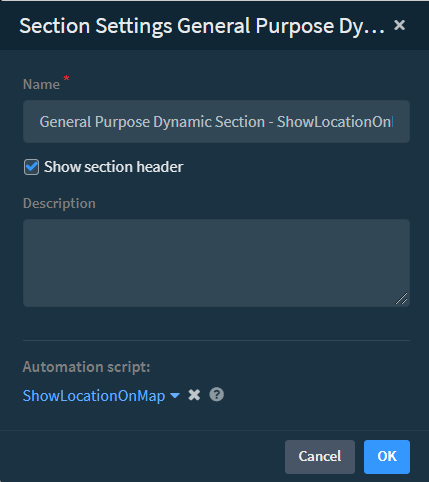
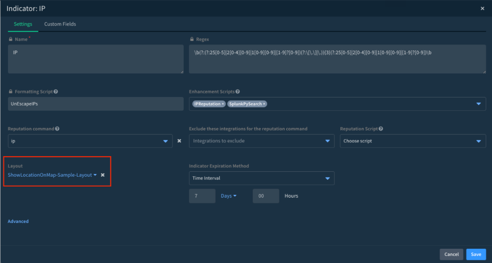
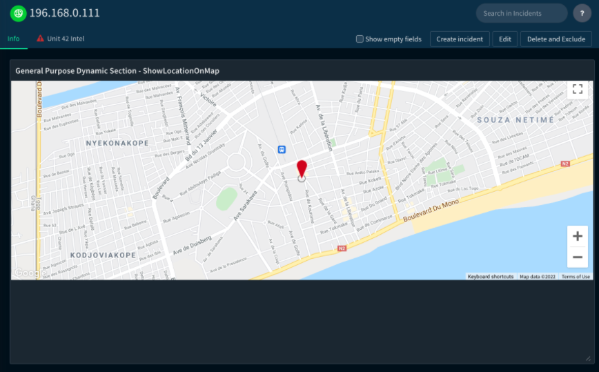

You need to set up Google Maps in Cortex XSOAR before using either the `ShowLocationOnMap` or the `ShowLocationOnMap` automation. To use Google Maps, you need to create a Google Cloud Plaform project that has [billing enabled](https://developers.google.com/maps/documentation/javascript/cloud-setup#billing). After creating the project, you need to enable the Maps JavaScript API and then create an API key for the project. You then need to add the API key to Cortex XSOAR. If using the `ShowLocationOnMap` automation, to view the map, you also need to add the automation to a indicator layout.  

1. In **Google Cloud Platform**, do the following:
   1. Create a [Google Cloud Project](https://developers.google.com/maps/documentation/javascript/cloud-setup).
   2. Enable APIs and Services (**API & Services>Dashboard**> **ENABLE APIS AND SERVICES**).
   3. Enable **Maps JavaScriptAPI**.
   4. Create the [Maps JavaScript API key](https://developers.google.com/maps/documentation/javascript/get-api-key#creating-api-keys) ( **Credentials**> **CREATE CREDENTIALS>API key**).
   6. Copy the Maps JavaScript API key.
2. Add the Maps JavaScript API key to Cortex XSOAR.
   1. Select **Settings > ABOUT > Troubleshooting> Add Server Configuration.**
   2. Add the following key and value: 

      | Key | Value |  
      | ----|----- | 
      | `UI.google.api.key`| `Maps JavaScript API key` (copied from step 1.4 above)|
    1. Click **Save**.
          You can now run the `ShowOnMap` automation in Cortex XSOAR. For example in the CLI type, `!ShowOnMap lat=6.1287 lng=1.2215`. For an example, see [How to Display a Geo-location Using Google Maps in the War Room](https://knowledgebase.paloaltonetworks.com/KCSArticleDetail?id=kA14u000000oMOUCA2&lang=en_US%E2%80%A9).
3. (`ShowLocationOnMap` automation only) [Customize an  indicator layout](https://docs.paloaltonetworks.com/cortex/cortex-xsoar/6-5/cortex-xsoar-admin/manage-indicators/understand-indicators/customize-indicator-view-layouts/customize-an-indicator-type-layout.html).
   1. If using an out-of-the box layout, such as IP, duplicate/detach the layout.
   2. Edit the layout.
   3. Drop and drag the **General Purpose Dynamic Section** onto the indicator page.
   4. In the **General Purpose Dynamic Section**, click **Edit button>Edit section settings**.
   5. Edit the name as required.   In this example, we will call it `General Purpose Dynamic Section - ShowLocationOnMap-Sample-Layout`.
   6. In the **Automation Script** field, select **ShowLocationOnMap**.
      .
   7. Click **OK**.

4. Add the indicator layout to an indicator type.
   1. Go to **Settings>OBJECTS SETUP>Indicators**.
   2. Select the indicator type and click **Edit**.
   3. In the **Layout** section select the layout you added in step 3.
     
   4. Click **Save**.

5. In the **Threat Intel** page, select a relevant indicator that has a value for the **Geo Location** field. The map should be shown in the section that you created.
      
6. If you do not have an indicator that has a value for the **Geo Location** field, to test the indicator, do the following:
   1.  Go to **Settings>OBJECTS SETUP>Incident Fields>Indicators** and search for **Geo Location**. 
   2.  Click Edit **Geo Location** and select the indicator type where you want the field to appear.
   3.  Go to **Threat Intel** page, select the indicator and then click **Edit** 
   4.  In the **Geo Location** field, type `6.1287,1.2215`.
