Supporting add-on for Cortex XSOAR. This application enables you to push incidents from Splunk into Cortex XSOAR, according to configurable trigger parameters.

Source code for the add-on is available at: [https://github.com/demisto/splunk-app](https://github.com/demisto/splunk-app).


## Prerequisites
- A Splunk instance, with version 8.0 or above.


## Installation / Update
1. Download ***Demisto Add-on for Splunk*** from [Splunkbase](https://splunkbase.splunk.com/app/3448).
2. Open your Splunk instance, Go to ***Apps*** → ***Manage Apps*** → ***Install app from file***.  
   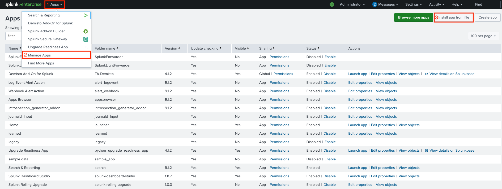
3. Click ***Choose File*** and select the file that was downloaded in step 1.  
   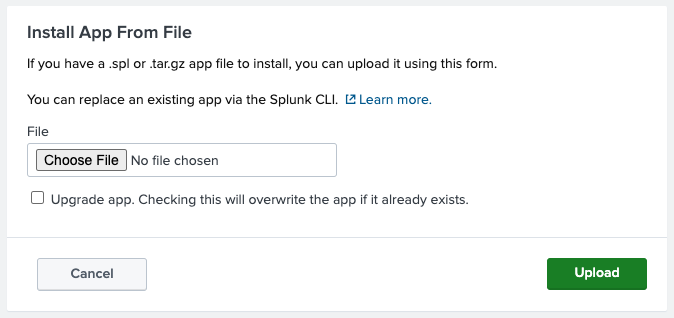
4. If the add-on is already installed, and this installation is for update purposes, check the ***Upgrade app*** checkbox.
5. A message saying that you need to restart Splunk will pop up. Click ***Restart Now***.  
   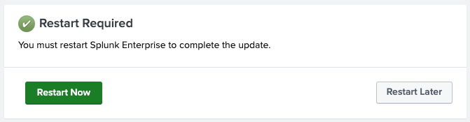


## Add-on Configuration on Splunk
1. Go to ***Apps*** → ***Manage Apps***.
2. Find ***Demisto Add-On for Splunk*** on the list, and click ***Launch app*** on the right under the *Actions* column.
3. On the configuration page, click ***Add*** to add a new XSOAR instance.  
   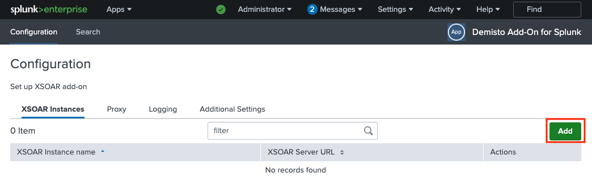
4. Configure a Cortex XSOAR instance:
   - Configuration for Cortex XSOAR 6 instances:
     1. Enter a unique instance name on the ***XSOAR Instance name*** field.
     2. Enter your Cortex XSOAR server URL (including port if needed) on the ***XSOAR Server URL*** field.
     3. Enter your API key on the ***API Key*** field.  
        An API key can be generated on XSOAR by navigating to **Settings** → **Integrations** → **API Keys**.
     4. Click ***Add***. 
   - Configuration for Cortex XSOAR 8 or Cortex XSIAM instances:
     1. Enter a unique instance name on the ***XSOAR Instance name*** field.
     2. Enter your Cortex XSOAR server's API URL on the ***XSOAR API URL*** field.  
        The API URL can be obtained on Cortex XSOAR by navigating to **Settings & Info** → **Settings** → **API Keys** (under *Integrations*), and clicking the ***Copy API URL*** button.  
     3. Enter your API key on the ***API Key*** field.  
        The API Key **must be in the *Advanced API Key* format**, and be entered in the following format: `[API_KEY]$[API_AUTH_ID]`.  
        An API key can be generated on Cortex XSOAR / XSIAM by navigating to **Settings & Info** → **Settings** → **API Keys** (under *Integrations*), and clicking the ***New Key*** button. Make sure to select the ***Advanced*** checkbox under **Security Level**.
   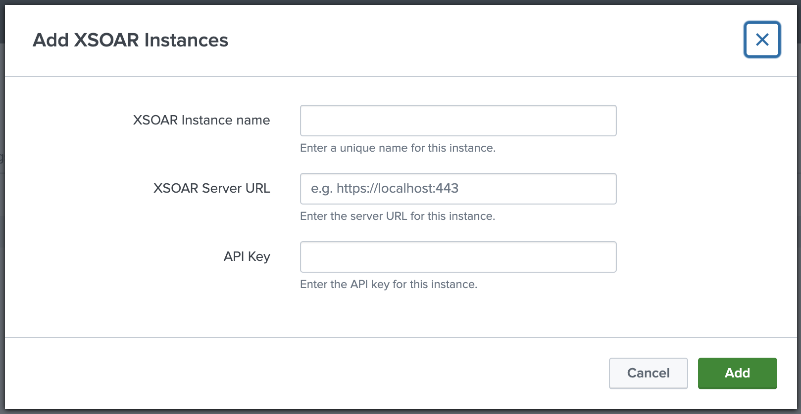
5. **[Optional]** Proxy Setup:  
   If you want to tunnel the traffic od the add-on through a proxy, select the ***Proxy*** tab, check the ***Enable*** checkbox, and fill all relevant proxy configuration fields.
   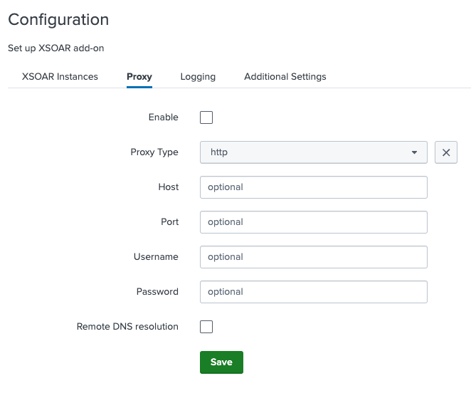
6. **[Optional]** Log Level Configuration:  
   By default, the logging level is "INFO". If you wish to change it (we don't recommend setting it to a value that isn't `INFO` or `DEBUG`), select the ***Logging*** tab, and choose the desired logging level from the ***Log Level*** drop-down list.
   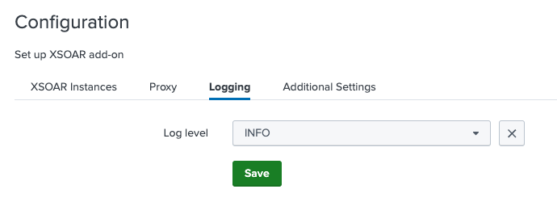
7. **[Optional]** SSL Certificate Configuration:  
   If you have an internal / self-signed SSL certificate, select the ***Additional Settings*** tab, and provide its full path on the ***Location to Certificate*** field.  
   Certificate validation is enabled by default. If you don't want to validate the SSL certificate, uncheck the ***Validate SSL*** checkbox (**NOTE:** this option will not work for Splunk Cloud).
   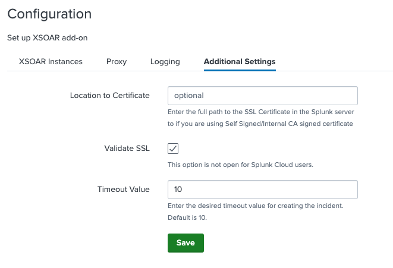
8. **[Optional]** Timeout configuration:
   If you would like to extend the incident creation request timeout time, select the ***Additional Settings*** tab, and enter the desired timeout value on the ***Timeout Value*** field.  
   By default, timeout value is 10 seconds.
9. After all configurations are set, restart Splunk to apply the changes.  
   To restart Splunk, go to ***Settings*** → ***Server Controls***, and click on the ***Restart Splunk*** button.


## Alert Configuration
In order for an alert to be pushed as an incident to Cortex XSOAR, you must add ***Create XSOAR Incident*** as a trigger action for the alert on Splunk.  
After adding the trigger action, you can configure the action to determine how the incident will be created in Cortex XSOAR.

The following fields are available for configuration:

| Field                         | Description                                                                                                             |
|-------------------------------|-------------------------------------------------------------------------------------------------------------------------|
| Name                          | Name of the alert.                                                                                                      |
| Time Occurred (epoch)         | Time when alert was triggered.                                                                                          |
| Send Alert to all the Servers | If enabled, the alert will be pushed to all configured Cortex XSOAR servers configured.                                 |
| XSOAR Server                  | Cortex XSOAR server to which the incident will be pushed (needed only if *Send Alert to all the Servers* is unchecked). |
| Type                          | Incident type in Cortex XSOAR.                                                                                          |
| Custom Fields                 | A comma-separated, 'key:value' formatted, custom fields pairs.                                                          |
| Labels                        | A comma-separated list of values to set for the labels field in the incident on Cortex XSOAR.                           |
| Severity                      | The severity to set for the incident on Cortex XSOAR.                                                                   |
| Details                       | The details field value to set for the incident on Cortex XSOAR.                                                        |


## Configuration Test
To assure the add-on is properly configured, and that incidents are being created in Cortex XSOAR properly, follow the steps below:
1. Click ***Add Data*** on the front page of Splunk.  
   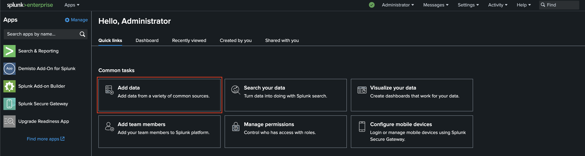
2. Click on ***Upload***.  
   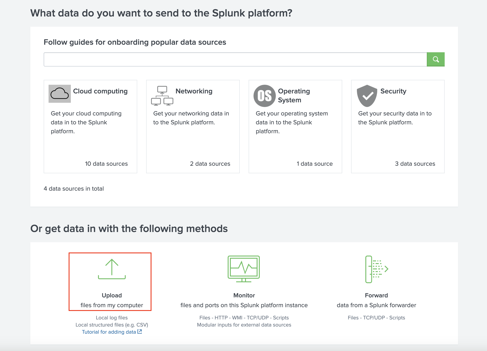
3. Click on ***Select File***, select a random file (preferably a small text-based file), and click on the green ***Next*** button.  
   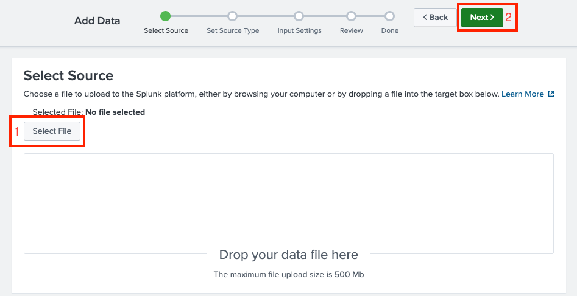
4. Click on the green ***Review*** button at the top, and then ***Submit***.
5. After that, you should see a message saying *"File has been uploaded successfully."*  
   Click on the green ***Start Searching*** button.
   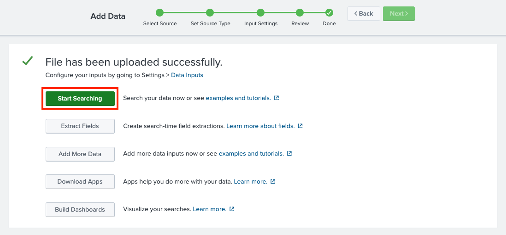
6. A *"New Search"* page will open. Click on ***Save As***, and then ***Alert***.
   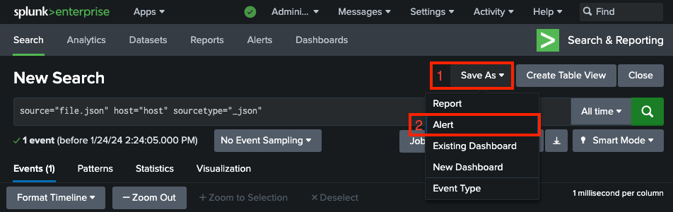
7. * Configure the alert:
     - **Title** - Some value.
     - **Permissions** – ***Shared in App***.
     - **Alert type** – ***Scheduled***, and then ***Run on Cron Schedule***.
     - **Cron Expression** – \* \* \* \* \* (5 asterisks, indicates a schedule of every 1 minute).
     - Under ***Trigger Actions***, click on the ***Add Actions*** button, and then select ***Create XSOAR Incident***.
     - Configure the ***Create XSOAR Incident*** action as described in the [Alert Configuration](#alert-configuration) section.
8. Enter your Cortex XSOAR server, wait a few minutes for incidents to be ingested, and assure that incidents are being created in Cortex XSOAR properly.
  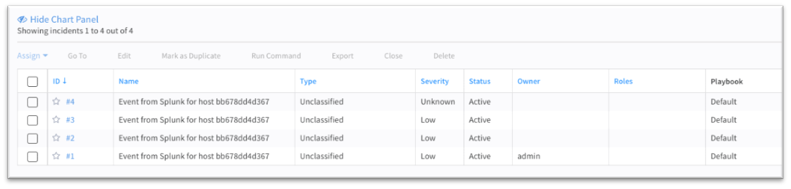

:::tip
A list of saved Alerts can be found by navigating to ***Apps*** → ***Search & Reporting*** → ***Alerts***.
:::

## Appendix
### Local Splunk Environment Setup
To set up a local environment for testing purposes, run the following command to start a Docker container of Splunk (replace `*****` with any 8-character password, containing letters and digits):
```
docker run -d -p "8000:8000" -p "8088:8088" -p "8089:8089" -e "SPLUNK_START_ARGS=--accept-license" -e "SPLUNK_PASSWORD=*****" --name splunk splunk/splunk:latest
```
Once the container is up and running, the Splunk environment will be accessible on http://localhost:8000.

For more information about the Splunk Docker image and containers configuration, see the official [Splunk DockerHub Page](https://hub.docker.com/r/splunk/splunk/).


### Create an Adaptive Response Action for Splunk Enterprise Security
1. Click ***Incident Review***. For Splunk Enterprise Security users, all incidents are reported in the *Incident Review* Dashboard.
2. Click the ***Actions*** drop-down button for the incident that you want to be created on Cortex XSOAR.
3. Click **ֿ*Run Adaptive Response Actions***.
4. Click ***Add New Response Action***.
5. Select ***Create XSOAR Incident*** from the list of actions.
6. Fill in the details that need to be sent out to Cortex XSOAR (as described in the [Connectivity Test](#connectivity-test---create-a-custom-alert-action-from-saved-searches). When finished, click ***Run***.
7. Splunk will display a message indicating that the action has been dispatched.
8. Back in the main screen of the Incident List table, Click the ***I*** button to list incidents in detail and track actions that took place when the incident occurred in Splunk.
9. Check the ***Adaptive Response*** section under details. It should include a response like *XSOAR Custom Alert Action* with a status.
10. Click ***XSOAR Custom Alert Action*** to drill down to more details on the alert action that was called along with the detailed response received from Cortex XSOAR.


## Troubleshooting
### Common Issues
#### Splunk Events are not Created in Cortex XSOAR
If after associating Create XSOAR Incident with saved searches, correlation searches using automated invocation, or using ad-hoc invocation from Splunk Enterprise Security's incident review dashboard, incidents are not being created on Cortex XSOAR, the following should be checked:
1. Check the configuration page. You may need to restart the add-on in order for the modifications to take effect.
2. Check the *Saved Search* trigger conditions. Splunk might be suppressing the events, which causes it not to create an incident in Cortex XSOAR.
3. Test the network connectivity in-between applications to ensure there are no connectivity issues. You can use the following commands to test the connectivity:
   ```bash
   # For Cortex XSOAR 6, 'XSOAR_SERVER' is the server URL, including a port if relevant in a <SERVER_ADDRESS>:<PORT> format.
   # For Cortex XSOAR 8 / Cortex XSIAM, 'XSOAR_SERVER' is the API URL.
   curl -kv <XSOAR_SERVER>
   telnet <XSOAR_SERVER>
   wget --no-check-certificate -O - <XSOAR_SERVER>
   ```

4. Test the API key generated in Cortex XSOAR.
   ```bash
   curl -kv -H "Authorization:<API_KEY>" https://<XSOAR_SERVER>/user
   wget --no-check-certificate --header="Authorization: <API_KEY>" -O - https://<XSOAR_SERVER>/user
   ```
   
#### Connection Timeout Errors
Connection timeout errors can be identified in the Splunk logs, and will look as follows:
```
2022-01-25 02:45:02,941 ERROR pid=**** tid=MainThread file=*** | sendmodaction - signature="Failed creating an incident to server ****. Reason: HTTPSConnectionPool(host='***', port=443): Read timed out. (read timeout=30.0)" action_name="***" search_name="****" action_status="failure"
```
In case of a connection timeout error:
1. Locate the `SavedSplunker` log facility.
2. Increase its verbosity to *ERROR* level.
3. If the logs include the following:  
   ```
   WARN SavedSplunker - Reached maximum amount of time allowed to spend in per-result alerts for savedsearch_id="SAVEDSEARCH_ID"
   ```  
   Increase the ***max_per_result_alerts_time*** value in the `limits.conf` file.

#### Incidents Created in Cortex XSOAR with Incorrect Fields
If incidents are being created in Cortex XSOAR with incorrect fields, ensure that the ***Create XSOAR Incident*** trigger action for the alert is configured properly. 
For more information about the fields mapping, see the [Alert Configuration](#alert-configuration) section a

#### Too Many Incidents Are Bring Created in Cortex XSOAR
Splunk has its own trigger conditions using the number of incidents which get pushed to XSOAR controlled.

See Splunk's *[Configure alert trigger conditions](https://docs.splunk.com/Documentation/Splunk/latest/Alert/AlertTriggerConditions)* documentation to understand Splunk Trigger Conditions to limit the incidents.  
It is also possible to [throttle alerts](https://docs.splunk.com/Documentation/SplunkCloud/latest/Alert/ThrottleAlerts) in Splunk after the saved search returned positive results, in order to suppress more incident creation.

#### Playbooks not getting invoked on Cortex XSOAR
Cortex XSOAR allows users to set up different types of incidents, and the user can associate different playbooks for each type of incident. If after pushing incidents from Splunk, the appropriate playbooks are not being invoked, you should check the following:
1. Check if the type of incident which is getting pushed from Splunk has a playbook associated with the Type in Cortex XSOAR.
2. Check if there are no case differences in the Type created in Cortex XSOAR and the type which is being pushed along with incident information in Splunk.

#### SSL Certificates Issues
* If you don’t use a certificate, make sure the ***Validate SSL*** checkbox is not selected.
* If you have a self-signed certificate, you must add it to the Splunk server first, and then set the path to it in the Add-on configuration page.
* In the case of a self-signed certificate, make sure that the whole certificate chain exist. Each of root, intermediate, and client certificate is required.
* When checking SSL certificate validity by pinging, ping to the server domain. SSL certificates are signed on server domain rather than its IP.

#### Splunk Common Information Model (CIM) Issues
If Splunk CIM is installed, make sure its version is compatible with the installed Splunk version. A common error caused by a version incompatibility might look as the following:
  ```
  12-28-2021 13:45:13.807 -0800 ERROR sendmodalert - action=create_xsoar_incident STDERR - NameError: name 'basestring' is not defined
  12-28-2021 13:45:13.807 -0800 ERROR sendmodalert - action=create_xsoar_incident STDERR - if isinstance(self.sid, basestring) and 'scheduler' in self.sid:
  12-28-2021 13:45:13.807 -0800 ERROR sendmodalert - action=create_xsoar_incident STDERR - File "/opt/splunk/etc/apps/Splunk_SA_CIM/lib/cim_actions.py", line 157, in init
  ```

### Logs
Relevant logs for troubleshooting and debugging can be found in the following paths:
- Add-on logs: `var/log/splunk/create_xsoar_incident_modalert.log`
- Splunk logs: `var/log/splunk/splunkd.log`
