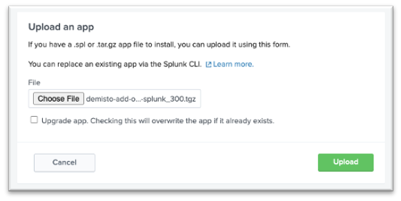
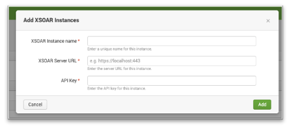
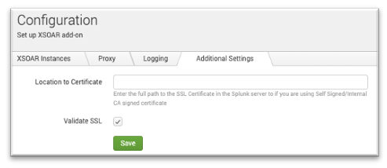
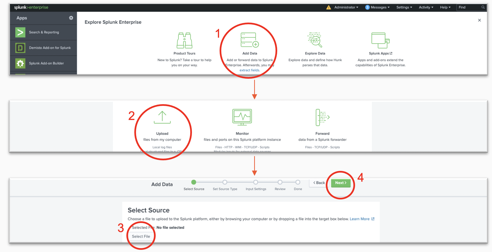
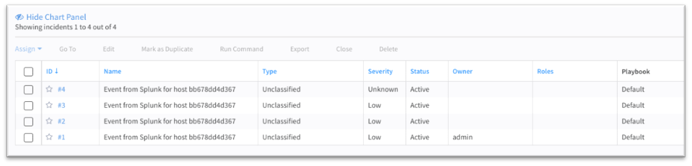

Supporting add-on for Cortex XSOAR. This application enables you to push incidents from Splunk into Cortex XSOAR, according to configurable trigger parameters.

The add-on is open source. Source code is available at: [https://github.com/demisto/splunk-app](https://github.com/demisto/splunk-app).


### Prerequisites
* Splunk version 8.0 or later


### Test on a local Splunk Environment
Run the following command to create a Splunk Docker container (replace the `*****` with any 8-character password, containing letters and digits):
```
docker run -d -p "8000:8000" -p "8088:8088" -p "8089:8089" -e "SPLUNK_START_ARGS=--accept-license" -e "SPLUNK_PASSWORD=*****" --name splunk splunk/splunk:latest
```
When the command is finished executing, the Splunk environment will be available at http://localhost:8000.


### Installation of the Add-on
* Download Demisto Add-on for Splunk from [Splunkbase](https://splunkbase.splunk.com/app/3448).
* After initializing the container, open your local Splunk environment.
* Go to **"Manage Apps" → Install app from file → upload the latest version of Demisto Add-on for Splunk**.
  *Note:* if a version of the app already exists, select the **"Upgrade app"** checkbox.
  
  
* Restart Splunk and login again.


### Configuration
In order to use the add-on and create incidents in XSOAR, you must complete the setup of the application. After you install the add-on, click "Launch app" and provide the following:
* Create a XSOAR instance:  
  Under XSOAR Instances tab, press the "Add" button. Choose an instance name, and fill the XSOAR server URL (including port if needed) and the API key fields. The API key is used for authorization with XSOAR. To generate this parameter, login to Cortex XSOAR and click on Settings → Integration → API Keys.
  

  >*NOTE:*  When using XSOAR v8 and above, and *Advanced API key* should be generated and be inserted as follows: *<API_KEY>$<API_AUTH_ID>*

  
* Set up proxy settings (optional):  
  Under the **Proxy** tab, select the **"Enable"** checkbox and provide all of the necessary proxy parameters.
* Choose log level (optional):  
  By default, the logging level is "INFO". You can change the logging level to "DEBUG" if needed.
* Additional Settings (optional):  
    * If you have an SSL certificate, provide its full path under the **"Location to Certificate"** field.
  By default, **"Validate SSL"** is enabled.
    * If you would like to extend the incident creating request timeout, provide the desired timeout under the "Timeout Value" field.
    By default, timeout value is 10 seconds.
  
  
* You must restart Splunk in order to apply changes in the configuration settings.

       
### Connectivity Test - Create a Custom Alert Action from Saved Searches
* Upload data to Splunk (any small PDF, CSV, or YML file).

  
* When the file is uploaded, click **"Start Searching"** and save the search as an Alert (on the top-right corner).
  * Complete the Alert settings:
      1. Title
      2. Permissions – Shared in App
      3. Alert type – Run on Cron Schedule
      4. Cron Expression – * * * * * (every 1 minute)
  
  * Press "Add Actions" and choose **Create XSOAR Incident**, from which you can setup the alert incident details:
      1. Name - name of the alert
      2. Time Occurred - time when alert was triggered
      3. XSOAR Server (if "Send Alert to all the servers" is unchecked)
      4. Type – incident type in XSOAR
      5. Custom Fields - A comma-separated 'key:value' custom fields pairs
      6. Labels – a comma-separated values to populate the labels field
      7. Severity – the alert severity
      8. Details – "details" field of the incident

* Go to the XSOAR server and wait for incidents to be ingested (one for each event in Splunk).

  

* *Note:* Saved Alerts can be found under Search & Reporting → Alerts.


### Create an Adaptive Response Action from Splunk Enterprise Security
1. Click **"Incident Review"**. For Splunk ES App users, all of the incidents are reported in the "Incident Review" Dashboard.

2. Click the **"Actions"** drop-down button for the incident that needs to be reported to Cortex XSOAR.

3. Click **"Run Adaptive Response Actions"**.

4. Click **"Add New Response Action"**.

5. Select **Create XSOAR Incident** from the list of Actions.

6. Fill in the details that need to be sent out to Cortex XSOAR (as described in the [Connectivity Test](#connectivity-test---create-a-custom-alert-action-from-saved-searches). When finished, click **"Run"**.

7. Splunk will display a message indicating that the action has been dispatched.

8. Back in the main screen of the Incident List table, Click the **"I"** to list incidents in detail and track actions that took place when the incident occurred in Splunk.

9. Check the **"Adaptive Response"** section under details. It should include a response such as "XSOAR Custom Alert Action" with a status.

10. Click **"XSOAR Custom Alert Action"** to drill down to more details on the alert action that was called along with the detailed response received from Cortex XSOAR.


### Troubleshooting
We recommend checking the following logs as an initial step in troubleshooting:
- Splunk issues: `var/log/splunk/splunkd.log`
- Add-on issues: `var/log/splunk/create_xsoar_incident_modalert.log`


### Common Issues

#### Splunk Events are not Created in XSOAR
In cases where after associating Create XSOAR Incident with saved searches or correlation searches using automated invocation or using ad-hoc invocation from Splunk-ES incident review dashboard, Incidents are not getting created into the Cortex XSOAR, the following criteria should be checked.

1. Check the configuration page. You may need to restart the add-on in order for the modifications to take effect.

2. Check the Saved Search trigger conditions. Splunk might be suppressing the events and not creating an incident in Cortex XSOAR.

3. Test the network connectivity in between applications to ensure that there are no connectivity issues. You may try one of the following:
   ```
   curl -kv https://<XSOAR_SERVER>:<PORT>
   telnet <XSOAR_SERVER> <PORT>
   wget --no-check-certificate -O - https://<XSOAR_SERVER>:<PORT>
   ```

4. Test the API key generated in XSOAR.
   ```
   curl -kv -H "Authorization:<API_KEY>" https://<XSOAR_SERVER>:<PORT>/user
   wget --no-check-certificate --header="Authorization: <API_KEY>" -O - https://<XSOAR_SERVER>:<PORT>/user
   ```
   
#### Connection Timeout Errors
```
2022-01-25 02:45:02,941 ERROR pid=**** tid=MainThread file=*** | sendmodaction - signature="Failed creating an incident to server ****. Reason: HTTPSConnectionPool(host='***', port=443): Read timed out. (read timeout=30.0)" action_name="***" search_name="****" action_status="failure"
```
In case of a connection timeout error as in the above log:
1. Locate the `SavedSplunker` log facility.
2. Increase its verbosity to *ERROR* level.
3. If the logs include the following:
    ```WARN SavedSplunker - Reached maximum amount of time allowed to spend in per-result alerts for savedsearch_id="SAVEDSEARCH_ID"```
    Increase the *max_per_result_alerts_time* value in the `limits.conf` file.

#### Incident Created with Incorrect Fields
If incidents being created in XSOAR but with incorrect fields, refer to the [Connectivity Test](#connectivity-test---create-a-custom-alert-action-from-saved-searches) section for an understanding of the fields which are associated with create incident actions.

#### Too Many Incidents Created in XSOAR
Splunk has its own trigger conditions using the number of incidents which get pushed to XSOAR controlled.

Refer to [Splunk Documentation](https://docs.splunk.com/Documentation/Splunk/latest/Alert/AlertTriggerConditions) to understand Splunk Trigger Conditions to limit the incidents. 
Also, it is possible to [throttle alerts](https://docs.splunk.com/Documentation/SplunkCloud/latest/Alert/ThrottleAlerts) in Splunk after the saved search returned positive results, in order to suppress more incident creation.

#### Playbooks not getting invoked on Cortex XSOAR
Cortex XSOAR allows users to set up different types of incidents and the user can associate different playbooks the each type of incident. If after pushing incidents from Splunk, the appropriate playbooks are not being invoked, you should check the following:
1. Check if the type of incident which is getting pushed from Splunk has a playbook associated with the Type in XSOAR.

2. Check if there are no case differences in the Type created in XSOAR and the type which is being pushed along with incident information in Splunk.

#### SSL Certificates Issues
* If you don’t use a certificate, make sure the **"Validate SSL"** checkbox is not selected.

* If the you have a self-signed certificate, you must add it to the Splunk server first, and then set the path to it in the Add-on configuration page.

* In the case of a self-signed certificate, make sure that the whole certificate chain exist. Each of root, intermediate, and client certificate is required.

* When checking SSL certificate validity by pinging, ping to the server domain. SSL certificates are signed on server domain rather than its IP.

#### Splunk Common Information Model (CIM) Issues
If Splunk CIM is installed, make sure its version is compatible with the installed Splunk version. A common error caused by a version incompatibility might look as follows:
  ```
    12-28-2021 13:45:13.807 -0800 ERROR sendmodalert - action=create_xsoar_incident STDERR - NameError: name 'basestring' is not defined
    12-28-2021 13:45:13.807 -0800 ERROR sendmodalert - action=create_xsoar_incident STDERR - if isinstance(self.sid, basestring) and 'scheduler' in self.sid:
    12-28-2021 13:45:13.807 -0800 ERROR sendmodalert - action=create_xsoar_incident STDERR - File "/opt/splunk/etc/apps/Splunk_SA_CIM/lib/cim_actions.py", line 157, in init
  ```
