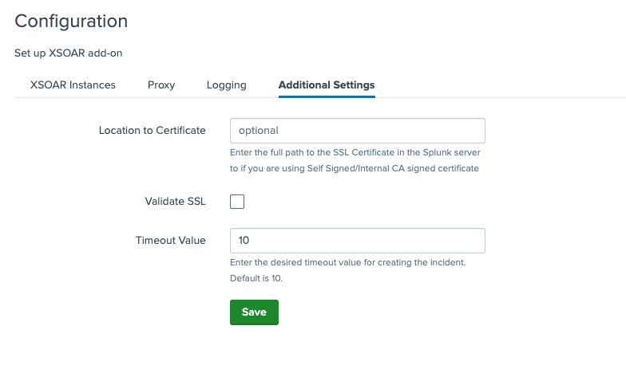

Supporting Add-on for Cortex XSOAR. This application allows to push incidents into Cortex XSOAR from Splunk according to configurable trigger parameters.


### Prerequisites
* Splunk version 7.2 >=


### Test on a local Splunk Environment
Run the following command to create a Splunk docker container (replace the `*****` with any 8-character password, containing letters and digits):
```
docker run -d -p "8000:8000" -p "8088:8088" -p "8089:8089" -e "SPLUNK_START_ARGS=--accept-license" -e "SPLUNK_PASSWORD=*****" --name splunk splunk/splunk:latest
```
Once executed, the splunk env will be available at http://localhost:8000.


### Installation of the Add-on
* Download Demisto Add-on for Splunk from [Splunkbase](https://splunkbase.splunk.com/app/3448).
* After initializing the container, open your local Splunk environment.
* Go to "Manage Apps" → Install app from file → upload the latest version of Demisto Add-on for Splunk.
  *Note:* if a version of the app already exists, mark the "Upgrade app" checkbox.
  
  
* Restart Splunk and login again.


### Configuration
* In order to use the add-on and create incidents in XSOAR, you must complete the setup of the application. Press "Launch app" action after installing the add-on and provide the following:
    1) Create a XSOAR instance:
       Under XSOAR Instances tab, press the "Add" button. Choose an instance name, and fill the XSOAR server URL (including port if needed) and the API key fields. The API key is used for authorization with XSOAR. To generate this parameter, login to Cortex XSOAR and click on Settings → Integration → API Keys.
    
       
    2) Set up proxy settings (optional):
       Under Proxy tab, check the "Enable" checkbox and fill all the proxy parameters needed.
    3) Choose log level (optional):
       By default, the logging level is "INFO". You may change the logging level to "DEBUG" if needed.
    4) Additional Settings (optional):
       - If you have an SSL certificate, provide its full path under "Location to Certificate" field.
       - By default, "Validate SSL" is enabled.
       
       
* You must restart Splunk in order to apply changes in the configuration settings.

       
### Connectivity Test - Create a Custom Alert Action from Saved Searches
* Upload data to Splunk (any small PDF, CSV or YML file).

  
* When the file is uploaded, click "Start Searching" and save the search as an Alert (on the top-right corner).
  * Complete the Alert settings:
      1. Title
      2. Permissions – Shared in App
      3. Alert type – Run on Cron Schedule
      4. Cron Expression – * * * * * (every 1 minute)
  
  * Press "Add Actions" and choose **Create XSOAR Incident**, from which you can setup the alert incident details:
      1. Name - name of the alert
      2. Time Occurred - time when alert was triggered
      3. XSOAR Server (if "Send Alert to all the servers" is unchecked)
      4. Type – incident type in XSOAR
      5. Custom Fields - A comma separated 'key:value' custom fields pairs
      6. Labels – a comma separated values to be put in the labels field
      7. Severity – the alert severity
      8. Details – "details" field of the incident

* Go to the XSOAR server and wait for incidents (one for each event in Splunk).

  

* *Note:* Saved Alerts can be found under Search & Reporting → Alerts.


### Create an Adaptive Response Action from Splunk Enterprise Security
* Click on "Incident Review". For Splunk ES App users, all of the incidents are reported in the "Incident Review" Dashboard.

* Click on the "Actions" drop-down button for the incident which needs to be reported to Cortex XSOAR.

* Click "Run Adaptive Response Actions".

* Click on "Add New Response Action".

* Select **Create XSOAR Incident** from the list of Actions.

* Fill in the details which need to be sent out to Cortex XSOAR (as described in the [Connectivity Test](#connectivity-test---create-a-custom-alert-action-from-saved-searches). When finished, click on "Run".

* Splunk will display a message indicating that the action has been dispatched.

* Back in the main screen of the Incident List Table, Click on "I" to list incidents in detail and track actions that took place when the incident occurred in Splunk.

* Check the "Adaptive Response" Section under details. It should include a response such as "XSOAR Custom Alert Action" with a status.

* Click on "XSOAR Custom Alert Action" to drill down to more details on the alert action which was called along with the detailed response received from Cortex XSOAR.


### Troubleshooting
We recommend checking the following logs as an initial step in troubleshooting:
- `var/log/splunk/splunkd.log` – for Splunk issues
- `var/log/splunk/create_xsoar_incident_modalert.log` – for the add-on issues


### Common Issues

#### Splunk Events are not Created in XSOAR
In cases where after associating Create XSOAR Incident with saved searches or correlation searches using automated invocation or using ad-hoc invocation from Splunk-ES incident review dashboard, Incidents are not getting created into the Cortex XSOAR, the following criteria should be checked.

1. Check the configuration page. You may need to restart for the modifications to take effect.

2. Check the Saved Search trigger conditions, Splunk might be suppressing the events and not creating an incident in Cortex XSOAR.

3. Test the network connectivity in between applications to ensure that there are no connectivity issues. You may try one of the following:
   ```
   curl -kv https://<DEMISTO_SERVER>:<PORT>
   telnet <DEMISTO_SERVER> <PORT>
   wget --no-check-certificate -O - https://<DEMISTO_SERVER>:<PORT>
   ```

4. Test the API key generated in XSOAR.
   ```
   curl -kv -H "Authorization:<API_KEY>" https://<DEMISTO_SERVER>:<PORT>/user
   wget --no-check-certificate --header="Authorization: <API_KEY>" -O - https://<DEMISTO_SERVER>:<PORT>/user
   ```

#### Incident Created with Incorrect Fields
If incidents being created in XSOAR but with wrong fields, try to refer to the [Connectivity Test](#connectivity-test---create-a-custom-alert-action-from-saved-searches) section for an understanding of the fields which are associated with create incident actions.

#### Too Many Incidents Created in XSOAR
Splunk has its own trigger conditions using the number of incidents which get pushed to XSOAR controlled.

Refer to [Splunk Documentation](https://docs.splunk.com/Documentation/Splunk/latest/Alert/AlertTriggerConditions) to understand Splunk Trigger Conditions to limit the incidents. 
In addition, it is possible to [throttle alerts](https://docs.splunk.com/Documentation/SplunkCloud/latest/Alert/ThrottleAlerts) in Splunk once the saved search returned with positive results, in order to suppress more incident creation.

#### Playbooks not getting invoked on Demisto Enterprise Application
Cortex XSOAR allows users to set up different types of incidents and the user can associate different playbooks the each type of incident. So, if after pushing incidents from Splunk, the appropriate playbooks are not being invoked, the following should be checked:
1. Check if the type of incident which is getting pushed from Splunk has a playbook associated with the Type in XSOAR.

2. Check if there are no case differences in the Type created in XSOAR and the type which is being pushed along with incident information in Splunk.

#### SSL Certificates Issues
* If you don’t use a certificate, make sure the "Validate SSL" checkbox is unmarked.

* If the you have a self-signed certificate, you must add it to the Splunk server first, and then set the path to it in the Add-on configuration page.

* In the case of a self-signed certificate, make sure that the whole certificate chain exist. Each of root, intermediate, and client certificate is required.

* When checking SSL certificate validity by pinging, ping to the server domain. SSL certificates are signed on server domain rather than its IP.
