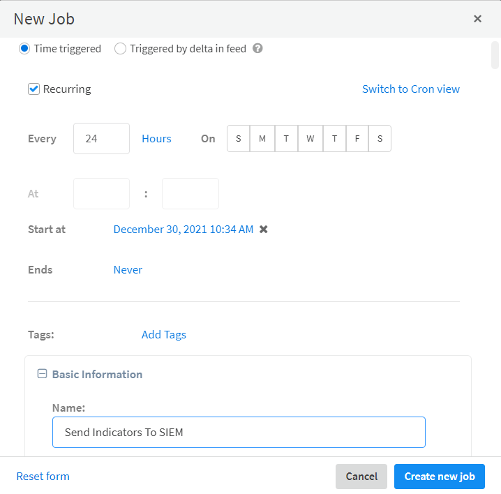
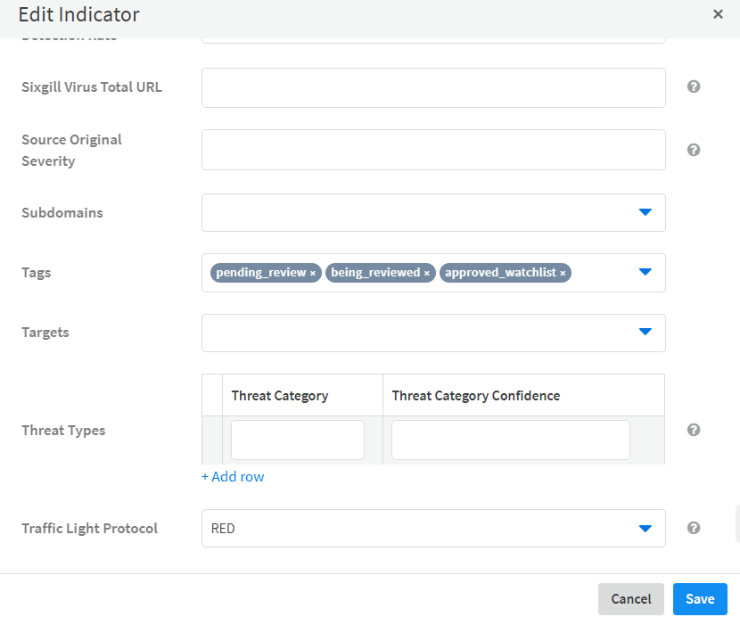

In Cortex XSOAR, you can set up a playbook to fetch indicators from a threat intel feed, enrich the indicators, and push them to your SIEM. 

Although this article takes you through this process, it is not intended to cover every possible scenario. It provides a practical scenario that touches on important points from which you can use in other scenarios. You should  follow these steps.

1. [Configure the threat intel feed](#configure-the-threat-intel-feed): Enables you to ingest indicators into Cortex XSOAR.
2. [Create a list of indicators not to process](#create-a-list-of-indicators-not-to-process): Create a list for indicators to exclude, which will be added to the playbook. 

3. [Customize the playbooks](#customize-your-playbooks): These playbooks process the indicators and determine which are legitimate.

4. [Define a feed-triggered job](#define-a-feed-triggered-job): Run a job every time indicators are ingested by the feed. 

5. [Review the indicators to send to the SIEM](#customize-the-add-all-indicator-types-to-siem-playbook): Determines which indicators are sent to the SIEM.

6. [Customize a job to push the indicators to the SIEM](#define-a-job-to-push-the-indicators-to-the-siem): Run a time-based job to push the indicators to the SIEM.

## Configure the Threat Intel Feed

You can install several TIM feeds in the Marketplace. In this example, we will use the **Bambenek Consulting feed**.

1. Go to **Marketplace** and download **Bambenek Consulting feed**.
2. Go to **Settings > INTEGRATIONS > Instances** and search for **Bambenek Consulting Feed**.

3. Click **Add instance**.

    1. Select **Fetches indicators**. 
    2. Determine the default reputation that you want indicators from this feed to receive. By default this is set to **Malicious**.

    3. Change the **Source Reliability**, if required. By default, Cortex XSOAR defines this feed as **B - Usually reliable**.
    4. In the **Services** field, select from where you want to pull the data. For example, **C2 All Indicator Feed**.

    5. Determine when the indicator expires and how often to fetch indicators from the feed.

   4. Click **Test**.
   5. Click **Save & exit**.
   The Indicators are now being ingested into Cortex XSOAR.

## Create a List of Indicators Not to Process

Create a list of indicators that you want to exclude. This list is added to the [TIM -Indicator Auto Processing](https://xsoar.pan.dev/docs/reference/playbooks/tim---indicator-auto-processing) sub-playbook, when [customizing the playbook](#customize-your-playbooks). In this example, create a list of business partner domain addresses.

1. Go to **Settings > Advanced > Lists**.  

2. Click **Add a list**. 

    1. Enter a meaningful name for the list. For example, `BusinessPartnersdomainaddresses`.
    2. In the **Content Type** field, select **Text**. 

    3. In the data section, enter a comma-separated list of domains of your business partners.
    
3. Click **Save**.

## Customize your Playbooks

After configuring the feed, you need to customize the playbook to process the indicators and determine which are legitimate. You need to configure the **TIM - Process Indicators - Manual Review** playbook and the **TIM - Indicator Auto Processing** sub-playbook.

 The [TIM - Process Indicators - Manual Review](https://xsoar.pan.dev/docs/reference/playbooks/tim---process-indicators---manual-review) playbook tags indicators ingested by feeds that require manual approval, which is triggered thorough the [feed-triggered job](#define-a-feed-triggered-job). You need to configure the query that indicators are returned. The playbook creates a new incident that includes the indicators for the analyst to review. 
   **NOTE**: You can use the [TIM - Process Indicators - Full Automated](https://xsoar.pan.dev/docs/reference/playbooks/TIM---process-indicators---fully-automated) playbook, which does not require any manual review and the tagged indicators will be ready for the SIEM.
  The [TIM -Indicator Auto Processing](https://xsoar.pan.dev/docs/reference/playbooks/tim---indicator-auto-processing) sub-playbook uses several other sub playbooks to process and tag indicators. It  identifies indicators that should not be added to the block list. You have the option of excluding certain IPs, hashes, domains, etc from the review process using the list(s) you created [here](#create-a-list-of-indicators-not-to-process).

1. Go the **Playbooks** page.
2. Edit the  **TIM - Process Indicators - Manual Review** playbook.

   1. At the top of the playbook, click the **Playbook Triggered** task. 

   2. From the **Inputs** tab (**From context data** radio button) in the `OpenIncidentToReviewIndicatorsManually` field, change the value to `Yes`, which opens an incident automatically so you can review the indicators. 

   3. Select the **From indicators** radio button.

   4. Under **Query**, enter a query to process the specific indicators that you want. For example, *sourceBrands:"Bambenek Consulting Feed"*.

   5. Click **Save**.

    

   6. Click **Save Version**.

1. Configure the **TIM - Indicator Auto Processing** sub-playbook.   

    1. Click **Detach Playbook** or **Duplicate Playbook**.
    2. Click **Edit**.
    
    3. Click on the sub-playbook task for the entity that you do not want to process. For example, to exclude business partner domains, click the **Process Indicators Against Business Partners Domains List** task.
   
    
    4. From the **Inputs** tab, in the **BusinessPartnersDomainsListName** field, click the curly brackets and select the list created [above](#create-list-of-indicators-not-to-process). In our example, we use *BusinessPartners domainaddresses*. 

    
    5. Click **OK**.

## Define a Feed-Triggered Job

Now that the feed and playbook are set up, you need to define a job that triggers the playbook when the indicators are fetched.

1. Go to the **Jobs** page and click **New Job**.

2. Select the **Feed triggered** radio button.
3. Under the **Triggers** section, select the **Specific feeds** radio button.
4.  In the **Select feeds** field, select the feed whose completion triggers this job. In this case, it should be the `Bambenek Consulting feed` instance you defined in [Configure the Threat Intel Feed](#configure-the-threat-intel-feed).

5. In the **Basic Information** section, enter a descriptive name for the job.

6. Select the ***TIM - Process Indicators - Manual Review*** playbook to run when this job is triggered. 

7. Click **Create New Job**.

Whenever Cortex xSOAR ingests indicators from the threat intel feed, it runs the **TIM Process Indicators-Manual Review** playbook and then creates an incident for review. You should re-fetch indicators from the Threat Intel feed, so when any indicators are ingested into Cortex XSOAR the incident is created and removes any indicators that need to be excluded. See step 1 in [Test the Flow](#test-the-flow).

## Customize the Add All Indicator Types To SIEM Playbook

Now that you have set up the infrastructure for pushing the feeds, you need to customize the [TIM - Add All Indicator Types to SIEM](https://xsoar.pan.dev/docs/reference/playbooks/tim---add-all-indicator-types-to-siem) playbook. 
 This playbook determines which indicators are sent to the SIEM and  sends to the SIEM only indicators that have been processed and tagged after an automatic or manual review process. By default, the playbook is configured to work with **ArcSight** and **QRadar**, but you should change this to match the SIEM in your system. 

1. Go the **Playbooks** page.
2. Edit the  **Add All Indicator Types to SIEM** playbook.

   1. At the top of the playbook, click the **Playbook Triggered** task. 

   2. From the **Inputs** tab (**From indicators** radio button) in the **Query** field, change the types, tags, or status as required. By default, it uses the query `(type:ip or type:file or type:Domain or type:URL) -tags:pending_review and (tags:approved_black or tags:approved_white or tags:approved_watchlist) and expirationStatus:active`.

   5. If you need to change the SIEM, update the sub-playbooks, such as **TIM - Add IP Indicators To SIEM**.
   6. Click **Save**.

   

## Define a Job to Push the Indicators to the SIEM

After setting up the infrastructure, create a job to push all the content that you have tagged to your SIEM. 

1. Navigate to **Jobs** and click **New Job**.

    1. Select the **Time triggered** radio button.

    2. Select the **Recurring** checkbox and determine how often you want the job to run.

       In this example, we run it daily at 10.34 AM.

    3. Enter a descriptive name for the job.

    4. Under **Playbook**, select the **TIM - Add All Indicator Types To SIEM** playbook to run when this job runs. 

2. Click **Create New Job**.

## Test the Flow

1. Navigate to **Settings > INTEGRATIONS > Instances** and edit the setting for the Bambenek instance ypu created earlier.

    1. Scroll to the end of the window and click **Re-fetch indicators from this instance**.

    2. Click **Fetch** and then save the changes.

2. Go to the **Jobs** page.   The [feed-triggered job](#define-a-job-to-push-the-indicators-to-the-siem) should be running.

    1. In the **Run Status** column, click the Run Status to open the job.

    2. Go to the **Work Plan** tab and click on the **Create Process Indicators Manually incident** task.

    3. Under the **Outputs** tab, note the incident ID for the incident that was created.

    

3. Go to the **Incidents** page and open the incident that was created. In this example the incident ID is 14194.

    1. From the **Indicators** tab, in the **Value** column, click an indicator. 
    
    2. In the **Indicator Quick View** dialog box, go to the **Tags and TLP** section and add the tags that apply to the indicator. We have added the `approved_watchlist` tag. This is the tag that the **TIM - Add All Indicator Types To SIEM** playbook uses to determine what needs to be pushed. If you use a different tag, ensure to change the input Query in the playbook.   **Note**: You can add tags in bulk to multiple indicators from the main Indicators page, but you will are not able to remove any tags that are already applied to an indicator.
    

    3. Under the **Work Plan** page, click the **Manually review the incident** task, select the **Yes** radio button, and click **Mark Completed**.

4. Navigate to the **Jobs** page. 

    1. Select the [time-triggered job](#define-a-job-to-push-the-indicators-to-the-siem) you defined to push content to the SIEM and click **Run now**. 

    2. Click **Running**.

    3. Under the **Work Plan** page, verify that the playbook completed. 

5. Navigate to **Indicators** and in the query, enter *tags:SIEM*. This is the tag appended to every indicator that has been processed and pushed to the SIEM.

        
