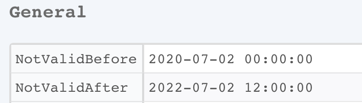
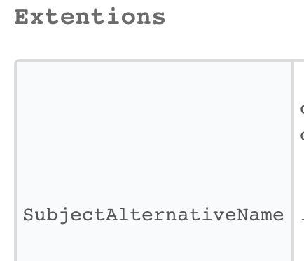
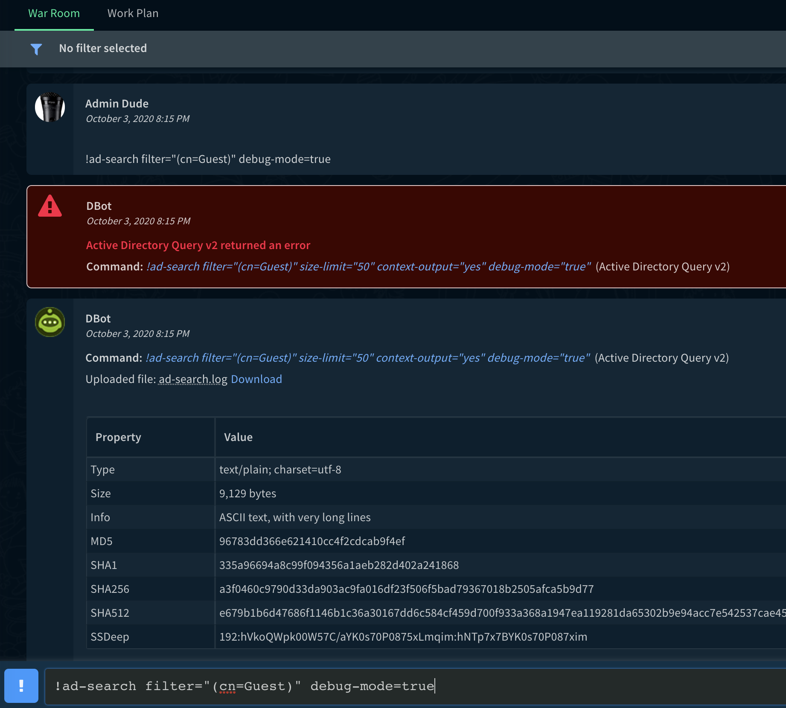
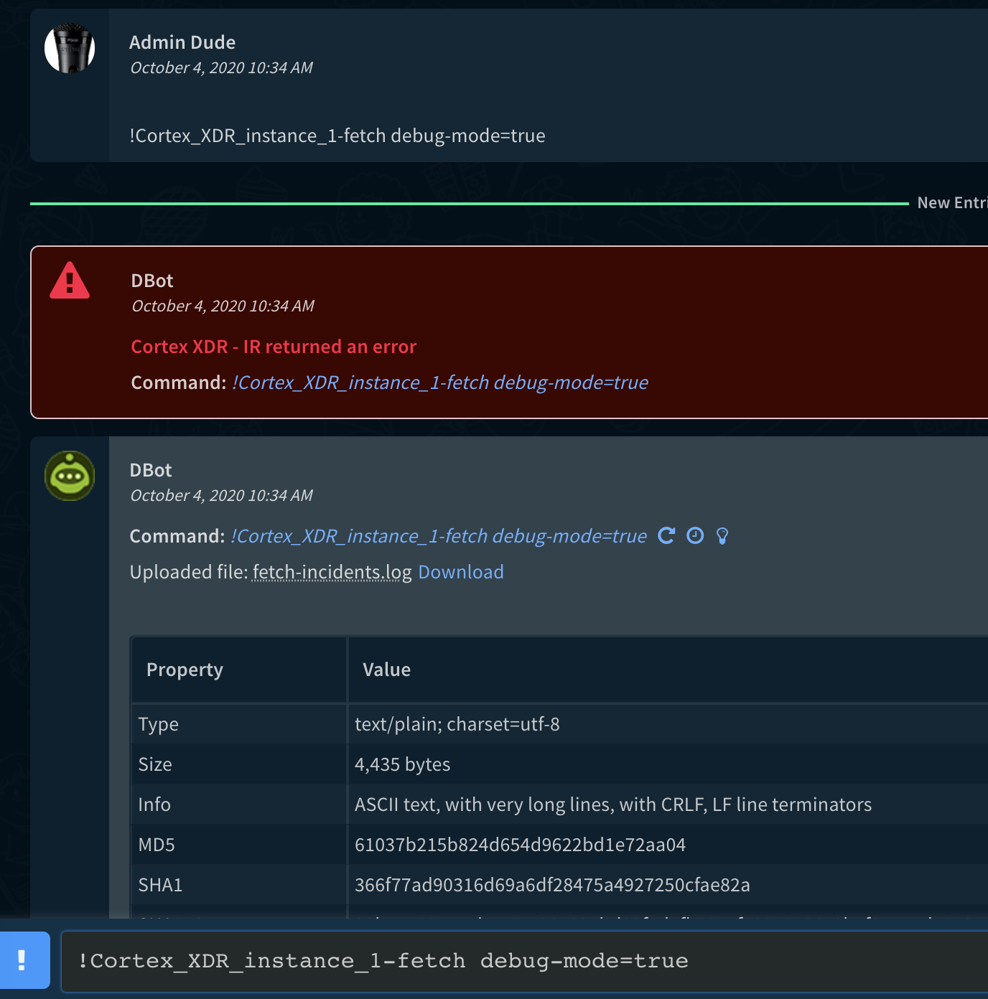
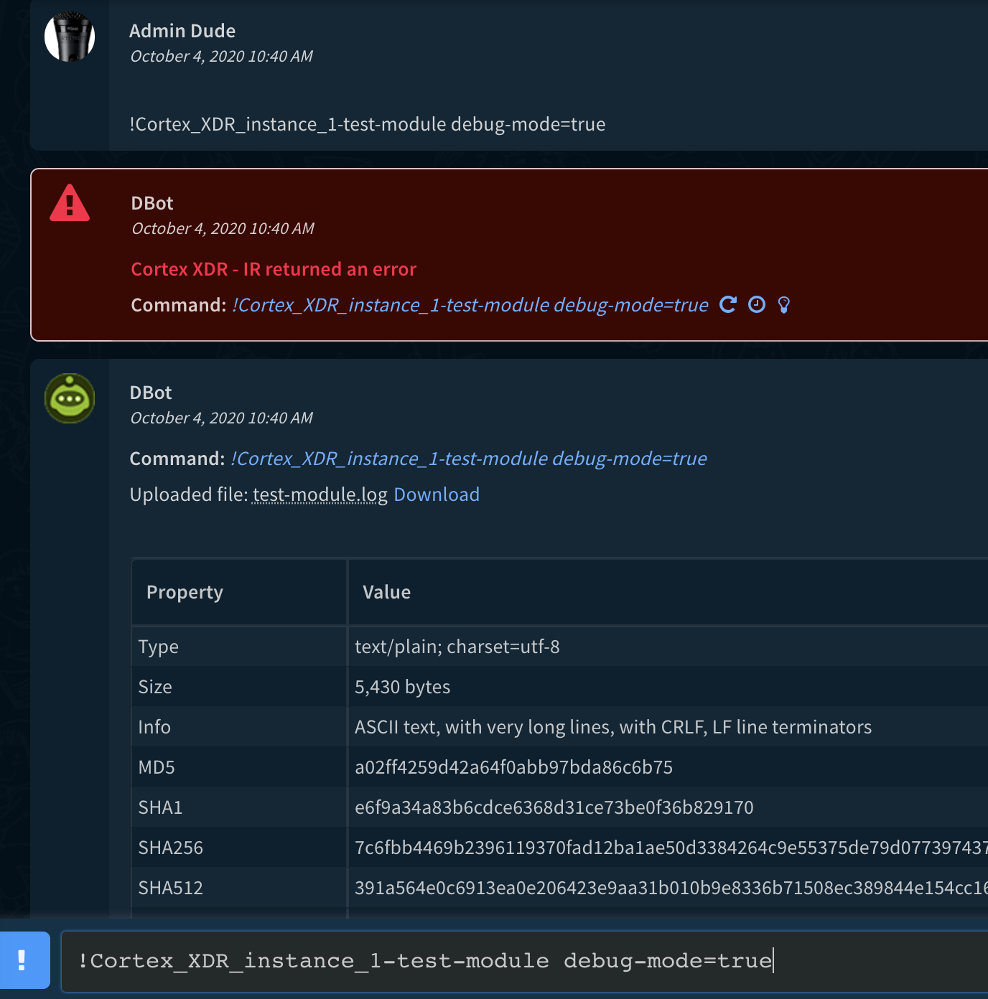

This guide provides common troubleshooting steps. When reporting an issue to Cortex XSOAR Support, always include all information obtained from running the following troubleshooting steps.

## Reverting a Pack to a Previous Version
If you encounter an issue after upgrading a Pack, you can revert to a previous version by going to *Installed Content Packs* -> *Pack Name* -> *Version History* and choosing *Revert to this version*. Sample screenshot:


## Network Troubleshooting

Examples of common errors indicating that there probably is a networking issue:
* `[Errno -2] Name does not resolve`
* `[Errno 110] Operation timed out`
* `Failed to establish a new connection: [Errno -3] Try again`
* `dial tcp: lookup ****: no such host`
* `connect: operation timed out`
* `connect: connection refused`


When troubleshooting networking issues, it is important to first understand what type of networking the integration or automation is using. Cortex XSOAR integrations and automations can be classified into two main types regarding their networking use:

### Host Based Networking 
Integrations/automations running within the Server/Engine will use the networking stack provided by the host machine of the Server/Engine. Such integrations/automations include native integrations (part of the Server binary) such as the `RemoteAccess` integration and JavaScript integrations such as `VirusTotal` and `http`. Native Integrations can be identified by the fact that they are shipped as part of the Server and not associated to a Content Pack. JavaScript integrations/automations can be identified by inspecting the integration/automation settings and under *Language Type* will appear **JavaScript**. JavaScript integrations/automations run within the Cortex XSOAR Server/Engine process using a JavaScript virtual environment and thus use the same network stack as the Server/Engine. The source IPs for these integrations/automations will be the same as used by the Server/Engine.


If the integration/automation is using HTTP based communication we recommend testing as a first step locally via the `curl` utility if it is possible to perform network communication with the HTTP endpoint. Run the `curl` command on the Server or Engine machine by logging in via SSH. Common `curl` command variants (`httpbin.org` is used as an example url):
```bash
# Run simple curl command with -v for verbose output:
curl -v https://httpbin.org/status/200

# Run with -k to trust any certificate in case you receive errors regarding certificates
curl -vk https://httpbin.org/status/200

# curl will use the machine env variables for proxy settings. If you wish to ignore the proxy settings run:
curl -vk --noproxy "*" https://httpbin.org/status/200

# Setting explicitly a proxy server to use by curl
curl -x http://192.168.0.1:8080 https://httpbin.org/status/200

# Passing an additional header as part of the curl request:
curl -v -H 'Accept: application/json' https://httpbin.org/headers

# In cases that the integration uses basic authentication, you can also easily test the credentials:
curl -v --user myuser:mypass https://httpbin.org//basic-auth/myuser/mypass
```

More info about `curl` is available at [Everything curl](https://ec.haxx.se/).

If you are not able to perform a basic `curl` request from the machine to the target HTTP endpoint, the issue is probably not a problem with the integration/automation but rather with the networking setup of the Server/Engine machine. Make sure to first resolve the networking issue so a basic `curl` command succeeds before continuing to test the integration/automation. Many times this resolves to a firewall, NAT or proxy issue. 

### Docker Based Networking
Docker Based integrations/automations are written in Python or Powershell. They can be identified by inspecting the integration/automation settings and under *Language type* will appear **Python** or **Powershell**. Docker creates its own networking, thus the integrations/automations are using a different networking stack from the Cortex XSOAR Server/Engine. The source IPs for these integrations/automations are different and provided according to the Docker networking configuration.

As with [Host Based Networking](#host-based-networking), for integrations/automations that use HTTP endpoints we recommend testing as a first step with `curl` from within a docker container. This can be done by logging in to the Server/Engine machine via SSH and running the following command:
```bash
docker run -it --rm demisto/netutils:1.0.0.6138 curl <curl parameters>
```
For example:
```bash
# Run simple curl command with -v for verbose output:
docker run -it --rm demisto/netutils:1.0.0.6138 curl -v https://httpbin.org/status/200
```
For additional `curl` sample commands see the [Host Based Networking](#host-based-networking) section.

**Note**: You may need to run `docker` with `sudo` or login with root if your user doesn't have sufficient permissions to execute the `docker` command.

If running `curl` from within `docker` fails with networking errors, we recommend also verifying if the `curl` command succeeds or fails without `docker` by running the `curl` command directly on the host machine. If the `curl` command succeeds on the host machine and fails within docker, you are probably experiencing a Docker networking issue regarding how the Docker networking stack is configured. 

It is recommended that you use the Docker networking stack because it provides networking isolation. Our recommendation is to try to resolve the [Docker networking issue](https://success.docker.com/article/troubleshooting-container-networking) and consult the [Docker networking docs](https://docs.docker.com/network/). 

For cases that running with Docker's networking stack continues to cause issues, there is an option to run Docker containers with host networking. In this mode, the container will share the host’s network stack and all interfaces from the host will be available to the container. The container’s host name will match the hostname on the host system. You can test this mode by running a `curl` command via `docker` in the following form:
```bash
docker run -it --rm --network=host demisto/netutils:1.0.0.6138 curl -v https://httpbin.org/status/200
```

If running with `--network=host` succeeds, you can configure the Server to use host networking for docker by adding the following advanced server configuration in Cortex XSOAR:

Key | Value
--- |  ----
`python.pass.extra.keys` | `--network=host`

After you add the server configuration, run the `/reset_containers` command from the Cortex XSOAR CLI to reset all containers and to begin using the new configuration.

**Notes:**
* For multi-tenant deployments, you need to add this setting to each tenant.
* When using engines, you need to add this setting to each engine.


## TLS/SSL Troubleshooting

Examples of common errors indicating that there is an issue with trusting a TLS/SSL networking connection:

* `SSLCertVerificationError`
* `SSL_CERTIFICATE_VERIFY_FAILED`
* `SSL: CERTIFICATE_VERIFY_FAILED`
* `SSLError: certificate verify failed`

These errors are usually as a result of a Server using an untrusted certificate or a proxy (might be transparent) that is doing SSL/TLS termination. 

**Notes**

* Most Integrations provide a configuration option of *Trust any certificate*, which will cause the integration to ignore TLS/SSL certificate validation errors. You can use this option to test the connection and verify that in fact the issue is certificate related.
* To trust custom certificates in Cortex XSOAR Server or Engines follow the following [instructions](https://docs.paloaltonetworks.com/cortex/cortex-xsoar/6-0/cortex-xsoar-admin/docker/configure-python-docker-integrations-to-trust-custom-certificates).

### CertificatesTroubleshoot Automation
Use the [CertificatesTroubleshoot Automation](https://xsoar.pan.dev/docs/reference/scripts/certificates-troubleshoot) to retrieve and decode an endpoint certificate. Additionally, use it to retrieve, decode and validiate the custom certificates deployed in Docker containers.

**Common reasons for TLS/SSL issues and resolutions**

* Endpoint certificate issues:
  * Expiration date - The certificate has a start and end date which is not valid anymore.

    * Identify: `Endpoint certificate` -> `General`-> `NotValidBefore/NotValidAfter`:

    

    * Resolution: If the certificate expired, make sure to renew the certificate at the target endpoint.

  * Common name / Alt name -  A certificate signed only for a specific URI, For example, if the certificate is signed for `test.com` and the Integration is accessing the endpoint using `test1.com` the certification validation will fail.

    * Identify: `Endpoint certificate` -> `Subject` -> `CommonName` and `certificate` -> `Extentions` -> `SubjectAlternativeName`:

      

      

    * Resolution: If the URI isn't matching the URI endpoint (Regex), Try to access the endpoint with one of the alt names/common names. If the endpoint isn't accessible via trusted names, sign the certificate with the correct common name or apply an additional alt name.

## Debug Mode
Cortex XSOAR (Server 5.0+) supports running Python integration commands and automation scripts in `debug-mode` from the Cortex XSOAR CLI. When a command is run in `debug-mode` a log file of the command execution will be created and attached to the war room. When encountering an issue which is related to an integration or an automation, make sure to reproduce the command with `debug-mode` and inspect the generated log file. The `debug-mode` log file will contain information not available in the Server logs and can provide additional insights regarding the root cause of the issue. Additionally, some integrations have specific code to include extra debug info when run in `debug-mode`.

### Run a command in `debug-mode`
In the Cortex XSOAR CLI run the command with all arguments that cause the issue and append the  following argument: `debug-mode=true`. For example: 

```
!ad-search filter="(cn=Guest)" debug-mode=true
```

Screenshot of running a command with `debug-mode=true` and the resulting log file (`ad-search.log`):


### Fetch Incidents in `debug-mode`
Starting with Cortex XSOAR 6.0 it is possible to run the fetch incidents command from the Cortex XSOAR CLI with `debug-mode=true`. This is done by issuing a command of the form:

```
!<instance_name>-fetch debug-mode=true
```

For example for an integration instance name of: `Cortex_XDR_instance_1` run the following from the CLI:

```
!Cortex_XDR_instance_1-fetch debug-mode=true
```

**Note:** if the instance name contains spaces, replace the space with an underscore (`_`).

Screenshot of running a `fetch` command with `debug-mode=true` and the resulting log file (`fetch-incidents.log`):


### Test Integration Module in `debug-mode`
Starting with Cortex XSOAR 6.0 it is possible to run the test integration module command from the Cortex XSOAR CLI with `debug-mode=true`. This is done by issuing a command of the form:

```
!<instance_name>-test-module debug-mode=true
```

For example for an integration instance name of: `Cortex_XDR_instance_1` run the following from the CLI:

```
!Cortex_XDR_instance_1-test-module debug-mode=true
```

**Note:** 
- If the instance name contains spaces, replace the space with an underscore (`_`).
- The "Do not use by default" checkbox should be unchecked on the integration instance you are testing by running:
  ```
  !<instance_name>-test-module debug-mode=true
  ```

Screenshot of running a `test-module` command with `debug-mode=true` and the resulting log file (`test-module.log`):
   


