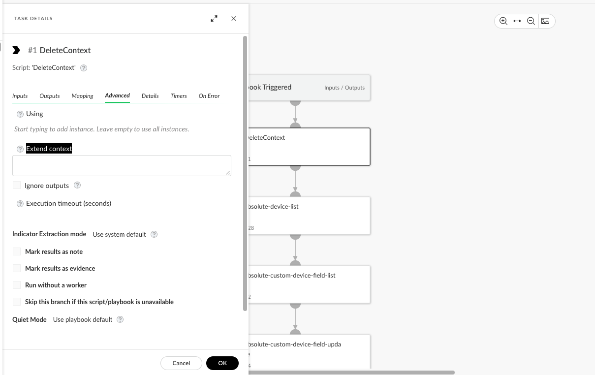

This guide provides common troubleshooting steps. When reporting an issue to Cortex XSOAR Support, always include all information obtained from running the following troubleshooting steps.

## Integration configuration

**Note**: This is a general integration configurations troubleshooting section. note that some integration also have a integration-specific troubleshooting guide.

### Seeing an error during test module execution

#### Docker Error

Docker timeout: A timeout error indicates a run that exceeded the timeout configured for the docker container.

1. Make sure Docker/Podman is installed on your machine (on-prem).
2. Try raising the docker timeout configuration which can be done manually if you're using the on-prem version by setting the integrationScript.timeout server configuration (in minutes), or a support ticket if you're using Saas/XSIAM.

#### Api Error

In case of an API error, there are several ways to see them: debug-mode, debug-logs, sometimes the error will be printed in the war room. Check the error received and try to see if it explains the issue:

##### Common HTTP codes

- 400: Bad request, double-check filters & arguments.
- 401/403: Usually means that authentication failed.
Permissions: Compare the permissions required by the integration in Cortex to what the user has configured in his 3rd party product. If the integration does not mention specific permissions, check the 3rd party API documentation.
Authentication: Re-check authentication parameters (credentials, IDs, etc), and try to re-configure them. Some integrations require different authentication flow, make sure to check the integration docs and verify you have covered the correct flow.
Authorization: Some integrations require several manual steps to authenticate the instance, double check if any special action is required.
- 404: Item not found, double-check the resource you were looking for exit in the 3rd party UI.
- 429: Rate limit - too many requests were issued by the user to the server. Try to wait the expected amount of time.
- 500: Internal server error usually implies the server was unable to process the request - Try to wait a few minutes before attempting to execute again, sometimes issues with the 3rd party server will pass after several minutes. If the issue persists, download the debug log and try to run the Curl mentioned in the debug log from post man. If the issues reproduced when running the Curl, contact the 3rd part provider. If not, try to make sure integration-specific parameters are entered correctly and are well formatted.

#### Python error

If you're seeing a traceback that indicates a syntax error:

1. Try upgrading the integration to the latest version.
2. As a temporary solution, you can detach and fix the issue until an official release is out (XSOAR only).

#### Networking error

##### How to find network issues

To find network issues, you can use the HttpV2 script using a simple request to see if it passed through.
Note that this part is only relevant for XSOAR on-prem.
Examples of common errors indicating that there probably is a networking issue:

* `[Errno -2] Name does not resolve`
* `[Errno 110] Operation timed out`
* `Failed to establish a new connection: [Errno -3] Try again`
* `dial tcp: lookup ****: no such host`
* `connect: operation timed out`
* `connect: connection refused`
* `ERR_CONNECTION_REFUSED`

When troubleshooting networking issues, it is important to first understand what type of networking the integration or automation is using. Cortex XSOAR integrations and automations can be classified into two main types regarding their networking use:

##### Host Based Networking

If the integration/automation is using HTTP-based communication, we recommend first testing locally using the `curl` utility to verify that it is possible to perform network communication with the HTTP endpoint. Run the `curl` command on the server or engine machine by logging in via SSH:

```bash
# Run simple curl command with -v for verbose output:
curl -v https://httpbin.org/status/200
```

If you are not able to perform a basic `curl` request from the machine to the target HTTP endpoint, the issue is probably not a problem with the integration/automation but rather with the networking setup of the server/engine machine. Make sure to first resolve the networking issue so a basic `curl` command succeeds before continuing to test the integration/automation. Many times this resolves to a firewall, NAT or proxy issue.

##### Docker Based Networking

Docker Based integrations/automations are written in Python or Powershell. They can be identified by inspecting the integration/automation settings and under *Language type* will appear **Python** or **Powershell**. Docker creates its own networking, therefore the integrations/automations use a different networking stack from the Cortex XSOAR server/engine. The source IP addresses for these integrations/automations are different and provided according to the Docker networking configuration.

For integrations/automations that use HTTP endpoints we recommend testing with `curl` from within a Docker container as a first step. This can be done by logging in to the server/engine machine via SSH and running the following command:
```bash
docker run -it --rm demisto/netutils:1.0.0.6138 curl <curl parameters>
```
For example:
```bash
# Run simple curl command with -v for verbose output:
docker run -it --rm demisto/netutils:1.0.0.6138 curl -v https://httpbin.org/status/200
```

**Note**: You may need to run `docker` with `sudo` or login with root if your user doesn't have sufficient permissions to execute the `docker` command.

If running `curl` from within `docker` fails with networking errors, we recommend checking if the `curl` command succeeds or fails without `docker` by running the `curl` command directly on the host machine. If the `curl` command succeeds on the host machine and fails within Docker, you are probably experiencing a Docker networking issue due to how the Docker networking stack is configured.

##### Read Timeout

In case you encounter a *ReadTimeout* error, such as `ReadTimeout: HTTPSConnectionPool(host='www.google.com', port=443): Read timed out. (read timeout=10)`, it means that the server (or network) failed to deliver any data within 10 seconds. This might be due to a large response size.

We support controlling the read timeout value via server advanced configuration, as follows:

* System wide

  Key | Value
  --- |  ----
  `python.pass.extra.keys` | `--env=REQUESTS_TIMEOUT=<TIMEOUT>`

* Per Integration

  Key | Value
  --- |  ----
  `python.pass.extra.keys` | `--env=REQUESTS_TIMEOUT.<INTEGRATION-ID>=<TIMEOUT>`

Examples:

* Set the read timeout value to *120* seconds system wide, `--env=REQUESTS_TIMEOUT=120`
* Set the read timeout value to *75* seconds for the Palo Alto Networks WildFire v2 integration, `--env=REQUESTS_TIMEOUT.WildFire-v2=75`

**Note:** The `REQUESTS_TIMEOUT` settings only affects integrations which use the [BaseClient](https://XSOAR.pan.dev/docs/integrations/code-conventions#client-class) class from CommonServerPython.

##### TLS/SSL Troubleshooting

Examples of common errors indicating that there is an issue with trusting a TLS/SSL networking connection:

* `SSLCertVerificationError`
* `SSL_CERTIFICATE_VERIFY_FAILED`
* `SSL: CERTIFICATE_VERIFY_FAILED`
* `SSLError: certificate verify failed`

These errors are usually as a result of a server using an untrusted certificate or a proxy (might be transparent) that is doing TLS/SSL termination.

**Notes**

* Most integrations provide a configuration option of *Trust any certificate*, which will cause the integration to ignore TLS/SSL certificate validation errors. You can use this option to test the connection and verify that in fact the issue is certificate related.
* To trust custom certificates in Cortex XSOAR on-prem server or engines, follow the following [instructions](https://docs-cortex.paloaltonetworks.com/r/Cortex-XSOAR/6.14/Cortex-XSOAR-Administrator-Guide/Configure-Python-Docker-Integrations-to-Trust-Custom-Certificates).
* To trust custom certificates in Cortex XSOAR Saas server or engines, follow the following [instructions](https://docs-cortex.paloaltonetworks.com/r/Cortex-XSOAR/8/Cortex-XSOAR-Cloud-Documentation/Configure-Docker-integrations-to-trust-custom-certificates).
* To trust custom certificates in Cortex XSIAM server or engines, follow the following [instructions](https://docs-cortex.paloaltonetworks.com/r/Cortex-XSIAM/Cortex-XSIAM-Documentation/Configure-an-engine-to-use-custom-certificates).

for more information, refer to the [advanced networking troubleshooting guide](https://XSOAR.pan.dev/docs/reference/articles/advanced-networking-troubleshooting-guide#debug-mode)

## Fetch Data (Incidents/Events/Assets/Issues)

### Mismatch in numbers - duplications / missing data

In some cases there might be some discrepancy between the events being shown in the UI compare to the events being shown in the 3rd party app. In such cases it’s recommended to do the following:

1. Re-check the timezones of the events in the query - sometimes the time appears in the event in the UI is different than the one in the 3rd party due to time zone differences, ensure the times point to the same TZ.
2. Double check for any filter params in the configurations - sometimes the integration configuration will contain filter params - an open text/dropdown filter to a specific field optional values, etc.. if you see events missing in the UI, double check those events doesn’t match the existing filters in the integration configuration page. In particular, make sure the filter does not point to past time.
3. Make sure suspicious missing events cannot be found using their unique ID to search the incidents tab.

### Fetch mechanism stopped fetching new events

#### Check the fetch history

Check the [fetch history](#fetch-history) for the following:

1. Getting 500 errors from the API - Sometimes fetch mechanism can encounter temporary issues when calling the API, such issues will usually appear once or twice before getting back to fetch normally and will contain the 500 (internal server) error.
2. Error from the API related to malformed params - Sometimes an error can come up from the API informing us that there was an issue with the params passed as part of the request, this error usually occurs in integrations where there’s a free-text filter param that might be malformed, double check all params are correct and ensure the error message doesn’t point to such issue.
3. Getting 429 (rate limit) error - Some APIs have a rate limiter in their system configured to a certain value that might be reached. when getting 429 try to increase the fetch interval as it will result less calls in a certain amount of time, and raise the limit as it usually affect the number of calls due to the data being fetched in less time.

#### Reset last run

Sometimes the fetch mechanism is getting stuck on a certain request due to last_run issues. when failing to get new events, head to the instance configuration, and press the **reset last run** button at the bottom of the page.

### Getting aggregated delays / failing to get events without an error error

In case you’re having aggregated delays between the fetched events and the real time events or you suspect you're not getting new events although there's no error in the [fetch-history](#fetch-history).

1. Try to increase the limit parameter up to the its maximum (usually documented), ensure the fetch interval is set to the lowest, and in some integrations, the fetch attempts to fetch from multiple endpoints/entities. In that case, try to separate the integration instance into several instances each fetching from one endpoint/entity to maximize the productivity.
2. To identify a delay, turn off the instance for 5 minutes and check if events are still coming in or not.

### Missing fields when fetching

Double check there’s no pre-process rule for XSOAR by heading to settings > Object Setup > Incidents > Pre-Process Rules.
Or parsing rule for XSIAM that does that by heading to settings > Dataset management > Parsing rule.

## Integration Mirroring

### No changes are being mirrored at all for both sides

Double check the mirroring direction in the integration configuration page - mirroring can be: None, outgoing, incoming, or both.
Ensure all the parameters are configured as expected, the instance is indeed a fetching instance, the incident expected to be mirrored indeed came from that specific instance, the mirroring direction is configured, in case other fields such as tags or closing parameters also exist, ensure they’re configured if expected to be working.

### No incoming mirroring

There’s either an issue with connecting to the remote and retrieving the information from or there are issues with the mapper and updating the incident.

1. Try to run `get-remote-data` command from the specific incident’s war room. In case of success, that means there's something wrong with the modification detection, double check the integration configuration and search the log-bundle for any relevant errors.
In case of failure, try to add add the debug-mode=true and see if you get extra information about the issue (error, response code).
2. Try to ensure the issue is not related to the mapper, double check that the mapper is indeed configured and contains the expected field.

### No outgoing mirroring

There’s either an issue where the change is not detected in XSOAR/XSIAM side, or it is not received on the other side.

1. Ensure the issue is not with the modification mechanism, try to run update-remote-system command from the specific incident’s war room. You can also add the debug-mode=true to try and get extra information about the issue (error, response code).
2. Ensure the instance has  permissions to the remote

### Failing when working with custom mapper

1. Make sure the custom mapper has all the required mirroring incident fields - dbotMirrorDirection, dbotMirrorId, and dbotMirrorInstance. Ensure they are mapped correctly, you can use the [mirroring integration guide](https://XSOAR.pan.dev/docs/integrations/mirroring_integration) for further assistance.
2. Alternetvley, you can detach the original mapper and slowly step by step make the changes while testing each step until you manage to find the problem.

### Mirroring doesn’t work after switching to a new mapper in the integration configuration

When switching mappers after fetching incidents with a certain mappers, the incident may become unable to mirror due to missing fields. In that case, remove the incidents, refetch them, and try again.

### Mirroring doesn’t work for a specific field

1. Double check the field is mapped correctly in the mapper tab (show how to get there), ensure the right field in the response is mapped to the right field in the mapper.
2. Test the field for other kind of actions - sometimes mirroring is only supported for appending / editing a field and not removing, double check it doesn't work in any case, if it does work in some cases, then it's more likely a feature request.

## long-running server

### Getting 400 error code when trying to pull from the long-running server

Go to integrations configuration page, disable the integration for a few seconds, and re-enable it.

## Automations (command / playbook)

### Not seeing any task outputs

New playbooks are set to quiet-mode by default. Make sure to unquiet them.
Alteratively, you can set the extend output/context option.


### Failing to obtain value from previous task

Make sure the data type is configured as "From previous tasks" rather than "As value".

### Command is failing as part of the script / playbook

Double check the command execution from the CLI with the basic arguments, this should help you figure out if the issue is with the integration and the command itself, or there's some failure in the logic of the playbook/script flow.

## TIM

### Missing indicators in the threat intel page

Sometimes indicators that were fetched cannot be seen in the threat intel page, if you encounter such an issue, double-check the exclusion list by heading to settings > object setup > indicators > exclusion list, and ensure the indicator is not a part of the list.

### A mismatch between the number of fetched indicators and the number of new indicators in the threat intel page

Sometimes some of the fetched indicators are already known to the system. In that case, the existing indicator will be modified rather than recreated. You can double-check the number of new/omitted/modified indicators in the logs.
Example:

```bash
[TIM][Recorded Future Feed][Recorded Future Feed_hash] Feed fetch - createIndicators command - batch number 2 - processed 2000 indicators, 0 skipped, 100 modified, 144 new
```

### Failing to obtain indicators from 3rd party application using Taxii server

Ensure the issue is not related to the 3rd party, attempt to obtain the indicators using postman to make sure the searched URL is indeed correct.

### Connecting to ‘Generic export indicators’ takes a lot of time

Double check the parameters, if the ‘Use Legacy Queries’ parameter is checked and not needed, make sure to uncheck it. If the issue still persists, try to raise the ‘XSOAR Indicator Page Size’ parameter.

### Failing to connect to the ‘Generic export indicators’ service

Relevant for XSOAR Saas, make sure the XSOAR IP is whitelisted in the firewall, for more information, refer to [Enable-access-to-Palo-Alto-Networks-resources](https://docs-cortex.paloaltonetworks.com/r/Cortex-XSOAR/8/Cortex-XSOAR-Cloud-Documentation/Enable-access-to-Palo-Alto-Networks-resources).

### Getting 500 (internal server error) when attempting to connect to ‘Generic export indicators’

Double-check that the user & password configured are correct, incorrect credentials may throw 500 error. Also, note that the password is case-sensitive.

## Demisto-sdk

### Command seems to be missing argument / functionality

SDK commands does not include all kind of functionalities. Sometimes what seems to be a bug is actually a feature request. Double check the documentation using `demisto-sdk <command-name> --help` to ensure there's indeed something that doesn't work.

### General issues with running a command

Check for newer versions.
To update to a specific version run

```bash
pip install demisto-sdk==x.y.z
```

To update to the latest version run

```bash
pip install demisto-sdk --upgrade
```

### SDK environment and installation have issues

1. Make sure all condition are met in "Prerequisite" section in [Install Demisto SDK|https://docs-cortex.paloaltonetworks.com/r/1/Demisto-SDK-Guide/Install-Demisto-SDK].
2. Make sure all condition are met in [Environment variables setup|https://docs-cortex.paloaltonetworks.com/r/1/Demisto-SDK-Guide/Environment-variables-setup].
For more information, refer to the [official demisto-sdk docs.|https://docs-cortex.paloaltonetworks.com/r/1/Demisto-SDK-Guide]

### Executing VS code command doesn’t work

1. errors related to vs code, the error will usually pop up at the bottom-right of the screen and will be informative. Try to follow the error and solution.
2. errors related to the demisto-sdk, the issue will usually appear in the terminal with traceback to demisto-sdk code. To ensure the issue is with demisto-sdk, you can try and manually execute the command from the terminal and see if the issue still occur.
For more information about the VS Code extension, refer to the official [docs](https://XSOAR.pan.dev/docs/concepts/vscode-extension)

### Setup integration/script environment fails in vs code extension

Make sure docker is up and running, make sure that Allow the default docker socket to be used (required password) is enabled in Docker advanced settings.
If docker is up and running and the issue still occur.
1. [clean up the docker](https://docs.docker.com/engine/manage-resources/pruning/)
2. [sign in to docker](https://www.docker.com/blog/seamless-sign-in-with-docker-desktop-4-4-2/)
3. [avoid rate limit](https://docs.docker.com/docker-hub/usage/#:~:text=Pull%20rates%20limits%20are%20based,to%205000%20pulls%20per%20day.)
4. Ensure the command was triggered on the integration / script itself by right click the code file > choosing setup integration/script environment. In this case a message saying "Please run this from an integration or script directory". will pop up.

## Troubleshooting tools

### Debugging

#### Debug Mode

Cortex XSOAR (Server 5.0+) supports running Python integration commands and automation scripts in `debug-mode` from the Cortex XSOAR CLI. When a command is run in `debug-mode` a log file of the command execution will be created and attached to the war room. When encountering an issue which is related to an integration or an automation, make sure to reproduce the command with `debug-mode` and inspect the generated log file. The `debug-mode` log file will contain information not available in the Server logs and can provide additional insights regarding the root cause of the issue. Additionally, some integrations have specific code to include extra debug info when run in `debug-mode`.

:::caution Important Note
The debug mode feature prints extended data from an integrations configuration and settings which may include sensitive information. Before sharing the generated log files, make sure sensitive information has been removed.
:::

##### Run a command in `debug-mode`

In the Cortex XSOAR CLI run the command with all arguments that cause the issue and append the following argument: `debug-mode=true`. For example:

```
!ad-search filter="(cn=Guest)" debug-mode=true
```

Screenshot of running a command with `debug-mode=true` and the resulting log file (`ad-search.log`):


#### Test Integration Module in `debug-mode`

Starting with Cortex XSOAR 6.2 when you `Test` an integration module and it fails, you can download from the integration configuration dialog a `debug-mode` full report by following the link: **Run advanced test and download a full report**. Example screenshot:


If you require a `debug-mode` log when the `Test` from the integration configuration dialog succeeds, it is possible to run the test integration module command from the Cortex XSOAR CLI with `debug-mode=true`. This is done by issuing a command of the form:

```
!<instance_name>-test-module debug-mode=true
```

For example for an integration instance name of: `Cortex_XDR_instance_1` run the following from the CLI:

```
!Cortex_XDR_instance_1-test-module debug-mode=true
```

**Note:**

- If the instance name contains spaces, replace the space with an underscore (`_`).
- The "Do not use by default" checkbox should be unchecked on the integration instance you are testing.

Screenshot of running a `test-module` command with `debug-mode=true` and the resulting log file (`test-module.log`):


#### Fetch Incidents in `debug-mode`

Starting with Cortex XSOAR 6.0 it is possible to run the fetch incidents command from the Cortex XSOAR CLI with `debug-mode=true`. This is done by issuing a command of the form:

```
!<instance_name>-fetch debug-mode=true
```

For example for an integration instance name of: `Cortex_XDR_instance_1` run the following from the CLI:

```
!Cortex_XDR_instance_1-fetch debug-mode=true
```

**Note:** if the instance name contains spaces, replace the space with an underscore (`_`).

Screenshot of running a `fetch` command with `debug-mode=true` and the resulting log file (`fetch-incidents.log`):


#### Integration Debug Logs

:::caution Important Note
The Integration Debug feature prints extended data from an integrations configuration and settings which may include sensitive information. Before sharing the generated **Integration-Instance** log files, make sure sensitive information has been removed.
:::
Starting with version 6.2, it is possible to create logs for an instance of an integration in order to get debug information for a specific instance over a period of time. 

This mode is especially useful for long running integrations such as EDL or TAXII-Server. It helps troubleshooting when it is not possible to run the desired command in `debug-mode` from the playground. Whether it is a long running integration, or the issue occurs from time to time such as with the ***fetch-incidents*** command.

For example, if you have an integration instance running the ***fetch-incidents*** command, and the integration misses some of the incidents, you may want to get debug level information for each ***fetch-incidents*** command (or any other command executed by this instance) even if the server log level is set to *Info*. If you move the server log level to *Debug*, the server log would contain a lot of irrelevant information for integration troubleshooting. For this reason, the *Log Level* configuration parameter was added to the integration configuration.

There are three options for this parameter:
- Off
- Debug
- Verbose


In Debug mode, the server will run all the commands of this instance with a *Debug* log level and log the information in the **Integration-Instance** log.

In Verbose mode, additional information such as connections coming off device handling, the raw response, and all parameters and headers are logged in addition to the debug level information.
For example, if an integration fails and the instance log level is *Debug*, the **Integration-Instance** log will contain the error stack trace. If the log level is *Verbose*, the **Integration-Instance** log will contain the error stack trace, but also a copy of the HTTP request, the parameters used in the integration, what the response was, etc.

By default, the *Log Level* configuration parameter is set to *Off*.

The **Integration-Instance.log** is located in  `/var/log/demisto/`.

These log level modes are only for the configured instance and do not affect the log for the entire server.

Note that the log level configuration for an integration instance may affect performance of the integration instance, therefore use this feature only for troubleshooting and set it to Off when you have the required information in the log.

### Reverting a Pack to a Previous Version

If you encounter an issue after upgrading a Pack, you can revert to a previous version by going to *Installed Content Packs* -> *Pack Name* -> *Version History* and choosing *Revert to this version*. Sample screenshot:


### Fetch History

It is possible to observe the results of the last **fetch-incidents**/**fetch-indicators**/**fetch-events** runs using the Fetch History modal. To view the modal, click the button with the history icon next to the Integration Instance settings.
</img>

The following fields are stored for each record:

1. **Pulled At** - The date and time the fetch run was completed.
1. **Duration** - The length of time the fetch run took to complete.
1. **Last Run** - The contents of the last run object.
1. **Message** - Depending on the fetch run status, will be one of the following:
   - If successfully finished, how many Incidents/Indicators were pulled or dropped. If nothing was pulled or dropped, the message will be "Completed".
   - In case of an error, the error details.
   - In long-running integrations, the info/error message forwarded to `demisto.updateModuleHealth()`. The *is_error* boolean argument of this method determines the message type.
1. **Source IDs** - If available, displays the incident IDs as they appear in the 3rd-party product. The IDs are collected from incidents that contain the `dbotMirrorId` field.
   Note: the `dbotMirrorId` field should be determined at the integration level rather than the mapping level.

#### Server Configurations (for XSOAR on-prem)

| Key | Description | Default Value |
| --- | --- | --- |
| **fetch.history.size** | The amount of records stored for every instance. | 20 |
| **fetch.history.enabled** | Whether or not the feature is enabled. | true |

### Troubleshoot pack

[The pack](https://cortex.marketplace.pan.dev/marketplace/details/Troubleshoot/) contains multiple automatons and playbook to run in the UI to help you troubleshoot and find various issues.
