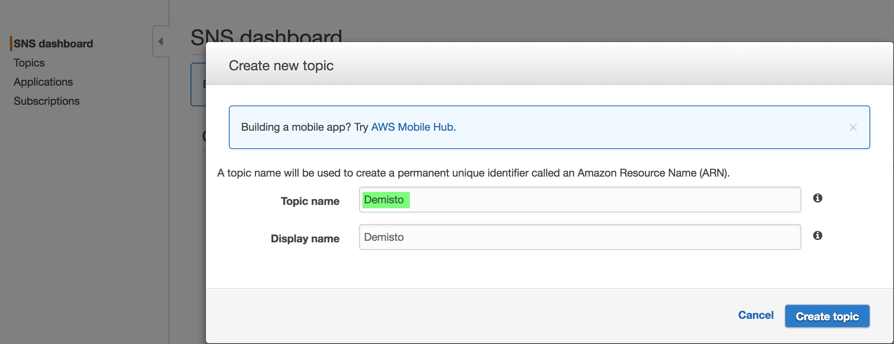
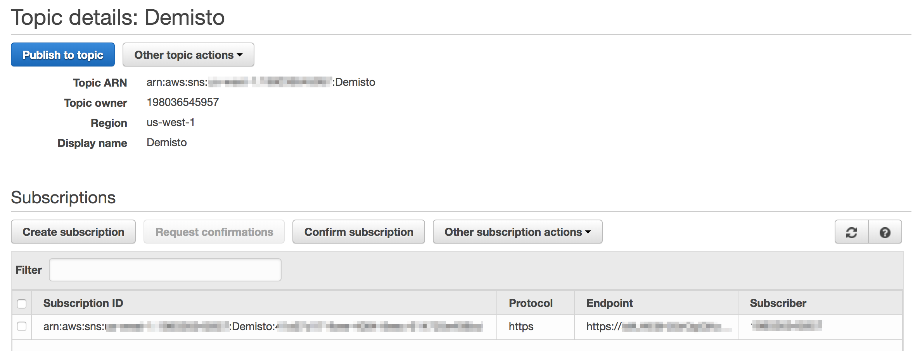
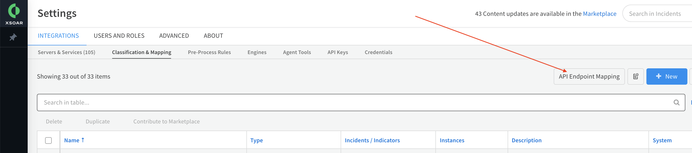
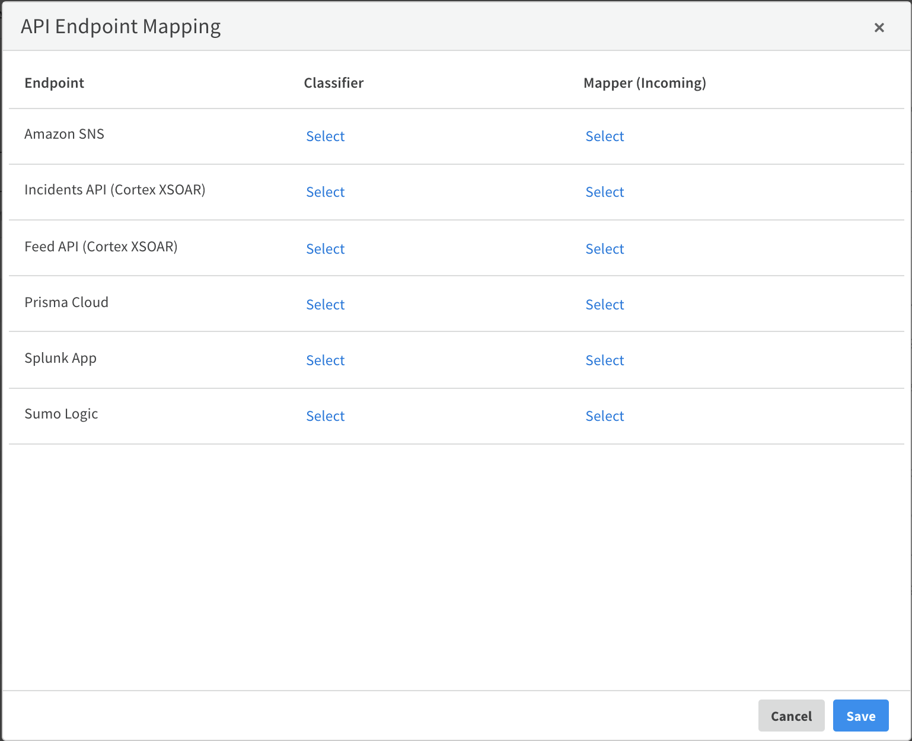

You can send Amazon SNS notifications and alerts from all SNS-supported AWS services to XSOAR using HTTPS, to
 automatically create  incidents from the notifications and alerts according to how you map and classify them.

Alerts and notifications are received in near real-time and are not pooled.

## Prerequisites

* Verify that your XSOAR server HTTPS endpoint (port 443) has inbound access to Amazon Web Services.
* Server certificates must be signed by a Certificate Authority (CA) that Amazon supports. For a list of supported CAs that Amazon supports, see the [Amazon documentation](https://docs.aws.amazon.com/sns/latest/dg/SendMessageToHttp.https.ca.html).

## Configure AWS SNS to Send Notifications to Cortex XSOAR

1.  Log in to your AWS console and select the SNS service.
2.  Click **Create topic**.  
    
    * In the **Topic name** field, type a meaningful name for the topic.
    * In the **Display name** field, type a meaningful display name for the topic.
    
    
3.  Create a new subscription for the topic you created.  
    
    * From the **Protocol** drop-down menu, select **HTTPS**.
    * In the **Endpoint** field, type the following URL with your server details: `[https://<demisto-api-key>@<demisto-server-url>/incident/aws/sns](https://@/incidents/aws/sns)`To create the Demisto API key, navigate to **Settings** \> **Integrations** \> **API Keys**.
    * Click **Create Subscription** and wait a few seconds for the XSOAR server to approve the subscription request.
   
    
## Configure Classification and Mapping for Incoming AWS SNS Events
To configure classification and mapping for incoming AWS SNS events:
* Navigate to **Settings** \> **Classification and Mapping** \> **API Endpoint Mapping**.
* Select a **Classifier** and  **Mapper (Incoming)** for *Amazon SNS*.
* Save the settings.

