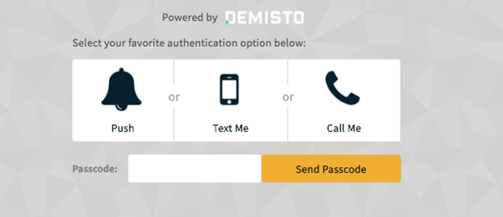

:::note
This integration supports Cortex XSOAR 6x only.
:::

Integrating with Duo to enables using a number of Duo commands in Demisto.

**duo-authenticate:**

The /auth endpoint performs second-factor authentication for a user by sending a push notification to the user's smartphone app, verifying a passcode, or placing a phone call. It is also used to send the user a new batch of passcodes via SMS.

**duo-authenticate-status:**

The /auth_status endpoint "long-polls" for the next status update from the authentication process for a given transaction. That is to say, if no status update is available at the time the request is sent, it will wait until there is an update before returning a response.

**duo-check:**

The /check endpoint can be called to verify that the integration and secret keys are valid, and that the signature is being generated properly.

**duo-preauth:**

The /preauth endpoint determines whether a user is authorised to log in, and (if so) returns the user's available authentication factors.

In addition, from version 3.1, you can use the Duo integration to enable two factor authentication to Demisto. See
 the [**Two Factor Authentication with Duo**](#two-factor-authentication-with-duo-v31-and-up) section.

### To set up the integration on Demisto:

1.  Go to **Settings > Integrations > Servers & Services**
2.  Locate the **DUO** integration by searching for it using the search box on the top of the page.
3.  Click **Add instance** to create and configure a new instance for the integration. You should configure the following DUO and Demisto-specific settings:
    *  __Name:__ A textual name for the integration instance.     
    *  __API hostname:__ Match to setting in Duo. 
    *  __Integration key:__ Match to setting in Duo.
    *  __Secret key:__ Match to setting in Duo.
    *  __User agent:__ Match to setting in Duo.
    *  __API Timeout:__ Match to setting in Duo.
    *  __Use system proxy settings:__ Match to setting in Duo.
    *  __Use Duo 2FA to login to Demisto:__ Used to activate Duo two factor authentication. See the [Two Factor Authentication with Duo](#two-factor-authentication-with-duo-v31-and-up) section for more information.
    *  __Do not validate server certificate:__ Select in case you wish to circumvent server certification validation. You may want to do this in case the server you are connecting to does not have a valid certificate.
    *  __Use system proxy settings:__ Specify whether to communicate with the integration via the system proxy server or not.
    *  __Demisto engine:__ If relevant, select the engine that acts as a proxy to the IMAP server.
        
        Engines are used when you need to access a remote network segments and there are network devices such as proxies, firewalls, etc. that prevent the Demisto server from accessing the remote networks. 
        For more information on Demisto engines see:  
        [https://docs.paloaltonetworks.com/cortex/cortex-xsoar/6-0/cortex-xsoar-admin/engines](https://docs.paloaltonetworks.com/cortex/cortex-xsoar/6-0/cortex-xsoar-admin/engines)
    *  __Require users to enter additional password:__ Select whether you’d like an additional step where users are required to authenticate themselves with a password.

4.  Press the ‘Test’ button to validate connection with ArcSight ESM.  
      
    If you are experiencing issues with the service configuration please contact Demisto support at support@demisto.com.  
          
5.  After completing the test successfully, press the ‘Done’ button.

### Two Factor Authentication with Duo (v3.1 and up):

:::note
This section is relevant for versions 3.1 and up only.
:::

Demisto supports integrating with Duo to enable two factor authentication to Demisto.

Accessing Demisto using Duo two factor authentication is as follows:

Factor 1. Enter the Demisto username and password.

Factor 2. The following options will appear:
* Push: Use the Duo Push app to ‘Approve’ access to Demisto.
* Test Me: A text message will be sent with a code.
* Call Me: The user will receive a phone call to approve access to Demisto.

The process of setting this up involves setting up your users in Duo and then integrating to your Duo account.

**To set up this option in Duo**

In order to setup using Duo with Demisto you will need to have a Duo account and to set up an application to be used as a gateway for Demisto to communicate with Duo.  
You can find additional information in [Duo getting started](https://duo.com/docs/getting_started).

1. Open a Duo account.

2. Create a Duo application by doing the following in Duo:

    a. Open Applications
    
    b. Click **Protect an Application** and locate Auth API in the applications list.
    
    c. Click **Protect this Application** to get your integration key, secret key, and API hostname. Make sure to record these as they will be used in Demisto to configure a Duo instance.

**Important!** Make sure to have at least one user, such as admin, that does not use two factor authentication, so that you are not locked out of Demisto.

Demisto supports Duo two factor authentication options of Push, Text Me and Call Me (see above).

**Note:** If using the Duo Push option where you authenticate using an installed app, it is important to note that you will need to verify the phone with the duo application. If you do not authenticate the app in the duo platform the push factor will not work.

**In Demisto:**

1.  Go to the Duo Integration (under Settings > Integrations > Servers & Services).
2.  Mark the option **Use Duo 2FA to login to Demisto** to activate using Duo two factor authentication. **Do not validate server certificate**: Select in case you wish to circumvent server certification validation. You may want to do this in case the server you are connecting to does not have a valid certificate.  
    
    **Important**: Before marking this option make sure that you have a safe account (such as admin) not associated to Duo so that you are not locked out of Demisto
    
3.  After completing the test successfully, press the ‘Done’ button.
