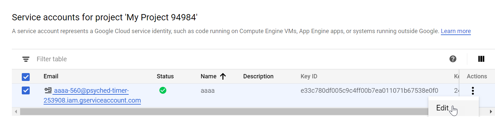
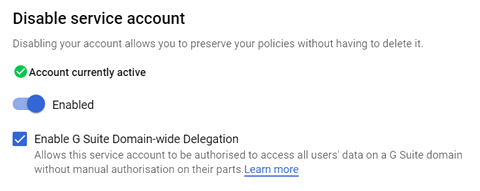
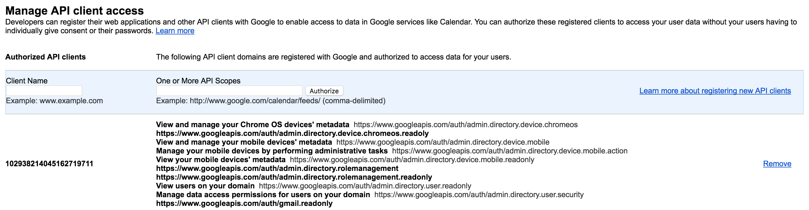
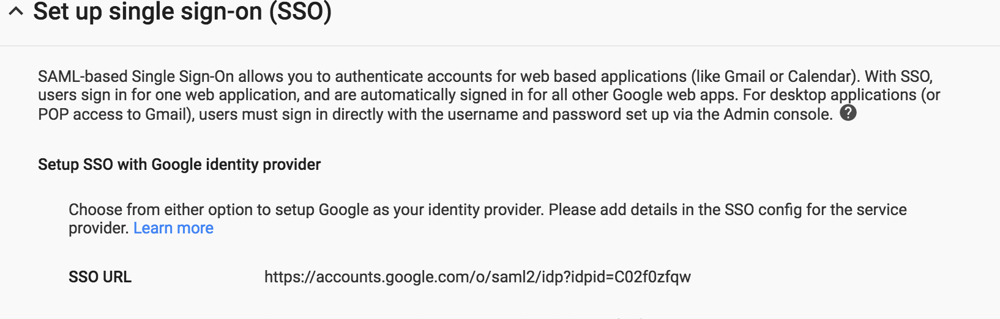
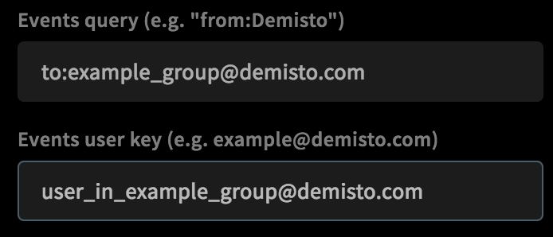

Use the GoogleApps API and G Suite integration to help administrators migrate to G Suite, create custom usage reports, and manage users, groups, and devices.

**NOTE**: The `googleapps-gmail` commands are deprecated, to execute Gmail commands, use the [Gmail integration](https://xsoar.pan.dev/docs/reference/integrations/gmail).

* * *

## Prerequisites

There are several procedures you have to perform in Google before configuring the integration on Demisto.

*   [Get a New Private Key](#get-a-new-private-key)
*   [Delegate Domain-wide Authority to Your Service Account](#delegate-domain-wide-authority-to-your-service-account)
*   [Get an Immutable Google Apps ID](#get-an-immutable-google-apps-id-parameters)

* * *

### Get a New Private Key

1.  Access your [Google Service Account](https://console.developers.google.com/projectselector/iam-admin/serviceaccounts%C2%A0).
2.  In the IAM & admin section select **Service accounts**.
3.  If you need to create a new project, click **CREATE** do the following:
    1.  In the **New Project** window, type a project name, select an organization from the drop-down list  and then select a location. 
    2.  Click **CREATE**.
4.  In the Service accounts section, click **Create Service Account**.
5.  In the **Create service account** window, type a name for the service account, add a description and then click **CREATE**.
6.  Click **Continue.**
7.  In the **Create key** section, click **CREATE KEY**.
8.  Select Key type **JSON** and click **CREATE**.
9.  Click **DONE**.
    
    A key pair is generated and automatically downloads.
    
10. In the **Actions** column, select the service and then click **edit**.
    
    
    
11. Under the show domain wide delegation, select **Enable G Suite Domain-wide Delegation**.
    
    
    
     NOTE: Copy the value of the Unique ID for the client name in step 2 in [Delegate Domain-wide Authority to Your Service Account](#h_55847897541534851652027).  
    
12. Click Save.
13. In the top search bar, search for _admin sdk_.
14. Click **Enable**.

### Delegate Domain-wide Authority to Your Service Account

1.  Access the [Google Administrator Console](http://admin.google.com/).
2.  Enter a client name and paste the following into the `One or More API Scopes` textbox.  
    
    ```
    https://www.googleapis.com/auth/gmail.settings.basic,https://www.googleapis.com/auth/admin.directory.user,https://www.googleapis.com/auth/admin.directory.device.mobile.action,https://www.googleapis.com/auth/admin.directory.device.mobile.readonly,https://www.googleapis.com/auth/gmail.modify,https://www.googleapis.com/auth/gmail.settings.sharing,https://www.googleapis.com/auth/gmail.send,https://www.googleapis.com/auth/gmail.modify,https://www.googleapis.com/auth/admin.directory.device.chromeos,https://www.googleapis.com/auth/admin.directory.user.readonly,https://www.googleapis.com/auth/admin.directory.user.security,https://www.googleapis.com/auth/admin.directory.rolemanagement,https://www.googleapis.com/auth/admin.directory.rolemanagement.readonly,https://www.googleapis.com/auth/gmail.readonly,https://mail.google.com,https://www.googleapis.com/auth/gmail.compose
    ```
    
    
    

##### GSuite API scopes

|     |     |     |
| --- | --- | --- |  
| API Scope | Description | Demisto command |
| `https://mail.google.com` | Reads, composes, sends, and permanently deletes all of the user's emails from Gmail. | <ul><li>gmail-get-autoreply</li></ul> |
| `https://www.googleapis.com/auth/`<br/>`admin.directory.device.chromeos` | Views and manages Chrome OS devices' metadata. |<ul><li> googleapps-chrome-device-action</li><li> googleapps-get-chrome-devices-for-user </li><li> googleapps-device-action</li><li> googleapps-get-devices-for-user</li> </ul>|
| `https://www.googleapis.com/auth/`<br/>`admin.directory.device.mobile.action` | Manages mobile devices by performing administrative tasks. |  <ul><li>googleapps-chrome-device-action </li><li> googleapps-get-chrome-devices-for-user  </li><li> googleapps-device-action </li><li> googleapps-get-devices-for-user </li></ul>|
| `https://www.googleapis.com/auth/`<br/>`admin.directory.device.mobile.readonly` | Views the metadata of a mobile device. | <ul><li> googleapps-chrome-device-action </li><li> googleapps-get-chrome-devices-for-user </li><li> googleapps-device-action </li><li> googleapps-get-devices-for-user </li></ul>|
| `https://www.googleapis.com/auth/`<br/>`admin.directory.rolemanagement` | Manages delegated administration roles for the user's domain. | <ul><li> gmail-get-user-role </li><li> gmail-revoke-user-roles </li></ul>|
| `https://www.googleapis.com/auth/`<br/>`admin.directory.rolemanagement.readonly` | Views delegated administration roles for the user's domain. | <ul><li> gmail-get-user-role </li></ul>|
| `https://www.googleapis.com/auth/`<br/>`admin.directory.user` | Enables full user management. | <ul><li> gmail-hide-user </li><li> gmail-set-user-password </li><li> gmail-create-user </li><li> gmail-delete-user </li></ul>|
| `https://www.googleapis.com/auth/`<br/>`admin.directory.user.readonly` | Views users on your domain. | <ul><li> gmail-list-users </li><li> gmail-get-user </li><li> gmail-search-all-mailboxes</li></ul> |
| `https://www.googleapis.com/auth/`<br/>`admin.directory.user.security` | Manages data access permissions for users on your domain. | <ul><li> gmail-get-user-tokens </li></ul>|
| `https://www.googleapis.com/auth/`<br/>`gmail.compose` | Sends a message on behalf of a user. | <ul><li> send-mail </li></ul>|
| `https://www.googleapis.com/auth/`<br/>`gmail.modify` | Views and modifies but not deletes email. | <ul><li> gmail-get-autoreply </li><li> gmail-move-mail </li><li> gmail-move-mail-to-mailbox </li><li> gmail-delete-mail </li></ul>|
| `https://www.googleapis.com/auth/`<br/>`gmail.readonly` | Views email messages and settings. | <ul><li> gmail-get-autoreply </li><li> gmail-search </li><li> gmail-search-all-mailboxes </li><li> gmail-get-mail </li><li> gmail-get-attachments </li><li> gmail-get-thread </li><li> fetch-incidents </li></ul>|
| `https://www.googleapis.com/auth/`<br/>`gmail.send` | Sends an email on behalf of someone else. | <ul><li> send-mail </li></ul>|
| `https://www.googleapis.com/auth/`<br/>`gmail.settings.basic` | Manages basic mail settings. | <ul><li> gmail-get-autoreply </li><li> gmail-set-autoreply </li><li> gmail-add-filter </li><li> gmail-add-delete-filter </li><li> gmail-list-filters </li><li> gmail-remove-filter </li></ul>|
| `https://www.googleapis.com/auth/`<br/>`gmail.settings.sharing` | Manages sensitive email settings, including who can manage emails. | <ul><li> gmail-delegate-user-mailbox </li><li> gmail-remove-delegated-mailbox </li></ul>|

### Get an Immutable Google Apps ID Parameters

In order to revoke/fetch a user role, you need an Immutable Google Apps ID param.

1.  Open [https://admin.google.com](https://admin.google.com/) (as in step 2).
2.  Navigate to **Security** > **Set up single sign-on (SSO)**.  
    The SSO URL is the Immutable Google Apps ID.
3.  Record the SSO URL, which is the Immutable Google Apps ID, and copy it for later use.  
    
    
    

* * *

## Configure the GoogleApps (GSuite) Integration on Demisto

1.  Navigate to **Settings** \> **Integrations** \> **Servers & Services**.
2.  Search for GoogleApps API.
3.  Click **Add instance** to create and configure a new integration instance.  
    * **Name**: a textual name for the integration instance.
    * **Service account private key file content (JSON):** Paste the Service account JSON you generated in the Google console, which includes the JSON key. The JSON might be long, so you can expand the text box.
    * **Email of user with admin capabilities** \- Enter the email address of the user that you set admin capabilities for.
    * **Immutable Google Apps ID:** Only the Cxxxxxxxx, section is needed.
    * **Import emails as incidents**: Automatically creates Demisto incidents from received emails.
    * **Events query** \- Use this to filter out the fetched messages.  
        The query language follows the Gmail query specification example: "from:someuser@example.com rfc822msgid:&lt;somemsgid@example.com&gt; is:unread". For more information, read the [Gmail Query Language documentation](https://support.google.com/mail/answer/7190?hl=en).
    * **Events user key**\- Use this to specify the email account to search for messages. By default, the integration uses the email address specified in the admin instance.  
        
        
        
    * **Incident type**
    * **Demisto engine**
4.  Click **Test** to validate the URLs and connection.

* * *

## Commands

You can execute these commands from the Demisto CLI, as part of an automation, or in a playbook. After you successfully execute a command, a DBot message appears in the War Room with the command details.

1.  [Perform an action on a Chrome device: googleapps-chrome-device-action](#perform-an-action-on-a-chrome-device)
2.  [Perform an action on a Google device: googleapps-device-action](#perform-an-action-on-a-google-device)
3.  [List all Chrome devices associated with a Google user: googleapps-get-chrome-devices-for-user](#list-all-chrome-devices-associated-with-a-google-user)
4.  [List all devices associated with a Google user: googleapps-get-devices-for-user](#list-all-devices-associated-with-a-google-user)
5.  [Get tokens for a Google user: googleapps-get-tokens-for-user](#get-tokens-for-a-google-user)
6.  [Get information for a Google user: googleapps-get-user](#get-information-for-a-google-user)
7.  [List all available Google roles: googleapps-get-user-roles](#list-all-available-google-roles)
8.  [Retrieve a Gmail message attachment: googleapps-gmail-get-attachment](#retrieve-a-gmail-message-attachment)
9.  [Retrieve a Gmail message: googleapps-gmail-get-mail](#retrieve-a-gmail-message)
10. [Search a user's Gmail records: googleapps-gmail-search](#search-a-users-gmail-records)
11. [List all Google user: googleapps-list-users](#list-all-google-user)
12. [Revoke a Google user's role: googleapps-revoke-user-role](#revoke-a-google-users-role)

* * *

### Perform an action on a Chrome device

Performs one of several actions on a Google Chrome device.

##### Base Command

`googleapps-chrome-device-action`

##### Input

|     |     |
| --- | --- |
| **Parameter** | **Description** |
| customerId | Unique identifier for the customer Google account. Use the !googleapps-get-user command to get this parameter. Default is _my_customer_. |
| action | Action to take on the Chrome OS device.  <ul><li> deprovision: Remove a device from management that is no longer active, being resold, or is being submitted for return/repair </li><li> disable: Disable a device from being used, helpful in cases when a device is lost or stolen. You can configure the device screen to display a message explaining how to return the device. </li><li> reenable: Re-enable a </li></ul>|
| resource-id | Unique ID the API service uses to identify the mobile device |
| token | Token for authentication and authorization |
| user-key | Identifies the user specified in the API request. The value can be the user's primary email address, alias email address, or unique user ID. |

##### Context Data

There is no context data for this command.

##### Raw Output

Action executed.

* * *

### Perform an action on a Google device

Performs one of several actions on a Google device.

##### Base Command

`googleapps-device-action`

##### Input

|     |     |
| --- | --- |
| **Parameter** | **Description** |
| customerId | Unique identifier for the customer Google account. Use the !googleapps-get-user command to get this parameter. Default is _my_customer_. |
| action | Action to take on the Chrome OS device.  <ul><li> admin\_account\_wipe: Remotely wipes only G Suite data from the device </li><li> admin\_remote\_wipe: Remotely wipes all data on the device </li><li> approve: Approves the device. If you selected Enable device activation, devices that register after the device activation setting is enabled require approval before they can begin syncing with your domain. Enabling device activation forces the device user to install the Device Policy app to sync with G Suite. </li><li> block: Blocks access to G Suite data (mail, calendar, and contacts) on the device. The user can still access their mail, calendar, and contacts from a desktop computer or mobile browser. </li><li> cancel\_remote\_wipe\_then\_activate: Cancels a remote wipe of the device and then reactivates the device </li><li> cancel\_remote\_wipe\_then\_block: Cancels a remote wipe of the device and then blocks the device </li></ul>|
| resource-id | Unique ID the API service uses to identify the mobile device |
| token | Token for authentication and authorization |
| user-key | Identifies the user specified in the API request. The value can be the user's primary email address, alias email address, or unique user ID. |

##### Context Data

There is no context data for this command.

##### Raw Output

Action executed.

* * *

### List all Chrome devices associated with a Google user

Lists all Google Chrome devices associated with a specified Google user.

##### Base Command

`googleapps-get-chrome-devices-for-user`

##### Input

|     |     |
| --- | --- |
| **Parameter** | **Description** |
| customerId | Unique identifier for the customer Google account. Use the !googleapps-get-user command to get this parameter. Default is _my_customer_. |
| action | Action to take on the Chrome OS device. <ul><li> admin\_account\_wipe: Remotely wipes only G Suite data from the device </li><li> admin\_remote\_wipe: Remotely wipes all data on the device </li><li> approve: Approves the device. If you selected Enable device activation, devices that register after the device activation setting is enabled require approval before they can begin syncing with your domain. Enabling device activation forces the device user to install the Device Policy app to sync with G Suite. </li><li> block: Blocks access to G Suite data (mail, calendar, and contacts) on the device. The user can still access their mail, calendar, and contacts from a desktop computer or mobile browser. </li><li> cancel\_remote\_wipe\_then\_activate: Cancels a remote wipe of the device and then reactivates the device </li><li> cancel\_remote\_wipe\_then\_block: Cancels a remote wipe of the device and then blocks the device </li></ul>|
| resource-id | Unique ID the API service uses to identify the mobile device |
| token | Token for authentication and authorization |
| user-key | Identifies the user specified in the API request. The value can be the user's primary email address, alias email address, or unique user ID. |

##### Context Data

```
Device:[{
        "BootMode": "",
        "ActiveTimeRanges":"",
        "recentUsersEmails":"",
        "recentUsersTypes":"",
        "AnnotatedAssetId":"",
        "OrgUnitPath": "",
        "AnnotatedLocation":"",
        "EthernetMacAddress":"",
        "FirmwareVersion":,
        "DeviceId":"",
        "LastEnrollmentTime":"",
        "Meid":"",
        "Notes": "",
        "OrderNumber": "",
        "Kind":"",
        "PlatformVersion":"",
        "SerialNumber": "",
        "Model":"",
        "SupportEndDate":"",
        "OsVersion":"",
        "Status":"",
        "MacAddress":"",
        "LastSync":""
    }
]
```

##### Raw Output
```
{
  "kind": "directory#chromeosdevices",
  "chromeosdevices": [
     {
       "kind": "directory#chromeosdevice",
       "deviceId": "deviceId value",
       "serialNumber": "device serialNumber",
       "status": "ACTIVE",
       "lastSync": "2013-03-05T17:30:04.325Z",
       "supportEndDate": "2014-04-05T17:30:04.325Z",
       "annotatedUser": "help desk",
       "annotatedLocation": "Mountain View help desk Chromebook",
       "annotatedAssetId": "1234567890",
       "notes": "Loaned from support",
       "orderNumber": "1234",
       "willAutoRenew": true,
       "osVersion": "Browser Version 18.0",
       "platformVersion": "Platform Version 1415.2.0",
       "firmwareVersion": "Firmware Version 1.2.3.4",
       "bootMode": "validated",
       "lastEnrollmentTime": "2012-04-05T17:30:04.325Z",
       "orgUnitPath": "corp/engineering"
     },
     {
       "kind": "directory#chromeosdevice",
       "deviceId": "deviceId value",
       "serialNumber": "device serialNumber",
       "status": "SHIPPED",
       "supportEndDate": "1404457200000",
       "model": "model value",
       "meid": "meid value",
       "macAddress": "macAddress value",
       "orderNumber": "1234",
       "willAutoRenew": true
     }
  ],
  "nextPageToken": "nextPageToken value"
}
```
* * *

### List all devices associated with a Google user

Lists all devices associated with a specified Google user.

##### Base Command

`googleapps-get-devices-for-user`

##### Input

|     |     |
| --- | --- |
| **Parameter** | **Description** |
| query | String to search for, enclosed in parentheses "". For more information, see the [Google documentation](https://developers.google.com/admin-sdk/directory/v1/guides/search-users). |
| customerId | Unique identifier for the customer Google account. Use the !googleapps-get-user command to get this parameter. Default is _my_customer_. |

##### Context Data
```
Device:[
    {
    "Applications": "",
    "DevicePasswordStatus":"Off",
    "Os":"Android 6.0.0",
    "DeviceCompromisedStatus":"No compromise detected",
    "Brand":,
    "Imei": "",
    "Hardware":"bullhead",
    "ResourceId":,
    "Model":,
    "Name":[
        "example example"
    ],
    "DeviceId":,
    "Status":"APPROVED",
    "BootloaderVersion": ,
    "Application Permissions": "",
    "Kind":"admin#directory#mobiledevice",
    "BuildNumber":,
    "Applications Versions": "",
    "DefaultLanguage":"English",
    "WifiMacAddress":"",
    "Type":"ANDROID",
    "KernelVersion":,
    "Packges":"",
    "Email":"example@demisto.com,example@demisto.com.test-google-a.com",
    "SerialNumber":
    }
]
```

##### Raw Output
```
{
    "etag": "",
    "kind": "admin#directory#mobiledevices",
    "mobiledevices": [
        {
            "basebandVersion": "",
            "bootloaderVersion": "",
            "brand": "",
            "buildNumber": "",
            "defaultLanguage": "",
            "deviceCompromisedStatus": "",
            "deviceId": "",
            "devicePasswordStatus": "",
            "email": [
                ""
            ],
            "encryptionStatus": "",
            "etag": "",
            "firstSync": "",
            "hardware": "",
            "hardwareId": "",
            "kernelVersion": "",
            "kind": "",
            "lastSync": "",
            "managedAccountIsOnOwnerProfile": "",
            "manufacturer": "",
            "model": "",
            "name": [
                ""
            ],
            "os": "",
            "privilege": "",
            "releaseVersion": "",
            "resourceId": "",
            "securityPatchLevel": "",
            "serialNumber": "",
            "status": "",
            "supportsWorkProfile": "",
            "type": "",
            "userAgent": ""
        }
    ]
}
```
* * *

### Get tokens for a Google user

Lists all tokens associated with a specified Google user.

##### Base Command

`googleapps-get-tokens-for-user`

##### Input

|     |     |
| --- | --- |
| **Parameter** | **Description** |
| user-key | Identifies the user specified in the API request. The value can be the user's primary email address, alias email address, or unique user ID. |

##### Context Data
```
{ 
    Tokens:
        {
            ClientId:id.apps.googleusercontent.com
            DisplayText:Google APIs Explorer
            Kind:admin#directory#token
            Scopes:https://www.googleapis.com/auth/admin.directory.rolemanagement.readonly
            UserKey:123456
        }
}
```
##### Raw Output
```
[
    {
        "clientId": "123.apps.googleusercontent.com",
        "displayText": "Google APIs Explorer",
        "etag": "",
        "kind": "admin#directory#token",
        "scopes": [
            "https://www.googleapis.com/auth/admin.directory.device.mobile.action",
            "https://www.googleapis.com/auth/admin.directory.rolemanagement"
        ],
        "userKey": "123456"
    }
]
```
* * *

### Get information for a Google user

Retrieves information for a specified Google user.

##### Base Command

`googleapps-get-user`

##### Input

|     |     |
| --- | --- |
| **Parameter** | **Description** |
| user-key | Identifies the user specified in the API request. The value can be the user's primary email address, alias email address, or unique user ID. |

##### Context Data
```
[
    {
        CustomerId: id
        DisplayName:example example
        Email:example@demisto.com
        Group:admin#directory#user
        ID:123456
        Type:Google
        UserName:example
    }
]
```
##### Raw Output
```
{
    "agreedToTerms": true,
    "creationTime": "2000-01-18T10:50:17.000Z",
    "customerId": "",
    "emails": [
        {
            "address": "example@demisto.com",
            "primary": true
        }
    ],
    "etag": "",
    "id": "123456",
    "includeInGlobalAddressList": true,
    "isAdmin": true,
    "isMailboxSetup": true,
    "kind": "admin#directory#user",
    "lastLoginTime": "2000-01-28T12:16:07.000Z",
    "name": {
        "familyName": "example",
        "fullName": "example example",
        "givenName": "example"
    },
    "nonEditableAliases": [
        "example@demisto.com.test-google-a.com"
    ],
    "orgUnitPath": "/",
    "primaryEmail": "example@demisto.com"
}
```
* * *

### List all available Google roles

Lists all available Google roles for a specified Google user.

##### Base Command

`googleapps-get-user-roles`

##### Input

|     |     |
| --- | --- |
| **Parameter** | **Description** |
| user-key | Identifies the user specified in the API request. The value can be the user's primary email address, alias email address, or unique user ID. |

##### Context Data
```
{
    GoogleApps:
        {
            Role:[
                {
                    AssignedTo:123456
                    ID:123456
                    Kind:admin#directory#roleAssignment
                    OrgUnitId:
                    RoleAssignmentId:123456
                    scopeType:CUSTOMER
                }
            ]
        }
}
```
##### Raw Output
```
{
    "etag": "",
    "items": [
        {
            "assignedTo": "123456",
            "etag": "",
            "kind": "admin#directory#roleAssignment",
            "roleAssignmentId": "123456",
            "roleId": "123456",
            "scopeType": "CUSTOMER"
        }
    ],
    "kind": "admin#directory#roleAssignments"
}
```
* * *

### Retrieve a Gmail message attachment

Retrieves a Gmail attachment sent to a specified Google user.

##### Base Command

`googleapps-gmail-get-attachment`

##### Input

|     |     |
| --- | --- |
| **Parameter** | **Description** |
| user-key | Identifies the user specified in the API request. The value can be the user's primary email address, alias email address, or unique user ID. |
| attachment-id | ID of the attachment to retrieve |
| message-id | ID of the message to retrieve |

##### Context Data
```
{
    "File": [
        {
            "Size":"",
            "SHA1": "",
            "SHA256": "",
            "Name": "",
            "EntryID": "",
            "Info": "",
            "Type": "",
            "MD5": "",
            "Extenstion": ""
        }
    ]
}
```
##### Raw Output

Requested file.

* * *

### Retrieve a Gmail message

Retrieves a Gmail message sent to a specified Google user.

##### Base Command

`googleapps-gmail-get-mail`

##### Input

|     |     |
| --- | --- |
| **Parameter** | **Description** |
| user-key | Identifies the user specified in the API request. The value can be the user's primary email address, alias email address, or unique user ID. |
| attachment-id | ID of the attachment to retrieve |
| message-id | ID of the message to retrieve |

##### Context Data
```
{
    "Email": [
        {
            "Body": "email body",
            "Headers" : "From,To,Date,Content-Type",
            "Attachments": [
                {
                    "Name": ,
                    "ID": ,
                }
            ],
            "Format": "multipart/mixed",
            "Type": "Gmail",
            "ID": ,
            "To": "example@demisto.com",
            "Labels": "UNREAD, CATEGORY_PERSONAL, INBOX"
        }
    ]
}
```
##### Raw Output
```
{
    "historyId": "17162",
    "id": "16097d6a5bf2ae87",
    "internalDate": "1514375913000",
    "labelIds": [
        "UNREAD",
        "CATEGORY_PERSONAL",
        "INBOX"
    ],
    "payload": {
        "body": {},
        "headers": [
            {
                "name": "Delivered-To",
                "value": "example@demisto.com"
            }
        ],
        "mimeType": "multipart/mixed",
        "parts": [
            {
                "body": {},
                "headers": [
                    {
                        "name": "To",
                        "value": "\\"example@demisto.com\\" &lt;example@demisto.com&gt;"
                    }
                ],
                "mimeType": "multipart/alternative",
                "partId": "0",
                "parts": [
                    {
                        "body": {
                            "data": ,
                            "size": 253
                        },
                        "headers": [
                            {
                                "name": "Content-Type",
                                "value": "text/plain; charset=\\"iso-8859-1\\""
                            },
                            {
                                "name": "Content-Transfer-Encoding",
                                "value": "quoted-printable"
                            }
                        ],
                        "mimeType": "text/plain",
                        "partId": "0.0"
                    }
                ]
            },
            {
                "body": {
                    "attachmentId": ,
                    "size": 8264
                },
                "filename": ,
                "headers": [
                    {
                        "name": "Content-Type",
                        "value": "application/octet-stream; name="
                    }
                ],
                "mimeType": "application/octet-stream",
                "partId": "1"
            }
        ]
    },
    "sizeEstimate": 32967,
    "snippet": ,
    "threadId": 
}
```
* * *

### Search a user's Gmail records

Searches the Gmail records of a specified Google user.

##### Base Command

`googleapps-gmail-search`

##### Input

|     |     |
| --- | --- |
| **Parameter** | **Description** |
| user-key | Email address of user that you want to search the mailbox for |
| query | Only returns messages that match the specified query.  Supports the same query format as the Gmail search box. For example, "from:[someuser@example.com](mailto:someuser@example.com) rfc822msgid: is:unread". For more syntax information, see the [Google documentation](https://support.google.com/mail/answer/7190?hl=en). |
| fields | Comma-separated list that enables retrieval of partial responses. For more information, see the [Google documentation](https://developers.google.com/gdata/docs/2.0/basics#PartialResponse). |
| include-spam-trash | Include messages labeled as SPAM and TRASH in the results, default is _false_. |
| label-ids | Comma-separated list that returns only messages with labels that match all of the specified label IDs. |
| max-results | Maximum number of results to return  * Min-Max: 1-500 * Default: 100 |
| page-token | Page token to retrieve a specific page of results in the list |

##### Context Data
```
{
    "Email": [
        {
            "ID": <_GoogleApps unique message ID_>,
            "ThreadId": &lt;GoogleApps unique thread ID&gt;,
            "Type": "Gmail"
        }
    ]
}
```
##### Raw Output
```
{
    "messages": [
        {
            "id": <_GoogleApps unique message ID_>,
            "threadId": _&lt;GoogleApps unique thread ID&gt;_ 
        }
    ],
    "resultSizeEstimate": 1
}
```
* * *

### List all Google user

Lists all Google users.

##### Base Command

`googleapps-list-users`

##### Input

Either the _domain _parameter or the _customer_ parameter is required.

|     |     |
| --- | --- |
| **Parameter** | **Description** |
| domain | Domain name. Use this field to get fields from only one domain. To return all domains for a customer account, use the customer query parameter. |
| customer | Unique ID for the customer Google account, default is the value specified in the integration configuration |
| event | Event on which subscription is intended (if subscribing).  * add * delete * makeAdmin * undelete * update |
| custom-feed-mask | Comma-separated list of schema names. All fields from these schemas are fetched. Only set this parameter when the _projection_ parameter is set to _custom_. |
| projection | The subset of fields to fetch for the specified user.  * basic: Do not include any custom fields for the user (default) * custom: Include custom fields from schemas requested in customFieldMask * full: Include all fields associated with the specified user |
| query | String to search for, enclosed in parentheses "". For more information, see the [Google documentation](https://developers.google.com/admin-sdk/directory/v1/guides/search-users). |
| show-deleted | If _true_, retrieves the list of deleted users, default is _false_ |
| sort-order | How to sort the results.  * Ascending * Descending |
| token | Token to authorize and authenticate the action |
| max-results | Maximum number of results to return  * Min-Max: 1-500 * Default: 100 |

##### Context Data
```
{
    "Account": [
        {
            "CustomerId": ,
            "DisplayName": "example example",
            "Email": "example@demisto.com",
            "Group": "admin#directory#user",
            "ID": _<Unique user_ ID>_,
_            "Type": "Google",
            "UserName": "example"
        }
    ]
}
```
##### Raw Output
```
{
    "etag": ,
    "kind": "admin#directory#users",
    "users": [
        {
            "agreedToTerms": true,
            "creationTime": "2016-05-18T10:45:01.000Z",
            "customerId": _<Customer_ _ID_>,
            "emails": [
                {
                    "address": "example@demisto.com",
                    "primary": true
                }
            ],
            "etag": <_eTag_>,
            "id": _<Unique user_ ID>,
            "includeInGlobalAddressList": true,
            "isAdmin": true,
            "isMailboxSetup": true,
            "kind": "admin#directory#user",
            "lastLoginTime": "2017-12-26T10:37:53.000Z",
            "name": {
                "familyName": "example",
                "fullName": "example example",
                "givenName": "example"
            },
            "nonEditableAliases": [
                "example@demisto.com.test-google-a.com"
            ],
            "orgUnitPath": "/",
            "primaryEmail": "example@demisto.com",
            "thumbnailPhotoEtag": ,
            "thumbnailPhotoUrl": "https://plus.google.com/..."
        }
    ]
}
```
* * *

### Revoke a Google user's role

Revokes roles for a specified Google users.

##### Base Command

`googleapps-revoke-user-role`

##### Input

|     |     |
| --- | --- |
| **Parameter** | **Description** |
| role-assignment-id | Immutable ID of the role assignment |
| token | Token to authorize and authenticate the action |
| user-key | Identifies the user specified in the API request. The value can be the user's primary email address, alias email address, or unique user ID. |

##### Context Data

There is no context data for this command.

##### Raw Output
```
{DeletedRoleId: 123456}
```