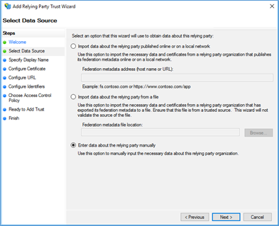
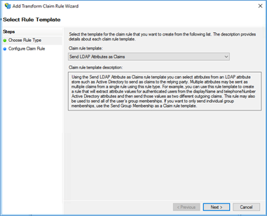

### Overview

The article explains how to **login to Demisto server with ADFS 3.0 SAML 2.0**, read further to find the required settings to enable SSO login to Demisto server using ADFS SAML.

SAML 2.0 single sign-on (SSO) supports integration with Microsoft Active Directory Federation Services (ADFS) 3.0.

### Technical Terms

* **[SAML 2.0](http://docs.oasis-open.org/security/saml/Post2.0/sstc-saml-tech-overview-2.0.html) – Security Assertion Markup Language.**
* **[ADFS 3.0](https://docs.microsoft.com/en-us/windows-server/identity/active-directory-federation-services) – Active Directory Federation Services.**
* **[SSO](https://en.wikipedia.org/wiki/Single_sign-on) – Single Sign-on**

### ADFS Setup

This procedure uses ADFS 3.0 on Windows Server 2016 and shows demistodev.local as the ADFS portal service which will allow a trust connection from the https://demo.demisto.com web server.

**IMPORTANT**: You must have a valid and trusted server certificate for ADFS to work, not the self-signed certificates that come with Demisto. If you do not use a trusted server certificate, you will experience TLS connection issues with ADFS and the integration will not work properly.
#### Steps:

1.  Log into ADFS server management console.
2.  Right-click Service and choose Edit Federation Service Properties…
    
    
3.  Confirm that General settings match the DNS entries and the correct certificates names.
    
    
4.  Right-click Relying Party Trusts, and Add Relying Party Trusts.
    
    
    
5.  A wizard screen will open, click Start.
    
    

6.  Choose Enter data about the relying party manually, and click Next.
    
     

7.  Create a Display name for the trust. In this example, the name is Demisto.
    
    

8.  Click Next (in the next step optionally configure the claims encryption).
9.  Choose Enable support for the SAML 2.0 Web SSO protocol, and enter the Core Server URL followed by /SAML at the end of the URL
    
    

10. Add the Relying party trust identifier. The identifier can be the a friendly name, the same as the Display name or the application URL. This identifier is used to redirect the userback to the Demisto web server instead of asking the user to manually choose which service is going to log on the ADFS IDP portal.
    
    

11. Choose an access control policy for the authentication portal, in this example will choose Permit everyone, click Next.
    
    

12. Check that all settings are correct, and finish the wizard.
    
    
    
    

### Making a Claim

1.  From the right menu pane of the Relying Party Trusts, click on Edit Claim Issuance Policy…
    
    

2.  Click Add Rule…
    
    

3.  In the Wizard that opens, pick Transform an Incoming Claim from the combo box and click Next.
    
    

4.  Create the Claim rule name WindowsAccountName which will pass the user logon name on AD and pick the Windows account name for the Incoming and Outgoing claim type, click Finish.
    
    

5.  Add another claim Rule which will pass the AD user account attributes to Demisto. This step is required to map the user group membership, full name, Email, Phone and other LDAP attributes Choose Send LDAP Attributes as Claims from the Claim rule template combo box
    
    

    Create a name for this rule, choose Active Directory as the attribute store, and map the required fields. Please Note that the user group attribute is mandatory if you wish to map the user group to Demisto user Role.
    
    

6.  Click Finish and OK to create the Claim Rules.
7.  Open PowerShell and make sure the IDP Sign-on page is enabled
    
    
    
    If one of these settings are set to false you can enable it by typing:
    
    Set-AdfsProperties -&lt;Property Name RelayState or EnableIdp&gt; $True

8.  Verify that the ADFS IDP Sign-on page is working by browsing to ADFS service portal URL, in our example: https://demistodev.local/adfs/ls/idpinitiatedsignon.aspx
    
    

9.  Once you are all set you can configure the SAML integration settings on Demisto server.

### Demisto SAML Integration

Once you finished setting up the ADFS relay trust you are ready to setup the SAML 2.0 integration on Demisto server.

1.  Logon to Demisto server Settings>Integrations>SAML>Add instance

    

2.  These are the properties required for the SAML integration

    * Name
    * Service Provider Entity ID – Core Server URL + /saml
    * IDP Metadata URL – ADFS URL+ /federationmetadata/2007-06/federationmetadata.xml
    * IDP SSO URL – ADFS URL+ /adfs/ls/idpinitiatedsignon.aspx
    * Attribute to get E-mail Address - `http://schemas.xmlsoap.org/ws/2005/05/identity/claims/emailaddress`
    * Attribute to get username - `http://schemas.microsoft.com/ws/2008/06/identity/claims/windowsaccountname`
    * Attribute to get first name - `http://schemas.xmlsoap.org/ws/2005/05/identity/claims/givenname`
    * Attribute to get last name - `http://schemas.xmlsoap.org/ws/2005/05/identity/claims/surname`
    * Attribute to get groups - `http://schemas.xmlsoap.org/claims/Group`
    * Default Role (for IdP users without group)– Users can be assigned to default Role at Demisto in case there is no mapping between their AD group membership and Demisto server role.
    * Service Identifier (ADFS) – This is the ADFS relay identifier which Demisto will redirect the user for SSO first login, in our example it will be Demisto.

3.  Additional checkboxes:
    
    

    Do not validate server certificate (insecure) - If you are using a self-signed certificate for the ADFS server you can use this checkbox.
    
    ADFS – Check mandatory for ADFS services
    
    Compress encode URL (ADFS) – Check mandatory for ADFS encoding.Click Test, if all settings are correct the test should pass. Press Done to finish.

### User Role Mapping SAML Integration

The last setting is to map between the AD user account group membership to a Demisto server role.

You can go directly to the roles settings by typing:

`https://demo.demisto.com/#/settings/roles`

or locate it in the UI:

In this example, we mapped AD @Analysts Users group to Demisto Analyst Role.
