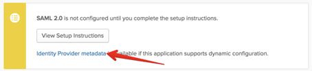
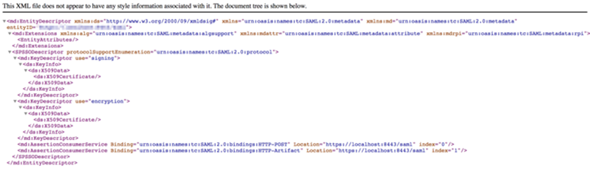

You can authenticate your Demisto users using SAML 2.0 authentication and Okta as the identity provider. First, you have to define Demisto authentication in your Okta account, then create a SAML 2.0 instance in Demisto.

## SAML 2.0 Overview

This definition of SAML 2.0 is taken from the [SAML 2.0 page in Wikipedia](https://en.wikipedia.org/wiki/SAML_2.0).

Security Assertion Markup Language 2.0 (SAML 2.0) is a version of the SAML standard for  
exchanging authentication and authorization data between security domains. SAML 2.0 is an  
XML-based protocol that uses security tokens containing assertions to pass information  
about a principal (usually an end user) between a SAML authority, named an Identity  
Provider, and a SAML consumer, named a Service Provider. SAML 2.0 enables web-based  
authentication and authorization scenarios including cross-domain single sign-on (SSO),  
which helps reduce the administrative overhead of distributing multiple authentication  
tokens to the user.

## Definitions

These parameters are part of the configuration process.
| **Parameter** | **Value** |
| --- | --- |
Service Provider |  Demisto
User Agent | User's browser
Identity Provider | Okta

## Add Demisto as an Okta Application

There are several steps you need to complete.

1.  Create Okta Groups for Demisto Users
2.  [Define the Okta application for Demisto authentication](#create-okta-groups-for-demisto-users)
3.  [Configure the SAML 2.0 integration in Demisto](#configure-the-saml-20-integration-in-demisto)
4.  [Map Okta groups to Demisto roles](#map-okta-groups-to-demisto-roles)

### Create Okta Groups for Demisto Users

To authenticate Demisto users with Okta, you need to have at least one Okta group that defines Demisto users, which will eventually be mapped to Demisto roles. There are two common methods for grouping and mapping users:

*   Create a single Okta group for all users, for example, Demisto All Users.
*   Create an Okta group for each business unit, for example, Demisto IT, Demisto Analysts, Demisto Admins.

#### How to create and add users to an Okta group

1.  Log in to Okta, and click the **Admin** button.
2.  Select **Users > Groups**.
3.  Click the **Add Group** button, and enter a meaningful name and description for the group.  
    The name and description should enable you to easily identify the users of that group.
4.  To add users to the group, click the group name and add the necessary users, and click **Save**.

### Define the Okta application for Demisto authentication

1.  To create a new application, log in to Okta and click the **Admin** button.
2.  Click the **Applications** tab, and then click the **Add Application** button.  
    
3.  For platform type, select **Service**, and click **Next**.
4.  Complete the **Application Settings**, and click **Create**.  

    | **Field** | **Value** |
    | --- | --- |  
    Platform | Web
    Sign on method | SAML 2.0
      
    

5.  In the **General Settings** section, enter a name for the application, and click **Next**.
6.  In the **SAML Settings** section, configure **General** parameters.  
      
    | **Parameter** | **Value** |
    | --- | --- |  
    Single sign on URL | `https://<_demistoURL_\>/saml`
    Audience URI (SP Entity ID) | `https://<_demistoURL_\>/saml/metadata` 
    Default RelayState | Keep this field empty.
    Name ID format | EmailAddress. The Demisto username will be the user's email address, as defined in Okta.
    Application username | Okta username
    
      
    
7.  In the **SAML Settings** section, configure **Attribute Statements** parameters.  
      
    | **Parameter** | **Name format** | **Value** |
    | --- | --- | --- |
    FirstName | Unspecified | user.firstName
    LastName |  Unspecified | user.lastName
    Email | Unspecified | user.email
    login | Unspecified | user.login
    Phone | Unspecified | user.primaryPhone
    
      
    
8.  In the **SAML Settings** section, configure **Group** **Attribute Statements** parameters.  
    This is where you define which groups to associate with Demisto, which will be mapped to Demisto roles. In this example, we created a group that includes all uses in a single group called _Everyone_.   
      
      
    
9.  Complete the **Feedback** configuration.  
    
    *   Select the **I’m an Okta customer adding an internal app** option.
    *   Select the **This is an internal app that we have created** checkbox.
    
    
10.  Click **Finish**.

## Configure the SAML 2.0 Integration in Demisto

Before you configure an instance of the SAML 2.0 integration in Demisto, access the Okta Setup Instructions and Identity Provider metadata in Okta. The values of several integration parameters are located here, such as Identity Provider Single Sign-On URL.

  

1.  In Demisto, navigate to **Settings > Integrations > Servers & Services**.
2.  Search for SAML 2.0.
3.  Click **Add instance** to configure a new integration instance.
    | **Attribute** | **Description** |
    | --- | --- |
    Name | A meaningful name for the integration instance.
    Service Provider Entity ID |  Also known as an ACS URL. This is the URL of your Demisto server, for example: https://yourcompany.yourdomain.com/saml
    IdP metadata URL |  URL of your organization's IdP metadata file.  
    IdP metadata file |  Your organization's IdP metadata file .
    IdP SSO URL |  URL of the IdP application that corresponds to Demisto.
    Attribute to get username |  Attribute in your IdP for the user name.
    Attribute to get email |  Attribute in your IdP for the user's email address.
    Attribute to get first name |  Attribute in your IdP for the user's first name.
    Attribute to get last name |  Attribute in your IdP for the user's last name.
    Attribute to get phone |  Attribute in your IdP for the user's phone number.
    Attribute to get groups |  Attribute in your IdP for the groups of which the user is a member.
    Groups delimiter |  Groups list separator.
    Default role |  Role to assign to the user when they are not a member of any group.
    RelayState |  Only used by certain IdPs. If your IdP uses relay state, you need to supply the relay state.
    Sign request and verify response signature |  Method for the IdP to verify the user sign-in request using the IdP vendor certificate.
    Identity Provider public certificate |  Public certificate for your IdP.
    Identity Provider private key |  Private key for your IdP, in PEM format. Created locally by the user who wants to use SAML. The public key is uploaded to Okta.
    Do not map SAML groups to Demisto roles |  SAML groups will not be mapped to Demisto roles
    
    
4.  Click **Test** to validate the URLs, token, and connection.
5.  Go back to the instance settings, and click **Get service provider metadata**, to verify that the settings are successful.  
    

## Map Okta Groups to Demisto Roles

It is important that when you specify the Okta group in Demisto to map to a role that you use the exact group name as it appears in Okta. Alternatively, you can specify .\*, which will pass all Okta groups to the relevant Demisto roles (this is not recommended).

1.  In Demisto, navigate to **Settings > Users & Roles > Roles**.
2.  To create a new role, click the **+New** button.
3.  Enter a meaningful name for the role.
4.  Select the permissions to grant to the role.
5.  In the **SAML Roles Mapping** section, specify one or more SAML groups to map to the Demisto role.  
    