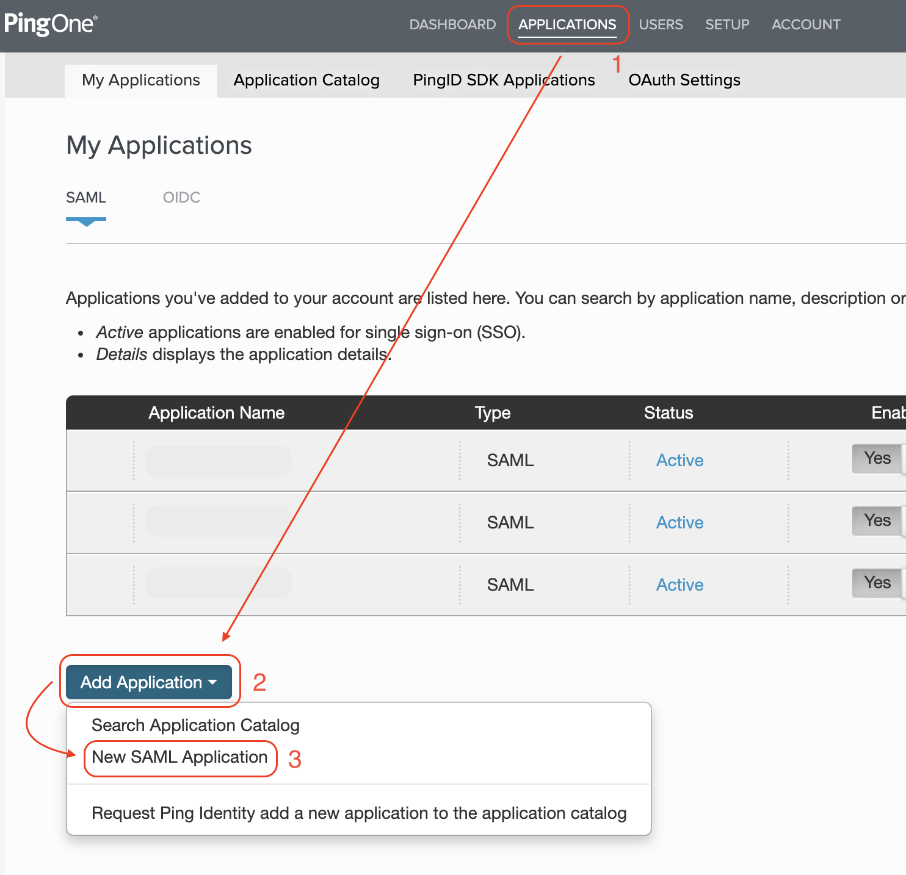
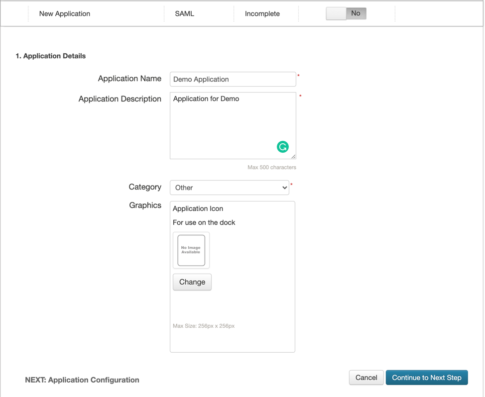
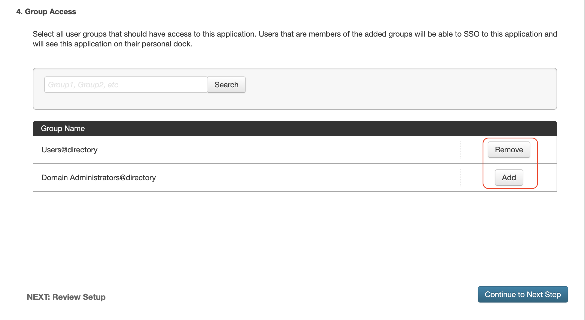
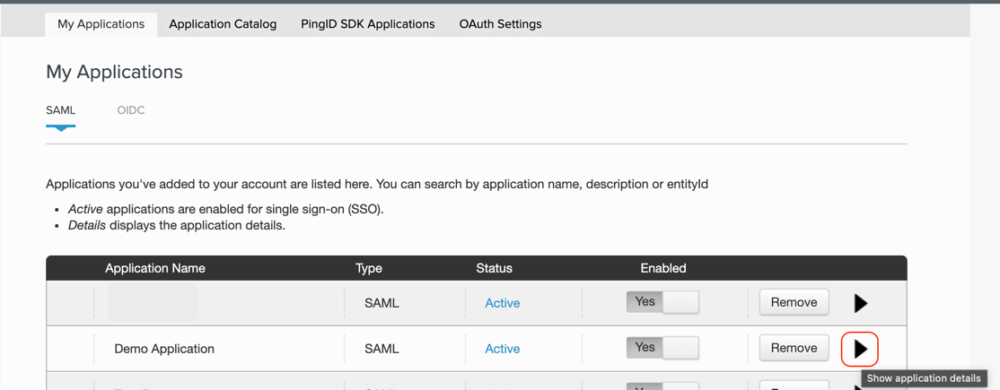
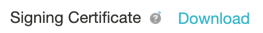
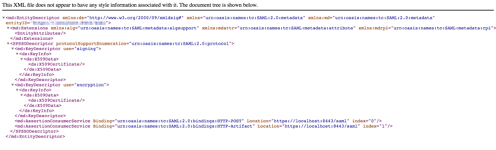
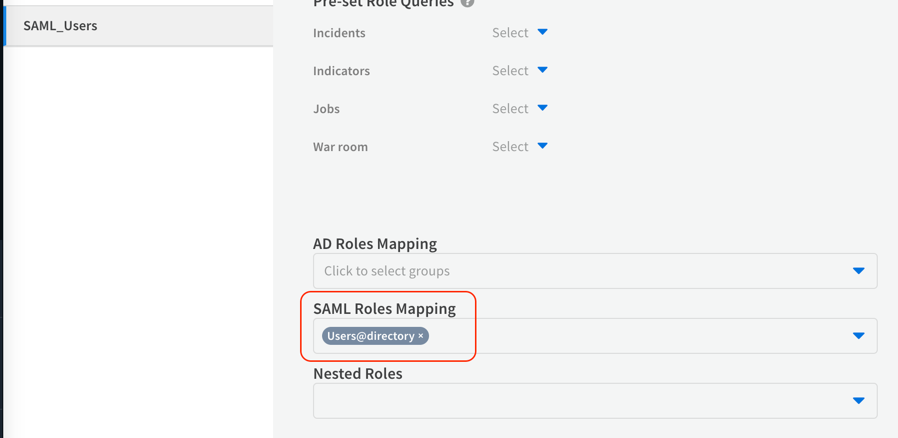

You can authenticate your XSOAR users using SAML 2.0 authentication and PingOne as the identity provider. First, you have to define XSOAR authentication in your PingOne account, then create a SAML 2.0 instance in XSOAR.

## SAML 2.0 Overview

This definition of SAML 2.0 is taken from the [SAML 2.0 page in Wikipedia](https://en.wikipedia.org/wiki/SAML_2.0).

Security Assertion Markup Language 2.0 (SAML 2.0) is a version of the SAML standard for  exchanging authentication and authorization data between security domains. SAML 2.0 is an  XML-based protocol that uses security tokens containing assertions to pass information  about a principal (usually an end user) between a SAML authority, named an Identity  Provider, and a SAML consumer, named a Service Provider. SAML 2.0 enables web-based  authentication and authorization scenarios including cross-domain single sign-on (SSO),  which helps reduce the administrative overhead of distributing multiple authentication  tokens to the user.

## Definitions

These parameters are part of the configuration process.

| **Parameter** | **Value** |
| --- | --- |
Service Provider |  XSOAR
User Agent | User's browser
Identity Provider | PingOne

## Add XSOAR as a PingOne Application

There are several steps you need to complete.

1.  [Create PingOne Groups for XSOAR Users](#create-pingone-groups-for-xsoar-users)
2.  [Define the PingOne application for XSOAR authentication](#define-the-pingone-application-for-xsoar-authentication)
3.  [Configure the SAML 2.0 integration in XSOAR](#configure-the-saml-20-integration-in-xsoar)
4.  [Map PingOne groups to XSOAR roles](#map-pingone-groups-to-xsoar-roles)
5.  [More references to PingOne's documentation](#more-references-to-pingones-documentation)

### Create PingOne Groups for XSOAR Users

To authenticate XSOAR users with PingOne, you need to have at least one PingOne group that defines XSOAR users, which will eventually be mapped to XSOAR roles. There are two common methods for grouping and mapping users:

*   Create a single PingOne group for all users, for example, XSOAR All Users.
*   Create a PingOne group for each business unit, for example, XSOAR IT, XSOAR Analysts, XSOAR Admins.

#### How to create and add users to an PingOne group

1.  Log in to PingOne.
2.  Go to **Users > User Directory > Groups**.
3.  Click the **Add Group** button, and enter a meaningful name and choose its directory permissions.  
    The name should enable you to easily identify the users of that group.
4.  To add user to the group, go to **Users > User Directory > Users**.
5.  Click the **Edit** button for the user you would like to add to the group.
6.  Under **Group Memberships** section, click the **Add** button and choose the desired group.

For further information regarding these steps, go to [PingOne Documentation](https://docs.pingidentity.com/bundle/pingone/page/ypu1564020497023-1.html)

### Define the PingOne application for XSOAR authentication

1.  To create a new application, log in to PingOne and click the **Applications** tab.
2.  Click the **Add Application** button.
3.  Click the **New SAML Application** button. 
    
4.  Complete the **Application Details**, and click **Continue To Next Step**.
    
5.  In the **Application Configuration** section, configure the following parameters:  
      
    | **Parameter** | **Value** | **Required**
    | --- | --- | --- |
    Protocol Version | SAML v 2.0 | True
    Assertion Consumer Service (ACS) | `https://<_XSOARURL_\>/saml` | True
    Entity ID | `https://<_XSOARURL_\>/saml` | True
    Application URL | `https://<_XSOARURL_\>/saml` | False
    Single Logout Endpoint | `https://<_XSOARURL_\>/saml-logout` | False 
    Single Logout Binding Type | POST | False
    Primary Verification Certificate | Your own certificate. For help creating a new certificate go to the [Set Up SAML Logout Article](https://docs.paloaltonetworks.com/cortex/cortex-xsoar/6-2/cortex-xsoar-admin/users-and-roles/authenticate-users-with-saml-20/set-up-adfs-as-the-identity-provider-using-saml-20/set-up-saml-logout.html) and follow Step 1. | False
    Signing | Sign Response | False

6.  In the **SSO Attribute Mapping** section, click the **Continue to Next Step** button.
7.  In the **Group Access** section, click the **Add** button for each group that you would like to associate to this application.  
    This is where you define which groups to associate with XSOAR, which will be mapped to XSOAR roles. In this example, we created a group that includes all uses in a single group called _Users_.  
    
      
    
8.  In the **Review Setup** section, go over the application configuration.
9.  Click **Finish**.

### Configure the SAML 2.0 Integration in XSOAR

Before you configure an instance of the SAML 2.0 integration in XSOAR, access the PingOne Application Details. The values of several integration parameters are located here, such as Identity Provider Single Sign-On URL.

1.  In XSOAR, navigate to **Settings > Integrations > Servers & Services**.
2.  Search for SAML 2.0.
3.  Click **Add instance** to configure a new integration instance.

    | **Attribute** | **Value** | **Description** |
    | --- | --- | --- |
    Name | | A meaningful name for the integration instance.
    Service Provider Entity ID | `https://<_XSOARURL_\>/saml` |  Also known as an ACS URL. This is the URL of your XSOAR server.
    IdP metadata URL | `https://admin-api.pingone.com/latest/metadata/<UUID>`  | URL of your organization's IdP metadata file.
    Or: IdP metadata file | |  Your organization's IdP metadata file. Download it from the PingOne UI: 
    IdP SSO URL | `https://sso.connect.pingidentity.com/sso/idp/SSO.saml2?idpid=<idp_id_from_PingID_UI>`.  | URL of the IdP application that corresponds to XSOAR.
    Attribute to get username | `urn` | Attribute in your IdP for the user name.
    Attribute to get email | `email` | Attribute in your IdP for the user's email address.
    Attribute to get first name | `firstName` | Attribute in your IdP for the user's first name.
    Attribute to get last name | `lastName` | Attribute in your IdP for the user's last name.
    Attribute to get phone | `Phone` | Attribute in your IdP for the user's phone number.
    Attribute to get groups | `memberOf` | Attribute in your IdP for the groups of which the user is a member.
    Groups delimiter | `,` | Groups list separator.
    Default role | | Role to assign to the user when they are not a member of any group.
    RelayState | | Only used by certain IdPs. If your IdP uses relay state, you need to supply the relay state.
    Sign request and verify response signature | | Method for the IdP to verify the user sign-in request using the IdP vendor certificate.
    IdP public certificate | | Download it from the PingOne UI:  
    Service Provider public certificate | The `certificate.crt` created in step 5. | Public certificate for your IdP. 
    Service Provider private key | The `private_unencrypted.key` created in step 5. | Private key for your IdP, in PEM format.
    ADFS | True | Active Directory Federation Services.
    Compress encode URL (ADFS) | True | Will compress the request sent to PingOne.
    Service Identifier (ADFS) | `https://yourcompany.yourdomain.com/saml` | 
    Do not map SAML groups to XSOAR roles |  | SAML groups will not be mapped to XSOAR roles
    IdP Single Logout URL | `https://sso.connect.pingidentity.com/sso/SLO.saml2` | This functionality will end the user's session in PingOne when logging out.
    
    
4.  Click **Test** to validate the URLs, token, and connection.
5.  Go back to the instance settings, and click **Get service provider metadata**, to verify that the settings are successful.  
    

### Map PingOne Groups to XSOAR Roles

It is important that when you specify the PingOne group in XSOAR to map to a role that you use the exact group name as it appears in PingOne. Alternatively, you can specify .\*, which will pass all PingOne groups to the relevant XSOAR roles (this is not recommended).

1.  In XSOAR, navigate to **Settings > Users & Roles > Roles**.
2.  To create a new role, click the **+New** button.
3.  Enter a meaningful name for the role.
4.  Select the permissions to grant to the role.
5.  In the **SAML Roles Mapping** section, specify one or more SAML groups to map to the XSOAR role.  
        
    

### More references to PingOne's documentation:
- [Managing Users](https://docs.pingidentity.com/bundle/pingone/page/ypu1564020497023-1.html)
- [Mapping attributes](https://docs.pingidentity.com/bundle/p14c/page/pwv1567784207915.html)  
- [PingOne and SLO](https://docs.pingidentity.com/bundle/pingone/page/qyg1564020481656.html)
