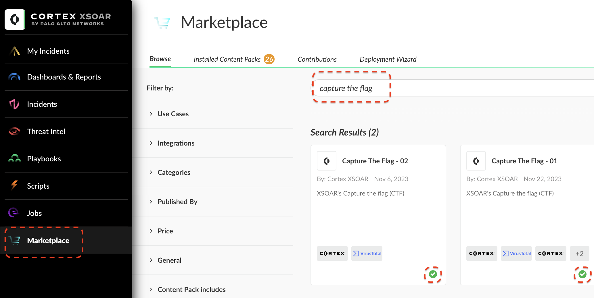

# Introduction
The XSOAR 8 CTFs provide a fun and engaging way for your audience or teams to learn about Cortex XSOAR.
The CTFs can be completed in 1 hour and so can be easily incorporated into an event for SOC practitioners. 

## Install CTF content Pack

The XSOAR CTF consists of two Content Packs. 
It is recommended to install "Capture The Flag - 01" and "Capture The Flag - 02" in this order. 
Navigate to the Cortex Marketplace, search for "Capture The Flag - 01" and click install. After "Capture The Flag - 01" is installed, search for "Capture The Flag - 02" and click Install. Once the CTFs are installed you will see a green check mark against the CTF packs. 
 

# Prepare Your CTF playbook.
After you install the CTF 1 and CTF 2 content packs from the Marketplace. 
You must run the “Prepare your Playbook” wizard that will instruct you to configure instances that are required for 
running the CTF and it will also check the system for any missing items.

## Install and Configure VirusTotal and Unit42 Atom Feed
The Unit 42 v2 feed provides access to published IOCs that contain known malicious indicators. 
VirusTotal will analyze suspicious hashes, URLs, domains, and IP addresses. You will need these two integrations for the CTF.
1. Go to Playbooks and search for “Prepare your CTF”

2. Click on View to open the Playbook.

3. Click on Run to run the playbook.

The playbook will first check if VirusTotal and Unit42 feeds are installed. If it is not installed, then follow the instructions to configure those from Marketplace. Here are the links to VirusTotal and Unit42 Atom feed. (Those integrations will enrich indicators and provide useful information to TIM).

4. After installing VirusTotal and Unit42 Feed you must configure instances for those integrations. Click on Settings & Info -> Settings -> Instances.

5. Search for VirusTotal and add an instance of VirusTotal. Create your own VirusTotal Account and retrieve the API key from there. (Use the How To guide located in the integration settings)

6. Search for Unit 42 Atom Feed and add an instance of Unit 42 Atom Feed. Create your own Unit 42 Atom Feed Account and retrieve the API key from there. (Use the How To guide located in the integration settings)

## Configure XDR-CTF and OHMYVT_CTF integrations.
The XDR-CTF and OHMYVT_CTF integrations have already been configured by default when you installed the CTF content pack. But you must configure an instance of each of those integrations. 
1. Go back to the Playbooks section and open the “Prepare your CTF” playbook and rerun it. To rerun click on “Stop” and then “Run”.

    If the previous configurations were configured correctly the playbook will check for XDR – CTF instance and a custom integration name “OHMYVT_CTF”

2. To configure Cortex XDR – IR CTF and OHMYVT_CTF instances, go back to Settings & Info -> Settings -> Instances.
Search for XDR - IR CTF and configure an instance by clicking on +Add Instance.

Leave all settings to default and click on Save&Exit.

3. Now search for OHMYVT_CTF and click on + Add instance.

Leave all settings to default and click on Save&Exit.

## Verify RDP brute force incident.

You will analyze and investigate various aspects of an RDP incident ingested from XDR. This incident is automatically created for you. In the following step you will verify that the incident exists in the database and all the indicators from that incident have been extracted successfully.  
1. After configuring XDR – IR CTF and OHMYVT_CTF, go back to the Playbooks section and open the “Prepare your CTF” playbook and rerun it. 
To rerun click on “Stop” and then “Run”. 

Now, the playbook will stop at the step “Ensure the following”.

-[ ] The incidents created successfully - wait until the incident for BruteForece stops on the manual task that classifies the incident.
-[ ] Indicators extracted properly.

2. Click on Incidents and search for the incident name:“XDR Incident 413 - 'Possible external RDP Brute-Force' generated by XDR Analytics detected on host dc1env12apc05 involving user env12\administrator”

3. Open the incident and click on the Investigation tab and ensure that the indicators have been extracted properly. 

4. Go back to the Playbooks section and open the “Prepare your CTF” playbook and click on Mark Completed for the “Ensure the following” step.

If you need to rerun click on “Stop” and then “Run”.

## Final Validation

Once All Validation is complete the playbook will stop at the step “You are all set!” 
