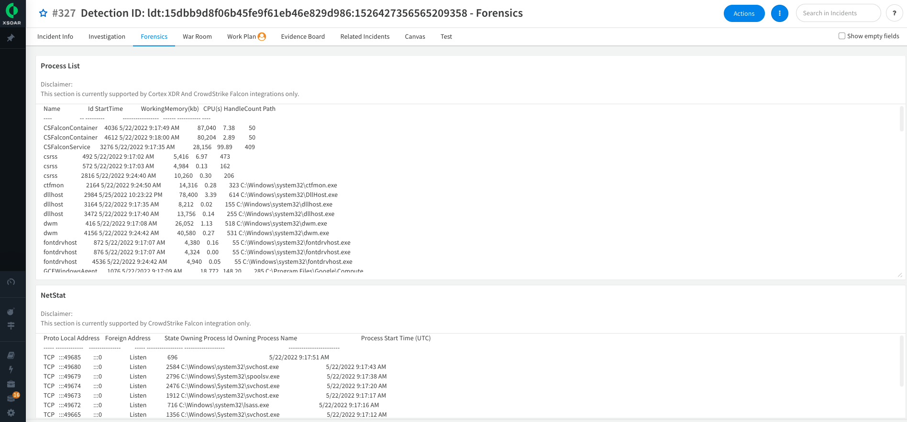

Malware threat is one of the most common cybersecurity challenges facing businesses today. It causes data breaches, hardware failures, and inoperable computers and system networks that can be extremely costly to recover.  
Malware investigations require security teams to reconcile data from multiple security products like EDRs, sandboxes, malware analysis tools, and threat intelligence providers. 
Performing investigations manually wastes valuable time when malware may be propagating within an organization.

The Malware Investigation & Response content pack accelerates the investigation process for endpoint malware incidents and alerts by collecting evidence of malicious behaviors from telemetry data available through EDRs and processing malware analysis reports through sandboxes. Incident layouts also include buttons to remediate activities quickly.    
The pack closely maps evidence to MITRE ATT&CK to uncover evidence of:
- Persistence (for example, registry and scheduled jobs)
- Evasion or tampering (for example and service stop and process kill)
- Lateral movement (for example, network connections and file share enumeration)
- Powershell abuse and command-line analysis
- Digitally signed files

## What Does This Pack Do?
* Provides forensic data, including running processes and open network connections at alert detection time
* Retrieves files and detonates sandboxes
* Processes select sandbox reports and visualizes the results in layouts
* Extracts indicators and provides threat intelligence enrichment
* Tags malicious and benign indicators for allow and deny lists for threat prevention and false-positive management
* Mirrors incidents between the EDR and Cortex XSOAR and enables incident closure with the EDR
* Supports aggregating incidents from EDRs, including multiple alerts and files

## Getting Started / How to set up the pack
For better user experience and easier onboarding for your use case, use the [**Deployment Wizard**](https://docs.paloaltonetworks.com/cortex/cortex-xsoar/6-8/cortex-xsoar-admin/marketplace/content-pack-installation/install-a-content-pack/use-the-use-case-deployment-wizard) after installing the content pack on the Marketplace page in Cortex XSOAR (Available for version 6.8).

## Pack Configuration
This pack leverages the new Deployment Wizard capability to streamline deployment and configuration (Available from Cortex XSOAR 6.8).  
- Primary playbook: [Malware Investigation and Response Incident Handler](https://xsoar.pan.dev/docs/reference/playbooks/malware-investigation--response-incident-handler)
- Primary incident type: **Malware Investigation and Response**

## Layouts
Primary layout is - 
This layout has three tabs:
* 
* 
* 

### Layout Features' Support Summary

| **Type**                  | **Name**                         | **Microsoft Defender For Endpoint** | **CrowdStrike Falcon**      | **Cortex XDR**              | 
|------------------------------|-------------------------------------|-------------------------------------|-----------------------------|-------------------------------|
| Button                       | **Kill Process**                    |                   :x:                 | :white_check_mark:*                                     |  :white_check_mark:**                                   |
| Button                       | **Delete file**                      |                   :white_check_mark:                 |               :white_check_mark:                         |               :white_check_mark:                          |
| Button                       | **Isolate** / **Unisolate endpoint**       |                   :white_check_mark:                 |               :white_check_mark:                          |              :white_check_mark:                          |
| Dynamic Section              | **Process List**             |                   :x:                 |               :white_check_mark:                         |               :white_check_mark:                         |
| Dynamic Section              | **Netstat Information**      |                   :x:                |              :white_check_mark:                          |               :x:                       |
*Only with the file path
**Only with the file name

 
## Integrations / Platforms
### Endpoint Integrations

#### [Palo Alto Networks Cortex XDR - Investigation and Response](https://xsoar.pan.dev/marketplace/details/CortexXDR)
**Main Playbook**: [Cortex XDR Malware - Investigation And Response](https://xsoar.pan.dev/docs/reference/playbooks/cortex-xdr-malware---investigation-and-response)

Cool and awesome features that are used in this pack:

- Hunting crosses your XDR instance on the dedicated Insights

    As the extremely sophisticated logic in the XDR incident correlation system, there are other ways to determine whenever additional suspicious activity was deducted from the system. The XDR Insights are basically detections that occurred from a rule, observed, and enriched on a dedicated endpoint. In this Playbook, we are searching for dedicated Insights by filtering them through Mitre Techniques and the investigated endpoint. 
  - Related Playbook: [Cortex XDR - Endpoint Investigation](https://xsoar.pan.dev/docs/reference/playbooks/cortex-xdr---endpoint-investigation)

#### [Microsoft Defender For Endpoint](https://xsoar.pan.dev/marketplace/details/MicrosoftDefenderAdvancedThreatProtection)
**Main Playbook**: [MDE Malware - Investigation and Response](https://xsoar.pan.dev/docs/reference/playbooks/mde-malware---investigation-and-response)

Cool and awesome features that are used in this pack:
- Advanced Hunting Features
  - Advanced hunting capabilities can make a huge difference when it comes to investigating and enriching alerts/incidents. Microsoft Defender For Endpoint provides tremendous features allowing us to query your integrated instance and search for information, In our playbook, we are using pre-defined commands, enrichment logic, and tagging results as an incident ‘Evidence’. For more information check out the mentioned playbook below.
  
    Related playbook: [MDE - Host Advanced Hunting]()
    
    _Note_: There are additional sub-playbooks that
    
- Pro-Active Actions and ‘Collect Investigation Package’ (Forensics feature)
  - As a part of the incident investigation, we are providing a powerful tool to the analyst where he can decide if there is a need to run additional pro-active actions to assist him with the incident investigation. As a part of this Playbook we are providing the following actions to the analyst (which can be also turned to be automatic using the corresponding playbook inputs):
    - Run Automated Investigation.
    - Run AntiVirus Full Scan on the Endpoint.
    - Collect Investigation Package (Forensics). 
    
    Related playbook: [MDE - Pro-Active Actions]()
  
    _Note_: there are playbook inputs that can be configured on the MDE Malware - Investigation and Response.

#### [CrowdStike Falcon](https://xsoar.pan.dev/marketplace/details/CrowdStrikeFalcon)
**Main Playbook**: [CrowdStrike Falcon Malware - Investigation and Response](https://xsoar.pan.dev/docs/reference/playbooks/crowd-strike-falcon-malware---investigation-and-response)

Cool and awesome features that are used in this pack:
 - Process list.
 - Searching for hash across the organization.

_**Note**_:
As the Main playbooks contain most of the common playbook inputs across the vendor’s playbooks, there are additional inputs that exist on the vendor’s playbooks but not on the main one. 
**For example,** there are inputs for the Dedup logic such as _DedupSimilarTextField_ and _DedupMinimunIncidentSimilarity_.
Another example, from the CrowdStrike Pack, will be - _HostGroupName_ and _ApplyOCGlobally_.

### Additional Integrations
####Mitre ATT&CK 
As the Mitre Att&ck framework became so popular, it allows us to classify the incident and better understand what is the current stage of this specific kill chain phase. By using the Mitre Att&ck integration we are ingesting enriched information about the found techniques associated with the incident.
- Related Playbook: [Mitre Attack - Extract Technique Information From ID](https://xsoar.pan.dev/docs/reference/playbooks/mitre-attack---extract-technique-information-from-id)

## Pack Disclaimers
1. The current layout shows only one item being searched (for example, one endpoint or one file SHA256) even though the logic is running and analyzing all the relevant information and performing enrichment on all the items.
2. Each vendor uses unique features and exposed API calls, so some of the layout features work only for certain vendors. See the **Feature Summary** above.
3. Some actions are irreversible. For example, the analyst should be careful when deleting files since deleting a file cannot be reversed (do not delete explorer.exe from the investigated device).
4. The logic supports **only** Microsoft Windows OS platforms. However, certain parts of the playbooks can analyze and provide information on other operating systems. For example, the sandbox section can run on Linux, Mac, Android, and others.
5. Avoid using the **Close** option before testing, since there are issues in deduplication logic when closing incidents that have not been opened yet.

 
