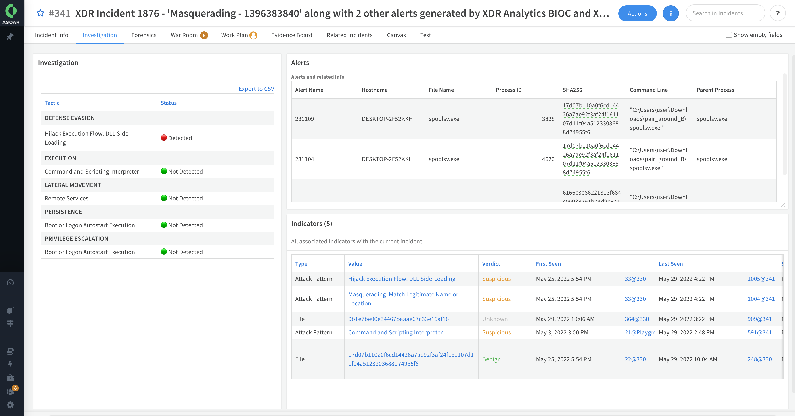

Malware threat is one of the most common cybersecurity challenges facing businesses today. It causes data breaches, hardware failures, and inoperable computers and system networks that can be extremely costly to recover.  
Malware investigations require security teams to reconcile data from multiple security products like EDRs, sandboxes, malware analysis tools, and threat intelligence providers. 
Manual investigation wastes valuable time when malware may be propagating within an organization.

The Malware Investigation & Response content pack accelerates the investigation process for endpoint malware incidents and alerts by collecting evidence of malicious behaviors from telemetry data available through EDRs and processing malware analysis reports through sandboxes. Incident layouts also include buttons to remediate activities quickly.    
The pack closely maps evidence to MITRE ATT&CK to uncover evidence of:
- Persistence (for example, registry and scheduled jobs)
- Evasion or tampering (for example and service stop and process kill)
- Lateral movement (for example, network connections and file share enumeration)
- PowerShell abuse and command-line analysis
- Digitally signed files

## What Does This Pack Do?
* Provides forensic data, including running processes and open network connections at alert detection time.
* Retrieves files and detonates sandboxes.
* Analyzes process command-line string for identifying suspicious behavior.
* Processes select sandbox reports and visualizes the results in layouts.
* Extracts indicators and provides threat intelligence enrichment.
* Tags malicious and benign indicators for allow and deny lists for threat prevention and false-positive management.
* Mirrors incidents between the EDR and Cortex XSOAR and enables incident closure with the EDR.
* Supports aggregating incidents from EDRs, including multiple alerts and files.

## Getting Started / How to Set up the Pack
### Use the Deployment Wizard (Available for version 6.8)
For better user experience and easier onboarding, use the [**Deployment Wizard**](https://docs.paloaltonetworks.com/cortex/cortex-xsoar/6-8/cortex-xsoar-admin/marketplace/content-pack-installation/install-a-content-pack/use-the-use-case-deployment-wizard) after installing the content pack on the Marketplace page in Cortex XSOAR (Available for version 6.8).
  

### Manually Configure Your Use Case (From Version 6.5)
For manual configuration, it is recommended to configure your integration instance to use: 
- The primary **playbook**: [Malware Investigation and Response Incident Handler](https://xsoar.pan.dev/docs/reference/playbooks/malware-investigation--response-incident-handler)
- The primary **incident type**: **Malware Investigation and Response**

#### Fetch Data from a EDR:
1. In [MarketPlace](https://xsoar.pan.dev/marketplace), select a fetching integration (for more details on supported EDR integrations, see [Additional Packs](#Additional-Packs)):  
   1. PaloAlto Cortex XDR 
   2. Microsoft Defender For Endpoint
   3. CrowdStrike Falcon  
2. In the **Settings** > **Integrations** tab, configure your fetching integration instance.   
   **Note:**  
   Set **Fetch Incidents** to true and set the **Incident Type** to  `Malware Investigation and Response` (for Cortex XDR - you can use the classifier `Cortex XDR Incident Handler - Classifier` instead of the incident type).
3. **Review the master playbook inputs**. These inputs control key features in the investigation process.

#### Fetch Data from a SIEM
If you retrieve incidents using a SIEM integration, you need to perform the following steps.  
  
1. **Before you start:** Set up your relevant EDR integration. For more details on supported EDR integrations, see [Additional Packs](#Additional-Packs).
2. Through your SIEM integration mapper, map the following fields to retrieve all required information:  
   - Original alert ID mapped to  `External System ID` incident field.
   - Incident type mapped to `External Category Name` incident field. (example )
   
   If you do not want to use update mapper to use those incident fields,change the following playbook inputs to the right alert ID and the incident type in the master playbook (**Malware - Investigation & Response Incident Handler**).:
     - `SIEMincidentFieldForID`  
     - `SIEMincidentFieldForType` 
3. Validate the EDR integration is enabled.
4. Ensure that relevant incoming incidents are assigned with 'Malware Investigation And Response' (through the SIEM Classifier).

### Additional Integrations
#### Mitre ATT&CK 
The Mitre Att&ck integration enables easy classification for investigated incidents and better understanding of the current stage in the kill chain phase. The Mitre Att&ck integration ingests enriched information about the found techniques associated with the incident.  
Information on findings are presented in the layout in the **Investigation Summary** and **Detailed Investigation** sections.  

Related Playbook: [Mitre Attack - Extract Technique Information From ID](https://xsoar.pan.dev/docs/reference/playbooks/mitre-attack---extract-technique-information-from-id)

#### [Palo Alto Networks WildFire - SandBox](https://xsoar.pan.dev/marketplace/details/Palo_Alto_Networks_WildFire) 
The Palo Alto Networks Wildfire sandbox integration enables you to automatically identify unknown threats by detonating unknown files. It also stops attacks by dynamically analyzing files.

#### [CrowdStrike FalconX - SandBox](https://xsoar.pan.dev/marketplace/details/CrowdStrikeFalconX)
The CrowdStrike FalconX sandbox integration enables you to automatically identify unknown threats by detonating unknown files and retrieve report information. It also stops attacks by dynamically analyzing files.

## Layouts
The primary layout has three tabs:
* Incident info - 
This is 
  
Description
* Investigation  
  
Description
* Forensics  
  
Description

### Layout Feature Support Summary

The primary layout is the standard and common layout for all supported vendors, however certain features are not available for some vendors. The table below summarizes the support for each vendor per layout feature.

| **Type**                  | **Name**                         | **Microsoft Defender For Endpoint** | **CrowdStrike Falcon**      | **Cortex XDR**              | 
|------------------------------|-------------------------------------|-------------------------------------|-----------------------------|-------------------------------|
| Button                       | **Kill Process**                    |                   :x:                 | :white_check_mark:*                                     |  :white_check_mark:**                                   |
| Button                       | **Delete file**                      |                   :white_check_mark:                 |               :white_check_mark:                         |               :white_check_mark:                          |
| Button                       | **Isolate** / **Unisolate endpoint**       |                   :white_check_mark:                 |               :white_check_mark:                          |              :white_check_mark:                          |
| Dynamic Section              | **Process List**             |                   :x:                 |               :white_check_mark:                         |               :white_check_mark:                         |
| Dynamic Section              | **Netstat Information**      |                   :x:                |              :white_check_mark:                          |               :x:                       |

*Only supports 'file path' / **Only supports 'file name'
 

### Endpoint Integrations

- #### [Palo Alto Networks Cortex XDR - Investigation and Response](https://xsoar.pan.dev/marketplace/details/CortexXDR)
  **Main Playbook**: [Cortex XDR Malware - Investigation And Response](https://xsoar.pan.dev/docs/reference/playbooks/cortex-xdr-malware---investigation-and-response)

  Noteworthy feature in this pack:

  - **Hunting for Dedicated Insights**

     XDR Insights are suspicious activity detections that occur from a rule and are observed and enriched on a dedicated endpoint. This playbook searches for dedicated Insights by filtering them through Mitre Techniques and the investigated endpoint. 

    Related Playbook: [Cortex XDR - Endpoint Investigation](https://xsoar.pan.dev/docs/reference/playbooks/cortex-xdr---endpoint-investigation)

- #### [Microsoft Defender For Endpoint](https://xsoar.pan.dev/marketplace/details/MicrosoftDefenderAdvancedThreatProtection)  
  **Main Playbook**: [MDE Malware - Investigation and Response](https://xsoar.pan.dev/docs/reference/playbooks/mde-malware---investigation-and-response)

  Noteworthy features in this pack:
  - **Advanced Hunting**  
   Microsoft Defender For Endpoint provides advanced features to query your integrated instance and search for information. This playbook uses pre-defined commands, enrichment logic, and tagging results as incident evidence. 
  
    Related playbook: [MDE - Host Advanced Hunting]()
           
  - **Pro-Active Incident Investigation**  
    The analyst can run the following pro-active incident investigation actions, which can be automated using playbook inputs:
    - Running an automated investigation
    - Running antiVirus full scan on the endpoint
    - Collecting an Investigation Package (forensics). 
    
    Related playbook: [MDE - Pro-Active Actions]()
  
    **Note**:  
    Some playbook inputs can be configured on the [MDE Malware - Investigation and Response](https://xsoar.pan.dev/docs/reference/playbooks/mde-malware---investigation-and-response) playbook.

- #### [CrowdStrike Falcon](https://xsoar.pan.dev/marketplace/details/CrowdStrikeFalcon)
  **Main Playbook**: [CrowdStrike Falcon Malware - Investigation and Response](https://xsoar.pan.dev/docs/reference/playbooks/crowd-strike-falcon-malware---investigation-and-response)

  Noteworthy feature in this pack:
   - **Allow and Block IOCs Per Device Group**

     Due to the complexity of managing multiple devices and exclusions, a policy may require certain modifications to fit each device group. This playbook enables choosing which device groups (specific or all groups) will be affected by your exclusions.

**Note**:  
The main playbooks contain most of the common playbook inputs across vendor playbooks, however specific vendor inputs are not in the main playbook. For example:  
- Inputs for Dedup logic such as _DedupSimilarTextField_ and _DedupMinimunIncidentSimilarity_
- In the CrowdStrike content pack:  _HostGroupName_ and _ApplyOCGlobally_
** add an example here for the playbooks

## Pack Disclaimers
1. The current layout shows only one item being searched (for example, one endpoint or one file SHA256) even though the logic is running and analyzing all the relevant information and performing enrichment on all the items.
2. Some actions are irreversible. For example, the analyst should be careful when deleting files since deleting a file cannot be reversed (do not delete explorer.exe from the investigated device).
3. The logic supports **only** Microsoft Windows OS platforms. However, certain parts of the playbooks can analyze and provide information on other operating systems. For example, the sandbox section can run on Linux, Mac, Android, and others.
4. Avoid using the **Close** option before testing, since there are issues in deduplication logic when closing incidents that have not been opened yet.
