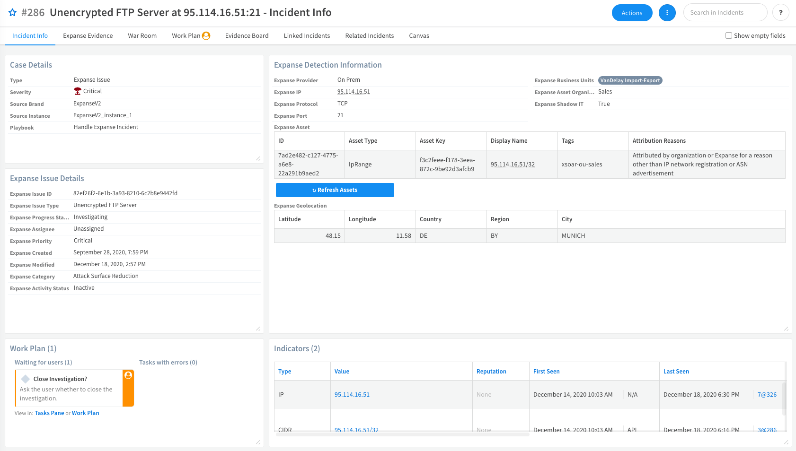
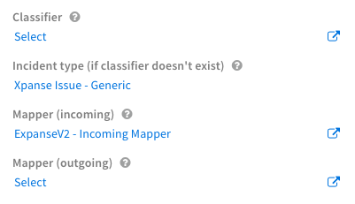

The Cortex Xpanse Content Pack for Cortex XSOAR provides full coverage of the Expanse Expander product capabilities to allow SOCs to automate the defense of their company’s attack surface. 

The integrations in this pack enable fetching and mirroring of Xpanse issues into Cortex XSOAR incidents, and ingestion of indicators (IPs, domains, and certificates) that refer to the corporate network perimeter as discovered by Expanse.

Through a powerful set of playbooks, analysts can correlate the discovered information with data provided from internal security systems (such as Palo Alto Networks Cortex Data Lake, Prisma Cloud and Panorama, Active Directory, Splunk SIEM, etc.) to help pinpoint the correct owners of the assets and automate remediation.

## Handle an Xpanse Incident

After configuring an instance of the Cortex Xpanse integration, the Xpanse issues start getting mapped to the Expanse incident type and the **Handle Expanse Incident** playbook will automatically be launched.
If you are only interested in enrichment and attribution, use the **Handle Expanse Incident - Attribution Only** playbook instead, by assigning it to the Expanse Issue Incident Type.

The first phase of the playbook is the *Enrichment* phase. The playbook tries to enrich the data (such as IP addresses, Domains, Certificates) associated with this incident. The playbook uses the enrichment commands for these indicator types to obtain as much context as possible from the Expanse integration and from other integrations that can provide reputation and enrichment for those assets.

The next phase is the *Validation* phase. This phase collects information to determine:
- If the asset is protected by the company's security services by having a firewall in front of it, if it is part of Prisma Cloud, and if it is a public cloud asset. 
- The users or owners who connect to it in order to determine who owns the asset.

This is achieved by correlating the IP address and FQDN that are found with the information available in other products as follows:
- Search firewall logs from Cortex Data Lake, Panorama, and Splunk to see if there is evidence of that asset, if users are connected to that service, or if there a firewall protecting this service. 
- Search Prisma Cloud to see if the asset is running on a public cloud service like AWS/GCP/Azure. If it is, then the asset is protected by Prisma Cloud and the owner, IP address, and FQDN can be retrieved from the Prisma Cloud inventory.
- If a user is found from the firewall logs, the playbook enriches the user information from Active Directory.

A report is then generated and appears in the Evidence Board with all of the captured information. 

In the *Shadow IT check* phase, based on the information in the report, the playbook can suggest whether the discovered issue corresponds to an asset that is known to the InfoSec team (i.e., if there are firewall logs present, if the asset is protected by Prisma Cloud, or if it is part of an IP range associated to the company). If there is no evidence that the asset is protected by the organization, the asset is shown as a possible Shadow IT. 

In the *Attribution* phase, the analyst is prompted to assign this issue to an organization unit, which is a group within Palo Alto Networks with a specific owner. The analyst can choose from existing organization units (stored in an XSOAR list) or define a new organization unit.  

The final phase is the *Response* phase. Depending on the issue type, several remediation actions are automatically and manually performed.
- Tag the asset in Expanse with a specific organization unit tag (for example: xsoar-ou-marketing).
- Create a firewall rule that blocks the service on PAN-OS (if a Firewall is deployed in front of the service).
- Create a new Shadow IT issue (if the asset is detected to be Shadow IT and the analyst confirms it).
- Add the service to a vulnerability management system.
- Link the incident to a related Prisma Cloud alert for the asset (if the asset is found in the Prisma Cloud inventory).
- Notify the owner of the assigned organization unit.

## In This Pack
The Cortex Xpanse content pack includes several content items.

### Automations
| Name | Description |
| ----| ---|
| ExpanseAggregateAttributionDevice | Aggregates entries from multiple sources into AttributionDevice. |
| ExpanseAggregateAttributionIP | Aggregates entries from multiple sources into AttributionIP. |
| ExpanseAggregateAttributionUser | Aggregates entries from multiple sources into AttributionUser. |
| ExpanseEnrichAttribution | Enriches context generated by ExpanseAggregateAttribution* scripts  with additional details. |
| ExpanseEvidenceDynamicSection | Appears in the **Expanse Issue** layout to display the latest evidence structure. | 
| ExpanseGenerateIssueMapWidgetScript | Generates a map of the Open Expanse Issue Incidents with provider On Prem. The map is generated as a static PNG file embedded in markdown.
| ExpansePrintSuggestions | Generates and prints a report in markdown format containing useful suggestions for the analyst to attribute an Expanse issue to an owner.
| ExpanseRefreshIssueAssets | Refreshes tags and attribution reasons for assets inside the Expanse issue. Use the script inside the Expanse Issue incident context.
| MatchIPinCIDRIndicators | Matches a provided IP address in all the indicators of type CIDR with the provided tags (longest match).

### Classifiers
- **ExpanseV2 - Classifier**
- **ExpanseV2 - Incoming Mapper**

### Dashboards
- **Expanse Incidents** - Displays information based on incidents created from Expanse issues using the Expanse V2 integration. 

- **Expanse Perimeter** - Displays information based on the Expanse Feed integration relating to the assets that are discovered. 

### Incident Fields
- **Expanse Activity Status**
- **Expanse Asset**
- **Expanse Asset Organization Unit**
- **Expanse Asset Owner**
- **Expanse Assignee**
- **Expanse Business Units**
- **Expanse Category**
- **Expanse Certificate**
- **Expanse Cloud Management Status**
- **Expanse Created** 
- **Expanse Domain**
- **Expanse Geolocation**
- **Expanse Initial Evidence**
- **Expanse IP**
- **Expanse Issue ID**
- **Expanse Issue Type**
- **Expanse Latest Evidence**
- **Expanse ML Features**
- **Expanse Modified**
- **Expanse Port**
- **Expanse Priority**
- **Expanse Progress Status**
- **Expanse Protocol**
- **Expanse Provider**
- **Expanse Region**
- **Expanse Service**
- **Expanse Shadow IT**
- **Expanse Tags**

### Incident Types
- **Expanse Issue**
- **Xpanse Issue - Generic**

### Indicator Fields
- **Expanse Asset Type**
- **Expanse Business Units**
- **Expanse Certificate Advertisement Status**
- **Expanse Date Added**
- **Expanse Dns Resolution Status**
- **Expanse Domain**
- **Expanse First Observed**
- **Expanse Last Observed**
- **Expanse Properties**
- **Expanse Provider Name**
- **Expanse Service Status**
- **Expanse Source Domain**
- **Expanse Tags**
- **Expanse Tenant Name**
- **Expanse Type**

### Integrations

- **Expanse Expander Feed** - Retrieves the discovered IPs, IP ranges, domains, and certificates from the Expanse Expander asset database and stores them in Cortex XSOAR for analysis and correlation. 
- **Cortex Expanse** - Allows XSOAR to collect Expanse issues and bi-directionally mirror them. The Expanse Expander API creates incidents from the Expanse issues and enriches IPs, IP ranges, domains, and certificates using information from assets discovered by Expanse Expander, and risky flows detected by Expanse Behavior. 

### Layouts
There are 2 layouts in this pack.

#### Expanse Certificate Indicator Layout
There are 3 tabs in this layout.
- *Info* - Displays basic information about the Expanse certificate indicator. You can enrich or expire the certificate indicator.
- *Details* - Displays the extensions, public key and extended details for the Expanse certificate.
- *Expanse* - Displays information about the Expanse certificate, such as the date added, first and last date observed, properties, business units, etc. 

#### Expanse Issue Layout
There are several tabs in this layout. The following describes the information in the Incident Info and Expanse Evidence tabs.

- Incident Info 

   | Layout Section | Description |
   | --- | --- |
   | Case Details |  Displays details such as the incident type and severity. |
   | Expanse Detection Information | Displays detection information such as the Expanse provider, IP address and protocol. |
   | Expanse Issue Details | Displays issue details such as issue ID, type, and progress status. |
   | Work Plan | Displays the tasks and work plan. You can view details by clicking the Tasks Pane or Work Plan links.  |
   | Indicators | Displays indicator details such as the indicator type, reputation, and first and last seen dates of the indicators. When you click an indicator, you can see the details of that indicator and any related incidents. |
   | Evidence | Displays when the evidence appeared and a description of the evidence.  |
   | Linked Incidents | Displays a list of linked incidents. |
   | Timeline Information | Displays general information about the handling of the indicator. |
   | Child Incidents | Displays a list of the child incidents. |
   | Investigation Data | Displays details of the investigation data. |
   | Notes | Displays comments entered by the analyst regarding the incident. |
   | Closing Information | Displays the time the incident was closed. |
   | Team Members | Displays the list of members handling this incident. |

- Expanse Evidence
Displays the fields and values for all evidence available for the incident.

### Playbooks
There are 8 playbooks in this pack.

#### Expanse Attribution
Sub-playbook for Handle Expanse Incident playbooks. Given an Expanse Issue IP, Issue Provider, Issue Domain, Issue Port and Issue Protocol, hunts for internal activity related to the detected service. The playbook looks for logs on Splunk, Cortex Data Lake and Panorama. Returns a list of potential owner business units, owner users, devices, and notes. 
#### Expanse Enrich Cloud Assets
Sub-playbook for Handle Expanse Incident playbooks. This playbook is meant to be used as a sub-playbook to enrich Public Cloud Assets (i.e., IP addresses and FQDNs) by:
- Searching the corresponding Region and Service by correlating the provided IPs with IP range feeds retrieved from Public Cloud Providers (require TIM and Public Cloud feeds such as AWS Feed integrations to be enabled).
- Searching IPs and FQDNs in Prisma Cloud inventory (requires Prisma Cloud). 
#### Expanse Find Cloud IP Address Region and Service
Sub-playbook for the Expanse Enrich Cloud Assets sub-playbook. This playbook is used to find the corresponding Public Cloud Region (i.e., AWS us-east-1) and Service (i.e., AWS EC2) for a provided IP address. It works by correlating the provided IP address with the IP Range Indicators (CIDRs) that can be collected from Public Cloud feeds (i.e., AWS Feed) in XSOAR. CIDR Indicators must be tagged properly using the corresponding tags (i.e., AWS for AWS Feed): tags can be configured in the Feed Integrations and must match the ones provided in the inputs of this playbook. Correlation is done based on the longest match (i.e., smaller CIDR such as /20 range wins over a bigger one such as /16).

#### Expanse Load-Create List
Sub-playbook to support the Expanse Handle Incident playbook.
- Loads a list to be used in the Expanse playbook.
- Creates the list if it does not exist.

#### Expanse Unmanged Cloud
Subplaybook for brining rogue cloud accounts under management.

#### Expanse VM Enrich
Used to verify that all assets found by Xpanse are being scanned by a vulnerability management tool.

#### Extract and Enrich Expanse Indicators
Sub-playbook for the Handle Expanse Incident playbooks.
- Extracts and enriches indicators (CIDRs, IPs, Certificates, Domains and DomainGlobs) from Expanse incidents.
- Enrichment is performed via the ***enrichIndicators*** command and generic playbooks.
- Returns the enriched indicators.

#### Handle Expanse Incident
This is the main playbook for handling Expanse incidents.

#### Handle Expanse Incident - Attribution Only
Shorter version of Handle Expanse Incident playbook with only the Attribution part.

#### NSA - 5 Security Vulnerabilities Under Active Nation-State Attack
Russian Foreign Intelligence Service (SVR) actors (also known as APT29, Cozy Bear, and The Dukes) frequently use publicly known vulnerabilities to conduct widespread scanning and exploitation.
#### Xpanse Incident Handling - Generic
A generic playbook for handling Xpanse issues. The logic behind this playbook is working with an internal exclusions list which will help the analyst to get a decision or, if configured, close incidents automatically.

### Widgets
There are 25 Widgets in this pack.
- Expanse Active Certificates by BU
- Expanse Active Certificates by BU with Active Service
- Expanse Active Domain with Bad/Suspicious Reputation
- Expanse Active Domains by BU
- Expanse Active Domains by BU with Active Service
- Expanse Active Expired Certificates by BU
- Expanse Active Public IP with Bad/Suspicious Reputation
- Expanse Active public IPs per BU
- Expanse Confirmed Shadow IT Assets
- Expanse Incidents On Non Standard Ports
- Expanse Map
- Expanse New Certificates by BU
- Expanse New Domains by BU
- Expanse New public IPs per BU
- Expanse Open Incidents
- Expanse Open Incidents by Business Unit
- Expanse Open Incidents By Organization Unit
- Expanse Open Incidents By Severity
- Expanse Open Incidents By Type
- Expanse Open Incidents on AWS By Region
- Expanse Open Incidents on Azure By Region
- Expanse Open Incidents on GCP By Region
- Expanse Open Incidents Pending Attribution
- Expanse Open Incidents With Attribution
- Expanse Open Incidents With High / Critical Severity

## Before You Start

### Required Content Packs
This Content Pack may require the following additional Content Packs:
- Base
- Common Playbooks
- Common Scripts
- Common Types
- Cortex Data Lake
- Phishing
- X509Certificate

### Optional Content Packs
- Active Directory Query
- AWS Feed
- Azure Feed
- EWS
- EWS Mail Sender
- Expanse
- Gmail
- Gmail Single User (Beta)
- Mail Sender (New)
- Microsoft Graph Mail Single User
- Microsoft Graph Mail
- PAN-OS
- Prisma Cloud
- ShadowIT
- Splunk

## Pack Configurations

### Integrations
Configure an instance of the [Cortex Xpanse](https://xsoar.pan.dev/docs/reference/integrations/expanse-v2) integration. At a minimum, you only need to configure the API key. 

You do not need to enable any additional integrations, but if you don't have Panorama, Cortex Data Lake, Splunk with firewall logs, or Prisma Cloud, the enrichment and validation phases of the playbook will not provide good results.

### Playbooks

The playbooks will work with the default settings out of the box. If you want to modify any of the default setting, see [Handle Expanse Incident](https://xsoar.pan.dev/docs/reference/playbooks/handle-expanse-incident) for a description of the playbook inputs.
In case you want to use the generic playbook instead of the main playbook, please configure the instance without any classifier and choose **Xpanse Issue - Generic** as the incident type:

## Troubleshooting

### Not Getting Incidents 
If you are not getting incidents and there are no errors, it is most likely that there are no incidents in the configured First Fetch Time.  
Try increasing the value of the First Fetch Time integration parameter. The default is 3 days.

### Errors when Running !expanse-list-risk-rules and !expanse-get-risky-flows 
If you get errors when running ***!expanse-list-risk-rules*** and ***!expanse-get-risky-flows*** but not with other commands, your Expanse tenant may not be enabled with Expanse's Behavior product.  Contact your Expanse customer success representative to verify if the tenant has Expanse's Behavior product.

