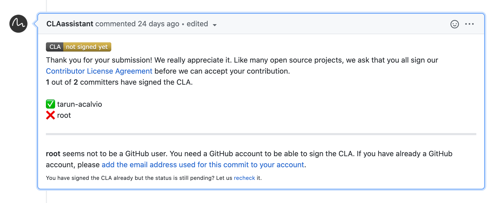

## What IDE should I use?

When it comes to an External IDE, you should stick to what you're comfortable with.

We developed a free [VSCode extension](vscode-extension) that simplifies/automates a few tasks such as:

- Running unit tests
- Creating a blank integration or automation script
- Uploading/Downloading your integration code to/from Cortex XSOAR

However, if you want to a different IDE (Sublime, vi, emacs, etc.) it's totally fine! It just means that some of those tasks must be performed manually. To automate them, you can use the  [demisto-sdk](https://docs-cortex.paloaltonetworks.com/r/1/Demisto-SDK-Guide/Introduction-to-Demisto-SDK).

You can also write code directly in the [Cortex XSOAR UI](../concepts/xsoar-ide) but is not recommended if you want to contribute supported content. Check [here](getting-started-guide#creating-new-content) for details.

:::note
Please note that IDEs are used only for writing Integrations and Automations, everything else (i.e. Playbooks/Dashboards/Layouts/etc.) should be done in the Cortex XSOAR UI
:::

## Which tools should I use?

While everything can be done in the XSOAR UI, for complex solutions and supported contributions you'll probably need a combination of both the Cortex XSOAR UI and other tools.

As a general rule of the thumb, we recommend that you use an external IDE (i.e. [VSCode extension](vscode-extension) paired with demisto-sdk when:

- Working on your [integration or script code](../integrations/code-conventions) (YourIntegration.py).
- Working on the [unit tests](../integrations/unit-testing) (YourIntegration_test.py).
- Working on the [Pack documentation](../documentation/pack-docs) (pack-metadata.json).
- Auto-generating the [README files](../documentation/readme_file) (README.md).
- Working on the [release notes](../documentation/release-notes).
- Running the [linting](../integrations/linting) and unit testing of your code.

Instead, you should use the Cortex XSOAR UI when:

- Creating [Playbooks](../playbooks/playbooks).
- Creating all the non-code entities (i.e. everything but Integrations and Scripts), such as:
  - Incident Fields, Types and Layouts.
  - Indicator Fields, Types and Layouts.
  - Classifiers and Mappers.
  - Widgets.
  - Dashboards.
- Working on the properties of your integration/script (parameters, commands, arguments, outputs, etc.) in the [YAML file](../integrations/yaml-file) - this can also be done with the [Visual Studio Code extension](vscode-extension).
- Testing the User Experience of your work.

For a more detailed explanation  about the needed tools visit the [Getting Started Guide](../concepts/getting-started-guide#using-the-right-tools).

## What programming languages do you support for Integrations and Automations?

### Python

The preferred development language is Python, which provides a wider set of capabilities and tools. Cortex XSOAR supports both Python2 and Python3. We require new contributions to be developed in Python3 (3.7+).

### Powershell

Cortex XSOAR supports PowerShell integrations and scripts. However at the moment the amount of content written in PowerShell is minimal, so we recommend PowerShell only for advanced users as you won't find many examples to look at.

### JavaScript

Cortex XSOAR supports JavaScript integrations and scripts but mainly to support older content, new contributed integrations and scripts must be developed in Python.

## Which OSs are supported for development?

Our recommended OS for development is either macOS or Linux, as we use bash and docker in some of our validation/testing flows.

If you are working on Windows, you can either work with a Linux VM or use [Windows Subsystem for Linux](https://docs.microsoft.com/en-us/windows/wsl/install-win10).

## Licensing

Cortex XSOAR content repository has a [MIT License](https://github.com/demisto/content/blob/master/LICENSE).

## CLA is pending even though I signed the agreement

The CLA should be signed by all committers of the branch. The CLA bot will let you know who are the committers who have not yet signed the agreement by marking them with a red `X` like this:

If the missing user appears under one of your commits (can be checked by visiting the `Commits` tab in the PR), it probably means that one of your commits was done using this user. Try the following:

1. If you have the credentials for the missing user, try to log-in and sign the CLA, then click the `recheck` button at the bottom of the CLA message.
2. Try to link your commits: add the email address of the missing user to your GitHub email settings, then click the `recheck` button at the bottom of the CLA message.
3. If the missing user is not a real user or named `Root` you will need to open a new branch: 
    - In your local environment - manually copy the code you have edited (most of the time you can copy the entire pack) to another location.
    - Checkout the master branch.
    - Create a new branch.
    - Paste the code from before into your new branch.
    - Commit and push your new branch.
    - Open a new Pull Request for the new branch. **Don't forget to close the old PR and delete the old branch.**
4. If the `license/cla` status check remains on *Pending*, even though all contributors have accepted the CLA, you can recheck the CLA status by visiting the following link (replace **[PRID]** with the ID of your PR): https://cla-assistant.io/check/demisto/content?pullRequest=[PRID] .

For further details visit the [Troubleshooting Guide](https://docs.github.com/en/github/committing-changes-to-your-project/why-are-my-commits-linked-to-the-wrong-user) from Github Docs site.

