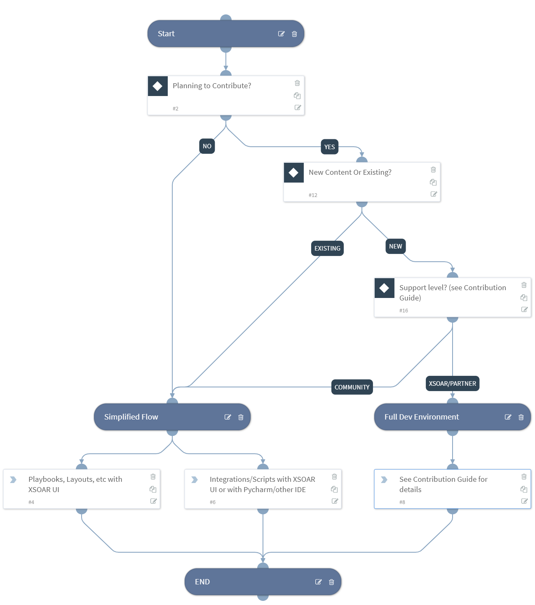

This guide will provide you with some pointers to jumpstart your development journey. After reading it, you’ll have a great background for creating content for the Cortex XSOAR platform.

If you have trouble with any of these items, please reach out for help over [Slack](https://start.paloaltonetworks.com/join-our-slack-community) on the `#demisto-developers` channel or, if you are/want to be a technology partner, also via [email](mailto:soar.alliances@paloaltonetworks.com).
 
## Before you start developing

Cortex XSOAR is a powerful platform that comes with a rich set of features and functionality that allow for a high degree of customization: we therefore recommend that you start by familiarizing yourself with the different aspects of the product:

1. Read and understand Cortex XSOAR [Concepts](../concepts/concepts).
1. Read the [FAQ](../concepts/faq).
1. Register to the [Learning Center](http://education.paloaltonetworks.com/learningcenter) and go through the [Product Training](../partners/become-a-tech-partner#3-take-required-training).
1. If you plan to publish your content to the [XSOAR Marketplace](../partners/marketplace) for other customers to use, read about the [Contribution](../contributing/contributing) process and the different tiers and support levels (partner vs community support, etc.).
1. Bookmark the links to the [Cortex XSOAR Developer Hub](https://xsoar.pan.dev/docs/) (this site) and the [Cortex XSOAR Product Documentation Page](https://docs.paloaltonetworks.com/cortex/cortex-xsoar.html).
1. Access the Palo Alto Networks [DFIR Slack Community](https://start.paloaltonetworks.com/join-our-slack-community) and join the *#demisto-developers* channel.
1. Sign up to the [Developer Newsletter](https://start.paloaltonetworks.com/cortex-xsoar-developer-newsletter.html) to receive technical updates on developing and contributing.
1. Obtain and install a copy of Cortex XSOAR. If you are not a Partner, you can obtain the Community Edition [here](https://start.paloaltonetworks.com/sign-up-for-demisto-free-edition). Installation instructions are available [here](https://docs.paloaltonetworks.com/cortex/cortex-xsoar/6-0/cortex-xsoar-admin/installation.html).
1. (only if you are integrating with an external API) Make sure you have API or SDK access to the product or solution you want to integrate with.

### Technology Partners

If you are or want to become a Technology Partner, make sure that you also:

1. Read the [Become a Technology Partner](../partners/become-a-tech-partner) page and follow the steps to sign up and sign the agreements.
1. Work with the [Cortex XSOAR Alliances Team](mailto:soar.alliances@paloaltonetworks.com) to make sure your use cases have been validated.

## Creating New Content

This site provides guidance and best practices to create production-quality XSOAR content: for those of you who want to take their work to the next level so that it will be published in the XSOAR marketplace and used by several production users worldwide in large SOCs, we offer a full [contribution](../contributing/contributing) guide to walk you through proper design, development, and documentation.

If you just want to get started and create content for your own benefit or contribute in a "community" supported way, there are no such requirements. The following flowchart summarizes the process of determining what tools you should use depending on what you want to achieve:

To summarize it in words: if you are *NOT* contributing or your contribution is meant to be *community* supported, you don't need to set up the development environment: just create everything through the [XSOAR IDE](../concepts/xsoar-ide) if you like it; if are writing code (i.e. Integrations and Scripts) and prefer to use a different IDE, check out our [Pycharm plugin](../concepts/pycharm-plugin), but feel free to use any other IDE of your choice. You can also install [demisto-sdk](https://github.com/demisto/demisto-sdk) to upload, download and run code on XSOAR directly from your operating system shell but, again, all of this is optional and is only meant to make your life easier if you are comfortable with IDEs and CLIs.

The same concept applies if you are contributing *community* supported content: we don't have strict requirements: you can just use the [XSOAR UI](../contributing/marketplace) to upload your content for review, which will automatically open a GitHub Pull Request behind the scenes to make your life easy. However, nothing prevents you to manually open a Pull Request on GitHub if you feel comfortable with it: in that case refer to the [Contribution Guidelines](../contributing/contributing) for details. 

On the other hand, if you are a Technology Partner or you are creating high quality content that is meant to be properly *supported* and used in production SOCs, you **must** follow the [Contribution Guidelines](../contributing): follow the best practice, write Unit Tests, document your content, install `demisto-sdk` and `docker` and upload your contribution through a GitHub Pull Request.

## Modifying Existing Content

If want to fix a bug or enhance an existing Integration, Script, Playbook that is currently part of the Cortex XSOAR content repository, we recommend you to copy and modify it directly in the XSOAR UI.

If you want to contribute your change, most of the time using the [XSOAR UI](../contributing/marketplace) to contribute will suffice. However, if the change is significant (i.e. the content you are adding is more than a small code enhancement or bug fix), we still recommend to follow the guidelines suggested in the [#Creating New Content] section.

