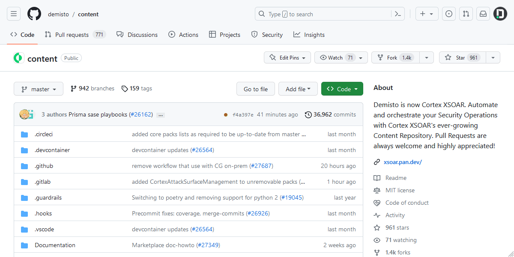

This article describes the contribution process for Cortex XSOAR content.  
Contributing allows clients / partners who made custom content, enhancements to existing content, and bug fixes, to share them with the community by making them publicly available in [Marketplace](/marketplace).  
Content can be either partner or community supported, and can be either [free or paid](../partners/premium-packs#pricing).

All content (except for paid content packs) is open source, and is hosted on the [Cortex XSOAR Content GitHub Repository](https://github.com/demisto/content), licensed under the [MIT license](https://github.com/demisto/content/blob/master/LICENSE).  

**If you have any questions or need support, feel free to reach out to us on the `#demisto-developers` channel on our [Slack DFIR Community](https://www.demisto.com/community/).**  
:::note
This article is only for content contributions.
For documentation contributions, refer to [Documentation Contributions](docs-contrib).  
:::

## Content Support Types
Contributions can be either *officially supported* (by Palo Alto Networks, a Technology Partner, or an individual), or *community supported*.  

### Officially Supported Packs
Officially supported packs include an email address or a website of the contributor for customers to contact for support (that they will be referred to in case of an issue), and have a more strict quality-control process.

### Community Supported Packs
Community supported packs on the other hand, do not have a support contact (customers will be able to ask questions on our [Live Community Forum](https://live.paloaltonetworks.com/t5/cortex-xsoar-discussions/bd-p/Cortex_XSOAR_Discussions)), and will have a less strict quality-control process.

:::info
Contributed content for Palo Alto Networks products (e.g., PAN-OS, XDR, etc.) will be adopted and supported by the Cortex XSOAR Content team.  
:::

## Contribution Methods
After creating new content to contribute, you must submit your content to Palo Alto Networks. The Cortex XSOAR Content Team will review and approve it before it becomes available to customers.
Before starting to work on a contribution, it is recommended to go over the [Contribution SLA](../contributing/sla) article.

**There are several ways to submit contributions:**

### Cortex XSOAR Content GitHub Repository (Pull Request)
Contribute by creating a fork and opening a pull request on the [Cortex XSOAR Content GitHub repository](https://github.com/demisto/content).  
Use this method in the following scenarios:
* You are a Technology Partner contributing with *partner* supported new content.
* Your contribution is big and contains lots of different parts (integrations, scripts, playbooks, layouts, etc.) that is likely to lead to a complex review process.
* You are proficient with GitHub.

:::tip
For contributing through GitHub, we recommend to use a GitHub Codespace, which will provide you with a pre-configured ready-to-use development environment.  
This method is still experimental, but will make the contribution, development, and review processes much easier.  

For more information and a step-by-step guide, see the dedicated [GitHub Codespace Setup tutorial](../tutorials/tut-setup-dev-codespace.md).
:::

### Cortex XSOAR Marketplace
Contribute from within Cortex XSOAR's UI using [Marketplace](../contributing/marketplace).  
This method is more simple, and doesn't require you to set up a development environment or be familiar with Git.  

Contributing from the marketplace has several limitations:
* The built-in editor is very limited and does not support features that full-fledged IDEs have.
* Documentation files (README, instance configuration help, etc.) cannot be created or edited.
* Unit tests cannot be created or updated.
* Private content packs cannot be contributed this way.

Because of these limitations, we do not recommend using this method for large contributions, and we recommend using it only in the following scenarios:
* Individual contributors, contributing content that is *community supported*.
* Small contributions (ex: a bug fix) to **existing** content (whether it's *XSOAR supported* or *partner supported*).

### A Private GitHub Repository (Premium Packs)
Contributing from a private GitHub repository is required only when the contribution is for a **Premium** (paid) content pack.  
The requirements are the same as supported packs, and the contribution process of premium packs is described in [the following dedicated article](../packs/premium_packs).

---

:::note
The following sections are necessary only for *officially supported* contributions,
but we still recommended to read them even if you are contributing *community supported* content in order to be aware of the best practices.  

The *Pull Request Process* section is not relevant for contributions that were created from Marketplace.
:::

## Guidelines
Carefully review the following guidelines, as they will greatly enhance the likelihood of a swift, streamlined, and efficient review process for all parties involved. If you have any questions or require clarification, feel free to contact us through the Slack platform using the #demisto-developers channel.

1. Begin by designing your contribution. We recommend to follow the [design guidelines](../concepts/design) to identify what you want to build and make sure it is aligned with our best practices. Also check out the [design tutorial](../tutorials/tut-design).
2. Make sure you have all the [Contributing Requirements](../contributing/contrib-requirements) satisfied.
3. Set up a development environment by following the short [Development Setup](../concepts/dev-setup) guide and the more detailed [tutorial](../tutorials/tut-setup-dev), 
    or [use a pre-configured GitHub Codespace environment](../tutorials/tut-setup-dev-codespace.md).
4. Follow the [Content Pack Structure](../packs/packs-format) to build your contribution.  
    The "[demisto-sdk init](https://github.com/demisto/demisto-sdk/blob/master/demisto_sdk/commands/init/README.md)" command will help you create the basic structure.
5. If you are updating an **existing** content pack, make you have the latest available version installed before proceeding.
6. Depending on the content entities you need to build, navigate to the specific section of this website for details.  
    If you are creating integrations and / or scripts (aka *automations*), make sure that you:
    * Use the proper [Directory Structure](../integrations/package-dir).  
        [demisto-sdk init](https://github.com/demisto/demisto-sdk/blob/master/demisto_sdk/commands/init/README.md) will help you create it.  
        If working on existing code that doesn't follow this structure, we require converting to this structure (as long as the changes aren't minor), as it allows running linting and unit-tests, and provides a smoother review process.
    * Understand the structure of the [YAML file](../integrations/yaml-file), and the [parameter types](../integrations/parameter-types) within it.
    * Make sure your integration follows our [logo guidelines](../integrations/integration-logo).
    * Read and follow the instructed [Python code conventions](../integrations/code-conventions), or [PowerShell code conventions](../integrations/powershell-code) (advanced users only).
    * If your integration generates incidents, follow the [Fetch Incidents guidelines](../integrations/fetching-incidents).
    * Make sure your commands make proper use of the [Context](../integrations/context-and-outputs), including [Context Standards](../integrations/context-standards-about) and [DBotScore](../integrations/dbot).
    * Make sure to create unit tests as documented [here](../integrations/unit-testing), and that the various linters we support pass as detailed [here](../integrations/linting).
    * Document your contributed content by generating the [README File](../documentation/readme_file).
7. Create [Pack Documentation](../documentation/pack-docs).  
    Make sure you follow the [Documentation Best Practices](../documentation/documentation_tips).
8. When creating new versions of your content pack, make sure to document your changes in a release notes file as detailed [here](../documentation/release-notes).

At this point you should be ready to submit a Pull Request!  
Check out our [Contributing Checklist](../contributing/checklist) to make sure you have all the parts you need.

:::tip
[Hello World Content Pack](https://github.com/demisto/content/tree/master/Packs/HelloWorld) is a good example that implements all of the above guidelines and can be used as a reference (alongside the [Hello World Design Document](https://docs.google.com/document/d/1wETtBEKg37PHNU8tYeB56M1LE314ux086z3HFeF_cX0)).
:::

:::note
If you are an XSOAR Technology Partner, make sure the [Cortex XSOAR Alliances Team](mailto:soar.alliances@paloaltonetworks.com) has reviewed your planned contribution, and that you have a *Partner ID* to associate your Pull Request to.
:::

## Pull Request Submission Process
### Prerequisites
Before submitting a Pull Request to the [Cortex XSOAR GitHub Repository](https://github.com/demisto/content), the following requirements must be met:
1. Make sure to check the content contribution [checklist](../contributing/checklist), and assure that all the required files exist and are properly formatted.
2. Create and upload your contribution to a GitHub **fork** of the XSOAR Content repository, and submit your changes **on a new branch** (do **not** push your changes to the *master* branch).
3. Validate your content using [demisto-sdk validate](https://github.com/demisto/demisto-sdk/blob/master/demisto_sdk/commands/validate/README.md):  
    `demisto-sdk validate -i Packs/YourPackName`
4. If your contribution has integrations or scripts, run linting (which also runs [unit-tests](../tutorials/tut-setup-dev#step-5-run-the-linter-and-unit-tests)) by running:  
    `demisto-sdk lint -i Packs/YourPakName`
5. Create a short demo video presenting the product and your pack, and link it.  
    This will help our reviewers to better understand what the product is used for, and how the newly contributed content integrates with it.

*Creating a new fork*

### Pull Request Creation
After all the prerequisites are met, and you are ready to create your pull request, commit and push your work to the branch you created in your forked repository (if you haven't already done so).  
After pushing your changes to the remote branch on GitHub, GitHub should automatically detect the changes, and a green **Compare & pull request** button will appear at the top.  
Click it, and then on the opened form, update the title and the description (using the pre-existing template), and click "Create pull request".  

For additional information on how to create a Pull Request from a fork, refer to [official GitHub documentation](https://help.github.com/articles/creating-a-pull-request-from-a-fork).

*Creating a new PR*

:::note
There will be a setting at the top of the form, to determine where the pull request will be opened.  
By default, it will open the pull request from your fork on the branch you created, to the `master` branch of the base Cortex XSOAR Content repository.  
This is the desired behavior, and should not be changed.
:::

### Post-Submission
After submitting your pull request, sign our [Contributor License Agreement (CLA)](https://github.com/demisto/content/blob/master/docs/cla.pdf), and monitor your pull request.  

Our Content team will review your code, and might ask questions and request changes.  

In order to establish a proper release timeframe for your contribution, you are required to respond (and apply the requested changes, if any) within 14 days.  
Stale pull requests will be closed.

At some point, when the review process is complete (or close to completion), we'll ask to schedule a meeting for an interactive demo.  

Prepare for it, and make sure you have a working instance of Cortex XSOAR, with your contributed pack fully configured.  
Check out our [Contribution Demo Page](../contributing/demo-prep) for additional information.

:::caution
As part of the pull request template, you will be asked to fill in the [contribution registration form](https://forms.gle/XDfxU4E61ZwEESSMA).  
Make sure to do so, as without it, we will not be able to start the review process for your contribution.
:::

:::info
If after signing the CLA it still shows as unsigned, refer to the [FAQ](../concepts/faq#cla-is-pending-even-though-i-signed-the-agreement) for possible solutions.
:::

For more details on how to properly create and manage your pull request, check out the dedicated [Pull Request Conventions](../contributing/conventions) article.
