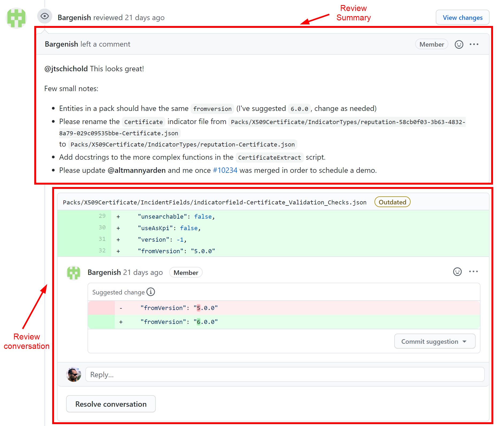

If you open a GitHub Pull Request (PR) against the Cortex XSOAR [repository](https://github.com/demisto/content), a reviewer from the Content Team will be assigned and will accompany you in the process of getting your contribution released. We receive lots of contributions and, while our reviewers always stay on top of all the requests, we recommend you to check the PR updates often and, if you think the process is stalled, feel free to "ping" the assigned reviewer by adding a new comment to the PR with a [mention](https://github.blog/2011-03-23-mention-somebody-they-re-notified/) or reach out in the `#demisto-developers` channel on our Slack [Community](https://dfircommunity.slack.com).

We value your contributions and want to make sure that your experience is smooth and easy and to reduce the amount of time and effort required to the minimum: in order to achieve it, we kindly ask for your support in following a few guidelines that will help.

Please use the following guidelines when working on the changes requested by our reviewers:
- Use clear and brief messages for your commits ([this article](https://chris.beams.io/posts/git-commit/) has good examples).

- Do **NOT** use force pushes (i.e. `git push --force`): if you end up in a situation where you need to force push, it's probably better to reach to us and ask (in the PR itself or via [Slack](https://dfircommunity.slack.com)).

- During the process our reviewers might ask for several changes: please work through the entire list and commit all the changes.

- The review usually has a *summary* and several *conversations*: make sure you address all the comments, including the ones in the summary.

    

- Once you have pushed all requested changes, please ask for a new review by navigating to Reviewers section in the right sidebar in GitHub and click the ⭯ icon next to the reviewer's name.

- 

You will see a few [GitHub Status Checks](https://help.github.com/en/github/collaborating-with-issues-and-pull-requests/about-status-checks) that help validate that your pull request is according to our standards

Keeping on indicative commit messages
Not using force pushes
Submitting all needed changes and not part of them (we've seen contributors that commit part of the changes and then dissapear)
Asking for a re-review after committing all changes
When making the changes, pay attention also to the review summary (we write there the changes that are related to a whole file, i.e. that aren't related to a specific line)
Make sure the build passes and pay attention to it (also add an explanation of our build process and how to use it)
Not resolving comments, rather commenting "done" and leaving resolving up to the reviewer.
Do not open a new PR unless absolutely necessary, as it will make it hard for the reviewer to track their comments.