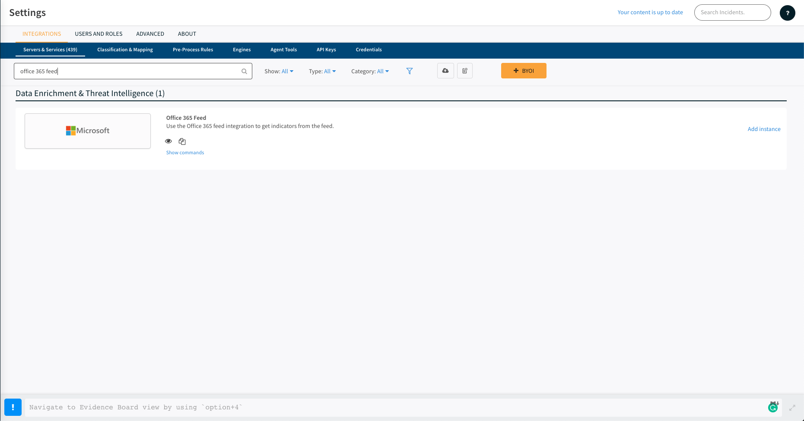

This guide will provide a reference on how to manually migrate the functionality of Minemeld nodes to the appropriate Cortex XSOAR integrations. After reading it, you’ll be well equipped  to make the switch from Minemeld to Cortex XSOAR.

## Conceptual Introduction

In Minemeld, the product revolves around the concept of nodes. Nodes have three different types, "miner"s, "processor"s, and "outbound" nodes and together, these three node types represent the entire functionality of Minemeld. Simply put, Minemeld can be broken down into a data flow composed of three steps, data ingestion, data processing, and data export with these three steps corresponding to the node types "miner", "processor", and "outbound" respectively. The flow of data described in a little more detail is as follows:
| Step | Node Type |
| ---- | ---------:|
| 1. Data Ingestion: ingest data from a variety of sources or _feeds_ | **miner** |
| 2. Data Processing: process the data in some fashion, for example - aggregate data from different sources, filter data by type, tag the data, etc. | **processor** |
| 3. Data Export: make processed data available for external consumption | **outbound** |

Whereas in Minemeld the flow of data is divided into the three previously described node types, in Cortex XSOAR, data flow is split into two - Feed Integrations, and Outbound Integrations. Cortex XSOAR provides dedicated Feed Integrations for many feed sources out of the box as well as generic Feed Integrations that can be configured to work with many feed sources for which explicit Feed Integrations have not been created. Unlike how in Minemeld the outputs of a **miner** node (the indicators fetched from a feed source) would need to be specified as the input of other node(s), all indicators fetched from Feed Integrations in Cortex XSOAR flow into the Cortex XSOAR instance's indicator store. Because the Cortex XSOAR indicator store already supports the mechanism of searching and filtering indicators, we are able to condense what in Minemeld was the flow of indicators into a **processor** node and then an **output** node into configuring a single instance of our *Export Indicators Service* integration. When configuring an instance of the *Export Indicators Service* integration, we can enter an indicator query (using the query syntax one would use to search and filter indicators in the Indicators page of your Cortex XSOAR instance) that determines exactly which indicators will be made available by this integration instance for external consumption.


## Minemeld Prototype to Cortex XSOAR Integration Mapping

The **Parameter Configuration** displays any configuration parameters that need to be specified for the corresponding integration in order for the integration instance to fetch indicators from the same source as the related prototype. The required configuration parameters will be presented as a list of keys and values where the key is the name of the configuration parameter and the value is what the user needs to enter or select. If no parameters are listed, this means that the user does not need to specify any parameter values for that integration instance.

| Prototype | Integration | Parameter Configuration |
| --------- | ----------- | ----------------------- |
| alienvault.reputation | Alienvault Reputation Feed | |
| aws.\<service\> | AWS Feed | **Sub-Feeds**: \<service\> |
| azure.cloudIPs | Azure Feed | |
| bambenekconsulting.\<service\> | Bambenek Consulting Feed | **Sub-Feeds**: \<service-url\> |
| blocklist_de.\<service\> | Blocklist_de Feed | **Sub-Feeds**: \<service\> |
| bruteforceblocker.blist | BruteForceBlocker Feed | |
| cloudflare.\<service\> | Cloudflare Feed | **Sub-Feeds**: \<service-url\> |
| dshield.block | DShield Feed | |
| fastly.ipv4 | Fastly Feed | |
| feodotracker.badips | Feodo Tracker IP Blocklist Feed | **Feed Source**: Last 30 Days |
| feodotracker.ipblocklist | Feodo Tracker IP Blocklist Feed | **Feed Source**: Currently Active |
| feodotracker.hashes | Feodo Tracker Hashes Feed | |
| malwaredomainlist.ip | Malware Domain List Active IPs Feed | |
| o365-api.\<region\>-\<service\> | Office 365 Feed | **Regions**: \<region\><br>**Services**: \<service\> |
| phishme.Intelligence | Cofense Feed | **Username**: \<your-cofense-username\><br>**Password**: \<your-cofense-password\> |
| proofpoint.EmergingThreatsDomains | Proofpoint Feed | **Authorization Code**: \<key-from-proofpoint-used-to-access-the-api\><br>**Indicator Reputation**: \<what-reputation-to-assign-indicators-fetched-from-this-feed\><br>**Indicator Type**: domain |
| proofpoint.EmergingThreatsIPs | Proofpoint Feed | **Authorization Code**: \<key-from-proofpoint-used-to-access-the-api\><br>**Indicator Reputation**: \<what-reputation-to-assign-indicators-fetched-from-this-feed\><br>**Indicator Type**: ip |
| recordedfuture.MasterRiskList | Recorded Future RiskList Feed | **Indicator Type**: \<the-type-of-indicator-to-fetch-from-this-feed\><br>**API token**: \<your-recorded-future-api-token\> |
| spamhaus.\<service\> | Spamhaus Feed | **Sub-Feeds**: \<service-url\> |
| sslabusech.ipblacklist | abuse.ch SSL Blacklist Feed | **Sub-Feeds**: https://sslbl.abuse.ch/blacklist/sslipblacklist.csv |
| tor.exit_addresses | Tor Exit Addresses Feed | |


## AWS Feed Example

Let's look at a specific example to better understand how to migrate a given Minemeld node. If we wanted to migrate the AWS feed shown in the Minemeld configuration file as follows,
```
  allow-ip_aws_cloudfront:
    inputs: []
    output: true
    prototype: aws.CLOUDFRONT
```
There is a node named `allow-ip_aws_cloudfront` which uses the prototype `aws.CLOUDFRONT`. The `aws` prototypes appear in the AutoFocus-hosted Minemeld UI as in the following screenshot.

</img>

If we click on the `aws.CLOUDFRONT` prototype, we are presented with more details about it. The attributes that we need to look at currently for configuring an instance of Cortex XSOAR's AWS Feed integration correctly are under the `config` key.

</img>

Alternatively, we can also find all of this information in the Minemeld GitHub repository. All of the prototypes that come out of the box can be found in the Minemeld repository on GitHub [here](https://github.com/PaloAltoNetworks/minemeld-node-prototypes/tree/master/prototypes). Listed there are all the files in which all of Minemeld's prototypes can be found. Since the prototype in our example begins with the prefix `aws`, we know the prototype we are looking for can be found in the [aws.yml](https://github.com/PaloAltoNetworks/minemeld-node-prototypes/blob/master/prototypes/aws.yml) YAML file. In this file, if we look under the `prototypes` key for `CLOUDFRONT`, we find the following,
```
    CLOUDFRONT:
        author: MineMeld Core Team
        development_status: STABLE
        description: CLOUDFRONT ranges
        node_type: miner
        indicator_types:
            - IPv4
        tags:
            - ConfidenceHigh
            - ShareLevelGreen
        class: minemeld.ft.json.SimpleJSON
        config:
            source_name: aws.CLOUDFRONT
            url: https://ip-ranges.amazonaws.com/ip-ranges.json
            extractor: "prefixes[?service=='CLOUDFRONT']"
            prefix: aws
            indicator: ip_prefix
            fields:
                - region
                - service
            age_out:
                default: null
                sudden_death: true
                interval: 257
            attributes:
                type: IPv4
                confidence: 100
                share_level: green
```

Let's look at the AWS Feed integration and see how to take these attributes from the Minemeld prototype and translate them to Cortex XSOAR. As shown in the screenshot below, if we do a search for 'aws feed', the _AWS Feed_ integration appears.

</img>

Let's configure an instance.

</img>

As you can see in the screenshot above, Cortex XSOAR provides default values for many of the configuration parameters as determined by the source of the feed. To configure the integration instance to fetch from the same source as the Minemeld node we are migrating from, we only need to update a single parameter. In this particular case, we only need to click the `Sub-Feeds` dropdown menu and click `CLOUDFRONT`. 

</img>

Notice that there is also a multi-select parameter, `Regions`, which we could use if we wanted to filter indicators returned by this `AWS Feed` integration instance by their associated region data field. Since, in our case, we are content to return indicators from all regions, we do not need to adjust this parameter. And as easy as that, we've finished configuring an instance. Let's make sure that everything is working properly by clicking the `Test` button at the bottom of the configuration panel. If everything is working as expected, a green 'Success!' message should appear at the bottom of the configuration panel as shown in the screenshot below.

</img>

Click `Done` at the bottom right of the configuration panel and you're all done!


## AWS Feed Continued

As you may have noticed when configuring the `AWS Feed` instance to pull indicators from `CLOUDFRONT`, there were additional sub-feeds that you were able to select. So, if it were the case that your Minemeld configuration contained multiple nodes, as shown below, whose prototypes were prefixed with `aws`, there are two options for configuring these additional AWS feeds in Cortex XSOAR.
```
  allow-ip_aws_cloudfront:
    inputs: []
    output: true
    prototype: aws.CLOUDFRONT
  allow-ip_aws_ec2:
    inputs: []
    output: true
    prototype: aws.EC2
  allow-ip_aws_s3:
    inputs: []
    output: true
    prototype: aws.S3
```
Let's see what we could do now if we wanted to configure the `allow-ip_aws_ec2` Minemeld node, whose prototype is `aws.EC2`, in Cortex XSOAR. In the case that we want to leave the parameter values for fetching from this feed source the same as what we had for fetching indicators from `CLOUDFRONT`, then there is no need to even create a new instance. Click the cog next to our previously configured instance.

</img>

In the dropdown menu for the `Sub-Feeds` multi-select field, click `EC2`. 

</img></img>

Now, both `CLOUDFRONT` and `EC2` are selected for this instance. Click `Done` and this `AWS Feed` integration instance will now fetch indicators from AWS's `CLOUDFRONT`  _and_ `EC2` feeds.

In the case that we wanted to configure an instance of the `AWS Feed` integration to fetch from AWS's `EC2` feed _but_ we wanted it configured for different regions than the instance fetching from the `CLOUDFRONT` feed, then we would simply configure a new, separate instance of the `AWS Feed` as described in the [AWS Feed Example](#aws-feed-example) section.


## Office 365 Feed Example

Let's say we wanted to migrate this sample Office 365 node shown from a Minemeld configuration,
```
  allow-multi_o365-worldwide-any:
    inputs: []
    output: true
    prototype: o365-api.worldwide-any
```
There is a node named `allow-multi_o365-worldwide-any` which uses the prototype `o365-api.worldwide-any`. The `o365-api` prototypes appear in the AutoFocus-hosted Minemeld UI as in the following screenshot.

</img>

If we click on the `o365-api.worldwide-any` prototype, we are presented with more details about it. The attributes that we need to look at currently for configuring an instance of Cortex XSOAR's Office 365 Feed integration correctly are under the `config` key.

</img>

Alternatively, we can also find all of this information in the Minemeld GitHub repository. All of the prototypes that come out of the box can be found in the Minemeld repository on GitHub [here](https://github.com/PaloAltoNetworks/minemeld-node-prototypes/tree/master/prototypes). Listed there are all the files in which all of Minemeld's prototypes can be found. Since the prototype in our example begins with the prefix `o365-api`, we know the prototype we are looking for can be found in the [o365-api.yml](https://github.com/PaloAltoNetworks/minemeld-node-prototypes/blob/master/prototypes/o365-api.yml) YAML file. In this file, if we look under the `prototypes` key for `worldwide-any`, we find the following,
```
    worldwide-any:
        author: MineMeld Core Team
        development_status: STABLE
        node_type: miner
        indicator_types:
            - URL
            - IPv6
            - IPv4
        tags:
            - ShareLevelGreen
            - ConfidenceHigh
        description: >
            Endpoints for O365, worldwide instance, any service
        class: minemeld.ft.o365.O365API
        config:
            instance: Worldwide
            service_areas: null
            age_out:
                default: null
                sudden_death: true
                interval: 1800
            attributes:
                confidence: 100
                share_level: green
```

Let's look at the Office 365 Feed integration and see how to take these attributes from the Minemeld prototype and translate them to Cortex XSOAR. As shown in the screenshot below, if we do a search for 'office 365 feed', the _Office 365 Feed_ integration appears.

</img>

Let's configure an instance.

</img>

As you can see in the screenshot above, Cortex XSOAR provides default values for many of the configuration parameters as determined by the source of the feed. To configure the integration instance to fetch from the same source as the Minemeld node we are migrating from, we do not need to make any adjustments because the default values for the **Regions** and **Services** configuration parameters are *Worldwide* and *All* respectively, which are the values we need to migrate this particular prototype. 

Click `Done` at the bottom right of the configuration panel and you're all set!

Let's explore two other cases.
Let us say you wanted to migrate two other Office 365 prototypes instead of the one previously described. You want to migrate these two nodes from a Minemeld configuration for example,
```yaml
  allow_o365-china-exchange:
    inputs: []
    output: true
    prototype: o365-api.china-exchange
  allow_o365-germany-exchange:
    inputs: []
    output: true
    prototype: o365-api.germany-exchange
```

We can configure one instance of the _Office 365 Feed_ integration with **Regions** set to *China* and *Germany* and **Services** set to *Exchange*, as shown in the following screenshot.

</img>

In the second case, let's say you wanted to migrate the two nodes from your Minemeld configuration that appear as follows,
```yaml
  allow_o365-china-exchange:
    inputs: []
    output: true
    prototype: o365-api.china-exchange
  allow_o365-germany-skype:
    inputs: []
    output: true
    prototype: o365-api.germany-skype
```

Since these are non-overlapping, we should instead configure two instances of the _Office 365 Feed_ integration. One instance with **Regions** set to *China* and **Services** set to *Exchange* and the other instance with **Regions** set to *Germany* and **Services** set to *Skype* as shown in the screenshots below.

</img></img>


## Migrating Output Nodes

Outputting indicators with Cortex XSOAR can be performed with two integrations, _Palo Alto Networks PAN-OS EDL Service_ and _Export Indicators Service_. Migrating Minemeld output nodes to Cortex XSOAR is a process that requires looking at the prototype of a given output node, as well as the prototypes of all of the nodes that flow into that output node. We need to do this to understand how to construct the query we will enter when configuring an instance of the _Palo Alto Networks PAN-OS EDL Service_ or _Export Indicators Service_ integration.

Looking at a concrete example will better demonstrate how this is done. Here is an example output node in Minemeld.

</img>

The first step is to look at the output node's prototype which we can do by clicking the link `stdlib.feedHCGreenWithValue` in the previous screenshot. It appears as follows.

</img>

We see in the `config` section that this prototype filters for indicators whose `confidence` is greater than 75 and whose `share_level` is 'green' - this is the first bit of information we need.
Now let's go back to the node's inputs. We need to explore each one. Our example only has one input node listed - let's explore it by clicking the link there `aggregatorIPv4Inbound-clone-MLB`.

</img>

Let's see the details of the node's prototype by clicking the prototype linked there - `stdlib.aggregatorIPv4Inbound`.

</img>

We see in the `config` section that this prototype filters for indicators whose `type` is 'IPv4' - let's file this information away for when we configure an integration instance in Cortex XSOAR.
Now if we go back to the aggregator node, we see that it too only has one input node listed. Let's perform the same actions as before and we'll be finished gathering the information we need. Let's click on the input node linked as `exit_addresses-clone-MLB`.

</img>

Click on the prototype listed there, `tor.exit_addresses`, to see its details.

We know from the table mapping Minemeld prototypes to Cortex XSOAR integrations detailed [above](#Minemeld-Prototype-to-Cortex-XSOAR-Integration-Mapping) that the `tor.exit_addresses` prototype maps to the _Tor Exit Addresses Feed_ integration. And with that, we have all the information we need to move forward. Let's review and gather here the information we collected from looking at the output node we want to migrate, and all the nodes that flow into it.
1. filters for indicators whose `confidence` is greater than 75 and whose `share_level` is 'green'
2. filters for indicators whose `type` is 'IPv4'
3. the `tor.exit_addresses` prototype maps to the _Tor Exit Addresses Feed_ integration

Let's configure an instance of the _Export Indicators Service_ integration using the information we collected to construct the query that defines which indicators are made available. Search for 'export indicators' in your Cortex XSOAR's integrations page as seen in the following screenshot.

</img>

When configuring an instance of this integration, we need to provide an `Indicator Query`. The value entered here uses the same query syntax one would use in the Cortex XSOAR's indicators page to filter and search for specific indicators.

</img>

So the information we gathered previously, translated to Cortex XSOAR's indicators query syntax would be,
```
type:IP and sourceBrands:"Tor Exit Addresses Feed" and confidence:>75 and trafficlightprotocol:Green
```
Enter that value for the **Indicator Query**.

</img>

Finish configuring the integration to your desired specifications and press `Done`.