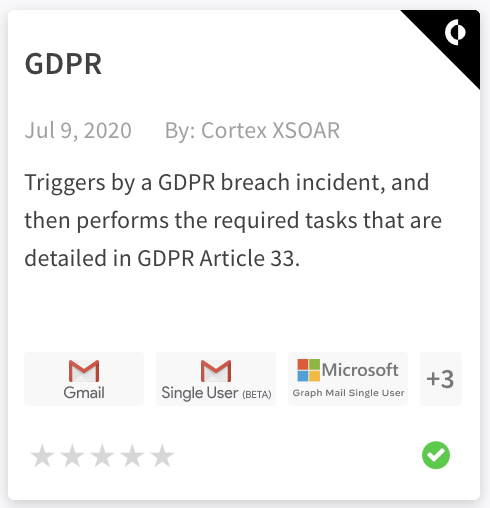
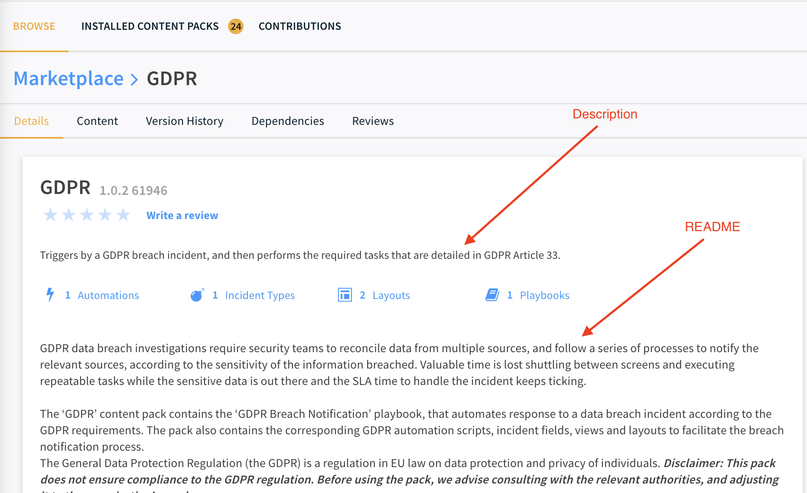

Content Packs displayed in the Cortex XSOAR Marketplace contain 2 main documentation sections: 
* **Description**: displayed in the Content Pack card when browsing the Marketplace and in the top of the *Details* tab.
* **README**: displayed in the main display area of the *Details* tab.

#### Screenshots
* *Description* in Pack display card: <br/>  
</img>  
* Details Tab with *Description* and *README*:
    


## Pack Description
The pack description is the first bit of information that users will see when they see your content pack. It's important to give a detailed, thorough description of what the pack contains, use cases, and overall benefits of the pack. The Pack Description is maintained in the `pack_metadata.json` file under the description field. Packs should always contain a description, even if a README file is provided with more details. This is to allow users to get a short overview of the Pack when browsing the Marketplace.

### General Description Guidelines
- Short and to the point
- Convey gain/benefit for user
- If possible - what is unique about this pack (e.g. minimal, extended, fast, thorough, streamlined etc.)
- Use active voice (You, yours, do, use, investigate) where possible
- Omit redundancy (Do not repeat the name of the pack, do not start with "Use this…")
- Must respect product capitalization (e.g. Content Pack)
- Constant tense (e.g. if "Engages" than "investigates", not "investigating")
- Up to 150 chars
- Up to 4 lines

#### An example of turning a "fat" description into a "lean" description:
**Before** 300 chars / 44 words:  
Use this content pack to investigate and remediate a potential phishing incident. The playbook simultaneously engages with the user that triggered the incident, while investigating the incident itself and enriching the relevant IOCs.
The final remediation tasks are always decided by a human analyst.

**After** 139 chars / 10 words :  
Streamline Investigation and remediation of Phishing incidents. Playbook engages with users while simultaneously investigates and enriches.

#### An example of turning a "passive" description into a "active" description:
**Before** (passive and impersonal):  
Provides data enrichment for domains and IP addresses.

**After** (active and personal) :  
Enrichment for your domains and IP addresses.

Here are some templates that can help you get started:

* "Streamline your _______ process for  _______. Optimized for _________ and ________ this _______ targeted Content Pack is ideal for _____________"
* "Eliminate ________ by improving your__________. Rich with layouts and playbooks, this Content Pack is right for ____________"
* "Get smarter. This pack utilizes _________ and _______for when _________ is heavily needed"

## Pack README
For larger packs that provide at least one end-to-end use case you should create a detailed README file for the pack that will be displayed in the *Details* tab of the pack in the Marketplace. The `README.md` file should be markdown formatted and placed in the Packs root directory. The file should contain a more detailed overview of the Pack compared to the *Description* section. You are free to add any information you see fit to include about the pack. It is recommended to provide an overview of what the Pack does and how to start working with the Pack.  

### README structure
Notes:
- If the pack is a ***beta*** pack, add the following at the very beginning of the pack README file:
_Note: This is a beta pack, which lets you implement and test pre-release software. Since the pack is beta, it might contain bugs. Updates to the pack during the beta phase might include non-backward compatible features. We appreciate your feedback on the quality and usability of the pack to help us identify issues, fix them, and continually improve._
- If the pack is adopted, add the correct text as specified on the [Adopt-a-Pack page](../partners/adopt.md#text-for-the-pack).

Each pack readme should contain:
1. A short paragraph connecting real-life situations to the pack use cases.
1. A "What does this pack do?" section, explaining point-by-point the capabilities of the pack or the main playbook of the pack.
1. (Optional): a sentence or two detailing the contents of the pack.
1. Mostly relevant for use-case packs that contain multiple playbooks: a reference to the README of the **main playbook** of the pack that contains the playbook logic. Add the following:
_For more information, visit the Cortex XSOAR Developer Docs_
Note that "Cortex XSOAR Developer Docs" should link **directly to the readme of the main playbook**. An example of what is linked in the Phishing pack: https://xsoar.pan.dev/docs/reference/playbooks/phishing-investigation---generic-v2
1. For packs that contains playbooks: a youtube video or an image of the main playbook of the pack. The section following the pack image below explains how to add an image.


### Images
Images can provide a great addition to the Pack `README.md` and can help users to get a quick understanding of the Pack. For Packs that contain playbooks which implement a use case, we recommend including at least an image of the main use case playbook.  Images can be included only as **absolute** urls. See the [following for instructions](../documentation/readme_file#absolute-image-urls). 

### Videos
It is possible to add an image placeholder which links to an external video. For example to add an external video hosted on YouTube use the following snippet template (replace `[YOUTUBE_VIDEO_ID]` with the YouTube video ID):
```
[](https://www.youtube.com/watch?v=[YOUTUBE_VIDEO_ID] "Video Name")
```
An example of including a YouTube video can be seen at the [Zoom Feed README](https://github.com/demisto/content/blob/master/Packs/FeedZoom/README.md).

## Pack Keywords, Tags, Use-cases & Categories
In order to classify packs and make them easier to find, there are a number of pack metadata elements that you can use:
- ***Use-case*** -- a name of a situation in which packs can be used - usually the pack name. The optional approved values for use-cases are:

- ***Tags*** -- words from the same semantic field of the use-case. These make it easier to find packs using filters or the search bar, and are visible on the screen to help understand what the pack is and its benefit to users. The optional approved values for tags are:

- ***Keywords*** -- operate like tags but aren't displayed in the UI. Assists in searching for your pack. You can freely add keywords as you see fit.

For example, for a pack related to messaging, you may want to add "msg" as a keyword so when a user searches for "msg" they will find the pack, but the word "msg" won't display in the UI.

- ***Category*** -- what field/subject the pack relates to, in high level.
Your pack should fall into one of the approved existing categories:
  <details>
  <summary>Pack Categories</summary>

      Analytics & SIEM
      Authentication 
      Breach And Attack Simulation
      Case Management
      Data Enrichment & Threat Intelligence
      Database
      Deception
      Email Gateway
      Endpoint
      Forensics & Malware Analysis
      IT Services
      Messaging
      Network Security
      Utilities
      Vunerability Management  

  </details>

You may use the above information to customize these elements in the pack metadata file.

## Pack Dependencies
### What are pack dependencies?
With the introduction of Marketplace in Cortex XSOAR, the user now chooses what content they want to install and use, and that content appears in the form of Content Packs.
Pack dependencies are the requirement of one content pack, when using another pack. The implication of this is that a user in XSOAR has to install another pack to be able to use the pack they originally wish installed. That situation is generally and preferably avoidable.

Dependencies can be categorized as either optional or required/mandatory. Optional means the pack will **benefit** from the existence of the pack it depends on, while required means the pack **needs**, and **will not work** without the existence of the pack it depends on.
Some packs ship out-of-the-box with XSOAR, and so depending on them is absolutely fine. Such are the Core packs:

<details>
<summary>Core Packs</summary>

      AccessInvestigation
      Active_Directory_Query
      AutoFocus
      Base
      CommonDashboard 
      CommonPlaybooks
      CommonReports
      CommonScripts
      CommonTypes
      CommonWidgets
      DefaultPlaybook
      DemistoLocking
      DemistoRESTAPI
      ExportIndicators
      FeedTAXII
      HelloWorld
      ImageOCR
      Malware
      Phishing
      rasterize
      TIM_Processing
      TIM_SIEM
      UrlScan
      VirusTotal
      WhereIsTheEgg
      Whois

</details>

### How do you find pack dependencies?
Demisto Software Development Kit (SDK) has a command called `find-dependencies` that can detect dependencies between packs. Run the following:

``` demisto-sdk find-dependencies -p 'PackName' -i 'PathToIdSet'``` - if you have an updated id_set.json file

```demisto-sdk find-dependencies -p 'PackName'``` - if you don’t have the id_set.json file

*The `id_set.json` file defines the relationships between content elements, and dictates the dependencies accordingly. If you don't have the `id_set.json` file, it will be generated automatically during the `find-dependencies` phase. It will scan your local copy of the repository. This process may take time. If you did not make any changes that could affect dependencies in your branch, you may provide your existing `id_set.json` file to save time.*


### What are some examples of dependencies?
- A playbook from **QRadar** pack uses a playbook from the **AccessInvestigation** pack.
- A playbook from the **Employee Offboarding** pack uses an automation from the **Impossible Traveler** pack.
- A classifier from the **EWS** pack uses incident fields from the **Phishing** pack.

The dependency logic is as follows:
```
integration <-> mapper, incident type, indicator type, indicator field
classifier <-> incident type, integration 
mapper <-> incident type, incident field
incident type <-> playbook, script, integration
layout <-> incident type, indicator type, incident field, indicator field
incident field <-> incident type
playbook <-> incident field, indicator field, script, integrations
Widget <-> script
```

### What should I do about the dependencies?
When a dependency is required, that means that in order to use a certain pack, the user MUST install a different pack - a behavior we want to eliminate as much as possible. 

Sometimes the dependency is justified. In this case Gmail depends on Phishing. Phishing contains content that is absolutely needed for Gmail, so we can avoid creating duplicate content in both packs, and instead we will acknowledge this as a mandatory dependency. Due to the fact that Phishing contains such core elements, we've also decided to make Phishing a Core pack, which ships out-of-the-box, so this causes no issue and mandatory can stay true:


In other cases the dependency must be fixed by us, manually. 

### How do I fix the dependencies?
The cases can vary from one dependency to another. Fixing a dependency involves 3 parts:
1. Make the necessary adaptation in the content (change the playbook, merge packs, move files to another pack, replace a deprecated script with newer script).
2. Manually change “mandatory” to “false” in the pack dependencies - only if the dependency is actually optional and not mandatory, for example if an integration is used after a condition that ensures that it's enabled, and the flow continues normally otherwise. Another possible optional dependency is when an automation or a subplaybook is configured to be skipped if the pack is unavailable (through the advanced task settings).
3. Remove the displayedImages section.


Here are some possible cases:
- **Slack** pack depends on the **Active_Directory_Query** pack:


  - Understand which dependencies are normal. We have 2 optional dependencies which is OK. We also have 2 required dependencies, one of which is CommonTypes that belongs to the Core packs - so it’s also OK. Then we have Active_Directory_Query which should not be required when installing the Slack pack.
  - At the content of the Slack pack, locate the reason/s for the dependency. We find that the playbook `Slack - General Failed Logins v2.1` uses `ad-expire-password`:
  

  - Solve the issue. In this case - we can add a condition before this task - “Is Active Directory enabled?”. Then, if the Active_Directory_Query pack is not present, the condition will lead to “else” and we just solved the required dependency issue.
Change “mandatory” to “false” in Slack’s dependency on Active_Directory_Query.

- CortexXDR pack depends on PortScan pack:


  - Looking through the content of CortexXDR pack we find that `Cortex XDR Port Scan` incident type is configured to run `Port Scan - Generic` from the PortScan pack.
  

This one is obviously a bug, because the right playbook that should run is Cortex XDR - Port Scan, and not the generic port scan playbook.
  - Change the playbook that the incident type is tied to
  - Change mandatory to false.
  
- QRadar depends on AccessInvestigation pack
  - We see that QRadar has a playbook called `Access Investigation - QRadar` which uses `Access Investigation - Generic`.
  
  
  - Access Investigation - Generic may have to be a Core pack, if so - its mandatory dependency will be fine. Note that packs become part of the Core packs only after our consideration and approval, and the list of core packs is meant to stay very limited. As a contributor, it is highly unlikely that your pack will be Core.
Another solution may be to “skip if unavailable”. This is a feature that exists starting in XSOAR 5.5 where if the content is not available (E.g., pack is not installed), then the task and its continuous branch will be skipped:


Note: When should you skip and when should you “check if X is available”? Well, when a playbook uses a task that is tied to a certain integration, it makes sense to check if that integration is enabled beforehand, because the skipping feature only works on 5.5+. However, when a subplaybook is used, you can’t really check whether that subplaybook is available without using the “skip” feature, so in that case it should be skipped using the new feature.

** Remember that anything from the Core pack should not be changed to “mandatory=false” **
