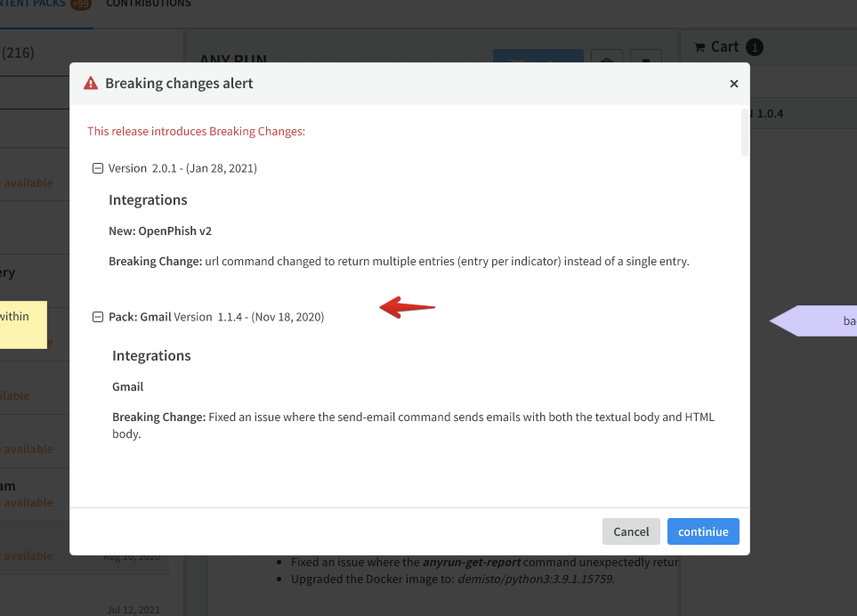

Release notes files help to keep track of the changes made for a specific content entity like an integration or a playbook.

To generate a release notes markdown file, first commit the changes to your branch and then run the following command provided by the `demisto-sdk`:

```bash
demisto-sdk update-release-notes -i [Changed pack path] -u [major|minor|revision]
```

**Please note:** Changes which have not been committed will not be detected automatically by the `update-release-notes` command.

This command will bump the `currentVersion` found in `pack_metadata.json` file automatically according to the update version (as denoted by the `-u` flag) for you.

Generally, you will use the command when you are ready to merge and expect no other changes. If you need to make additional 
changes *after* running the command, you will need to remove the `-u` argument. This will update the release notes 
file for you to fill out.

```bash
demisto-sdk update-release-notes -i [Changed pack path]
```

For more detailed information regarding the `update-release-notes` command in the `demisto-sdk`, please refer to the 
[documentation found here](https://github.com/demisto/demisto-sdk/blob/master/demisto_sdk/commands/update_release_notes/README.md).

## Naming
The release notes file will be generated for you and is found under the `ReleaseNotes` folder within each pack. If this folder does not already exist, one will be created for you.

The names for the files generated should not be changed as this will cause potential issues in the future. 


## Format
After running the `demisto-sdk` command mentioned above, the release notes file which was generated will contain a section for each entity changed in the pack as well as a placeholder (`%%UPDATE_RN%%`).
This placeholder should be replaced with a line describing what was changed for that specific entity.

For example, if changes were detected in the Cortex XDR pack for the items IncidentFields, Integrations, and Playbooks; the following would be created:
```markdown
#### Incident Fields
##### XDR Alerts
  - %%UPDATE_RN%%

#### Integrations
##### Cortex XDR - IR
  - %%UPDATE_RN%%

#### Playbooks
##### Cortex XDR - Isolate Endpoints
  - %%UPDATE_RN%%

##### Cortex XDR - Port Scan
  - %%UPDATE_RN%%

```

## MD Formatting
For single line RNs, follow this format:
```markdown
#### Integrations
##### Cortex XDR - IR
  - Release note here.
```

For single line RNs with a nested list, follow this format:
```markdown
#### Integrations
##### Cortex XDR - IR
  - Release note here.
    - List item 1
    - List item 2
```

For multiline RNs, follow this format:
```markdown
#### Integrations
##### Cortex XDR - IR
  - Release note 1 here.
  - Release note 2 here.
  - Release note 2 here.
```

For multiline RNs with nested content, follow this format:
```markdown
#### Integrations
##### Cortex XDR - IR
  - Release note 1 here.
    - List item 1
    - List item 2
  - Release note 2 here.
    - List item 1
    - List item 2
  - Release note 2 here.
```

## Examples and Best Practices

### What Should Be Logged
One should specify in the corresponding release notes file the following changes:
  - Any change made
  - Creation of a new command
  - Adding/updating parameters
  - Adding/updating arguments
  - Updating outputs
  - Fixes for customer bugs

### General
- The release notes need to be in simple language and informative. Think about what is the impact on the user and what they should know about this version.
    - Bad example: `Added the timeout parameter.`  
    - Good example: `Added the timeout parameter, which enables you to define the amount of time (in minutes) that the integration will try to execute commands before it throws an error.`

- If this is a single line release note, there is no need for the bullet point, just a regular sentence. 

Pretend you need this release note to do your work. A bad RN can easily lead to a CS ticket.

### Entity Styling  
- Command name: - should be wrapped with three stars - \*\*\*command_name***
- Packs/Integrations/scripts/playbooks and other content entities (incident fields, dashboards...) - should be wrapped with two stars - \*\*entity_name**
- Parameters/arguments/functions/outputs names - should be wrapped with one star - \*parameter_name*


### Examples  

#### Enhancement Examples
```markdown
- **MISP V2**  
You can now filter an event by attribute data fields.

- **WhatIsMyBrowser**  
Added support for the *extend-context* argument in the ***ua-parse*** command.

- **Microsoft Graph Mail**   
Added 3 commands:
    - ***msgraph-mail-list-folders***
    - ***msgraph-mail-list-child-folders***
    - ***msgraph-mail-create-folder***
```

#### Bug Fixes Examples
```markdown
- **Slack v2**  
    - Fixed an issue where mirrored investigations contained mismatched user names.
    - Added the **reporter** and **reporter email** labels to incidents that are created by direct messages.

- **CrowdStrike Falcon**  
Fixed an issue with ***fetch incidents***, which caused incident duplication.

- **IBM QRadar**  
Fixed an issue in which the ***qradar-delete-reference-set-value*** command failed to delete reference sets with the "\" character in their names.

- **GitHub**  
Improved implementation of the default value for the *fetch_time* parameter.
```
#### Docker Updates Example
```markdown
- Updated the Docker image to: *demisto/python3:3.9.1.15759*.
```
#### General Changes

> **Note:** Use these if the change has no visible impact on the user, but please try to refrain from using these if possible!

```markdown
- Maintenance and stability enhancements.
- Documentation and metadata improvements.
```
  
## Excluding Items
Release notes are required to contain all items which have been changed included in the generated file. As such, validation 
will fail if detected items are removed from the generated release notes file.

However, you may encounter a scenario where certain changes are not necessary to document in the release notes. To solve 
this, you may comment out the entries by using the following syntax:

```markdown
<!--
#### Integrations
##### Cortex XDR - IR
  - Renamed an item. Not necessary to document in release notes.
-->
```

## demisto-sdk doc-review
`demisto-sdk` includes the `doc-review` command to assist with the doc review process. It will check the spelling of the release notes and provide guidance if you are not using one of our standardized templates. Example usage:

```
demisto-sdk doc-review -i Packs/Base/ReleaseNotes/1_11_10.md
```

More info is available at the `demisto-sdk doc-review` command [README](https://github.com/demisto/demisto-sdk/blob/master/demisto_sdk/commands/doc_reviewer/README.md).

## Breaking Changes Version
In some cases, a new version is introduced which breaks backward compatibility (although we try to avoid it as much as possible, sometimes it is needed).
From XSOAR version 6.5 and above, there is a support to mark a new version as a **breaking changes version** mechanism.

Marking a version as a **breaking changes version** will pop up a screen to the customer upon installation:



#### How to indicate a new version as a breaking changes version?
In order to specify the new introduced version as breaking changes, the demisto-sdk update-release-notes command can be run with the -bc flag, for example:

```
demisto-sdk update-release-notes -i Packs/<Pack Name> -u revision -bc
```
Adding the `-bc` flag will:
- Generate a corresponding configuration JSON file to the new release notes. For example, if the newly created release notes version is 1_1_0.md, a new configuration file 1_1_0.json will be created in the corresponding ReleaseNotes directory.
- The configuration JSON file will be generated with the following fields:
  -  `breakingChanges`: Indicates whether version is breaking changes or not, will be created with `true` value upon using `-bc` flag.
  -  `breakingChangesNotes`: Will contain the text to be displayed to the customer upon installation, as can be seen in above image. If `breakingChangesNotes` is not specified, the default will be to present the whole release notes text to the user upon installation.


## Common Troubleshooting Tips

#### I excluded an item from the release notes file, but it won't pass validation.

Make sure to remove the `%%UPDATE_RN%%` from the generated file and leave the other generated items intact.

#### When I run the `update-release-notes` command, it does not find any of my changes.

First make sure you have committed your files. Next check to see that the type of file you changed requires a release notes 
entry. TestPlaybooks, Images, README's and TestData don't require release notes.

#### I ran the command and filled out the release notes correctly, but it still fails validation.

On rare occasions it's possible that the pack you are working on has already had the version bumped. To resolve this, delete 
the generated release notes Markdown (*.md) file and restore the `currentVersion` in the `pack_metadata.json` file to it's original version. Next, pull from the master branch. 
Lastly, run the `update-release-notes` command as you previously had done.

#### I added a new pack. Do I need release notes?

New packs do not require release notes. The build process will automatically create the initial release notes for you.
