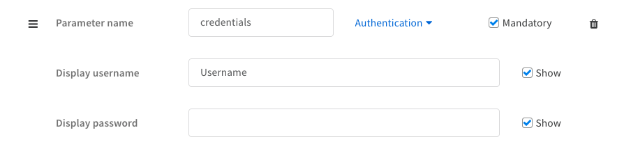
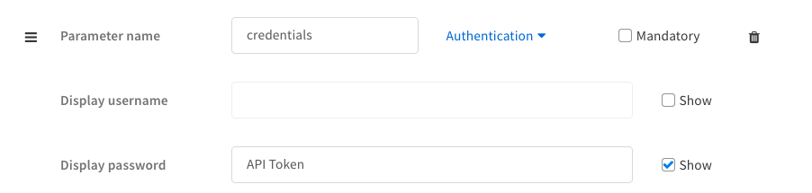
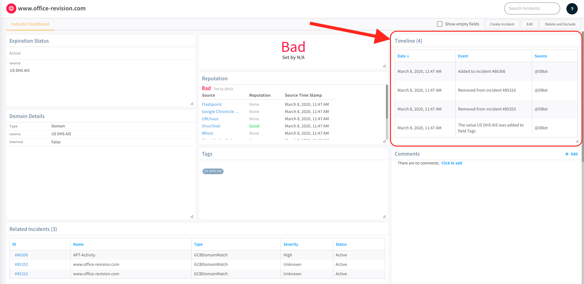

We use standardized code conventions to ensure uniformity across all Cortex XSOAR Integrations. This section outlines our code conventions.

New integrations and scripts should follow these conventions. When working on small fixes and modifications to existing code, follow the conventions used in the existing code.

**Note:** Cortex XSOAR supports also JavaScript integrations and scripts. Our preferred development language is Python, and all new integrations and scripts should be developed in Python, which also provides a wider set of capabilities compared to the available JavaScript support. Simple scripts may still be developed in JavaScript using the conventions provided by the default script template used in the Cortex XSOAR IDE.

## Example Code and Templates
For an example of a **Hello World** integration see [HelloWorld](https://github.com/demisto/content/tree/master/Packs/HelloWorld/Integrations/HelloWorld).

For quick starts templates see [Templates directory](https://github.com/demisto/content/tree/master/Templates).

## Python 2 vs 3
All new integrations and scripts should be written in Python 3. Python 2 is supported only for existing integrations and scripts.

## Imports 
You define imports and disable insecure warning at the top of the file.
```python
import demistomock as demisto
from CommonServerPython import *
from CommonServerUserPython import *
''' IMPORTS '''

import json
import requests

# Disable insecure warnings
requests.packages.urllib3.disable_warnings()
```

## Constants 
You define constants in the file below the imports. It is important that you do not define global variables in the constants section.

```python
''' CONSTANTS '''
DATE_FORMAT = "%Y-%m-%dT%H:%M:%SZ"
```

**IMPORTANT**: The example below shows the incorrect way to name constants.
```python
apiVersion = "v1"
url = demisto.params().get("url")
```

## Main function 
These are the best practices for defining the Main function.
- Create the `main` function and in the main extract all the integration parameters.
- Implement the **_command** function for each integration command (e.g., `say_hello_command(client, demisto.args())`)
- To properly handle exceptions, wrap the commands with try/except in the main. The `return_error()` function receives error message and returns error entry back into Cortex XSOAR. It will also print the full error to the Cortex XSOAR logs. 
- For logging, use the `demisto.debug("write some log here")` function.
- In the main function, initialize the Client instance, and pass that client to `_command` functions.
```python
def main():
    """
        PARSE AND VALIDATE INTEGRATION PARAMS
    """
    params = demisto.params()
    username = params.get('credentials', {}).get('identifier')
    password = params.get('credentials', {}).get('password')

    # Remove trailing slash to prevent wrong URL path to service
    base_url = urljoin(params['url'], '/api/v1/suffix')

    verify_certificate = not params.get('insecure', False)

    # How many time before the first fetch to retrieve incidents
    first_fetch_time = params.get('fetch_time', '3 days').strip()

    proxy = params.get('proxy', False)
    
    command = demisto.command()
    demisto.debug(f'Command being called is {command}')
    try:
        client = Client(
            base_url=base_url,
            verify=verify_certificate,
            auth=(username, password),
            proxy=proxy)

        if command == 'test-module':
            # This is the call made when pressing the integration Test button.
            result = test_module(client)
            return_results(result)

        elif command == 'fetch-incidents':
            # Set and define the fetch incidents command to run after activated via integration settings.
            next_run, incidents = fetch_incidents(
                client=client,
                last_run=demisto.getLastRun(),
                first_fetch_time=first_fetch_time)

            demisto.setLastRun(next_run)
            demisto.incidents(incidents)

        elif command == 'helloworld-say-hello':
            return_results(say_hello_command(client, demisto.args()))

    # Log exceptions
    except Exception as e:
        return_error(f'Failed to execute {command} command. Error: {str(e)}')


if __name__ in ('__main__', '__builtin__', 'builtins'):
    main()
```


## Client class
These are the best practices for defining the Client class.
- Client should inherit from **BaseClient**. **BaseClient** defined in **CommonServerPython**.
- Client is necessary in order to prevent passing arguments from one function to another function, and to prevent using global variables.
- Client will contain the `_http_request` function.
- Client will implement the 3rd party service API.
- Client will contain all the necessary params to establish connection and authentication with the 3rd party API.

```python
class Client(BaseClient):
    """
    Client will implement the service API, should not contain Cortex XSOAR logic.
    Should do requests and return data
    """

    def get_ip_reputation(self, ip: str) -> Dict[str, Any]:
        """Gets the IP reputation using the '/ip' API endpoint

        :type ip: ``str``
        :param ip: IP address to get the reputation for

        :return: dict containing the IP reputation as returned from the API
        :rtype: ``Dict[str, Any]``
        """

        return self._http_request(
            method='GET',
            url_suffix=f'/ip',
            params={
                'ip': ip
            }
        )

    def get_alert(self, alert_id: str) -> Dict[str, Any]:
        """Gets a specific HelloWorld alert by id

        :type alert_id: ``str``
        :param alert_id: id of the alert to return

        :return: dict containing the alert as returned from the API
        :rtype: ``Dict[str, Any]``
        """

        return self._http_request(
            method='GET',
            url_suffix=f'/get_alert_details',
            params={
                'alert_id': alert_id
            }
        )
```

#### Example - client instance using API KEY
```python
api_key = demisto.params().get('apikey')

# get the service API url
base_url = urljoin(demisto.params()['url'], '/api/v1')

# if your Client class inherits from BaseClient, SSL verification is
# handled out of the box by it, just pass ``verify_certificate`` to
# the Client constructor
verify_certificate = not demisto.params().get('insecure', False)

headers = {
    'Authorization': f'Bearer {api_key}'
}

client = Client(
    base_url=base_url,
    verify=verify_certificate,
    headers=headers,
    proxy=proxy
)
```

#### Example - client instance using Basic Authentication
```python
username = demisto.params().get('credentials').get('identifier')
password = demisto.params().get('credentials').get('password')

# get the service API url
base_url = urljoin(demisto.params()['url'], '/api/v1')

# if your Client class inherits from BaseClient, SSL verification is
# handled out of the box by it, just pass ``verify_certificate`` to
# the Client constructor
verify_certificate = not demisto.params().get('insecure', False)

client = Client(
    base_url=base_url,
    verify=verify_certificate,
    auth=(username, password),
    proxy=proxy
)
```

### HTTP Call Retries
We do not allow using `sleep` in the code as it might lead to performance issues.
Instead, you can utilize the retry mechanism implemented in the **BaseClient** by using the `retries` and `backoff_factor` arguments of the `_http_request` function.

## Command Functions
These are the best practices for defining the command functions.
- Each integration command should have a corresponding `_command` function.
- Each **_command** function should use `Client` class functions.
- Each **_command** function should be unit testable. This means you should avoid using global functions, such as `demisto.results()`, `return_error()`, or `return_results()`.
- The **_command** function will receive `client` instance and `args` (`demisto.args()` dictionary).
- The **_command** function will return an instance of the [CommandResults](code-conventions#commandresults) class. 
- To return results to the War Room, in the `main` use `return_results(say_hello_command(client, demisto.args()))`.
```python
def say_hello_command(client, args):
    """
    Returns Hello {somename}

    Args:
        client: HelloWorld client
        args: all command arguments

    Returns:
        Hello {someone}

        readable_output: This will be presented in Warroom - should be in markdown syntax - human readable
        outputs: Dictionary/JSON - saved in incident context in order to be used as input for other tasks in the
                 playbook
        raw_response: Used for debugging/troubleshooting purposes - will be shown only if the command executed with
                      raw-response=true
    """
    name = args.get('name')

    result = client.say_hello(name)

    # readable output will be in markdown format - https://www.markdownguide.org/basic-syntax/
    readable_output = f'## {result}'
    outputs = {
        'name': name,
        'hello': result
    }
    
    results = CommandResults(
        outputs_prefix='HelloWorld.Result',
        outputs_key_field='name',
        outputs=outputs,
        
        readable_output=readable_output,
        raw_response=result
    )

    return results


def main():
    """
    SOME CODE HERE...
    """
    try:
        client = Client(
            base_url=server_url, 
            verify=verify_certificate, 
            auth=(username, password),
            proxy=proxy)
        
        """
        SOME CODE HERE...
        """
        if demisto.command() == 'helloworld-say-hello':
            return_results(say_hello_command(client, demisto.args()))

    # Log exceptions
    except Exception as e:
        return_error(f'Failed to execute {demisto.command()} command. Error: {str(e)}')
```


## IOC Reputation Commands
There are two implementation requirements for reputation commands (aka `!file`, `!email`, `!domain`, `!url`, and `!ip`) that are enforced by checks in the [demisto-sdk](https://github.com/demisto/demisto-sdk/blob/master/demisto_sdk/commands/validate/README.md).
- The reputation command's argument of the same name must have `default` set to `True`.
- The reputation command's argument of the same name must have `isArray` set to `True`.

For more details on these two command argument properties look at the [yaml-file-integration](yaml-file#commands) in our `docs` folder.


## test-module
- When users click the **Test** button, the `test-module` will execute when the **Test** button pressed in the integration instance setting page.
- If the test module returns the string `"ok"` then the test will be green (success). All other string will be red.
```python
if demisto.command() == 'test-module':
    # This is the call made when pressing the integration Test button.
    result = test_module(client)
    return_results(result)
```
```python
def test_module(client):
    """
    Returning 'ok' indicates that the integration works like it suppose to. Connection to the service is successful.

    Args:
        client: HelloWorld client

    Returns:
        'ok' if test passed, anything else will fail the test
    """

    result = client.say_hello('DBot')
    if 'Hello DBot' == result:
        return 'ok'
    else:
        return 'Test failed because ......'
```

## fetch-incidents
These are the best practices for defining fetch-incidents.
- The [fetch-incidents](fetching-incidents) function will be executed when the `Fetch incidents` checkbox is selected in the integration settings. This function will be executed periodically.
- The fetch-incidents function must be unit testable.
- Should receive the `last_run` param instead of executing the `demisto.getLastRun()` function.
- Should return `next_run` back to main, instead of executing `demisto.setLastRun()` inside the `fetch_incidents` function.
- Should return `incidents` back to main instead of executing `demisto.incidents()` inside the `fetch_incidents` function.
```python
def fetch_incidents(client, last_run, first_fetch_time):
    """
    This function will execute each interval (default is 1 minute).

    Args:
        client: HelloWorld client
        last_run: The greatest incident created_time we fetched from last fetch
        first_fetch_time: If last_run is None then fetch all incidents since first_fetch_time

    Returns:
        next_run: This will be last_run in the next fetch-incidents
        incidents: Incidents that will be created in Cortex XSOAR
    """
    # Get the last fetch time, if exists
    last_fetch = last_run.get('last_fetch')

    # Handle first time fetch
    if last_fetch is None:
        last_fetch, _ = dateparser.parse(first_fetch_time)
    else:
        last_fetch = dateparser.parse(last_fetch)

    latest_created_time = last_fetch
    incidents = []
    items = client.list_incidents()
    for item in items:
        incident_created_time = dateparser.parse(item['created_time'])
        incident = {
            'name': item['description'],
            'occurred': incident_created_time.strftime('%Y-%m-%dT%H:%M:%SZ'),
            'rawJSON': json.dumps(item)
        }

        incidents.append(incident)

        # Update last run and add incident if the incident is newer than last fetch
        if incident_created_time > latest_created_time:
            latest_created_time = incident_created_time

    next_run = {'last_fetch': latest_created_time.strftime(DATE_FORMAT)}
    return next_run, incidents

def main():
    """
    SOME CODE HERE
    """
    try:
        client = Client(
            base_url=server_url, 
            verify=verify_certificate, 
            auth=(username, password),
            proxy=proxy)

        if demisto.command() == 'fetch-incidents':
            # Set and define the fetch incidents command to run after activated via integration settings.
            next_run, incidents = fetch_incidents(
                client=client,
                last_run=demisto.getLastRun(),
                first_fetch_time=first_fetch_time)

            demisto.setLastRun(next_run)
            demisto.incidents(incidents)

    # Log exceptions
    except Exception as e:
        return_error(f'Failed to execute {demisto.command()} command. Error: {str(e)}')
```


## Exceptions and Errors
These are the best practices for defining the exceptions and errors.
- To avoid unexpected issues, it is important to wrap your command block in a "Try-Catch". See the example below.
- Raise exceptions in the code where needed, but in the main catch them and use the `return_error` function. This will enable acceptable error messages in the War Room, instead of stack trace.
- If the `return_error` second argument is error, you can pass Exception object.
- You can always use `demisto.error("some error message")` to log your error.
```python
def main():
    try:
        if demisto.command() == 'test-module':
            test_get_session()
            return_results('ok')
    
        if demisto.command() == 'atd-login':
            return_results(get_session_command(client, demisto.args()))
    
    except Exception as e:
        return_error(f'Failed to execute {demisto.command()} command. Error: {str(e)}')
```


## Unit Tests
Every integration must have unit tests.

- Unit tests must be in a separate file, which should have the same name as the integration but be appended with `_test.py` for example `HelloWorld_test.py`
- To mock http requests use [requests_mock](https://requests-mock.readthedocs.io/en/latest/).
- For mocks use [mocker](https://github.com/pytest-dev/pytest-mock/).

For example:
```python
from HelloWorld import Client, say_hello_command, say_hello_over_http_command


def test_say_hello():
    client = Client(
        base_url="https://test.com", 
        verify=False, 
        auth=("test", "test"),
        proxy=False)

    args = {
        "name": "DBot"
    }
    results = say_hello_command(client, args)

    assert results.outputs == {
        'name': 'DBot',
        'hello': "Hello DBot"
    }
    assert results.outputs_prefix == 'HelloWorld.Result'
    assert results.outputs_key_field == 'name'


def test_say_hello_over_http(requests_mock):
    mock_response = {"result": "Hello DBot"}
    requests_mock.get("https://test.com/api/v1/suffix/hello/Dbot", json=mock_response)

    client = Client(
        base_url="https://test.com", 
        verify=False, 
        auth=("test", "test"),
        proxy=False)

    args = {
        'name': 'DBot'
    }
    results = say_hello_over_http_command(client, args)

    assert results.outputs == {
        'name': 'DBot',
        'hello': 'Hello DBot'
    }
    assert results.outputs_prefix == 'HelloWorld.Result'
    assert results.outputs_key_field == 'name'
```

## Variable Naming
When naming variables use the following convention.

### Do this:
```variable_name```

### Do not do this:
```variableName```

## Outputs
Make sure you read and understand [Context and Outputs](context-and-outputs).

Make sure you follow our [context standards](context-standards-about) when naming indicator outputs.

#### Linking Context
Wherever possible, we try to link context together. This will prevent a command from overwriting existing data, or from creating duplicate entries in the context. To do this, observe the following:

```python  
ec = ({
    'URLScan(val.URL && val.URL == obj.URL)': cont_array,
    'URL': url_array,
    'IP': ip_array,
    'Domain': dom_array
})
```

In this instance, the ```val.URL && val.URL == obj.URL``` links together the results retrieved from this integration with results already in the context where the value of the URL is the same.
For more information about the syntax of linking and Cortex XSOAR Transform Language in general have a look [here](dt) 

## Logging
In some cases, it may be necessary to pass information to the logs to assist future debugging. 

First, we need to ensure that the debug level logging is enabled. Go to **Settings -> About -> Troubleshooting** and select **Debug** for Log Level.
 
To post to the logs, we use the following:
```python
demisto.debug('DEBUG level - This is some information we want in the logs')
demisto.info('INFO level - This is some information we want in the logs')
demisto.error('ERROR level - This is some information we want in the logs')
```


You can also use the ```@logger``` decorator in Cortex XSOAR. When the decorator is placed at the top of each function, the logger will print the function name as well as all of the argument values to the ```LOG```.
```python
@logger
def get_ip(ip):
    ip_data = http_request('POST', '/v1/api/ip' + ip)
    return ip_data
```

## Do No Print Sensitive Data to The Log
This section is critical.When an integration is ready to be used as part of a public release (meaning you are done debugging it), we **ALWAYS** remove print statements that are not absolutely necessary.


## Dates
We do not use epoch time for customer facing results (Context, Human Readable, etc.). If the API you are working with requires the time format to be in epoch, then convert the date string into epoch as needed. Where possible, use the human readable format of the date ```%Y-%m-%dT%H:%M:%S```

```python
time_epoch = 499137720
formatted_time = timestamp_to_datestring(time_epoch, "%Y-%m-%dT%H:%M:%S")
print(formatted_time)
>>> '1985-10-26T01:22:00'
```

**Note:** If the response returned is in epoch, it is a best practice to convert it to ```%Y-%m-%dT%H:%M:%S```.

## Pagination in integration commands
When working on a command that supports pagination (usually has API parameters like `page` and/or `page size`) with a maximal page size enforced by the API, our best practice is to create a command that will support two different use-cases with the following 3 integer arguments:
1. `page` 
2. `page_size` 
3. `limit` 

**The two use cases** 
- **Manual Pagination:** The user wants to control the pagination on its own by using the `page` and `page size` arguments. To achieve this, the command will simply pass the `page` and `page size` values on to the API request.
- **Automatic Pagination:** The user does not want to work with pages, but only with a number of total results. In this case, the `limit` argument will be used to aggregate results by iterating over the necessary pages from the first page until collecting all the needed results. This implies a pagination loop mechanism will be implemented behind the scenes. For example, if the limit value received is 250 and the maximal page size enforced by the API is 100, the command will need to perform 3 API calls (pages 1,2, and 3) to collect the 250 requested results.

## Credentials
When working on integrations that require user credentials (such as username/password, API token/key, etc..) the best practice is to use the `credentials` parameter type.

**Using username and password:**

- **In Demisto UI:**


- **In the YML file:**
```yml
- display: Username
  name: credentials
  type: 9
  required: true
```

**Using an API Token/Key:**

- **In Demisto UI:**


- **In the YML file:**
```yml
- displaypassword: API Token
  name: credentials
  type: 9
  required: false
  hiddenusername: true
```
  
Using credentials parameter type is always recommended (even when working with API token\key) as it provides the user the flexibility of using the [XSOAR credentials vault](../reference/articles/managing-credentials) feature when configuring the integration for the first time.


## Common Server Functions
Before writing a function that seems like a workaround for something that should already exist, check the script helper to see if a function already exists. Examples of Common Server Functions are noted below:

### fileResult
This will return a file to the War Room by using the following syntax:

```python
filename = "foo.txt",
file_content = "hello foo"

return_results(fileResult(filename, file_content))
```

You can specify the file type, but it defaults to "None" when not provided.


### tableToMarkdown
This will transform your JSON, dict, or other table into a Markdown table.

```python
name = 'Sample Table'
t = {'first':'Foo', 'second': 'bar', 'third': 'baz', 'forth': ''}
headers = ['Input', 'Output']
tableToMarkdown(name, t, headers=headers, removeNull=True)
```
The above will create the table seen below:
| Input  | Output |
|--------|--------|
| first  | foo    |
| second | bar    |
| third  | baz    |

In the War Room, this is how a table will appear:
</img>

You may also use ```headerTransform``` to convert the existing keys into formatted headers.

Use the ```url_key``` argument to specify a list of keys whose value in the MD table should be a clickable url. This list may contain keys of inner dicts\list of dicts in the data given to the tableToMarkdown function.
For example, for the following data:

```
d = {
  "id": "123",
  "url1": " https://url1.com",
  "result": {
            "files": [
                    {
                        "filename": "Screen.jpg",
                        "url2": "https://url2.com"
                    }
                ]
            },
   "links": {
                "url3": "https://url2.com"
            }
}
```

and using ```url_keys=('url1', 'url2', 'url3')``` (note that some of the keys are nested):
 
```python

tableToMarkdown('Data Table', d, headers=('id', 'url1', 'result', 'links'),
                                          headerTransform=string_to_table_header, url_keys=('url1', 'url2', 'url3'))
```

The resulted table will be:


### demisto.command()
```demisto.command()``` is typically used to tie a function to a command in Cortex XSOAR, for example:
```python
    if demisto.command() == 'ip':
        ip_search_command()
```


### demisto.params()
```demisto.params()``` returns a dict of parameters for the given integration. This is used to grab global variables in an integration, for example:

```python
    APIKEY = demisto.params().get('apikey')
    ACCOUNT_ID = demisto.params().get('account')
    MODE = demisto.params().get('mode')
    INSECURE = demisto.params().get('insecure')
```

### demisto.args()
```demisto.args()``` returns a dict of arguments for a given command. We use this to get non-global variables, for example:

```python
    url = demisto.args().get('url')
```
 The argument above can be seen in the integration settings as shown below:
 
 </img>
 
 After the command is executed, the arguments are displayed in the War Room as part of the command, for example:
 
 </img>

### IndicatorsTimeline
The `IndicatorTimeline` is an optional object (available from Server version 5.5.0 and up) . It is only applicable for commands that operate on indicators. It is a dictionary (or list of dictionaries) of the following format:
When `IndicatorTimeline` data is returned in an entry, the timeline section of the indicator whose value was noted in the timeline data will be updated (and is viewable in the indicator's view page in Cortex XSOAR as can be seen in the attached image).

</img>

**What value should be used for the `'Category'` field of a `timeline` data object?**  
Any Cortex XSOAR integration command or automation that returns `timeline` data may include the `'Category'` value.
If not given, When returning `timeline` data from a Cortex XSOAR integration or automation, the value will be `'Integration Update'` or `'Automation Update'` accordingly.

**So when should one include a timeline object in an entry returned to the war room?**  
The answer is any time that a command operates on an indicator. A good indicator (pun intended?) of when `timeline` data should be included in an entry is to look and see if the command returns a `DBotScore` or entities as described in our [context standards documentation](../integrations/context-standards-about) to the entry context. A common case is reputation commands, i.e. `!ip`, `!url`, `!file`, etc. When implementing these commands in integrations, `timeline` data should be included in the returned entry. To see an example of an integration that returns entries with `timeline` data, take a look at our [AbuseIPDB integration](https://github.com/demisto/content/blob/14148b68f5030a64c6fe6f7cf5af4f184e93abad/Packs/AbuseDB/Integrations/AbuseDB/AbuseDB.py#L215).


| Arg        | Type   | Description                                                                                                                                                                                |
|------------|--------|--------------------------------------------------------------------------------------------------------------------------------------------------------------------------------------------|
| indicators | list   | Expects a list of indicators, if a dict is passed it will be put into a list.                                                                              |
| category   | str    | Indicator category.
| message    | str    | Indicator message.                                                                                                                                         |

**Example**
```python
timeline = IndicatorsTimeline(
      indicators=[args.get('ips')],
      message='Important to note'
)
```

```python
timeline = IndicatorsTimeline(
      indicators=[args.get('ips')],
      category='Some category',
      message='IP was blocked in Checkpoint'
)
```

### CommandResults
This class is used to return outputs. This object represents an entry in warroom. A string representation of an object must be parsed into an object before being passed into the field.

| Arg               | Type   | Description                                                                                                                                                                                |
|-------------------|--------|--------------------------------------------------------------------------------------------------------------------------------------------------------------------------------------------|
| outputs_prefix    | str    | Should be identical to the prefix in the yml contextPath in yml file. for example:         CortexXDR.Incident                                                                              |
| outputs_key_field | str    | Primary key field in the main object. If the command returns Incidents, and of the properties of Incident is incident_id, then outputs_key_field='incident_id'                             |
| outputs           | object | The data to be returned and will be set to context                                                                                                                                         |
| readable_output    | str   | (Optional) markdown string that will be presented in the warroom, should be human readable -  (HumanReadable) - if not set, readable output will be generated via tableToMarkdown function |
| raw_response      | object | (Optional) must be dictionary, if not provided then will be equal to outputs.  Usually must be the original raw response from the 3rd party service (originally Contents)                  |
| indicators        | list   | DEPRECATED: use 'indicator' instead.                                                                                                                                                       |
| indicator         | Common.Indicator | single indicator like Common.IP, Common.URL, Common.File, etc.                                                                                                                   |
| indicators_timeline | IndicatorsTimeline | Must be an IndicatorsTimeline. used by the server to populate an indicator's timeline.                                                                                       |
| ignore_auto_extract | bool | If set to **True** prevents the built-in [auto-extract](../incidents/incident-auto-extract) from enriching IPs, URLs, files, and other indicators from the result. Default is **False**.  |
| mark_as_note | bool |  If set to **True** marks the entry as note. Default is **False**. |
| scheduled_command | ScheduledCommand | Manages the way the command result should be polled. |

**Example**
```python
results = CommandResults(
    outputs_prefix='VirusTotal.IP',
    outputs_key_field='Address',
    outputs={
        'Address': '8.8.8.8',
        'ASN': 12345
    },
    indicators_timeline = timeline
)
return_results(results)
```
__Note:__ More examples on how to return results, [here](context-and-outputs)

### return_results
```return_results()``` calls `demisto.results()`. It accept either a list or single item of `CommandResults` object or any object that `demisto.results` 
can accept.
Use `return_results` to return mainly `CommandResults` object or basic `string`.

**Example**
```python
results = CommandResults(
    outputs_prefix='VirusTotal.IP',
    outputs_key_field='Address',
    outputs={
        'Address': '8.8.8.8',
        'ASN': 12345
    }
)
return_results(results)
```

```python
return_results('Hello World')
```

```python
results = [
    CommandResults(
        outputs_prefix='VirusTotal.IP',
        outputs_key_field='Address',
        outputs={
            'Address': '8.8.8.8',
            'ASN': 12345
        }
    ), 
    CommandResults(
        outputs_prefix='VirusTotal.IP',
        outputs_key_field='Address',
        outputs={
            'Address': '1.1.1.1',
            'ASN': 67890
        }
    )]
return_results(results)
```

__Note:__ More examples on how to return results, [here](context-and-outputs)

### return_error
**Note:** Will return error entry to the warroom and will call `sys.exit()` - meaning the script will stop.

```python
return_error(message="error has occurred: API Key is incorrect", error=ex)
```

Will produce an error in the War Room, for example:

</img>


### DEPRECATED - demisto.results()
_Note_: Use `return_results` instead

```demisto.results()``` returns entries to the War Room from an integration command or an automation.
A typical example of returning an entry from an integration command looks as follows:
```python
demisto.results(
    {
        'Type': EntryType.NOTE,
        'ContentsFormat': EntryFormat.TEXT,
        'Content': res,
        'HumanReadable': 'Submitted file is being analyzed.',
        'ReadableContentsFormat': EntryFormat.MARKDOWN,
        'EntryContext': entry_context,
        'IndicatorTimeline': timeline,
        'PollingCommand': polling_command,        
        'NextRun': next_run,
        'Timeout': timeout,
        'PollingArgs': polling_args
    }
)
```
The entry is composed of multiple components.
* The `Type` dictates what kind of entry is returned to the warroom. The available options as of today are shown in the dictionary keys of `EntryType` below.
* The `ContentsFormat` dictates how to format the value passed to the `Content` field, the available options can be seen below.
* The `Content` usually takes the raw unformatted data - if an API call was made in a command, then typically the response from the request is passed here.
* The `HumanReadable` is the textual information displayed in the warroom entry.
* The `ReadableContentsFormat` dictates how to format the value passed to the `HumanReadable` field.
* The `EntryContext` is the dictionary of context outputs for a given command. For more information see [Outputs](#outputs).
* The `IndicatorTimeline` is an optional field (available from Server version 5.5.0 and up) . It is only applicable for commands that operate on indicators. It is a dictionary (or list of dictionaries) of the following format:
* The `PollingCommand` runs after the time period (in seconds) designated in the `NextRun` argument.
* The `NextRun` argument is the next run time in seconds for the `PollingCommand`. The `PollingCommand` executes after this time period.
* The `Timeout` argument is the timeout in seconds for polling sequence command execution. However, if a user has provided an `execution-timeout`, it overrides the timeout specified by this field.
* `PollingArgs` are the arguments that will be used while running the `PollingCommand`.

    ```python
    {
        'Value': indicator_value,  # for example, an IP address like '8.8.8.8'
        'Message': 'ExampleVendor marked the IP address 8.8.8.8 as "Good"',
        'Category': 'Integration Update'
    }
    ```
    When `IndicatorTimeline` data is returned in an entry, the timeline section of the indicator whose value was noted in the timeline data will be updated (and is viewable in the indicator's view page in Cortex XSOAR as can be seen in the attached image).
 
    </img>

    **What value should be used for the `'Category'` field of a `timeline` data object?**  
    Any Cortex XSOAR integration command that returns `timeline` data should include the `'Category'` value of `'Integration Update'`. When returning `timeline` data from a Cortex XSOAR automation, the value passed to the `'Category'` field should be `'Automation Update'`.

    **So when should one include a timeline object in an entry returned to the war room?**  
    The answer is any time that a command operates on an indicator. A good indicator (pun intended?) of when `timeline` data should be included in an entry is to look and see if the command returns a `DBotScore` or entities as described in our [context standards documentation](../integrations/context-standards-about) to the entry context. A common case is reputation commands, i.e. `!ip`, `!url`, `!file`, etc. When implementing these commands in integrations, `timeline` data should be included in the returned entry. To see an example of an integration that returns entries with `timeline` data, take a look at our [AbuseIPDB integration](https://github.com/demisto/content/blob/14148b68f5030a64c6fe6f7cf5af4f184e93abad/Packs/AbuseDB/Integrations/AbuseDB/AbuseDB.py#L215).


The `EntryType` and `EntryFormat` enum classes are imported from `CommonServerPython` and respectively appear as follows:
```python
class EntryType(object):
    NOTE = 1
    DOWNLOAD_AGENT = 2
    FILE = 3
    ERROR = 4
    PINNED = 5
    USER_MANAGEMENT = 6
    IMAGE = 7
    PLAYGROUND_ERROR = 8
    ENTRY_INFO_FILE = 9
    WARNING = 11
    MAP_ENTRY_TYPE = 15
    WIDGET = 17
```
```python
class EntryFormat(object):
    HTML = 'html'
    TABLE = 'table'
    JSON = 'json'
    TEXT = 'text'
    DBOT_RESPONSE = 'dbotCommandResponse'
    MARKDOWN = 'markdown'
```


### DEPRECATED - return_outputs
_Note_: Use `return_results` instead
 
`return_outputs()` is a convenience function - it is simply a wrapper of `demisto.results()` used to return results to the War Room and which defaults to the most commonly used configuration for entries, only exposing the most functional parameters for the sake of simplicity. For example:
```python
def return_outputs(readable_output, outputs=None, raw_response=None, timeline=None):
    """
    This function wraps the demisto.results(), makes the usage of returning results to the user more intuitively.

    :type readable_output: ``str``
    :param readable_output: markdown string that will be presented in the warroom, should be human readable -
        (HumanReadable)

    :type outputs: ``dict``
    :param outputs: the outputs that will be returned to playbook/investigation context (originally EntryContext)

    :type raw_response: ``dict`` | ``list``
    :param raw_response: must be dictionary, if not provided then will be equal to outputs. usually must be the original
        raw response from the 3rd party service (originally Contents)

    :type timeline: ``dict`` | ``list``
    :param timeline: expects a list, if a dict is passed it will be put into a list. used by server to populate an 
        indicator's timeline

    :return: None
    :rtype: ``None``
    """
    
return_outputs(
    "## Some h2 header",
    {"some": "json into context"},
    {"some": "raw JSON/dict"},
    {'Value': 'some indicator', 'Message': 'Some message', 'Category': 'Integration Update'}
)
```


### AutoExtract
As part of ```CommandResults()``` there is an argument called ```ignore_auto_extract```, which prevents the built-in [auto-extract](../incidents/incident-auto-extract) feature from enriching IPs, URLs, files, and other indicators from the result. For example:

```python
results = CommandResults(
    outputs_prefix='VirusTotal.IP',
    outputs_key_field='Address',
    outputs={
        'Address': '8.8.8.8',
        'ASN': 12345
    },
    indicators_timeline = timeline,
    ignore_auto_extract = True
)
return_results(results)
```
**Note:** By default, ignore_auto_extract is set to ```False```.

## Quality Examples of Integrations
* [Google Cloud Functions](https://github.com/demisto/content/tree/master/Packs/GoogleCloudFunctions/Integrations/GoogleCloudFunctions)
* [Cortex XDR](https://github.com/demisto/content/tree/master/Packs/CortexXDR/Integrations/CortexXDRIR)
* [Proofpoint TAP v2](https://github.com/demisto/content/tree/master/Packs/ProofpointTAP/Integrations/ProofpointTAP_v2)
