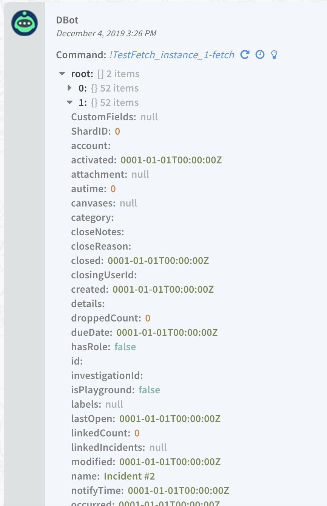

Cortex XSOAR can pull events from 3rd party tools and convert them into actionable incidents. There are a few important parts that are necessary to keep in mind while doing so and they are outlined below.

## The `fetch-incidents` Command
The `fetch incidents` command is the function that Cortex XSOAR calls every minute to import new incidents and is triggered by the "Fetches incidents" parameter in the integration configuration. It is not necessary to configure the `fetch-incidents` command in the Integration Settings.


Let's walk through the example below:

First we open up the command called "fetch-incidents". Make sure that the command is also referenced in the execution block as well.

```python
def fetch_incidents():
      # your implementation here


if demisto.command() == 'fetch-incidents':
      fetch_incidents()

```

## Last Run
demisto.getLastRun() is the function that retrieves the previous run time. To avoid duplicating incidents, it's important that Cortex XSOAR only fetches events that occurred since the last time the function was run. This helps avoid duplicate incidents.

```python
    # demisto.getLastRun() will returns an obj with the previous run in it.
    last_run = str(demisto.getLastRun())
```

## First Run
When an integration runs for the first time, the Last Run time will not be in the integration context. We catch this from failing by using an ```if``` statement. When the last run time is not specified, we use a time that is specified in the integration settings.

It is best practices to allow a customer to specify how far back in time they wish to fetch incidents on the first run. This is a configurable Parameter in the integration settings.

## Query and Parameters

Queries and parameters allow for filtering of events to take place. In some cases, a customer may only wish to import certain event types into Cortex XSOAR. In this case, they would need to query the API for only that specific event type. These should be configurable Parameters in the integration settings.

The following example shows how we use both **First Run** and the **Query** option:
```python
    # usually there will be some kind of query based on event creation date, 
    # or get all the events with id greater than X id and their status is New
    query = 'status=New'

    day_ago = datetime.now() - timedelta(days=1) 
    start_time = day_ago.time()
    if last_run and 'start_time' in last_run:
        start_time = last_run.get('start_time')

    # execute the query and get the events
    events = query_events(query, start_time)
```

## Fetch Limit 
An important parameter is the `Fetch Limit` parameter. Using this parameter the customer can enforce the maximum number of incidents to fetch per fetch command. In order to maintain optimal load on XSOAR we recommend enforcing a limit of 200 incidents per fetch. Notice that should a customer enter a larger number or a blank parameter the `Test` button should fail.


## Creating an Incident
Incidents are created by building an array of incident objects. These object all must contain the ```name``` of the incident, when the incident ```occurred``` as well as the ```rawJSON``` for the incident.

```python
# convert the events to Cortex XSOAR incident 
events = [
  {
      'name': 'event_1',
      'create_time': '2019-10-23T10:11:00Z',
      'event_id': 100
  }
]
    
incidents = []
for event in events:
    incident = {
        'name': event['name'],        # name is required field, must be set
        'occurred': event['create_time'], # must be string of a format ISO8601
        'rawJSON': json.dumps(event)  # the original event, this will allow mapping of the event in the mapping stage. Don't forget to `json.dumps`
    }
    incidents.append(incident)
```

### rawJSON
When fetching incidents, it's important to include the ```rawJSON``` key in the incident field, which enables event mapping. Mapping is how an event gets imported into Cortex XSOAR, since it allows a customer to choose which data from the event to be mapped to their proper fields. An example of this is below:

```python
incident = {
    'name': event['name'],        # name is required field, must be set
    'occurred': '2019-10-23T10:00:00Z', # occurred is optional date - must be string of a format ISO8601
    'rawJSON': json.dumps(event)  # set the original event to rawJSON, this will allow mapping of the event. Don't forget to `json.dumps`
}
```

### Setting Last Run
When the last of the events have been retrieved, we need to save the new last run time to the integration context. This timestamp will be used the next time the ```fetch-incidents``` function is run.
When setting the last run object, it's important to know that the values of the dictionary must be of type `string`.  
We recommend using the time of the most recently created incident as the new last run.

```python
demisto.setLastRun({
    'start_time': timestamp_to_datestring(last_incident['time'])
})
```

When pulling incidents with ***fetch-incidents*** the ```setLastRun``` will not execute if there is an error with ***fetch-incidents***.

### Sending the Incidents to Cortex XSOAR
When all of the incidents have been created, we return the array of incidents by using the ```demisto.incidents()``` function. This is similar to the ```demisto.results()``` function, but is used exclusively to handle incident objects.

An example of it's usage is below:

```python
# this command will create incidents in Cortex XSOAR
demisto.incidents(incidents)
```

If you do not have any incidents to return then just return an empty list to ```demisto.incidents()``` function.
```python
# returning an empty list will keep the status as ok but no new incidents are created.
demisto.incidents([])
```

## Advenced

### Generic fetch with look back
Use the generic look back functions for fetching missing incidents that are indexed a while after they are created.

#### Use case
During a **fetch-incidents** run, some edge-cases might cause missing incidents from the 3rd-party product. The most common are:
* Indexing issues in the product: for example, if an incident A was created before an incident B, and only B was indexed, the fetch-incidents will fetch only B and will miss A, so if A was indexed after the fetch was called, the next fetch will fetch only from the created time of B.
* An update in the incident information: some implementations of fetch-incidents are using a query filter to fetch only specific incidents. If initially an incident did not match the query (i.e., it was not fetched) but at some point was updated so that now it does match the query, a **fetch-incidents** command that queries incidents from the product using a **time** field, will not find it.

#### Solution
Having the *look_back* parameter, we can configure how much the fetch-incidents will look back in time (minutes) to get the incidents that were created a while ago but indexed a minute ago.

The solution functions are in [CommonServerPython](https://xsoar.pan.dev/docs/reference/api/common-server-python) and you can find the exact documentation there, but here is a short description.

* **get_fetch_run_time_range** - The function gets the last run object and some other arguments and calculate the time to fetch and returns the start and end time to fetch.
If the parameter look_back is given, then the start time will always be >= than `now - look_back`.

* **filter_incidents_by_duplicates_and_limit** - After getting the incidents from the 3rd party API call, we will want to filter the incidents from duplicates.
In the example above, after incident "a" is indexed the fetch will bring incidents "a" and "b", then we want to return only "a" because "b" is already fetched.
In addition, after filtering from duplicates, if we still have more incidents than the limit, the function will return only by the limit.

* **get_latest_incident_created_time** - Given a list of incidents and the created time field, the function will return the latest incident created time.

* **remove_old_incidents_ids** - Removes old unneccesary incident ids from the last run object to avoid overloading.

* **get_found_incident_ids** - Returns a list of the new fetched incident ids. This is for saving it into the last run object and filter duplicates in the next call of fetch-incidents.

* **create_updated_last_run_object** - Creates a new last run object with a new time and limit for the next fetch.

* **update_last_run_object** - Updates the existing last run object.
The function updates the found ids given from the function `get_found_incident_ids` and updates also the new time and limit given from the function `create_updated_last_run_object` and returns the updated last run object.

Note. The solution is highly modular, this is done in part so you can only use specific functions and implement the others according to your needs.

### Example fetch with look back
```python
def fetch_incidents(params):

    incidents = []

    fetch_limit_param = params.get('limit')
    look_back = int(params.get('look_back', 0))
    first_fetch = params.get('first_fetch')
    time_zone = params.get('time_zone', 0)

    last_run = demisto.getLastRun()
    # The fetch_limit might be different than the fetch_limit_param in case the start time in the current fetch is the same as the start time in the previous fetch.
    fetch_limit = last_run.get('limit') or fetch_limit_param

    # It's important to get here the end_fetch_time to pass it into the update_last_run_object function.
    start_fetch_time, end_fetch_time = get_fetch_run_time_range(last_run=last_run, first_fetch=first_fetch, look_back=look_back, timezone=time_zone)

    # Functions for building the query and send the API call to get the incidents.
    query = build_query(start_fetch_time, end_fetch_time, fetch_limit)
    incidents_res = get_incidents_request(query)

    incidents = filter_incidents_by_duplicates_and_limit(incidents_res=incidents_res, last_run=last_run, fetch_limit=fetch_limit_param, id_field='incident_id')

    last_run = update_last_run_object(last_run=last_run, incidents=incidents, fetch_limit=fetch_limit_param, start_fetch_time=start_fetch_time, end_fetch_time=end_fetch_time, look_back=look_back, created_time_field='created', id_field='incident_id')

    demisto.incidents(incidents)
    demisto.setLastRun(last_run)
```
## Troubleshooting
For troubleshooting fetch-incident execute `!integration_instance_name-fetch` in the Playground, it should return the incidents.
</img>
