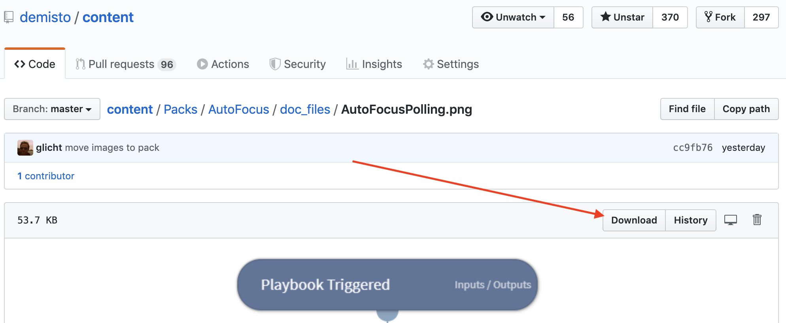
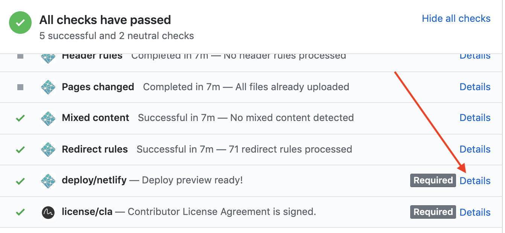

Documentation is a critical step that assists customers who may use your integration by providing insight into how the integration is supposed to work. From creating custom playbooks, to providing background information to assist in debugging, it is important to ensure that the documentation explains every aspect of the integration. Documentation is maintained as `README.md` per integration/automation/playbook and made available for customers as part of the [reference docs](https://xsoar.pan.dev/docs/reference/index) of the Cortex XSOAR Developer Hub.


## Documentation _must_ be generated if:
1.  If the integration is new then you are required to create new documentation.
2.  If the integration is existing but missing documentation then please create new documentation.
3.  If the integration is existing and some of the integration has changed. For example, a new command was added, context was changed, or anything else; please update the documentation.

:::note
The documentation must conform to the [Integration Doc Format](doc-structure).
:::


## Creating Documentation
Use the `demisto-sdk generate-docs` command to generate documentation for your Integration. Documentation for the command is available [here](https://github.com/demisto/demisto-sdk#generate-docs). 

### Command Examples
To automatically generate example output (human readable and context), you should create a text file containing command examples, one per line. The command examples should appear the same way they would as in the CLI in Cortex XSOAR, for example `!url url=8.8.8.8`.
Commands will be executed one at a time, in the order in which they appear in the file. If there are duplicates of a command included in the text file, only the output of the command's first execution  will be included in the generated documentation output. 

Create a `command_examples.txt` file in the same directory as the Integration. Make sure to check this file in to git, so if needed to regenerate the documentation in the future, the commands are easily available. Example for `command_examples.txt` file:
```
!ip ip=8.8.8.8
!domain domain=demisto.com
```

A larger example of such a file is available [here](https://github.com/demisto/content/blob/master/Packs/Securonix/Integrations/Securonix/commands_examples.txt).

### Run `demisto-sdk generate-docs`
Make sure to set your environment variables: `DEMISTO_BASE_URL` and `DEMISTO_API_KEY` so `demisto-sdk` will be able to connect to the Server to run the commands. Run the `generate-docs` command with an input of the Integration yml file and the `command_examples.txt` file. For example:
```
demisto-sdk generate-docs --insecure -e Packs/Nmap/Integrations/Nmap/command_examples.txt -i Packs/Nmap/Integrations/Nmap/Nmap.yml
Start generating integration documentation...
found the following commands:
!nmap-scan options="-sV" targets=scanme.nmap.org
Output file was saved to :
/Users/glichtman/dev/demisto/content/Packs/Nmap/Integrations/Nmap/README.md
``` 
:::note
If you are connecting to a Server with a self signed certificate, make sure to pass the `--insecure` option to the `generate-docs` command.
:::

## Images
Images in the documentation should be added to the relevant pack under a `doc_files` or `doc_imgs` directory. All images should be included with absolute URLs. To obtain an absolute URL to an image from GitHub:

* Commit the image and push to GitHub.
* View the file in the GitHub web interface. 
* Copy the URL from the `Download` button.
* Make sure the URL you are copying is not referring to a branch which will be deleted after the PR is merged. The URL should refer to a commit hash or the `master` branch.
* Note: if you click the `Download` button, GitHub will perform a redirect and the url in the browser will point to the domain: `raw.githubusercontent.com`. You may also use this URL as the absolute URL.


Embed the image in the README.md using a Markdown Image Link, such as:
```

```
Or if you want more control on the image (for example setting width dimension) you can use the HTML `` tag, such as:

```

```
**Screenshot of `Download` button:**


**Absolute Image URL Examples:**
* URL to commit hash: https://github.com/demisto/content/raw/2d6e082cfb181f823e5b1446ae71e10537591ea6/Packs/AutoFocus/doc_files/AutoFocusPolling.png
* URL to `master` branch: https://github.com/demisto/content/raw/master/Packs/AutoFocus/doc_files/AutoFocusPolling.png
* URL after redirection (also valid): https://raw.githubusercontent.com/demisto/content/master/Packs/AutoFocus/doc_files/AutoFocusPolling.png

## Videos
A video can provide a great addition to the documentation either as a demo video or tutorial. Similar to images, videos should be added to the relevant pack under a `doc_files` or `doc_imgs` directory. The preferred video format is `mp4`. 

Since video files are larger in size, we require using [git-lfs](https://git-lfs.github.com/) to add these files to the content repo (a getting started git-lfs tutorial is available [here](https://github.com/git-lfs/git-lfs/wiki/Tutorial)).

All videos should be included with absolute URLs. To obtain a URL to a video from GitHub follow the same steps as detailed for images.

Include the video using the HTML `<video>` tag, such as:
```
<video controls>
    <source src="https://github.com/demisto/content/raw/b4bf86e4b8a4e5217abca615618b40f587896565/Packs/FeedJSON/Integrations/FeedJSON/demo_video/Json_generic_feed_demo.mp4"
            type="video/mp4"/>
    Sorry, your browser doesn't support embedded videos. You can download the video at: https://github.com/demisto/content/blob/b4bf86e4b8a4e5217abca615618b40f587896565/Packs/FeedJSON/Integrations/FeedJSON/demo_video/Json_generic_feed_demo.mp4 
</video>
```
**Note:** GitHub markdown preview will not display the video (it will show the `browser not supported message`). Rest assured, the dev docs site will display the video properly as can be seen at the following [example](https://xsoar.pan.dev/docs/reference/integrations/json-feed#demo-video).

## Documentation Examples

* [Azure Sentinel](https://github.com/demisto/content/blob/master/Packs/AzureSentinel/Integrations/AzureSentinel/README.md): Shows how the commands and examples should be presented.
* [Slack v2](https://github.com/demisto/content/blob/master/Packs/Slack/Integrations/Slack/README.md): Shows an example of the troubleshooting section.
* [Autofocus Query Samples and Sessions Playbook](https://github.com/demisto/content/blob/master/Packs/AutoFocus/Playbooks/playbook-Autofocus_Query_Samples_and_Sessions_README.md): show an embedded playbook image.
* [JSON Feed](https://github.com/demisto/content/blob/master/Packs/FeedJSON/Integrations/FeedJSON/README.md): Shows use of embedding a video.

Example Images: 


## Posting Documentation
The documentation should be posted in the integration/automation script directory as a `README.md` file. If the integration/automation is not in the [Directory Structure](package-dir), name the documentation file the same as the yml file without the `.yml` extension and with an ending of: `_README.md`. For example: [integration-mcafeeDam_README.md](https://github.com/demisto/content/blob/master/Packs/Legacy/Integrations/integration-mcafeeDam_README.md).

## Documentation Deployment
Once the PR with the documentation README file is merged in to master, it will trigger an update to the Cortex XSOAR Developer Hub. When the deployment is complete, the documentation will be available at the [reference docs section](https://xsoar.pan.dev/docs/reference/index). If you wish to preview how the documentation looks at the Developer Hub, before merging to master, you can either run locally the `content-docs` project to preview the Reference Docs site locally or create a PR at the [content-docs repo](https://github.com/demisto/content-docs). 

### Preview by Generating Reference Docs Locally (recommended)
Clone or download the [content-docs repo](https://github.com/demisto/content-docs). Follow the instructions at the project's [README](https://github.com/demisto/content-docs/blob/master/README.md) to run the site locally and generate Reference Docs for the `content` repo you have locally. For example run in the `content-docs` checkout dir:
```bash
CONTENT_REPO_DIR=~/dev/demisto/content npm run reference-docs && npm start
```

### Preview by Creating a PR at the Content Docs Repo
Create a PR at the [content-docs repo](https://github.com/demisto/content-docs) with the same branch name as the PR you are working on in the [content repo](https://github.com/demisto/content-docs). Mention in the PR that it is related to a PR from the content repo. Your PR in the content-docs repo will include a preview link in the GitHub Checks section from `deploy/netlify`. You can perform a dummy white space change for the PR that will re-trigger the build and create a new preview. Example screenshot for preview link:



## Notes
We use [MDX](https://mdxjs.com/) for the Markdown generation. MDX is a superset of standard Markdown, but it requires that any html used in the document must be jsx complaint. Meaning all html tags need to contain a closing tag. For example don't use: `<br>`, use: `<br/>`. Additionally, html entities `< >`, not in code blocks, need to be encoded. Use `&lt;` and `&gt;` to encode. As part of the CircleCI build, the README.md file will be validated that it is MDX complaint.
