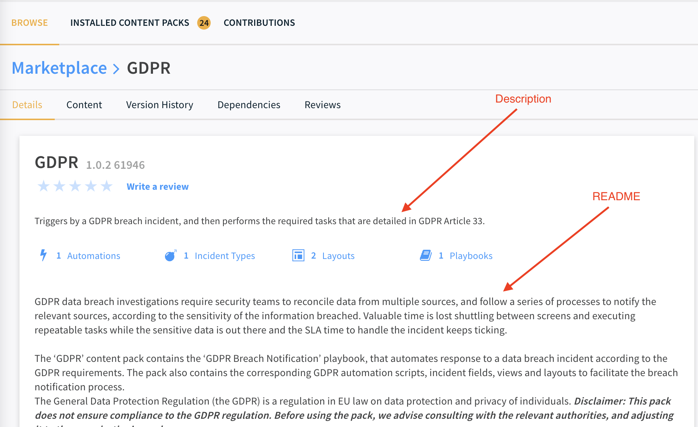

Content Packs displayed in the Cortex XSOAR Marketplace contain 2 main documentation sections: 
* **Description**: displayed in the Content Pack card when browsing the Marketplace and in the top of the *Details* tab.
* **README**: displayed in the main display area of the *Details* tab.

#### Screenshots
* *Description* in Pack display card: <br/>  
</img>  
* Details Tab with *Description* and *README*:
    


## Pack Description
The Pack Description is maintained in the `pack_metadata.json` file under the description field. Packs should always contain a description, even if a README file is provided with more details. This is to allow users to get a short overview of the Pack when browsing the Marketplace.

### General Description Guidelines
- Short and to the point
- Convey gain/benefit for user
- If possible - what is unique about this pack (e.g. minimal, extended, fast, thorough, streamlined etc.)
- Use active voice (You, yours, do, use, investigate) where possible
- Omit redundancy (Do not repeat the name of the pack, do not start with "Use this…")
- Must respect product capitalization (e.g. Content Pack)
- Constant tense (e.g. if "Engages" than "investigates", not "investigating")
- Up to 150 chars
- Up to 4 lines

#### An example of turning a "fat" description into a "lean" description:
**Before** 300 chars / 44 words:  
Use this content pack to investigate and remediate a potential phishing incident. The playbook simultaneously engages with the user that triggered the incident, while investigating the incident itself and enriching the relevant IOCs.
The final remediation tasks are always decided by a human analyst.

**After** 139 chars / 10 words :  
Streamline Investigation and remediation of Phishing incidents. Playbook engages with users while simultaneously investigates and enriches.

#### An example of turning a "passive" description into a "active" description:
**Before** (passive and impersonal):  
Provides data enrichment for domains and IP addresses.

**After** (active and personal) :  
Enrichment for your domains and IP addresses.

Here are some templates that can help you get started:

* "Streamline your _______ process for  _______. Optimized for _________ and ________ this _______ targeted Content Pack is ideal for _____________"
* "Eliminate ________ by improving your__________. Rich with layouts and playbooks, this Content Pack is right for ____________"
* "Get smarter. This pack utilizes _________ and _______for when _________ is heavily needed"

## Pack README
For larger Packs that provide a use case, we recommend creating a README file which will be displayed in the *Details* tab of the Pack. The `README.md` file should be markdown formatted and placed in the Packs root directory. The file should contain a more detailed overview of the Pack compared to the *Description* section. You are free to add any information you see fit to include about the pack. It is recommended to provide an overview of what the Pack does and how to start working with the Pack.  

### README structure
- **If** the pack is a beta pack, add the following at the very beginning of the pack README file:
_Note: This is a beta pack, which lets you implement and test pre-release software. Since the pack is beta, it might contain bugs. Updates to the pack during the beta phase might include non-backward compatible features. We appreciate your feedback on the quality and usability of the pack to help us identify issues, fix them, and continually improve._
* A short paragraph connecting real life situations to the usefulness of the pack
* A "What does this pack do?" section, explaining point by point what the capabilities of the pack or the main playbook of the pack are.
* Optional: a sentence or two detailing the contents of the pack.
* Mostly relevant for use-case packs that contain multiple playbooks: a reference to the README of the **main playbook** of the pack which contains most of the logic behind it. Add the following:
_For more information, visit our Cortex XSOAR Developer Docs_
Note that "Cortex XSOAR Developer Docs" should link **directly to the readme of the main playbook**. An example of what is linked in the Phishing pack: https://xsoar.pan.dev/docs/reference/playbooks/phishing-investigation---generic-v2
* For packs that contains playbooks: a youtube video or an image of the main playbook of the pack. The section following the pack image below explains how to add an image.


### Images
Images can provide a great addition to the Pack `README.md` and can help users to get a quick understanding of the Pack. For Packs that contain playbooks which implement a use case, we recommend including at least an image of the main use case playbook.  Images can be included in the same way as documented for integrations. See the [following for instructions](integration-docs#images). 


## Pack Dependencies
### What are pack dependencies?
With the introduction of Marketplace in Cortex XSOAR, the user now chooses what content they want to install and use, and that content appears in the form of Content Packs.
Pack dependencies are the requirement of one content pack, when using another pack. The implication of this is that a userin XSOAR has to install another pack to be able to use the pack they originally wish installed. That situation is generally and preferably avoidable.

Dependencies can be categorized as either optional or required/mandatory. Optional means the pack will **benefit** from the existence of the pack it depends on, while required means the pack **needs**, and **will not work correctly** without the existence of the pack it depends on.
Some packs ship out-of-the-box with XSOAR, and so depending on them is absolutely fine. Such are the Core packs:
<details>
<summary>Core Packs</summary>
AMP,
ANYRUN,
APIVoid,
ARIAPacketIntelligence,
AWS-ACM,
AWS-AccessAnalyzer,
AWS-Athena,
AWS-CloudTrail,
AWS-CloudWatchLogs
AWS-EC2,
AWS-GuardDuty,
AWS-IAM,
AWS-Lambda,
AWS-Route53,
AWS-S3,
AWS-SQS,
AWS-SecurityHub,
AWS_DynamoDB,
AWS_Sagemaker,
AbuseDB,
AccessInvestigation,
Accessdata,
ActiveMQ,
Active_Directory_Query,
Aella_StarLight,
Akamai_SIEM,
Akamai_WAF,
Alexa,
Algosec,
AlienVault_OTX,
AlienVault_USM_Anywhere,
AlphaSOC_Network_Behavior_Analytics,
AlphaSOC_Wisdom,
Anomali_ThreatStream,
AquatoneDiscover,
ArcSightESM,
ArcSightLogger,
ArcSightXML,
ArcherRSA,
AttackIQFireDrill,
AttivoBotsink,
AutoFocus,
AwakeSecurity,
AzureCompute,
AzureSecurityCenter,
AzureSentinel,
BPA,
Base,
BastilleNetworks,
BeyondTrust_Password_Safe,
BigFix,
BitDam,
Blockade.io,
BluecatAddressManager,
Blueliv,
BluelivThreatCompass,
BluelivThreatContext,
Box,
BreachNotification-US,
BruteForce,
C2sec,
CIRCL,
CVESearch,
CarbonBlackDefense,
CarbonBlackEnterpriseEDR,
CarbonBlackProtect,
Carbon_Black_Enterprise_Live_Response,
Carbon_Black_Enterprise_Response,
Censys,
Centreon,
CheckPhish,
CheckpointFirewall,
Cherwell,
cisco-ise,
cisco-meraki,
Cisco-umbrella,
CiscoASA,
CiscoFirepower,
CiscoSpark,
Claroty,
Cloaken,
CloudLock,
CloudShark,
Code42,
Cofense-Intelligence,
CofenseTriage,
CommonDashboards,
CommonPlaybooks,
CommonReports,
CommonTypes,
CommonWidgets,
Compliance,
Confluence,
CortexDataLake,
CortexXDR,
CounterCraft,
CounterTack,
CrisisManagement,
CrowdStrikeFalcon,
CrowdStrikeFalconSandbox,
CrowdStrikeFalconStreamingV2,
CrowdStrikeFalconX,
CrowdStrikeHost,
CrowdStrikeIntel,
CuckooSandbox,
cyberark_AIM,
CyberTriage,
Cybereason,
Cylance_Protect,
Cymulate,
D2,
DNSDB,
dnstwist,
DeHashed,
DeepInstinct,
DefaultPlaybook,
DemistoLocking,
DemistoRESTAPI,
DeprecatedContent,
DeveloperTools,
Devo,
DigitalGuardian,
DigitalShadows,
Digital_Defense_FrontlineVM,
DomainTools,
DomainTools_Iris,
DuoAdminApi,
EDL,
epo,
EWS,
EWSMailSender,
EasyVista,
EclecticIQ,
Elasticsearch,
EmployeeOffboarding,
Endace,
Endgame,
Exabeam,
Exchange2016_Compliance,
ExifRead,
Expanse,
ExportIndicators,
ExtraHop,
F5,
FeedAWS,
FeedAlienVault,
FeedAzure,
FeedAzureADConnectHealth,
FeedBambenekConsulting,
FeedBlocklist_de,
FeedBruteForceBlocker,
FeedCSV,
FeedCloudflare,
FeedCofense,
FeedDShield,
FeedElasticsearch,
FeedFastly,
FeedFeodoTracker,
FeedGCPWhitelist,
FeedJSON,
FeedMalwareDomainList,
FeedMicrosoftIntune,
FeedMitreAttack,
FeedOffice365,
FeedPlainText,
FeedProofpoint,
FeedRecordedFuture,
FeedSpamhaus,
FeedTAXII,
FeedTorExitAddresses,
FeedUnit42,
FeedZoom,
Feedsslabusech,
FetchIndicatorsFromFile,
FidelisElevateNetwork,
FidelisEndpoint,
fireeye,
FireEyeETP,
FireEyeHX,
FireEyeHelix,
Flashpoint,
Forcepoint,
Forescout,
FortiGate,
FortiSIEM,
FreshDesk,
GDPR,
GRR,
GenericSQL,
GetLicenseID,
GetServerURL,
Giphy,
GitHub,
Gmail,
GmailSingleUser,
GoogleBigQuery,
GoogleChronicleBackstory,
GoogleCloudCompute,
GoogleCloudFunctions,
GoogleCloudStorage,
GoogleCloudTranslate,
GoogleDocs,
GoogleKeyManagementService,
GoogleKubernetesEngine,
GooglePubSub,
GoogleResourceManager,
GoogleSafeBrowsing,
GoogleVault,
GoogleVisionAPI,
GuardiCore,
Guidance_Encase_Endpoint,
HIPAA-BreachNotification,
HPE_Service_Manager,
HashiCorp-Vault,
HelloWorld,
Humio,
Hunting,
HybridAnalysis,
IBMResilientSystems,
ICEBRG,
iDefense,
illuminate,
IllusiveNetworks,
ImageOCR,
Imperva_Skyfence,
ImpossibleTraveler,
Incapsula,
Indeni,
InfoArmor_VigilanteATI,
Infoblox,
Infocyte,
IntSight,
Intezer,
ipinfo,
Ipstack,
IronDefense,
IronPort,
isight,
IsItPhishing,
IvantiHeat,
jamf,
Jask,
Jira,
JoeSecurity,
JsonWhoIs,
Kafka,
Kenna,
Koodous,
Lastline,
LogRhythm,
LogRhythmRest,
Logzio,
Lokpath_Keylight,
Looker,
Lost_Stolen_Device,
Luminate,
mcafeeDam,
MISP,
ML,
MailListener_-_POP3,
MailSenderNew,
Maltiverse,
Malware,
Malwarebytes,
Malwr,
Mattermost,
MaxMind_GeoIP2,
McAfee-MAR,
McAfee-TIE,
McAfeeNSM,
McAfeeWebGateway,
McAfee_Advanced_Threat_Defense,
McAfee_DXL,
McAfee_ESM-v10,
MicrosoftDefenderAdvancedThreatProtection,
MicrosoftGraphCalendar,
MicrosoftGraphDeviceManagement,
MicrosoftGraphFiles,
MicrosoftGraphGroups,
MicrosoftGraphListener,
MicrosoftGraphMail,
MicrosoftGraphSecurity,
MicrosoftGraphUser,
MicrosoftManagementActivity,
MicrosoftTeams,
Mimecast,
MinervaLabsAntiEvasionPlatform,
Moloch,
MongoDB,
MxToolBox,
NIST,
Netcraft,
Netskope,
nessus,
Nmap,
NozomiNetworks,
OSQuery,
OSXCollector,
OTRS,
Okta,
OnboardingIntegration,
OpenLDAP,
OpenPhish,
OpsGenie,
opswat-metadefender,
PAN-OS,
PANWComprehensiveInvestigation,
PacketMail,
Packetsled,
PagerDuty,
PaloAltoNetworks_PAN_OS_EDL_Management,
Palo_Alto_Networks_WildFire,
PassiveTotal,
PcapAnalysis,
Pcysys,
PerceptionPoint,
Perch,
PhishAI,
PhishLabs,
PhishTank,
Phishing,
Pipl,
PolySwarm,
Polygon,
PortScan,
Preempt,
PrismaAccess,
PrismaCloud,
PrismaCloudCompute,
ProofpointServerProtection,
ProofpointTAP,
ProofpointThreatResponse,
ProtectWise,
Pwned,
qualys,
QRadar,
QuestKace,
RSANetWitnessEndpoint,
RSANetWitness_v11_1,
RTIR,
Ransomware,
Rapid7_Nexpose,
rasterize,
Recorded_Future,
RedCanary,
Remedy-On-Demand,
Remedy_AR,
remedy_SR,
ReplaceMatchGroup,
ReversingLabs_A1000,
ReversingLabs_Titanium_Cloud,
RiskSense,
RsaNetWitnessPacketsAndLogs,
RsaNetwitnessSecurityAnalytics,
SANS,
SCADAfence_CNM,
SMB,
SMIME_Messaging,
SNDBOX,
SafeBreach,
Salesforce,
sampleSiem,
SandBlastAppliance,
Sandblast,
SecBI,
SecureWorks,
SecurityAdvisor,
Securonix,
SentinelOne,
ServiceDeskPlus,
ServiceNow,
ShiftManagement,
Shodan,
SignalSciences,
Silverfort,
Sixgill-Darkfeed,
Sixgill-DeepInsights,
Skyformation,
Slack,
SlashNextPhishingIncidentResponse,
Smokescreen_IllusionBLACK,
Snowflake,
SplunkPy,
Stealthwatch_Cloud,
SumoLogic,
SymantecBlueCoatMalwareAnalysis,
SymantecDLP,
SymantecEndpointProtection,
SymantecMSS,
SymantecManagementCenter,
Symantec_Advanced_Threat_Protection,
Symantec_Deepsight,
Symantec_Messaging_Gateway,
Syslog,
TAXIIServer,
TCPIPUtils,
TIM_Processing,
TIM_SIEM,
Tanium,
TaniumThreatResponse,
Telegram,
Tenable_io,
Tenable_sc,
ThinkstCanary,
ThreatConnect,
ThreatExchange,
ThreatGrid,
ThreatIntelligenceManagement,
ThreatMiner,
ThreatQ,
ThreatX,
Threat_Crowd,
Traps,
TrendMicroApex,
TrendMicroDDA,
trendMicroDsm,
TruSTAR,
Tufin,
Twilio,
URLHaus,
Uptycs,
UrlScan,
VMRay,
VMware,
Vectra,
Venafi,
Verodin,
Vertica,
VirusTotal,
VirusTotal-Private_API,
Volatility,
VulnDB,
WhatIsMyBrowser,
WhereIsTheEgg,
Whois,
WindowsDefenderAdvancedThreatProtection,
Workday,
XFE,
XForceExchange,
Yara,
Zabbix,
Zendesk,
ZeroFox,
Zimperium,
Zoom,
Zscaler,
</details>

### How do you find pack dependencies?
Demisto Software Development Kit (SDK) has a command called `find-dependencies` that can detect dependencies between packs. Run the following:

``` demisto-sdk find-dependencies -p 'PackName' -i 'PathToIdSet'``` - if you have an updated id_set.json file

```demisto-sdk find-dependencies -p 'PackName'``` - if you don’t have the id_set.json file

### What are some examples of dependencies?
- A playbook from QRadar pack uses a playbook from AccessInvestigation pack
- A playbook from Employee Offboarding pack uses an automation from Impossible Traveler pack
- A classifier from EWS pack uses incident fields from Phishing pack

The dependency logic is as follows:

integration <-> mapper, incident type, indicator type, indicator field
classifier <-> incident type, integration 
mapper <-> incident type, incident field
incident type <-> playbook, script, integration
layout <-> incident type, indicator type, incident field, indicator field
incident field <-> incident type
playbook <-> incident field, indicator field, script, integrations
Widget <-> script


### What should I do about the dependencies?
When a dependency is required, that means that in order to use a certain pack, the user MUST install a different pack - a behavior we want to eliminate as much as possible. 

Sometimes the dependency is understandable. In this case Gmail depends on Phishing, but Phishing is a core pack and ships out of the box, so this causes no issue and mandatory can stay true:


In other cases the dependency must be fixed by us, manually. 

### How do I fix the dependencies?
The cases can vary from one dependency to another. Fixing a dependency involves 3 parts:
1. Making the necessary adaptation in the content (changing playbook, merging packs, moving files to another pack, replacing deprecated script with newer script)
2. Changing “mandatory” to “false” in the pack dependencies
3. Removing the displayedImages section


Here are some possible cases:
- Slack pack depends on Active_Directory_Query pack:


  - Understand which dependencies are normal. We have 2 optional dependencies which is OK. We also have 2 required dependencies, one of which is CommonTypes that belongs to the Core packs - so it’s also OK. Then we have Active_Directory_Query which should not be required when installing the Slack pack.
  - At the content of the Slack pack, locate the reason/s for the dependency. We find that the playbook `Slack - General Failed Logins v2.1` uses `ad-expire-password`:
  

  - Solve the issue. In this case - we can add a condition before this task - “Is Active Directory enabled?”. Then, if the Active_Directory_Query pack is not present, the condition will lead to “else” and we just solved the required dependency issue.
Change “mandatory” to “false” in Slack’s dependency on Active_Directory_Query.

- CortexXDR pack depends on PortScan pack:


  - Looking through the content of CortexXDR pack we find that `Cortex XDR Port Scan` incident type is configured to run `Port Scan - Generic` from the PortScan pack.
  

This one is obviously a bug, because the right playbook that should run is Cortex XDR - Port Scan, and not the generic port scan playbook.
  - Change the playbook that the incident type is tied to
  - Change mandatory to false.
  
- QRadar depends on AccessInvestigation pack
  - We see that QRadar has a playbook called `Access Investigation - QRadar` which uses `Access Investigation - Generic`.
  
  
  - Access Investigation - Generic may have to be a Core pack, if so - its mandatory dependency will be fine. 
Another solution may be to “skip if unavailable”. This is a feature that exists on XSOAR 6.0 where if a pack is not available, the task and its continuous branch will be skipped:


Note: When should you skip and when should you “check if X is available”? Well, when a playbook uses a task that is tied to a certain integration, it makes sense to check if that integration is enabled beforehand, because the skipping feature only works on 5.5+. However, when a subplaybook is used, you can’t really check whether that subplaybook is available without using the “skip” feature, so in that case it should be skipped using the new feature.

** Remember that anything from the Core pack should not be changed to “mandatory=false” **
