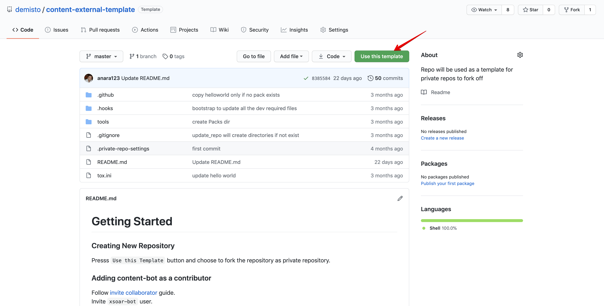

In this document we will go over the entire process for developing paid content for XSOAR’s marketplace, step by step.

1. Duplicate the demisto/content-external-template repository by clicking on the “Use this template”, then choose to create it as a private repository under your user.  
</img>  
2. Follow the guidelines mentioned in the template repository in-order to get your pack in there, don't forget to choose your pricing for the pack.
5. Once you have completed the work on the pack you should invite the “xsoar-bot” user as a collaborator to your repository so that we will be able to review your contribution and add it into our build system.
This can be done using this [guide](https://help.github.jp/enterprise/2.11/user/articles/inviting-collaborators-to-a-personal-repository/).
6. Send the details of the pack to the person you are in contact with and he will link your contribution to our system.
7. Review Phase - we will review your pull request and leave notes, in parallel we have internal an validation process that we will spin up to validate your pack.
In order to approve your pull request, we need:
- Pull request build must pass
- Fix all our notes in the pull request
- Internal validation process must pass - we will update you if it will fail and why.
8. Only after we approved your pull request, you are should merge pull request.
9. The pack is now officially in the XSOAR marketplace!
