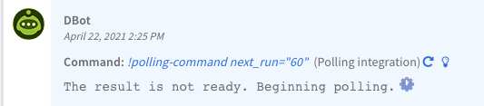

### Available from Cortex XSOAR version 6.2.0 and later.

</img>

A command can schedule the future execution of another command.

The playbook does not proceed to the next task until it is done with all scheduled commands, i.e. until there is no future execution scheduled.
When the playbook is waiting for a command execution it does not use a worker, as workers are only used at the time commands are executed.

Use cases for scheduled commands include:
* ***Polling Flow*** - The command cannot return the full result in a single execution (possibly because a remote process hasn't finished execution). Scheduled commands enable you to try the command again later, and return the full results when available. Examples include `Sandbox Detonation` and `Autofocus samples search`.

### YAML Prerequisite
* ***Integration***: In the integration yml, under the command root, add `polling: true`.
* ***Script***: In the script yml, in the root of the file, add `polling: true`.

For an example, see the [Autofocus V2](https://github.com/demisto/content/blob/master/Packs/AutoFocus/Integrations/AutofocusV2/AutofocusV2.py) `autofocus-samples-search` command.

### ScheduledCommand Class
`ScheduledCommand` is an optional class that enables scheduling commands via the command results.

| Arg               | Type   | Description                                                                                                                                                                                |
|-------------------|--------|--------------------------------------------------------------------------------------------------------------------------------------------------------------------------------------------|
| command                        | str    | The command that runs after `next_run_in_seconds` has passed.
| next_run_in_seconds            | int    | How long to wait before executing the command.
| args (optional)                | dict   | Arguments to use when executing the command.
| timeout_in_seconds (optional)  | int    | Number of seconds until the polling sequence timeouts.

When provided to [CommandResults](./code-conventions#commandresults) it transforms the result into a ***schedule result***.
After the `next_run_in_seconds` delay, the command will be executed.
The scheduled command can return another ***schedule result***, that schedules another scheduled command and so on.

The interval between each run is determined by `next_run_in_seconds`, however it will never be less than 10 seconds.

The schedule sequence completes when any one of three terminating actions occur:

1. ***Done*** - The integration finishes a schedule sequence by **not returning** a schedule result. Otherwise, the sequence continues as long as a schedule result is returned. 
2. ***Error*** - The schedule sequence finishes with an error when a command in the sequence returns an error result.
3. ***Timeout (automatically handled)*** - The schedule sequence finishes execution with a timeout error when the timeout is reached. Cortex XSOAR will return the timeout error entry automatically.

#### Code Example
In the example below, if the `status` is not `complete` then a result with `schedule_config` is returned. After 60 seconds, the result triggers a poll for the search. This is done in the next run as well, and repeats until the status is complete.

```python
def run_polling_command(args: dict, cmd: str, search_function: Callable, results_function: Callable):
    ScheduledCommand.raise_error_if_not_supported()
    interval_in_secs = int(args.get('interval_in_seconds', 60))
    if 'af_cookie' not in args:
        # create new search
        command_results = search_function(args)
        outputs = command_results.outputs
        af_cookie = outputs.get('AFCookie')
        if outputs.get('Status') != 'complete':
            polling_args = {
                'af_cookie': af_cookie,
                'interval_in_seconds': interval_in_secs,
                'polling': True,
                **args
            }
            scheduled_command = ScheduledCommand(
                command=cmd,
                next_run_in_seconds=interval_in_secs,
                args=polling_args,
                timeout_in_seconds=600)
            command_results.scheduled_command = scheduled_command
            return command_results
        else:
            # continue to look for search results
            args['af_cookie'] = af_cookie
    # get search status
    command_results, status = results_function(args)
    if status != 'complete':
        # schedule next poll
        polling_args = {
            'af_cookie': args.get('af_cookie'),
            'interval_in_seconds': interval_in_secs,
            'polling': True,
            **args
        }
        scheduled_command = ScheduledCommand(
            command=cmd,
            next_run_in_seconds=interval_in_secs,
            args=polling_args,
            timeout_in_seconds=600)

        # result with scheduled_command only - no update to the war room
        command_results = CommandResults(scheduled_command=scheduled_command)
    return command_results
```
