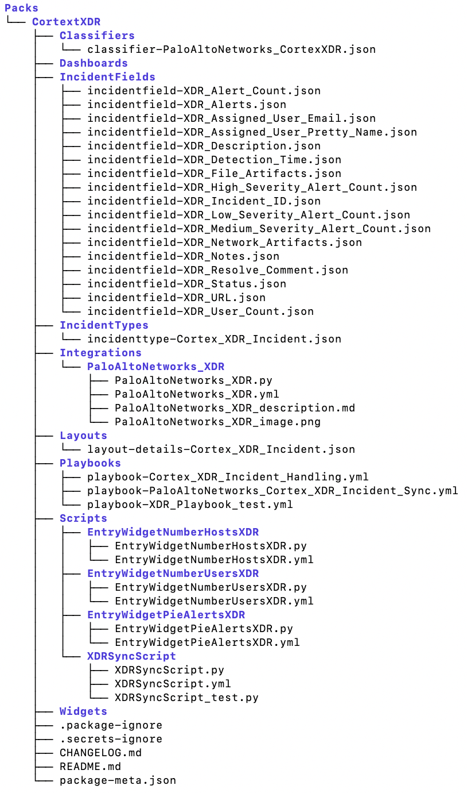

As part of the content contribution process we are using a new format, Packs.
This new content artifact will behave like a mini content repo. we will have all the relevant content items relevant 
fot that pack located within it.
<br/><br/>
For instance a pack for CortexXDR will look as follows: 


This will help you see and work in your own small world without having to touch nor see any other scripts/integation 
and get flustered among all of those files, we want you to be able to work in you micro universe.

### Directories  
All the directories within the pack are the same as we had in the Content repository until this day.  
```angular2
- Integrations
- Scripts
- Playbooks
- Reports
- Dashboards
- IncidentTypes
- IncidentFields
- Layouts
- Classifiers
- Misc
- IndicatorFields
- Connections
```

while the way we work in those directories haven't changed, just updated their location for your convenience.


### Pack files
The pack will have few files for its' configuration. And will give you a place to add your documentation for the 
pack, and some metadata regarding the pack itself.
Please note that all of the following files will be created using the `demisto-sdk init --pack`, and some of them 
will have to be filled by you. An explanation for each of them will be provided below.

#### .secrets-ignore
This file will be used while running the `demisto-sdk secrets`([explanation](https://github.com/demisto/demisto-sdk/blob/master/docs/secrets.md)), we will determine the file and will
 use it as a  white list of approved words for your PR.
 
#### metadata.json
This file will contain all the relevant metadata about the pack and will be maintained in the future using the demisto-sdk.
Information that you can find there is: the author name(you), pack id, etc...  
This file will generate some of its information based on your pack files, and some of the data will have to be filled
 by you. This data will be fields like the support details, in order to contact you about the pack you've just wrote,
  or the pack name.

#### changelog.json
This file will contain the version history for the pack. Each entry of the file will direct to the pack version and 
release notes for that specific version. This file will be automatically generated and updated by the Content build.
It helps us maintain the version history of your pack.

#### README.md
This file will be the general explanation for the pack and will contain any information you want to put there.