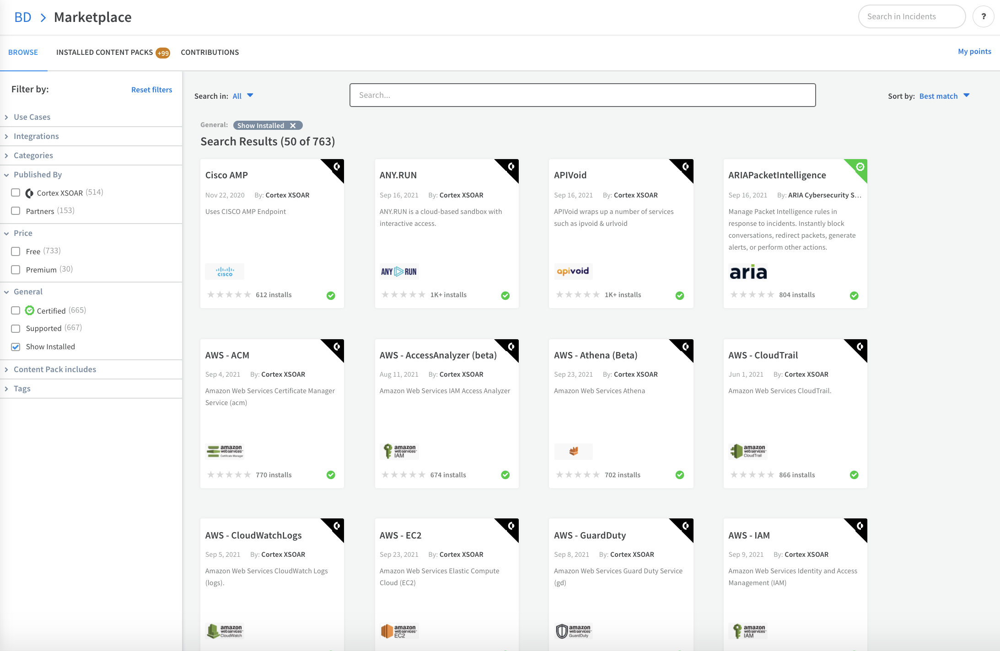
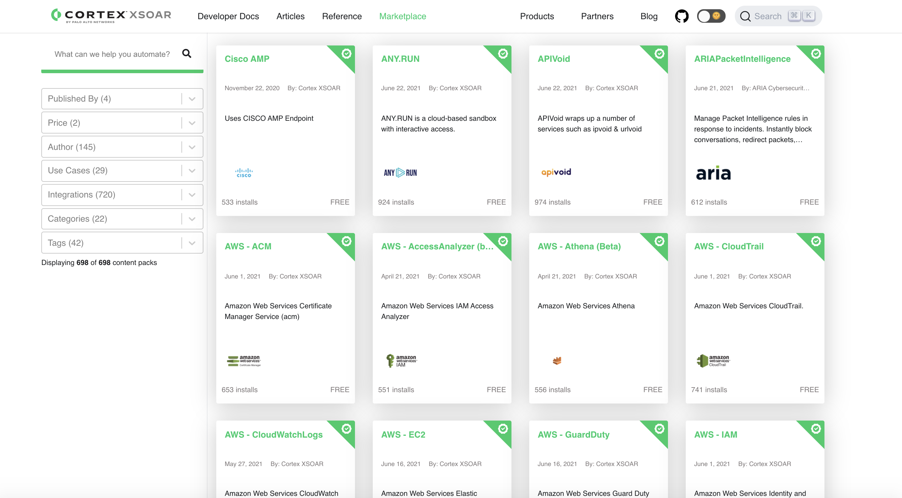
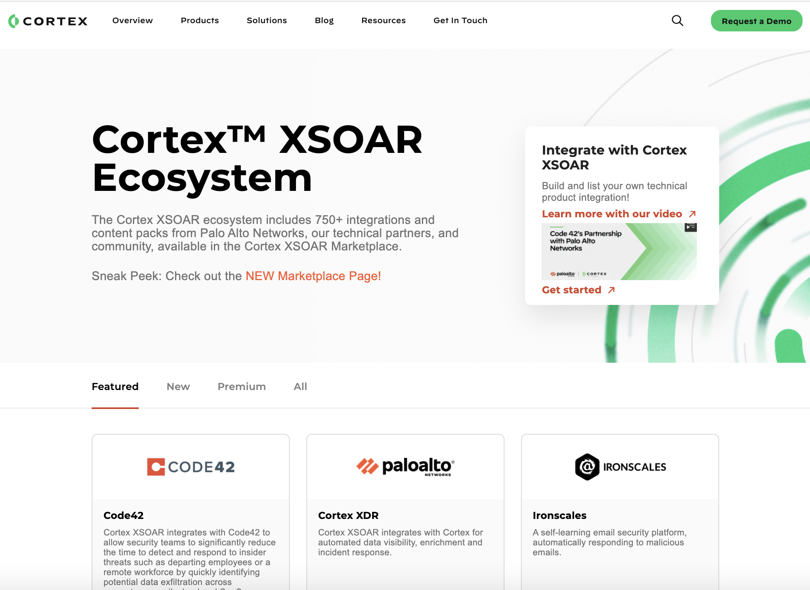
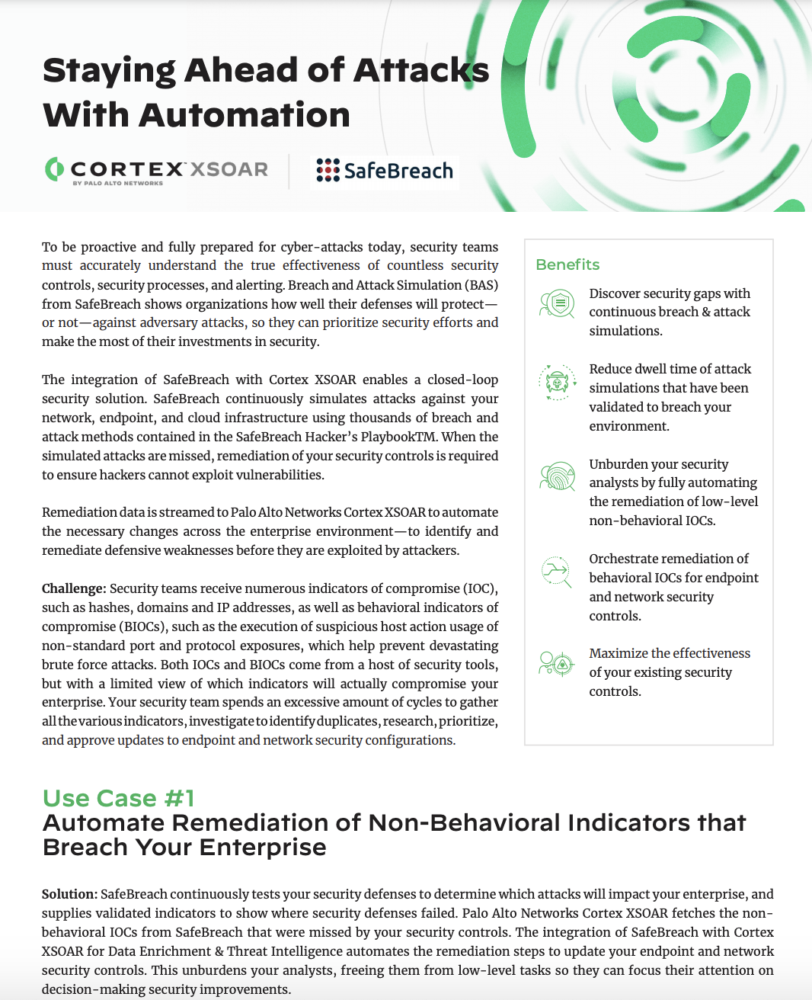
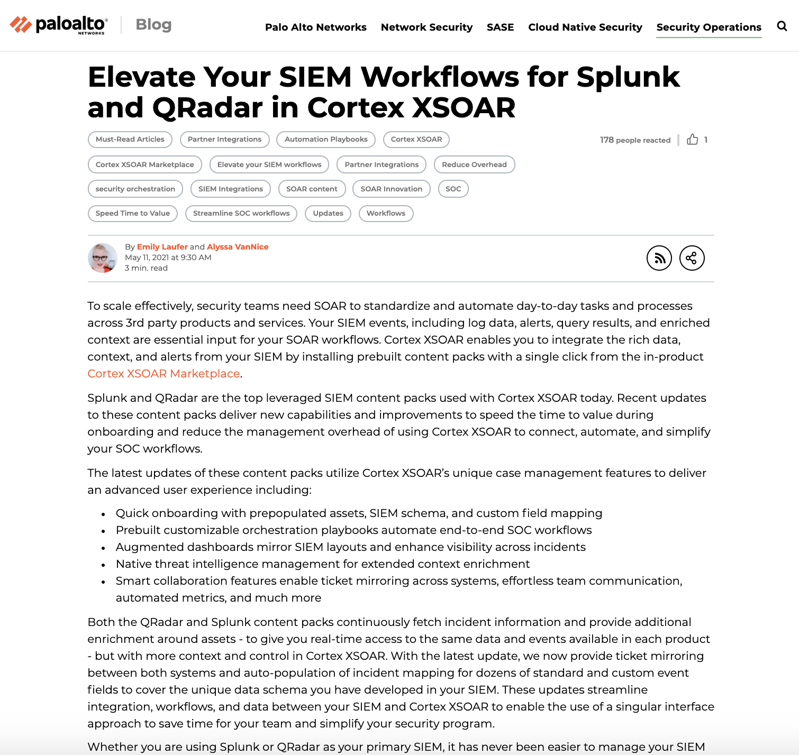
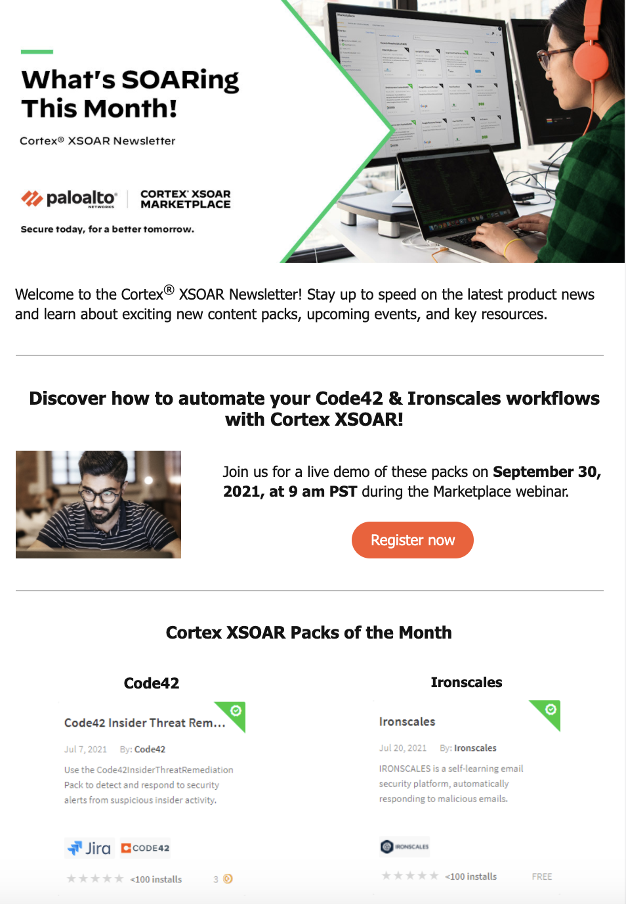
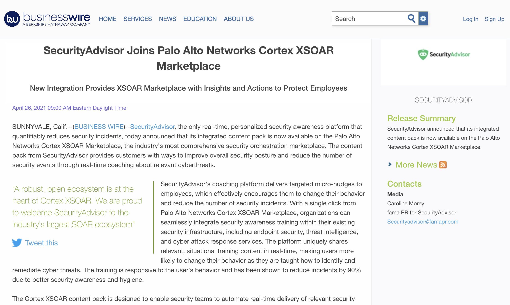

The Cortex XSOAR Marketplace is the industry’s most comprehensive storefront for discovering, exchanging, and contributing integrated security automation playbooks and content. When Cortex XSOAR partners contribute to the Marketplace, we strive to showcase the many different ways that their product can be beneficial to a customer’s unique ecosystem. These marketing opportunities educate our customers, prospects, sales team, and other cyber curious individuals on the critical use cases these packs address.

When your organization participates in the Cortex XSOAR Marketplace program, you gain guidance with creating your content packs, curated marketing collateral--some of which is hosted on the Palo Alto Networks website--and the possibility of participating in webinars and events. Additionally, Cortex XSOAR customers can become *your* prospects. 

If you join the Cortex XSOAR Marketplace, Palo Alto Networks may highlight your product in the following ways: 
* Marketplace Listing featured in the product 
* Public version of the Marketplace 
* Joint Solution Brief using our format  
* Blog on the Palo Alto Networks site
* Social media mentions and cross promotion
* Placement in the monthly What’s SOARing Newsletter 
* Press Release ready for publication
* A Featured Spot in our monthly Webinar Series
* Additional webinars featuring customers 
* Participation in other joint marketing sponsorships and events

## Marketplace
The Cortex XSOAR Marketplace displays the full library of content packs for anyone to browse. Each pack contains a summary, contents, and links to related collateral. The Marketplace listing is managed by the contributor that provides full flexibility over the messaging and language. 

Marketplace content is available publicly & inside the product. 
* The _public version is accessible_ via the [web](https://xsoar.pan.dev/marketplace). Each pack has a unique link that partners can send to customers, place in marketing pieces, etc. 
* Customers, SIs, and community edition users can view the Marketplace located directly _inside the product_. From there, they can instantly download and deploy your content.

Our platform ensures both sites stay in sync. 

Built-in Marketplace within Cortex XSOAR

Public Marketplace at [xsoar.pan.dev/marketplace](xsoar.pan.dev/marketplace).

## Ecosystem Webpage
Cortex XSOAR’s [Ecosystem webpage](https://www.paloaltonetworks.com/cortex/xsoar-ecosystem) is publically accessible and linked directly from the main Cortex XSOAR site. The Ecosystem page has tabs for Featured, New, and Premium content packs to highlight our partners. This is updated often to reflect our ever growing Marketplace! 

Ecosystem page

## Solution Brief
Partners use the Palo Alto Networks logos and branding in their solution brief. After the review process completes, all assets are hosted and made available from the Palo Alto Networks website. 

You can see more solution briefs in our [resource library](https://www.paloaltonetworks.com/resources.html?q=*%3A*&_charset_=UTF-8&fq=PRODUCTS0_DFACET%3Apan%253Aresource-center%252Fproducts0%252Fdemisto&fq=RC_TYPE_DFACET%3Apan%253Aresource-center%252Frc-type%252Fdatasheet).

First page of a partners' [solution brief](https://www.paloaltonetworks.com/content/dam/pan/en_US/assets/pdf/xsoar-integrations/safebreach-solution-brief.pdf)

## Blog
Similar to the solution brief, partners receive access to a detailed template. Marketplace blogs will be hosted and linked on the Cortex XSOAR [website](https://www.paloaltonetworks.com/blog/security-operations/).

[Sample blog post](https://www.paloaltonetworks.com/blog/security-operations/siem-splunk-qradar-xsoar/)

## Newsletter 
Partner contributed packs are included in the monthly newsletter sent out to the XSOAR install base. Additionally, two packs are chosen to be highlighted at the top for extra visibility. 

Snapshot of our newsletter. [Register Now!](https://start.paloaltonetworks.com/cortex-xsoar-whats-soaring-newsletter.html)

## Press Release
Similar to the solution brief & blog, partners receive access to a detailed template that speeds approvals when releasing on the partner's paper. Take a look at the [press release from SecurityAdvisor.](https://www.businesswire.com/news/home/20210426005118/en/SecurityAdvisor-Joins-Palo-Alto-Networks-Cortex-XSOAR-Marketplace)

Press Release with SecurityAdvisor. 

## Webinar
The Marketplace program features two partners each month in the Top Use Cases webinar. This hour-long webinar allows partners to present their products and content packs including a demo and a Q&A session for customer and prospect participation. Check out the webinars we’ve done so far on [our site!](https://register.paloaltonetworks.com/cortexxsoartopusecaseswebinarseries)

 Partners can also host additional webinars featuring joint customers. 

Webinar registration 

## Sponsorships / Events
A select group of XSOAR partners may be invited to sponsor Palo Alto Networks events such as [SKO](https://www.panwsko.com/) or [Ignite](https://www.ignite.paloaltonetworks.com/). These events are great opportunities for partners to be seen by prospects, GTM teams, customers and more!

Partners may also request  Palo Alto Networks attendance at  their events, including using our  branding and speakers. 

Join XSOAR’s Alliances Program today!! If your team has any questions or additional marketing ideas they want to propose, please email _soar.alliances@paloaltonetworks.com_
