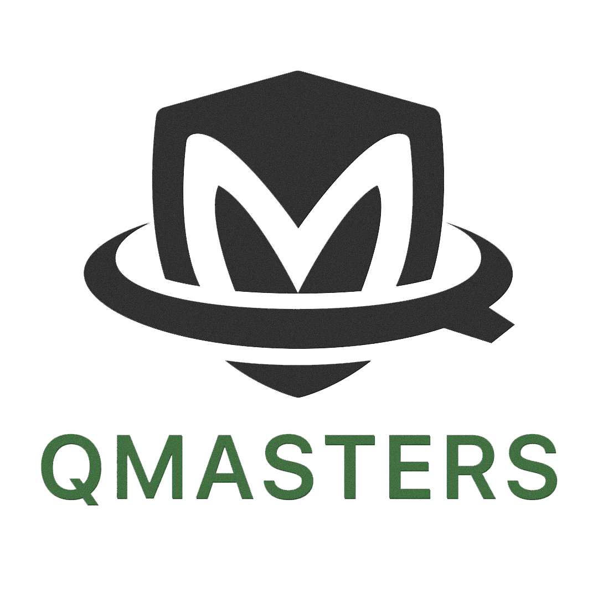

We’ve been talking with lots of technical partners in the past few months who are excited to join the Demisto ecosystem. Many technical partners are able to build their integration in-house with their existing development teams. (Learn [what it takes](become-a-tech-partner) to build an integration.) But there are many partners that are interested in joining our ecosystem but may be resource- or roadmap-constrained; they are unable to commit to building the integration.

To address this need, we’re pleased to have software development companies that have been trained by, and have access to, our engineering team to reduce risk in the integration development lifecycle. We call these Development Partners. The development partners below can help you with some or all of the integration work. These partners typically will do end-to-end work including scoping, designing, coding, testing, and checking the code into our repository. They know our process and the Demisto product and can dramatically speed up your integration timeline.

## How It Works
Having your integration built by a development partner and certified by us is easy:

1. Contact one or more of the partners below - They’ve been pre-screened and trained by Demisto teams.

2. Establish scoping and contracting - Define what you want to accomplish in your integration. We’re happy to join calls to define use cases and commands based on our experience -- just let us know! (Palo Alto Networks is not a party to your agreement.)

3. Sign up as a Technical Partner - [register](https://start.paloaltonetworks.com/become-a-technology-partner) and complete our Technology Partner Agreement (TPA) so we can publish the integration under your company name.

4. The development partner will keep us updated on timing and any issues. They’ll manage the GitHub pull request and certification with our Engineering teams.

5. [Most common] When the Integration is complete and GA, the development partner will release the code to you as a [partner-owned integration](partner-owned-integration); you will support the integration for defects and enhancements going forward. Be sure to register for [TSANet](https://paloaltonetworks-nextwave.connect.tsanet.org/) for that.

## Our Partners
Our ecosystem of helpful partners is growing. If you are interested in becoming a partner, please [contact Matt Chase](mailto:mchase@paloaltonetworks.com).

### Crest Data Systems ([www.crestdatasys.com](https://crestdatasys.com))

Crest Data Systems is a leading provider of software integrations and custom solutions in the areas of Data Analytics, Cyber Security, and DevOps based in the San Francisco Bay Area. Crest has built 1,500+ integrations and provided 24x7 managed (CloudOps/SRE and SOC) services for 100+ customers ranging from Fortune 500 corporations to Silicon Valley Startups to help them outperform the competition and stay ahead of the innovation curve.

→ Contact Malhar Shah at [malhar@crestdatasys.com](mailto:malhar@crestdatasys.com)

### QMasters ([qmasters.co](https://qmasters.com))

With decades of experience in consulting, project management, IT integration and working with a wide range of companies from many sectors, including the Israeli Government, QMasters addresses ever-growing security demands. QMasters has quickly established itself as a leading Information Security company, both in Israel and internationally, specializing in consulting, implementing and integrating of security products and solutions.

→ Contact Gregori Nazrovsky [gregorin@qmasters.co](mailto:gregorin@qmasters.com)

More partners are coming soon! If you are interested in becoming a partner, please [contact Matt Chase](mailto:mchase@paloaltonetworks.com).