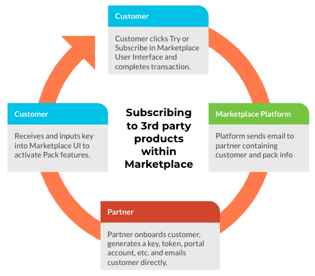
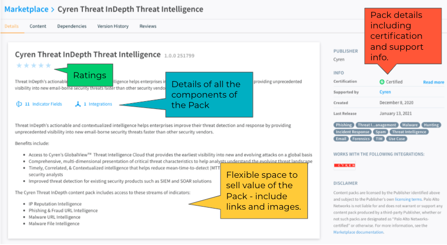

With the release of Cortex XSOAR v.6 in August 2020, we are pleased to announce the industry's first fully integrated marketplace for orchestration content!

[Cortex XSOAR Marketplace](/marketplace) is a digital storefront for discovering, exchanging and contributing security orchestration content centrally within the Cortex XSOAR platform. It enables users to install turnkey content packs to help solve any security use case with content contributed by SecOps experts and the world’s largest SOAR partner community, including you.

Additionally, Partners have the ability to monetize their content on the Marketplace. You decide the content, the price, and how to best market it, and get a healthy share of the revenue. The customer gets premium content to solve their use case. It's a win-win.

## Packs

All content on Marketplace is included in a Pack. ([What can be in a pack?](/docs/packs/packs-format#directories)) When Partners create a pack, they specify the content that is included in that pack. 

Packs on Marketplace can be free or paid. Our platform does full dependency checking, too, so a pack can be dependent on, say, a command in another pack. This allows you to build a playbook addressing a full use case across products. Paid Packs are held in your private repository. Free Packs are held in our open source repository. 

If you previously had a Demisto or Cortex XSOAR integration, it has been converted to a pack format and added to Marketplace for you.

### What Can Be Paid?

All integrations must be free. We always want to encourage our mutual customers to connect our systems such that 1+1=3. 

That said, paid packs generally fall into one of two types:

1. Packs with **premium content** can consist of any other element(s) including complex playbooks, detailed automation scripts, dashboards that appeal to a specific user type, etc. This adds additional value on top of a free pack. For example, a UEBA partner may offer a free pack with the integration and a basic playbook, but offer the complex full playbook in a 2nd paid pack. 
1. Packs that **resell 3rd party products** essentially use XSOAR Marketplace as a transaction tier to enable delivery of a full SaaS product key. We have partners who sell access to intel feeds, training seats, etc. Anything that can be delivered via an API key can be listed on Marketplace. For example, a threat intel vendor may offer a free pack with the integration and a basic playbook. In order to access the actual threat feed, the customer must either contact the vendor, contract and procure directly, or... the customer simply clicks Subscribe in our marketplace and gets access to the data. Much easier. 

For packs that resell 3rd party products, the following illustrates the flow of subscription:

### Reporting and Notifications

Marketplace provides robust reporting to Partners on their paid pack activity including both:

1. **Notifications** are sent immediately via email whenever there is activity on the Pack including a new trial, trial end, a new subscription, etc. Each notification will include customer/human information when possible.
1. **Reports** are sent on the first of each month where there was revenue-related activity in the prior month. The report details dollar roll-ups per pack, each revenue related transaction line item, etc. 

Reporting is not currently available for free packs.

### Points

The Marketplace transacts in points, rather than dollars, such that one point is valued at US$100. Customers purchase points via their Palo Alto Networks sales channels and subscribe to your content with those points on a monthly basis. We automatically pay you a revenue share also on a monthly basis, with no invoice required!

The Partner sets the price of the pack in points per month. Marketplace transacts exclusively monthly for all paid packs. 

### Show Your Pack

With the new pack display model, Partners have much more real estate and flexibility to show their content within Marketplace including links, images, etc. You can even include a video in your listing to help convey the value of your pack. 

## Program Details

This page is meant as an overview to Marketplace. Please see the [Palo Alto Networks Cortex XSOAR Partner Program Guide](https://xsoar.pan.dev/program-guide) for details on the program. 

## More Information

Marketplace is an in-product experience for our users. Existing partners can simply upgrade their NFR to v.6+ and Marketplace will be included so you can see your pack! Contact the [Alliances Team](mailto:soar.alliances@paloaltonetworks.com) with any questions. 

If you are interested in contributing a pack, please [submit your application](https://start.paloaltonetworks.com/become-a-technology-partner) today. 

## Contact us

Reach out to the [Alliances Team](mailto:soar.alliances@paloaltonetworks.com) to discuss your new or improved listing on our marketplace.
