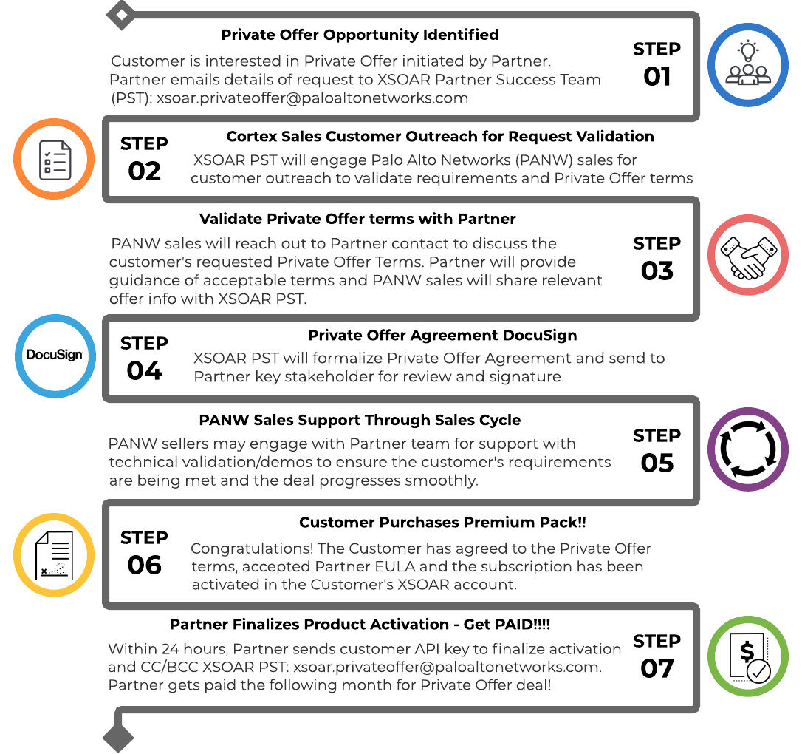
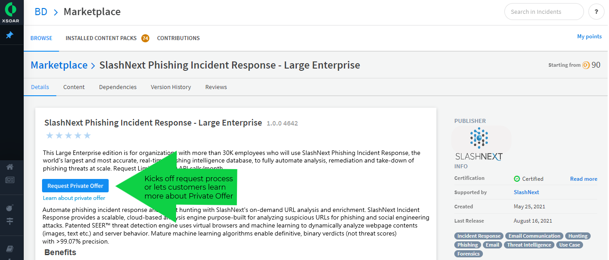

The Cortex XSOAR Marketplace has been successfully giving partners a vehicle in which to drive the value of their technology for over a year now. Partners develop turn-key premium content packs that span playbooks, dashboards, and reports that customers can subscribe to with a single click.

To take Marketplace to the next level by offering customers purchasing flexibility and giving Partners the option of ARR, the XSOAR Marketplace now supports **Private Offer!**

Private Offer enables Cortex XSOAR customers to subscribe to premium content packs in the XSOAR Marketplace with customized, upfront term lengths and discounts. Partners now have the ability to:
* Receive payment up front for the full contracted term
* Receive  a higher revenue share than monthly transactions
* Bundle offerings to enhance value of the solution and increase revenue streams
* Meet the customer’s needs by offering longer terms and discounting flexibility on a per-deal basis
* Simplify the acquisition process by using Palo Alto Networks paper 
* Develop a new channel for generating revenue

### Partner Benefits:
* Streamlined acquisition and activation process assures Marketplace points are being spent on the Partner’s products.
* ARR model for predictable revenue stream.
* Longer terms mean higher dollar values for the partner
* Enhance product stickiness by bundling solutions
* Increased collaboration with PANW sellers 
  * Access to unfamiliar markets and regions
  * Sell into Enterprise SOC accounts 
  * Qualified leads for solution portfolio expansion
* Amplify reach with brand alignment and marketing activities, subject to Palo Alto Networks' discretion

## How Does Private Offer Work? 
To ensure as seamless an experience as possible for both you and our customers, we have created a simplified process for Private Offer. XSOAR Customers have the ability to request a Private Offer directly within the XSOAR Marketplace user interface by clicking on  button in participating premium pack listings. Customers then complete a simple [form](https://xsoar.pan.dev/request-private-offer) to submit their Private Offer request. If you choose to participate in Private Offer, you will just need to add the button to your pack listing. 

Requests can also be initiated through your sales teams or our Cortex sales teams. We highly recommend that your teams promote your XSOAR packs to ensure customers/prospects know you have a premium offering in the XSOAR Marketplace. If an opportunity is identified, email the details of the request to xsoar.privateoffer@paloaltonetworks.com . 

Here is an overview of the Private Offer process when initiated by a Partner:


## Private Offer Listing Designation 
Let customers know your XSOAR Marketplace premium pack is available for Private Offer! For partners who elect to participate in Private Offer, the UI will be updated to advertise and drive attention to your pack listing as shown below:



For Partners interested in having their premium pack available for Private Offer on the XSOAR Marketplace, please contact the XSOAR Partner Success Team (PST) at xsoar.privateoffer@paloaltonetworks.com to ensure your solution is added to our internal enablement content.  

### Private Offer Listing Designation Steps
To create your Private Offer listing, follow the [Premium Packs setup](https://xsoar.pan.dev/docs/packs/premium_packs) and then follow these steps to add the Private Offer button:

<details>
<summary>Click here for detailed steps to add Private Offer to your premium pack</summary>

1. In your pack directory navigate to your [Pack Readme](https://xsoar.pan.dev/docs/documentation/pack-docs#pack-readme) (`Packs/My_Pack/README.md`).
2. In top of the README file copy and paste the following Markdown text:
```markdown
[](https://xsoar.pan.dev/request-private-offer)
[Learn about Private Offer](https://xsoar.pan.dev/private-offer-learn-more)
 ```
**Make sure to copy the text exactly as it is.**
</details>


Contact xsoar.privateoffer@paloaltonetworks.com for help. 

## Working with the Palo Alto Networks Sellers
Whether the Private Offer is initiated by the customer or your sales rep, alignment with the Cortex seller during the Private Offer process will be instrumental in ensuring a seamless and successful customer sales experience.

The Cortex seller will be the main point of contact and lead the customer through the sales cycle and Private Offer process. To ensure the customer’s requirements are being met with the proposed solution, the Cortex seller will engage with your sales team as needed for technical validation, demos, etc. They will also work closely with your business team for guidance and approval on the requested offer terms. 

**Have a Private Offer Opportunity?** Please email the details of the request to xsoar.privateoffer@paloaltonetworks.com.

## Private Offer Agreement 
The Agreement details the terms and conditions for delivering your content to a specific Customer through the XSOAR Marketplace. The Agreement is a binding contract between your organization and Palo Alto Networks ([see sample](../doc_imgs/partners/PrivateOfferTermsAgreementSample.pdf)).

After the terms of the deal have been set and approved by your team, the XSOAR PST will send you a Private Offer Agreement via DocuSign. Once the Agreement is executed by your Signatory, the rest of the process can continue. 

## Enabling Cortex Sales to Sell Partner Solutions
We are invested in the success of the XSOAR Marketplace and want to help maximize your efforts and investment in developing premium content available for Private Offer. 

On an ongoing basis, we will be running internal enablement sessions to ensure sales understands the value Partner solutions add to a customer’s XSOAR investment. To aid in enabling our sellers to promote and sell your solution we recommend creating the following:
* [Sales playbook](https://docs.google.com/presentation/d/1WMrFTYoN-wc8BEwFnTnetNG4-lPP3wAiD8g-W0gSMbI/edit?usp=sharing) (e.g. cheat sheet) to highlight Partner solution, value prop and use cases.
* [Joint Solution Brief](https://docs.google.com/document/d/1Hk2fCSHd6dKAQo0eEUyBx8y1oSK4j-17AcaV-pQRnf4/edit?usp=sharing) (JSB)
* Please send completed playbooks and JSBs to the XSOAR PST for review: xsoar.privateoffer@paloaltonetworks.com.

## Ways to Promote Your Private Offer Solution(s)
* Write a blog post [(template here)](https://docs.google.com/document/d/1amTRiQ2fl_wUNvfF8M4MP939PlK2x-nyCQLqzjsV_eg/edit?usp=sharing) - prior to posting, please send draft for review to xsoar.privateoffer@paloaltonetworks.com
* Enable your sales teams
* Highlight the value prop of your Cortex XSOAR solution and partnership on your website
* Tweet about the offering
*  Get the word out to your customers (see email template)
* Do a webinar
* Post about it on LinkedIn


## Still Have Questions? 
For more information about Private Offer, please review our [Partner FAQ](https://docs.google.com/document/d/1kUFQPKmuiJuFHNtrg6RHg4cEMeAkjGsDNPXK9Etf4eY/edit#heading=h.pe5n8bsuhdc) (restricted access). For questions or help, please contact the XSOAR PST at xsoar.privateoffer@paloaltonetworks.com. 
